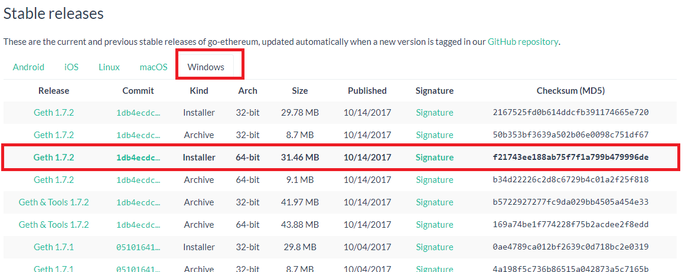

# Build Your First Ethereum Smart Contract with Solidity — Tutorial
 

 So you wanna build a smart contract? Perhaps you want to understand how they work, maybe you want to build your own Dapp, maybe you want to launch the very first billion dollar ICO (sarcasm)... Regardless of your intentions, learning how smart contracts work is invaluable. The Ethereum platform possesses enormous potential to create Dapps that could change the way we interact on the web in the decades to come. While Ethereum deploys smart contracts that work much like a standard blockchain transaction, they yield a conditional statement that must be met before a function(s) is executed. Smart contracts can be used for voting, crowdfunding, blind auctions, multi-signature wallets and MUCH more.

 


## A Quick Smart Contract Example:
 Bob has his own scrap metal depot business in the United States, Eric is his iron scrap supplier. Eric is based out of China. Bob and Eric have a GREAT business relationship. They trust each other and have been doing business for a long time. Both have booming businesses, and Bob in particular sells out of iron scrap on a routine basis. Bob deploys a contract where once his iron scrap inventory reaches a certain range, he automatically sends an order out to Eric for X lbs of iron scrap at Y ether per ton. Eric agrees to the arrangement and accepts Bob’s payment in ether right away. Eric gets to work right away and starts fulfilling Bob’s order. Eric can exchange his ether at a local exchange online for Yuan for a tiny fee and it’ll be processed instantaneously. Whether Eric decides to hold ether or convert to Yuan is his choice, but either way he can now put this capital to work right away!

 Both parties are ecstatic! Typically Bob has to contact his bank and request a money wire to be sent to Eric’s bank in China. It typically takes ~48 hours to process the wire transfer, at which point Eric will have to wait another few days for his bank to clear the payment. Not only that, Bob’s bank is going to charge him a fee for wiring money to Eric… Time and money out the window. To make matters worse, both parties have to deal with the headache of foreign exchange, turning the US Dollars into Chinese Yuan.


## So What Am I Going to Learn?
 As the saying goes, “you have to crawl before you can walk”. Before we get to deploying our first contract it’s important we learn a few basics. More importantly, I’d like to point out that Ethereum’s platform launched in 2016. While still in it’s infancy, now is the perfect time to start learning about smart contracts.

 In this tutorial we’re going to learn about:
 * Ethereum Nodes
 * Building A Private Blockchain Network
 * MetaMask Browser Plug In
 * Mist Browser
 * Ethereum Wallet
 * Web3 Ethereum JavaScript API
 * Remix Web Browser IDE
 * Geth (Go Ethereum) Command Line Interface
 * Solidity Programming Language

 **Important: If at any point you run into an issue with running a program, try launching it as administrator by right clicking on it and selecting “Run as administrator” (on Windows PCs).**


## Setting Up An Ethereum Node
 In the simplest form, an Ethereum node is any device that is running the Ethereum protocol (blockchain). While nodes are typically running on desktops & laptops, development for mobile is on going. When we connect to the Ethereum protocol we are on the Ethereum blockchain network and are running a node. By running an Ethereum node we can connect to other nodes in the network, have direct access to the blockchain, and even do things like mine blocks, send transactions, and deploy smart contracts.

 Nodes are written in Go (Go Ethereum/Geth), C++, and Python. In this tutorial we’re going to stick to the most popular of the three, Go. Important to also note that by downloading Geth we are downloading the ENTIRE Ethereum blockchain. That said, make sure you have ~35GBs of storage on your hard drive before continuing.


 1. Visit the Go Ethereum website and install Geth
    Visit here: https://geth.ethereum.org/downloads/
 2. Download the latest release of Geth (currently 1.8.7) for Windows, make sure you download the 64-bit version.

 

 3. Once your download is complete, open the installer and click “I Agree” and finish the installation.

 4. Open up command prompt (I’ll be using Git Bash — download here: https://git-scm.com/ , do make sure you add to PATH variables during installation) and navigate to the Geth directory by typing “cd C:\Program Files\Geth”
 

 5. Begin syncing to the Ethereum blockchain by typing “Geth”. Because this is your first sync you’ll download the ENTIRE blockchain from other peers. This will take some time so get comfy…
 

 Done? Right on! You’re now running an Ethereum Node. Let the fun begin…


## Establishing Our Own Private Ethereum Network
 Now that we have access to the Ethereum protocol via our node, we’re going to setup our own private server to develop & deploy our smart contract. Note that none of this will actually be deployed on the Ethereum blockchain, instead we’ll deploy on our own blockchain. We’ll start by initializing the very first block in our blockchain, the genesis block (genesis.json).

 1. Create a new folder on your desktop called “Private Chain”.
 2. Open command prompt in this folder and create a data directory folder for our chaindata by typing “Mkdir chaindata”. You can open a command prompt in this folder by holding shift and right clicking, then select “open command window here”.
 3. Next, we need to create and save our genesis.json block in our Private Chain folder, as the genesis block will be used to initialize our private network and store data in the data directory folder “chaindata”.
 4. Open up notepad, copy & paste the code below into a new file called “genesis.json” and save this file in our Private Chain folder.

 *Learn more about genesis.json parameters visit the link below*:
 https://ethereum.stackexchange.com/questions/2376/what-does-each-genesis-json-parameter-mean

```json
{
  "coinbase"   : "0x0000000000000000000000000000000000000001",
  "difficulty" : "0x20000",
  "extraData"  : "",
  "gasLimit"   : "0x2fefd8",
  "nonce"      : "0x0000000000000042",
  "mixhash"    : "0x0000000000000000000000000000000000000000000000000000000000000000",
  "parentHash" : "0x0000000000000000000000000000000000000000000000000000000000000000",
  "timestamp"  : "0x00",
  "alloc": {},
  "config": {
        "chainId": 15,
        "homesteadBlock": 0,
        "eip155Block": 0,
        "eip158Block": 0
    }
}
```

 

 5. Now we want to initialize our private network in the chaindata directory by using our genesis.json file. We’re going to tell Geth we want the data directory in the “chaindata” directory and where the genesis.json file can be found (make sure genesis.json is NOT in chaindata folder). Type the following command into the cmd line pointing to the Private Chain folder.

```bash
geth --datadir=./chaindata/ init ./genesis.json
```

 6. You should then see that the genesis state was successfully written.
 

 7. Now we can start Geth and connect to our own private chain. As you will see the geth.ipc endpoint socket connection will be opened and so will port 30303.


```bash
geth --datadir=./chaindata/
```


 Whenever we start Geth the IPC endpoint will open, which is used to process connections to Geth with programs like MetaMask, Ethereum Wallet, Mist, or for opening the Geth Javascript API console. We will discuss all of these next.

 We now have established our very own private geth network!


## What Is MetaMask Exactly?
MetaMask is both an Ethereum browser and a wallet. Through MetaMask you can interact with Dapps and smart contracts on the web without having to download the blockchain or install any software. You simply add MetaMask to chrome as an extensions, create a wallet, and deposit ether. While currently only available for Chrome, expect to see a launch for Firefox in the near future.

The biggest downfall to Metamask is that like any online wallet, you must trust MetaMask. The possibility of MetaMask being hacked or leaking your private key does exists, for your information is stored online.

You can download MetaMask here: https://chrome.google.com/webstore/detail/metamask/nkbihfbeogaeaoehlefnkodbefgpgknn?hl=en


## The Mist Browser
 Mist is an electron application, meaning that its a desktop hybrid app with a web interface as well. This allows for faster development and changes of the Mist interface and helps with the browser part of Mist. Its important that you recognize Mist is in beta, so expect to run into a few issues here and there.

 Mist is powerful in that it includes a Geth node that runs in the background upon launch; a connection to the Ethereum blockchain is made right away. But because we want to practice developing a smart contract, we are going to run a node on our private network and will not need Mist to connect to the default Geth node.

 Read more about Mist: https://github.com/ethereum/mist/wiki


## What About The Ethereum Wallet?
 The Ethereum Wallet is just a Mist implementation that can only access a single Dapp — the wallet dapp, this is due to missing features in Mist. The Ethereum Wallet is written in pure HTML and Javascript code, makes use of web3.js to manage your accounts, and runs inside of the Mist browser. You can also download a standalone version if prefered. The wallet is not yet official released, bugs will exist.

 Ethereum Wallet: https://github.com/ethereum/meteor-dapp-wallet


## Let’s Download the Mist Browser & Connect To Our Private Network
 Let’s take a second to download the Mist browser so we can connect with our private network.

 1. Navigate to the Mist download page and download the latest version of the Mist installer — https://github.com/ethereum/mist/releases
 

 2. Run the installer...

 Feel free to open Mist and mess around with the UI to get a better feel for things, but we’ll be opening up Mist shortly.


## Connecting Mist To Our Private Network
Now that we knocked out initializing our private network with the genesis block, we can open a command line in our Private Chain folder and tell Geth to connect to our datadir. Type the following command into command prompt:

```bash
geth --datadir=./chaindata/
```


 Geth will now start running and once we open Mist the geth.ipc endpoint will open; Mist will then make the connection to our private network. Make sure Mist is connected by confirming “Private-Net” exists in the upper right corner of the Mist launch window.
 


## The Basics Of Mist
 Let’s open up Mist and familiarize ourselves with a few things:
 

 1. At the top we can see our tool bar. Navigating to “Ethereum Node” under the “Develop” tab will show that we are NOT connect to Geth, as it is grayed out — we’re running our own network. Much like Chrome, under the “Develop” tab we can also access “Developer Tools”

 

 2. On the left side of the Mist browser we can see the various different tabs that are open, just like any other browser. By clicking on the green box we are opening the Ethereum Wallet. The wallet is a distributed application that makes it incredibly easy to interact with the JavaScript interface of Go Ethereum

 3. As you can see we’re connected to the Ethereum wallet through https://wallet.ethereum.org/ , don’t forget that Mist is simply a browser. From here we can do things like see past transactions, send ether, and even deploy or watch contracts.

 4. Under the “Wallets” tab we can see our accounts, add new accounts, create wallet contracts (like single owner accounts, multi-signature wallet contracts, and even import wallets), and also examine past transactions

 5. Let’s create an account by clicking “Add Account” (synonymous with “wallet”), then “Create new account”, and enter a super safe password (even though this is an account on our private network and will not be connected to the actual Ethereum network, it’s a good habit). Click “OK” and create your wallet
 

 Under the “Send” tab we can send ether from one wallet to another, or even from a wallet to a contract. As you can see below, before hitting send we’re given the option to set the gas (fee) for our transaction. All transactions require some amount of gas to incentivize processing. Depending on how fast we want to get the transaction processed and approved by the blockchain, we can adjust the amount of gas.

 

 Lastly, under the “Contracts” tab we can deploy new contracts, watch existing contracts, and watch previously created tokens. Here is where we will create and deploy our “Hello World!” contract.

 

 We can also see the option to watch contracts & tokens. If we have interest in interacting with a previous deployed contract, we can click on “Watch Contracts” and enter in the name of the contract, contract address, and the contract ABI (application binary interface). If we have interest in watching or spending ERC-20 tokens (tokens developed on the Ethereum blockchain), we can also input the token contract address, token name, and token symbol.

 Now for one of the more exciting parts… If we move over to the explorer tab (blue box w/ magnifying glass) we‘ll see that a browser with an address bar opens up at the top and a web page loads. If we click “connect” in the upper right hand corner of the screen, we can connect the browser to our wallet. We’ will have then connected to “Web 3.0” and from here we can visit Ethereum powered distributed applications (Dapps) and use our wallet to interact with them. Try it out for yourself and visit https://www.stateofthedapps.com/ to see a few examples. Pretty cool, huh? As I mentioned before, this is all still relatively new so try and use your imagination for where this all could go…just don’t get lost in space…you gotta come back and finish the rest of this tutorial…

 

 Because we’re on our private network, we will be able to connect our wallet to the browser but we do not have any *real* ether. Thus, we’ll be limited to what we can do when interacting with these Dapps. In order to get the full experience you’ll need to connect to the Ethereum network and deposit ether into your wallet, but that doesn’t mean we can’t browse.

 


## Web3.js?! What the???
You might be asking yourself “how is Mist able to connect a wallet to a browser and interact with the Ethereum blockchain?” Mist is merely a browser, a browser injected with Web3.js library and can communicate with an Ethereum node or transact with a smart contract deployed on the blockchain. The Web3.js library communicates with an Ethereum node through JSON RPC calls by connecting to an HTTP or IPC connection.

If you would like to learn more about Web3.js, feel free to visit the GitHub documentation here at: https://github.com/ethereum/wiki/wiki/JavaScript-API


## Let’s Take A Breather For A Second…
Okay, so I’ve thrown a lot at you so far. While a lot of it may not have stuck on the first go, I urge you to keep going. Next we’ll be interacting with the Remix web IDE, write our first smart contract in solidity, deploy through Mist, and even interact with it.

If something wasn’t explained clearly or maybe I missed something, feel free to drop a comment down below! I’m always happy to clear up any confusion and answer questions you may have. As always, Google is always a safe source for more information.


## Remix Web Browser IDE
 Let’s jump right into things and start writing our some code! While we can write directly into Mist, we’re going to first write our Solidity code in the Remix web browser IDE. Why? Well, Remix has a handful of features that makes for a more comprehensive development experience (for now). It is typically best used for smaller sized contracts. Remix features include:

 * Integrated debugger (step by step, instructions, monitoring variables, call data, call stack)
 * Warnings such as unsafe code, gas cost, whether functions could be constant, and checks for overlapping variable names
 * Integrated testing & deployment environment
 * Static analysis
 * Syntax & error highlighting
 * Works with injected Web3 objects
 * Can deploy directly to MetaMask or Mist
 * Lets make our way over to Remix by visiting: https://remix.ethereum.org/

 

 Smack dab right in the middle of the page we can see our space for our code. In the upper left of the screen we can see a few different file options available: “Create New File”, “Add Local File”, “Publish All Open Files to an Anonymous Github Gist”, “Copy All Files to Another Instance”, and lastly “Connect to Localhost”. We can also see a list of current contracts under development.

 

 On the upper right side of our screen we have several tabs to select from. Our “Compile” tab allows for us to compile our contract once complete (set to Auto compile by default). If we click on “details” we get a list of several contract details ranging from metadata, to bytecode, to ABI, and even our contract’s Web3 deployment code.

 The “Settings”, “Debugger”, “Analysis”, and “Support” tabs all have their use case and are worth familiarizing yourself with. In the interest of time we’re going to be using the “Run” tab for the rest of this tutorial. If we click on the “Run” tab we can see a few different contract settings.

 

 **Environment**: There are 3 type of environments Remix can be plugged to. Both the Web3 Provider and Injected Web3 environments require external tools like MetaMask or Mist. JavaScript VM is what we’ll stick to, as it will allow for execution to take place in our browser, in addition to our deployment in Mist.

 **Account**: Remix provides 5 different accounts with 100 Ether preloaded! These can be used during contract development if desired.

 **Gas limit**: Set a limit forthe amount of gas (fee) attached to the contract.

 **Gas Price**: Set a required amount of gas for the contract.

 **Value**: Deploy the contract with X amount of ether attached.


## Finally…Hands On Solidity!
For those of you familiar with Javascript I’m sure you’ll take notice to the overlaps with Solidity. Much like JS, Solidity is a contract-oriented, high-level language that is designed to target the Ethereum Virtual Machine (EVM). The code is statically typed, supports inheritance, libraries and complex user-defined types among other features.

In our “Hello World!” contract we’re going to create a state variable called counter and assign it a starting value of 5. Then we’re going to create a function that increases our state variable by 1, a function that decreases the variable by 1, a function that returns our counter , and lastly a function that will destroy the contract.

The first bit of code that we’ll type into Remix is the source code version. At the time of writing this Solidity 0.4.16 is the latest version that is recognized by Mist. We’re going to call this version by typing at the top of our contract:

```javascript
pragma solidity ^0.4.16;
```

The keyword `pragma` is called that way because generally pragmas are instructions for the compiler about how to treat the source code.

More info on Solidity can be found here in the docs: https://solidity.readthedocs.io/en/develop/index.html


## Functions & States
 Looking at the bare bones of a smart contract we can see that contracts are merely collections of code (its functions) and data (its states) that correspond to a specific contract address on the blockchain.

 For example, the line `uint256 counter;` sets the variable `counter` of type `uint256` (unsigned integer of 256 bits). It can now be thought of as a single slot in a database that can be pulled by calling the function of the code that manages the database. We can even set a value for the variable `counter` while also setting the type as *uint256*.

```javascript
uint256 counter = 5;
```

 State variables are typically outside of functions, making them global variables, and usually are the first few lines in our contract. We’ve now managed to set our variable counter as an uint256 and a value of 5. If we want to call a function to increase the value of `counter` by 1, we’re going to create a function (we’ll call it “add”) and tell it to add 1 to `counter` .

```javascript
function add() public {
  counter++;
}
```

 After calling the function `add()` , `counter` will have a value of 6.


## Building Out The Contract
 Lets create our “Hello World!” contract by first creating a contract called such:

```javascript
pragma solidity ^0.4.16;
contract HelloWorld {

 
}
```

 We can now include that counter state variable that we talked about early. Remember, we’re going to assigning this state variable as an unsigned integer of 256 bits (unsigned meaning that this type can only be positive integers, not positive and negative. 256 bits in size is a design of the Ethereum Virtual Machine). Oh yeah, also set it to a value of 5.

```javascript
pragma solidity ^0.4.16;
contract HelloWorld {
    uint256 counter = 5;
  
}
```

 Go ahead and see if you can create 2 functions below this state variable assignment. We need 1). a function that increases counter by 1 and 2). a function that decreases the counter by 1.

```javascript
pragma solidity ^0.4.16;
contract HelloWorld {
 
 uint256 counter = 5; //state variable we assigned earlier
 function add() public {  //increases counter by 1
  counter++;
 }
 
 function subtract() public { //decreases counter by 1
  counter--;
 }
 
 
}
```

 You’ll see from the code above that we assigned both functions the modifier `public` . Since Solidity knows two kinds of function calls (internal ones that do not create an actual EVM call — also called a “message call” — and external ones that do), there are four types of visibilities for functions and state variables. Functions can be specified as being `external`, `public`, `internal` or `private`, the default is `public` . Aside from the fact that Remix will throw a warning message stating that no visibility is specified and it’s defaulting to public , typing out the function visibility is a good habit to get into. It will allow us to better understand the contract settings when evaluating our code.

 We’re getting close, but not quite there. Our state variable can change depending on the function we call, but we need a function that will output the value of `counter` . Try creating a function called `getCounter()` that will return `counter`. This will be a *read only* action, so we need to tell our function that we’ll be returning a constant. Additionally, when returning a state variable we must tell our function the type that is being returned, in this case we’re returning an uint256 as discussed earlier.

```javascript
pragma solidity ^0.4.16;
contract HelloWorld {
 
 uint256 counter = 5; //state variable we assigned earlier
function add() public {  //increases counter by 1
  counter++;
 }
 
 function subtract() public { //decreases counter by 1
  counter--;
 }
 function getCounter() public constant returns (uint256) {
  return counter;
    } 
}
```

 *While calling a functions on the Ethereum network will require a small amount of gas to be spent, no gas is required when returning a constant function.*

 Awesome! So now we have a contract that allows us to change the value of our global variable counter . We can also increase it by 1, decrease it by 1, and return the value of our counter whenever we want. Let’s give it a whirl…


## Let’s Test
 So your code should be in Remix and “Auto compile” should be checked by default under the “Compile” tab. Make your way over to the “Run” tab. Default settings will have the environment set to JavaScript VM, an account will be selected, gas limit will be 3000000, and your gas price & value will be 0. Click on “Create” under your “Run” tab. You should now see your contract created just like below.

 

 Right off the bat you can see the 3 functions that we had created — `add()`, `substract()`, and `getCounter()`. You can also see that our state variable has a value assigned to it of 5. Now, click “add” to increase our `counter` by 1. Then go ahead and click `getCounter()` to call our newly modified `counter` . You should see the value has been updated to 6. Try it again for `substract()`.
 

 Give yourself a pat on the back. You just done did it. Contract created!


## Deploying Contracts in Mist
 Now that we’ve tested and confirmed our code in Remix, let’s start up Mist (make sure it’s connected to the Private Network) and deploy it on our private network. Navigate to the “Contracts” tab of the Ethereum Wallet in Mist. Then select “Deploy New Contract” and paste our code from Remix into the source code box.

 Before we can proceed any further, we need to have ether in our wallet. We can mine for ether on our private network by running the miner. We’ll do this through the Geth JavaScript console.

 Open up ANOTHER command prompt window pointing to your private network folder (C:/users/name/desktop/private network) and type `geth attach` . Hit enter. You will see a Geth JavaScript console generated and you can now enter commands into Geth directly. Let’s begin mining for some ether by typing `miner.start();` . You will see that the console returns “null” and mining has begun! Take a look at your wallet on Mist, you’ll see increments of 5 ether continuously added to your wallet. You can stop the miner anytime by typing `miner.stop();` in console…or you can continue to mine fake ether… whatever makes you happy!

 Learn more about JS console commands here: https://github.com/ethereum/go-ethereum/wiki/JavaScript-Console
 

 Now move back to the “Contracts” tab, “Deploy New Contract”, make sure our code is in the source code box. To the right of the source code box select “Hello World” as the contract to deploy, then click deploy.
 

 After you have entered your password, make your way back over to the wallets tab. Scroll down to “Lastest Transactions” and you will see the contract we just deployed. You’ll also notice that the contract shows 0 of 12 confirmations and is stuck in a perpetual state of “creating contract”.
 
 
 The reason our contract hasn’t been fully created is that there are no miners on our network confirming our newly deployed contract. Start mining again in the Geth JavaScript console we opened earlier ( `miner.start();` ). Once we start mining again we will see that the number of confirmations will start to tick up, eventually fully deploying our contract.
 

 Now click on the contract name. From here we can do all sorts of things. We can transfer ether to the contract, copy the contract address, generate a QR code to be scanned, get the contracts interface (ABI), and even execute contract functions.
 

 As you can see our “Hello World” contract is displaying our getCounter() function with the `counter` state variable of 5. Make your way over to “select function” and select either “add” or “subtract” function. Once selected, hit “execute”. Do not forget, we’re the only ones on our private network so we need to confirm the transaction by running our miner!
 

 And there we have it! Our contract has executed the subtract function and returned a value of “4”. We now have a live smart contract on our private Ethereum blockchain network that can be interacted with on Mist!


## Bonus: Adding a Self-Destruct Function
 As mentioned above, when contracts are deployed they are officially added to the Ethereum blockchain and anyone with the contract address can interact with the contract, to a certain degree that is. What if we as the owner decide we want to remove the contract from the blockchain? Fortunately, Solidity offers an incredibly easy, maybe perhaps too easy, method for putting an end to the contract. We can perform the `selfdestruct` operation. When we `selfdestruct` the contract, all remaining Ether stored at the contract address is sent to a designated target and the contract is no more.

 While we want to have the optionality for destroying the contract, we want to make sure that such operation can only be performed by the creator of the contract. It could be CATASTROPHIC to neglect assigning `selfdestruct` privileges to a certain person(s). We need to first tell our contract who the owner of the contract is, which is the `msg.sender` . Go ahead and set the state variable `owner` as `msg.sender` . Because the `msg.sender` is associated with an address, we also need to tell Solidity that the state variable is going to be assigned as an `address`.

```javascript
pragma solidity ^0.4.16;
contract HelloWorld {
 
 uint256 counter = 5; //state variable we assigned earlier
 address owner = msg.sender; //set owner as msg.sender
 //........
}
```

 We’re going to call the self-destruct function “kill” and are also going to create a conditional if statement to ensure that the person executing the kill function is infact the owner. We will also set `selfdestruct(owner);` to tell the contract to send all contract funds back to the `owner` of the contract.


```javascript
pragma solidity ^0.4.16;
contract HelloWorld {
 
 uint256 counter = 5; //state variable we assigned earlier
 address owner = msg.sender; //set owner as msg.sender
function add() public {  //increases counter by 1
  counter++;
 }
 
 function subtract() public { //decreases counter by 1
  counter--;
 }
 function getCounter() public constant returns (uint256) {
  return counter;
    } 
 function kill() public { //self-destruct function, 
   if(msg.sender == owner) {
    selfdestruct(owner); 
        }
}
```

 We can now go back into Mist and redeploy a new contract with the `kill()` function added. To see the `kill()` function in full force, we’re going to deploy the new contract, send ether to the contract, and then initialize `kill()` and see our ether return back to our wallet. Likewise, we also need to create a function that is executed whenever our contract receives Ether. In order to receive Ether, a fallback function must be marked payable in the contract. If such a function does not exist, the contract cannot receive Ether. A contract can have exactly one unnamed function, which is going to be the unnamed function that we’ll mark as payable . Add the function below to our contract, the function can be placed below the `kill()` function.

```javascript
function () public payable {
 
}
```

 Great, now our contract can receive Ether from any wallet that has the contract’s address! Go ahead and click “Deploy” to deploy our new contract and submit your password. Do make sure your miner is running to confirm the transaction. Once complete, go to the contract and click “Copy address”. You will get a warning message reminding you that you’re on a test network, select “copy anyway”.
 


## Let’s send some Ether…
 Awesome, we’ve copied our contract’s address and now we can send over some Ether to test our kill() function. Click on the “Send” tab and copy the contract address into the “to” field. Enter in however much ether you’d like to send for this test, I’m going to send over ~30,000 Ether.
 

 You know the routine by now…scroll down and click “send”, turn on your miner, and wait for the transaction to get processed. You should notice right away your wallet no longer holds the ether we sent to the contract. Open the contract AGAIN under your “Contracts” tab, you’ll see that the contract now has ether attached to it. Select the kill function under the “Select function” drop down and go ahead and self-destruct that bad boy. Enter your password, crank that miner. After 12/12 confirmations have been processed, your wallet will be restored with the Ether we sent to the contract. Now the contract is inoperable, but the contract’s history does still exist on the blockchain.


## All in a day’s work…
 Aaaaaaandddd there you have it. Congrats on finishing the tutorial and having deployed (and killed) your very first smart contract! There is a lot that was covered here, surely somethings are still a bit of a head scratch. That’s okay! You now know how to open a private network, write Solidity code, deploy in Mist & Remix, and interact with it. Plenty more to do and learn now that you know the basics.

 

 *I hope this tutorial was helpful!*