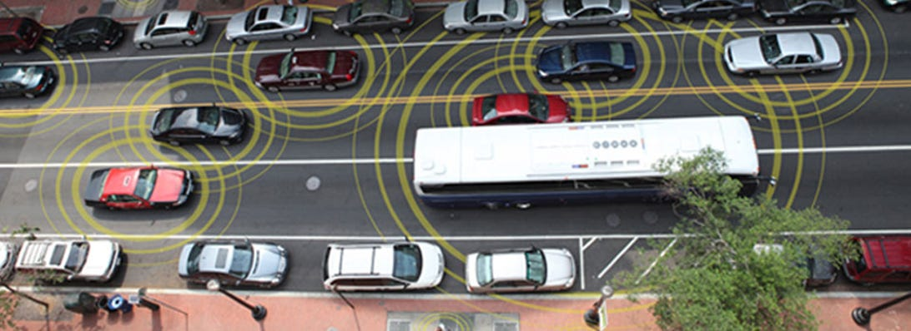
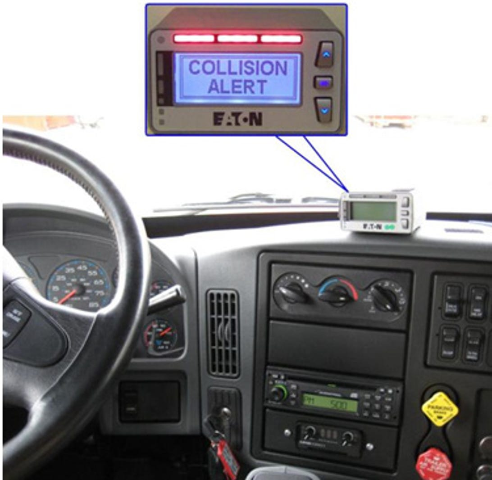
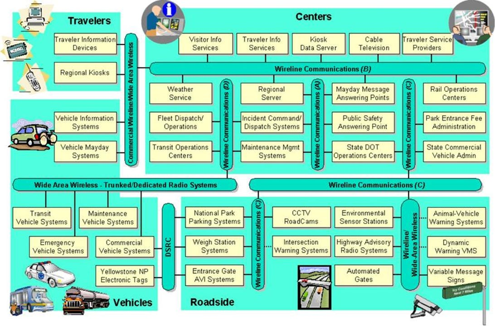



Now, you'll be able to blame the on-board computer for why you were speeding (or crashed)!!


 The government believes vehicle-to-vehicle data links will help improve driver safety, and will push for legislation requiring it in "a future year."

 

 The US government will work to enable wireless communication links between cars, technology it expects will reduce accidents and, eventually, decrease fuel consumption and speed travel.

 The National Highway Transportation Safety Administration said Monday it's finalizing a report on the subject based on a 3,000-vehicle study of vehicle-to-vehicle communications that began in Ann Arbor, Mich., in 2012. That report should be released in the coming weeks -- and then the Department of Transportation's push for using V2V technology in cars and light trucks will get serious.

 "NHTSA will then begin working on a regulatory proposal that would require V2V devices in new vehicles in a future year," the [agency said](http://www.nhtsa.gov/About+NHTSA/Press+Releases/2014/USDOT+to+Move+Forward+with+Vehicle-to-Vehicle+Communication+Technology+for+Light+Vehicles). "DOT believes that the signal this announcement sends to the market will significantly enhance development of this technology and pave the way for market penetration of V2V safety applications."

 It's an understatement to suggest a federal law requiring V2V technology would speed its arrival into the marketplace. But any such change is likely years away, Transportation Department told CNET.

 "The timing of implementation will be informed by the comments we receive on our research report and additional information we receive as we pursue a regulation," the department said. "We anticipate that completion of the rulemaking plus allowing manufacturers some lead time to get ready will take a few years."

 V2V communications use a variation of the 802.11 wireless network standard used by laptops and mobile phones, but instead link cars, which can share position and speed information with each other 10 times per second. That can let one car reliably detect when another in front is braking hard, for example.

 V2V technology initially will assist drivers, but NHTSA is considering linking it to "active safety technologies that rely on on-board sensors." That could let a car brake or steer to avoid a collision without driver involvement.

 

 A related technology, V2I, links vehicles to infrastructure like traffic signals. That ultimately could be used to help coordinate traffic flow better.

 Neither V2V nor V2I technology is required for [self-driving cars](http://news.cnet.com/8301-11386_3-57595738-76/how-googles-robo-cars-mean-the-end-of-driving-as-we-know-it/), but both would help by giving a car specific data about its surroundings.

 One tricky part of V2V and V2I communications is that another branch of the US government, the Federal Communications Commission, is considering whether to release some radio spectrum for general use that's currently dedicated only for vehicular communications.

 Currently, the 5.9GHz band is set aside for use of the 802.11p standard for V2V dedicated short-range communications (DSRC). The Transportation Department is participating in the FCC's discussions about how to handle the spectrum and in the [National Telecommunications and Information Administration](http://www.ntia.doc.gov/)'s evaluation of interference issues. The NTIA, part of the Commerce Department, is tasked with analyzing the best way to extract as much use as possible from scarce radio spectrum and check for interference issues.

 The Transportation Department "also intends to participate in the NTIA's upcoming technical analysis related to understanding interference and sharing of the 5.9 GHz spectrum," the department said in a statement to CNET. "We believe that the FCC and the NTIA must ensure that unlicensed devices do not compromise safety through harmful interference to the Intelligent Transportation System architecture, operations, or safety?critical applications if permitted to operate in the 5.9 GHz band."

 **Updated at 10:06 p.m.** PT with comment from the Transportation Department.

 