 In this tutorial my objective is to walk you through the steps required to create a decentralized application from start to finish and deploy it in Ethereum.

 Here is how it will look:

 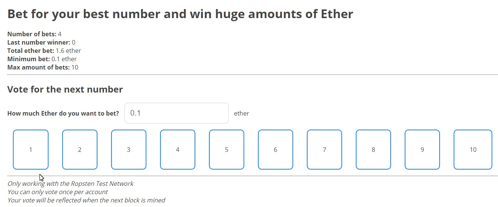

 I’m making it because I see a lot of tutorials that don’t really show you the whole picture of how to connect everything and have a final dapp including decentralized hosting with IPFS, which is a powerful technology.

 Also because I found myself lost in a situation where I didn’t know exactly how to develop the ***truly unstoppable application*** that the ethereum website talks about.

 You’ll learn some basic and complex topics such as :

 * How to create a Smart Contract from scratch
 * How to deploy Smart Contracts on ropsten
 * How to create the frontend of the Dapp
 * How to connect the deployed contract with your application
 * How to deploy the final dapp on the decentralized hosting of IPFS
 * How to use your custom domain with IPFS

 At the end of this tutorial you’ll have a fully decentralized website working with your own Smart Contracts, so that you can use them from the browser and interact with the blockchain using Metamask or Mist.

 You must know a little bit about the blockchain, the software that has been created, a basic knowledge of how contracts work and experience programming websites with javascript.



This tutorial is ideal for you if you’re a web developer at the point of “I know how this works and I just want to start creating something in Ethereum to learn and hopefully become a Dapp developer”



 **BTW I wrote a book about Ethereum development to learn solidity from scratch where you’ll learn the most important concepts for becoming an Ethereum Developer fast. Check it out here, free for kindle unlimited us: https://www.amazon.com/dp/B07BJB1YNQ**

 **You can also get it from my website for $20 USD in PDF here: [https://merunas.org/book](./Ultimate-end2end-tutorial-to-create-deploy-a-fully-decentralized-Dapp-in-Ethereum/ethereum-developer-book.pdf)**

 Here is the technology that we are going to use:
 * **Database**: The Ethereum’s Testnet Ropsten blockchain.
 * **Hosting**: IPFS to get free hosting forever in a decentralized platform.
 * **Frontend**: React.js with webpack. Don’t worry I’ll explain the most important steps. You can use whatever framework you like or plain javascript.
 * **Domain name**: Godaddy. Here I could use some decentralized domain service like peername but it’s just faster and easier with godaddy or any other domain registrar.
 * **Contract’s programing language**: Solidity 0.4.11, right now the most famous language for developing Smart Contracts.
 * **Frontend contracts**: web3.js to use those contracts in your web user interface.
 * **Frameworks**: Truffle to deploy, test and compile our contracts.
 * **Development server**: Node.js to use the app while developing locally along with testrpc.
 * **Metamask**: To use the final application like the end user would.

 And these are the steps that we’re going to follow:
 1. Setup the project
 2. Program the Solidity contracts
 3. Create the frontend application
 4. Deploy the application online with IPFS
 5. Use a custom domain for the application
 6. Play with the final Dapp!


## Setup the project
 I’ll explain you what are we going to create so that you have a clear image of the end result.

 **We are going to create a casino like application where users are able to bet money for a number between 1 and 10 and if they’re correct, they win a portion of all the ether money staked after 100 total bets.**

 It’s quite a complex app to start but you’ll love it because it’s original and funny to use.

 Now I must warn you that this is not a secure application because you can’t simply generate randomness with Solidity. You’ve to take try different random generation techniques on the blockchain and see what works.

 Take this tutorial as an introduction to see the whole process of creating a Dapp from start to finish.

 First, download the current version of node.js from their website [nodejs.org](https://nodejs.org/en/) if you don’t have nodejs already. Then, create a folder called `casino-ethereum` in your computer’s desktop. Inside, open the terminal or command line and execute the command: `npm init -y`

 After that do:

```bash
npm i -D -g truffle 
```
 
 To install the Ethereum development framework Truffle in this project as a developing dependency (-D) and globally (-g).

 Then execute:

```bash
npm init -y
truffle init
```

 Those 2 commands will start the project by creating the essential files for dapp development.

 After that, do:

```bash
npm i -D webpack react react-dom babel-core babel-loader babel-preset-react babel-preset-env css-loader style-loader json-loader web3@0.20.0
```
 
 Those are all the tools that we need to create the front-end of the dapp. There are a lot of dependencies because we’ll be creating a web application with the lastest version of javascript and React.js.

 Mainly we installed webpack, react, babel and web3.

 Note that we are installing the version 0.20.0 of web3 with `web3@0.20.0` because the latest version of web3, the 1.0 is still in beta and it’s unstable.

 Then, install `npm i -g http-server` . This a lightweight server that you’ll use to host your web app locally as you develop on `localhost:8080` .

 Now you have all the dependencies that you need to create this project with react and webpack.

 After that, go to your project folder and create a `webpack.config.js` file. This is the file that will combine all of our javascripts and css to generate a single file called build.js with all the js code converted to be compatible with new and old browsers. So that we can use not-yet-released features of the lastest javacript.

 Now write this code inside the file:

```javascript
const path = require('path')
module.exports = {
   entry: path.join(__dirname, 'src/js', 'index.js'), // Our frontend will be inside the src folder
   output: {
      path: path.join(__dirname, 'dist'),
      filename: 'build.js' // The final file will be created in dist/build.js
   },
   module: {
      rules: [{
         test: /\.css$/, // To load the css in react
         use: ['style-loader', 'css-loader'],
         include: /src/
      }, {
         test: /\.jsx?$/, // To load the js and jsx files
         loader: 'babel-loader',
         exclude: /node_modules/,
         query: {
            presets: ['es2015', 'react', 'stage-2']
         }
      }]
   }
}
```

 After that, create the folder `src/` in the project and inside that folder, create the folders `js/` and `css/` just to organize the source code.

 Inside each folder create `index.js` and `index.css` .

 Finally create the folder `dist/` at the outer level and inside `index.html` .

 The structure will be the following:

```
contracts/
-- Migrations.sol
migrations/
node_modules/
test/
src/
-- css/index.css
-- js/index.js
dist/
-- index.html
package.json 
truffle-config.js
truffle.js
webpack.config.js
```

 Now go to your `index.html` and write this code by hand:

```html
<!DOCTYPE html>
<html lang="en">
<head>
   <meta charset="UTF-8">
   <meta name="viewport" content="width=device-width, initial-scale=1.0">
   <link href='https://fonts.googleapis.com/css?family=Open+Sans:400,700' rel='stylesheet' type='text/css'>
   <title>Casino Ethereum Dapp</title>
</head>
<body>
   <div id="root"></div>
   <script src="build.js"></script>
</body>
</html>
```

 The main things about this code is that I’ve added the Open sans font to have better looking text, the `<div id="root"></div>` where the react code will be inserted and the `<script src="build.js"></script>` to include the build file generated by webpack.

 Create the file `contracts/Casino.sol` , this is the main Solidity contract that we’ll be coding in the next section.

 After preparing all this we can start to create the app at last!


## Program the Solidity contracts
 In this section, you’ll write the main contract of the project and you’ll test it to see if it works correctly for not deploying vulnerable code that could make someone lose real money.

 First, every Solidity contract must start with the compiler version, so write this at the top of the `Casino.sol` file that you created:

```
pragma solidity 0.4.20;
```

 Now create the contract:

```javascript
pragma solidity 0.4.20;
contract Casino {
   address public owner;
   function Casino() public {
      owner = msg.sender;
   }
   function kill() public {
      if(msg.sender == owner) selfdestruct(owner);
   }
}

```

 The address variable called owner is that long string from your Metamask account, in my case is this *0x08f96d0f5C9086d7f6b59F9310532BdDCcF536e2*.

 That `function Casino()` is the constructor because it has the same name as the contract and we use it to set up the owner of that contract. The user address that created this contract is the owner.

 The `function kill()` is used to destroy the contract whenever you want. Of course only the owner can kill it. The remaining ether that the contract has stored will be sent to the owner’s address. Only use it if the contract is compromised by some hack and you can’t secure it.

 Remember, the goal is to:



Create a casino like application where users are able to bet money for a number between 1 and 10 and if they’re correct, they win a portion of all the ether money staked after 100 bets.



 So we have to do the following tasks:
 * Keep a record of how much a user has bet for what number.
 * The minimum price of a bet.
 * The total amount of ether accomulated.
 * A variable to store how many bets there are.
 * When to stop the bets and reveal the winning number.
 * A function to send the winning amount of ether for each winner.

 These are the functions:
 * Bet for a number.
 * Generate random number as winner.
 * Send ether to winners.


 **Keep a record of how much a user has bet for what number.**

 We can use a struct with a mapping type of variable to store the address of the user, the amount bet and the number in a javascript like object.

 A struct is like an object in javascript and amapping is like an array.

 Let’s go with the code:

```javascript
pragma solidity 0.4.20;
contract Casino {
   address public owner;
   uint256 public minimumBet;
   uint256 public totalBet;
   uint256 public numberOfBets;
   uint256 public maxAmountOfBets = 100;
   address[] public players;
   struct Player {
      uint256 amountBet;
      uint256 numberSelected;
   }
   // The address of the player and => the user info   
   mapping(address => Player) public playerInfo;

   function Casino() public {
      owner = msg.sender;
   }
   function kill() public {
      if(msg.sender == owner) selfdestruct(owner);
   }
}

```

 The `struct` named Player is made of the amount bet and the number selected because we want to keep track of how much ether a user has bet and for what number.

 Then we create a mapping called playerInfo to do something like this `playerInfo[here_goes_his_address].amountBet` where we can use the address as the “key” in a javascript object to access it’s properties.

 We want to have an array of players to know who is playing the game for distributing the rewards to the winners.

 Modify the constructor to define the minimum bet for the game so that you can select a variable number of minimum bets for distributing the prizes:

```javascript
function Casino(uint256 _minimumBet){
   owner = msg.sender;
   if(_minimumBet != 0 ) minimumBet = _minimumBet;
}
```

 Now create a function at the end of the contract to bet for the numbers between 1 and 10, both inclusive:

```javascript
pragma solidity 0.4.20;
contract Casino {
   // ...
   // To bet for a number between 1 and 10 both inclusive
   function bet(uint256 numberSelected) public payable {
      require(!checkPlayerExists(msg.sender));
      require(numberSelected >= 1 && numberSelected <= 10);
      require(msg.value >= minimumBet);
      playerInfo[msg.sender].amountBet = msg.value;
      playerInfo[msg.sender].numberSelected = numberSelected;
      numberOfBets++;
      players.push(msg.sender);
      totalBet += msg.value;
   }
}

```

 * The word `payable` is a `modifier` that it’s used to indicate that this function can receive ether when you execute it.
 * The `require()` function is like an `if` statement that must return true. If the condition inside the require evaluates to false, the function stops and the ether paid is reverted to the sender. We use it to verify that the player hasn’t played already, that the number is in range and that the bet paid is more or equal the minimum bet.
 * `msg.sender` and `msg.value` are values defined by the user when he executes the contract. The sender is his address and the value is the amount of ether he paid when executing this `payable` function.
 * Then we define the amount bet for that user with `playerInfo[msg.sender]` .`amountBet = msg.sender;` . `msg.sender` is the address of the user that executed that function.
 * Then we increase the `numberOfBets` by 1. This variable is a counter used to see how many bets there are for this game to stop it when there are 100 and distribute the rewards.
 * Finally we increase the totalAmount bet for this game that will be spread across the winners.

 You can see that in the first require statement of that funcion:

```javascript
require(!checkPlayerExists(msg.sender));
```

 I’m invoking a function called `checkPlayerExists()` to check that the user has not played already because we only want that each person only plays once per game. The function is not yet there. So let’s create it now:

```javascript
pragma solidity 0.4.20;
contract Casino {
   // ...
   function checkPlayerExists(address player) public constant returns(bool){
      for(uint256 i = 0; i < players.length; i++){
         if(players[i] == player) return true;
      }
      return false;
   }
   // ...
}

```

 The `constant` keyword of the function, indicates that this is a function that doesn’t cost any gas to run because it’s returning an already existing value from the blockchain. It’s reading a value. That’s why it’s free.

 After creating those cool functions, we have to check if the number of bets is bigger or equal the maximum so we can generate the winner number. Because when there are 99 bets, we want that the next bet, the bet number 100, releases the prices and executes the needed calculations. Get it?

 Great, add this at the end of the bet() function for that purpose:

```javascript
if(numberOfBets >= maxAmountOfBets) generateNumberWinner();
```

Now we have to create the function `generateNumberWinner()` that will randomly generate a number between 1 and 10 to decide the winner:

```javascript
pragma solidity 0.4.20;
   // ...

   // Generates a number between 1 and 10 that will be the winner
   function generateNumberWinner() public {
      uint256 numberGenerated = block.number % 10 + 1; // This isn't secure
      distributePrizes(numberGenerated);
   }
}

```

 It takes the current block number and gets the last number + 1 so if the block number is 128142 the number generated will be 128142 % 10 = 2 and 2 +1 = 3.

 This isn’t secure because it’s easy to know what number will be the winner depending on the conditions. The miners can decide see the block number for their own benefit.

 Then, we distribute the prizes for the winners with the function `distributePrices(numberGenerated)` :

```javascript
pragma solidity 0.4.20;
contract Casino {
   //...

   // Sends the corresponding ether to each winner depending on the total bets
   function distributePrizes(uint256 numberWinner) public {
      address[100] memory winners; // We have to create a temporary in memory array with fixed size
      uint256 count = 0; // This is the count for the array of winners
      for(uint256 i = 0; i < players.length; i++){
         address playerAddress = players[i];
         if(playerInfo[playerAddress].numberSelected == numberWinner){
            winners[count] = playerAddress;
            count++;
         }
         delete playerInfo[playerAddress]; // Delete all the players
      }
      players.length = 0; // Delete all the players array
      uint256 winnerEtherAmount = totalBet / winners.length; // How much each winner gets
      for(uint256 j = 0; j < count; j++){
         if(winners[j] != address(0)) // Check that the address in this fixed array is not empty
         winners[j].transfer(winnerEtherAmount);
      }
   }
}
```

 This function does the following:
 1. First generates an array of `winners` called winners by checking if the player’s `numberSelected` is the `numberWinner` . The `winners` array is a `memory` array that get’s deleted after the function executes. It must have a fixed size.
 2. Then it calculates the amount of ether each winner gets depending on the total bet amount and the amount of winners. The less winners, the bigger the prize.
 3. Then it sends the corresponding amount of ether for each winner with `winners[j].transfer` .

 This should be it. Now we have a working contract that allows people to play as a simple casino.

 One last thing that I like to do is to create an anonymous fallback function, a function without name that has the modifier payable that it’s executed when you send ether to the contract without executing any function:

```javascript
// Fallback function in case someone sends ether to the contract so it doesn't get lost and to increase the treasury of this contract that will be distributed in each game
   function() public payable {}
```

 This will allow you to save the ether you send to the contract. Otherwise it would be rejected.
 
 This is the _complete_ contract that you just created:

```javascript
pragma solidity 0.4.20;
contract Casino {
   address public owner;
   uint256 public minimumBet;
   uint256 public totalBet;
   uint256 public numberOfBets;
   uint256 public maxAmountOfBets = 100;
   address[] public players;
   struct Player {
      uint256 amountBet;
      uint256 numberSelected;
   }
   // The address of the player and => the user info   
   mapping(address => Player) public playerInfo;
   function() public payable {}
   function Casino(uint256 _minimumBet) public {
      owner = msg.sender;
      if(_minimumBet != 0 ) minimumBet = _minimumBet;
   }
   function kill() public {
      if(msg.sender == owner) selfdestruct(owner);
   }
   function checkPlayerExists(address player) public constant returns(bool){
      for(uint256 i = 0; i < players.length; i++){
         if(players[i] == player) return true;
      }
      return false;
   }
   // To bet for a number between 1 and 10 both inclusive
   function bet(uint256 numberSelected) public payable {
      require(!checkPlayerExists(msg.sender));
      require(numberSelected >= 1 && numberSelected <= 10);
      require(msg.value >= minimumBet);
      playerInfo[msg.sender].amountBet = msg.value;
      playerInfo[msg.sender].numberSelected = numberSelected;
      numberOfBets++;
      players.push(msg.sender);
      totalBet += msg.value;
   }
   // Generates a number between 1 and 10 that will be the winner
   function generateNumberWinner() public {
      uint256 numberGenerated = block.number % 10 + 1; // This isn't secure
      distributePrizes(numberGenerated);
   }
   // Sends the corresponding ether to each winner depending on the total bets
   function distributePrizes(uint256 numberWinner) public {
      address[100] memory winners; // We have to create a temporary in memory array with fixed size
      uint256 count = 0; // This is the count for the array of winners
      for(uint256 i = 0; i < players.length; i++){
         address playerAddress = players[i];
         if(playerInfo[playerAddress].numberSelected == numberWinner){
            winners[count] = playerAddress;
            count++;
         }
         delete playerInfo[playerAddress]; // Delete all the players
      }
      players.length = 0; // Delete all the players array
      uint256 winnerEtherAmount = totalBet / winners.length; // How much each winner gets
      for(uint256 j = 0; j < count; j++){
         if(winners[j] != address(0)) // Check that the address in this fixed array is not empty
         winners[j].transfer(winnerEtherAmount);
      }
   }
}

```

 You can see the complete and updated contract in my github https://github.com/merlox/casino-ethereum inside the contracts folder. It’s an advanced version with an oraclize for secure random number generation.



 Now that the contract is done we have 2 options:
 * Write tests using truffle and deploying the contract in `testrpc` during those tests.
 * Test the contract manually using the Solidity’s IDE https://remix.ethereum.org. This is the official tool to write, test and deploy contracts.

 Because I don’t want to make this article too long, we’ll use the remix IDE to test the contract quickly altough you must make the tests with truffle to make sure your apps work as expected and are secure every time you update them.

 Before continuing, you must download [metamask.io](https://metamask.io) from that link. It’s the tool used to execute Smart Contracts on your browser and also an Ethereum wallet.

 After installing it, open it, follow the steps and create an account. Make sure to save the 12 word passphrase because it’s the only way to recover your account if you forget your password or private key. You should see something like this:

 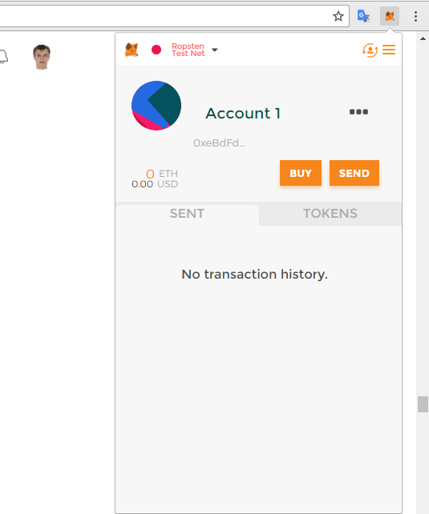

 You now have an account in metamask and you can use it for interacting with dapps and Smart Contracts.

 So go to the Remix IDE and paste the contract:

 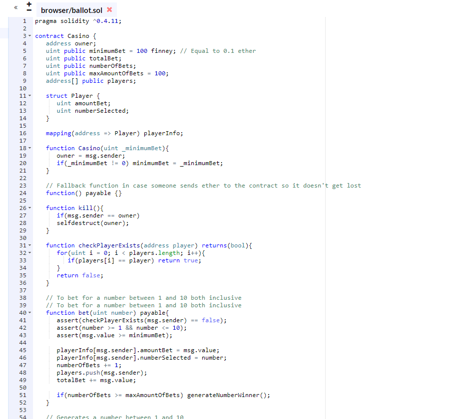

 This is what we’re going to do in the remix IDE:
 * Deploy the contract to the Testnet Ropsten Blockchain, the blockchain where ether has no real value.
 * Use metamask to pay for the gas of each function.
 * Make sure that all functions work as expected.

 You have 2 panels, the left with your code and the right one where you can do interesting stuff with that contract.

 On the right panel, click on the Run tab:

 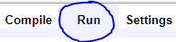

 You should see there is a red button that says Create with an input field that has a placeholder saying `uint256 _minimumBet` . That’s the minimum bet of the constructor. You can leave it empty or write a number.

 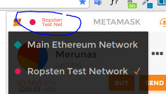

 Now open the Metamask extension and change your network to the Ropsten Testnet Network like in the image.

 Next go to https://faucet.metamask.io/ and request 1 free ether. The faucet is a place where you can get ether for your Ropsten account.
 
 After a while you’ll see that your account has some nice amount of ether in it.

 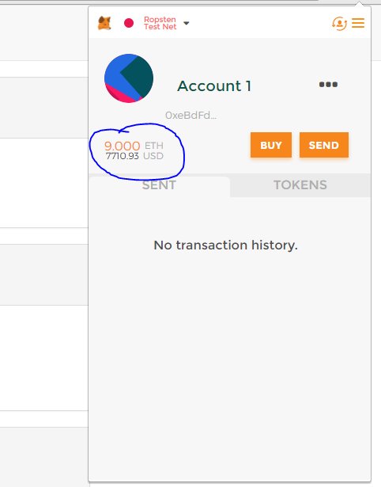

 Go to the Remix IDE and make sure that you are in the Environment: Injected web3:

 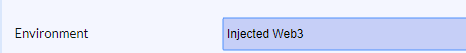

 This means that you are using the blockchain injected from Metamask. Now click on `Create` to deploy your contract, you’ll see a notification window from metamask:

 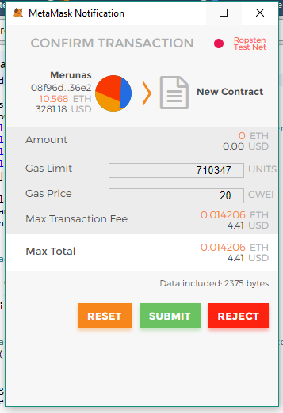

 Just click on `Submit` to pay for the deployment and you are done, your contract is live on the Ropsten network.

 If for some reason, you can’t change the enviroment or you don’t see the notification window, press the F12 key to open the Chrome dev tools. Click and hold the reload button in chrome and select the last option:

 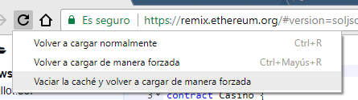

 That should fix those bugs.

 After deploying the contract you’ll see the address of the contract, the functions and more interesting data on the right panel.

 Something like this:

 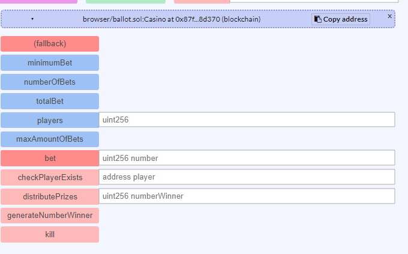

 At the top you have a button that says `Copy address` that you can use to save that contract’s address for later use. Just click it and save the address somewhere.

 Then, the blue buttons are `constant` or `public` functions and variables. This means that when you declare a public variable like `uint256 public totalBet;` you can access it’s value anytime because it’s public.

 You can say that it has a getter method automatically generated.

 Then the constant functions are those that return a value and don’t modify the state of the contract. This means that they don’t modify the contract’s variables, they just execute and give you a result.

 Let’s start by executing the functions one by one.
 
 If you click on `minimumBet` you’ll instantly get the value of that variable because it’s public:

 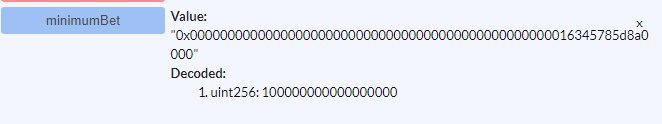

 It returns `uint256: 1000000000000000` in Wei, which is 0.1 ether. Remember that you interact using Wei, not ether.

 Next, the red buttons are those that consume gas to execute functions that save values to the blockchain.

 If you see that a function like `checkPlayerExists()` is in read, you must change the contract to set it `constant` because it returns a value and doesn’t modify the main variables.

 So before changing the contract, we have to destroy the current contract. Execute the kill function and modify the contract (You don’t need to do this if the function is already constant but you can try killing the contract anyway):


```javascript
function checkPlayerExists(address player) constant returns(bool){ 
```

 Deploy it again and you’ll see that the `checkPlayerExists` button is now blue. That means that it won’t consume gas to operate.

 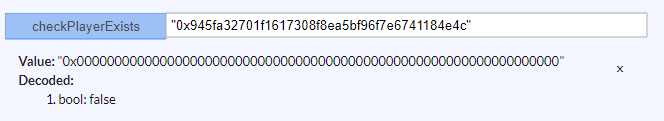

 Note that `bytes32` and `string` must be in double quotes `"` to work. It’s a common problem that happens when you paste an address because they require json values, which are double-quoted.

 The `bet` function requires that you send an amount of ether bigger than the minimum bet and that you select a number between 1 and 10.

 To test it go to the top section of the right column and send a monetary value like in the image:

 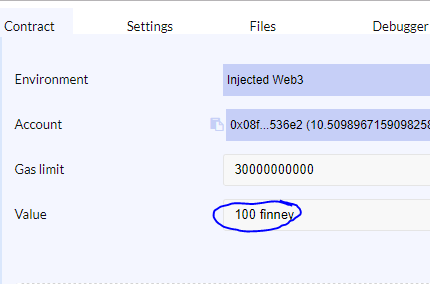

 That’s the value that will be available as `msg.value` in the contract. Send something bigger than the `minimumBet` that you set for your contract and execute the function by sending the `number` to bet for.

 If it says that the gas exceeds the gas limit, refresh the page removing the cookies as I taught you before.

 After playing with the functions I realized that the `distributePrizes()` function **doesn’t reset all the variables** of the contract so the `totalBet` and the `numberOfBets` stayed the same after the first game.

 So I created a new function like this:


```javascript
function resetData(){
   players.length = 0; // Delete all the players array
   totalBet = 0;
   numberOfBets = 0;
}
```

 And I called it from the `distributePrizes()` function. I found a potential problem that I didn’t know before, that’s the power of testing!

 Now before going to the next part, let’s compile the contract to use it later with the frontend application.

 Create the file `2_deploy_contracts.js` inside the `migrations` folder. In this file is where you set up the values that the constructor of your contract will receive, in my case it’s:

```javascript
var Casino = artifacts.require("./Casino.sol");
module.exports = function(deployer) {
  deployer.deploy(web3.toWei(0.1, 'ether'), 100, {gas: 3000000});
};
```

 Explanation:
 * First we require the `Casino.sol` contract.
 * Then, in the `.deploy()` method we specify the minimum bet, in this case it’s `0.1 ether` converted to `wei` with that function.
 * 100 is the max amount of players.
 * Finally the gas limit that we are willing to use to deploy the contract.

 After that, go to your project folder and execute the command `truffle compile` . This will generate a json file that will have all the needed data about the contract.

 We won’t use this data but just so you know when you use the truffle framework. It helps you deploy and test everything from the command line instead of using the Remix IDE.

 When you’re done testing, continue with the next part of the tutorial.


## Create the frontend application
 Start by opening the `index.js` file to create the application with react:

```javascript
import React from 'react'
import ReactDOM from 'react-dom'
import Web3 from 'web3'
import './../css/index.css'
class App extends React.Component {
   constructor(props){
      super(props)
      this.state = {
         lastWinner: 0,
         timer: 0
      }
   }
voteNumber(number){
      console.log(number)
   }
render(){
      return (
         <div className="main-container">
            <h1>Bet for your best number and win huge amounts of Ether</h1>
<div className="block">
               <h4>Timer:</h4> &nbsp;
               <span ref="timer"> {this.state.timer}</span>
            </div>
<div className="block">
               <h4>Last winner:</h4> &nbsp;
               <span ref="last-winner">{this.state.lastWinner}</span>
            </div>
<hr/>
<h2>Vote for the next number</h2>
            <ul>
               <li onClick={() => {this.voteNumber(1)}}>1</li>
               <li onClick={() => {this.voteNumber(2)}}>2</li>
               <li onClick={() => {this.voteNumber(3)}}>3</li>
               <li onClick={() => {this.voteNumber(4)}}>4</li>
               <li onClick={() => {this.voteNumber(5)}}>5</li>
               <li onClick={() => {this.voteNumber(6)}}>6</li>
               <li onClick={() => {this.voteNumber(7)}}>7</li>
               <li onClick={() => {this.voteNumber(8)}}>8</li>
               <li onClick={() => {this.voteNumber(9)}}>9</li>
               <li onClick={() => {this.voteNumber(10)}}>10</li>
            </ul>
         </div>
      )
   }
}
ReactDOM.render(
   <App />,
   document.querySelector('#root')
)
```

 That’s the main structure only with react, here is what I did:
 * First I imported react, reactdom, the css and web3 because that’s what we are going to use.
 * Then I created an `<App />` component that we’re going to use to generate the main view of the document.
 * Finally I generated the constructor, the method `voteNumber(number)` that we’ll use to send a vote to the contract and, in the `render()` method I added the basic html with the `onClick` events.

 If you are new with react, I recommend you to just copy the code by hand or to create a simple html website with those events in javascript.

 Here is the css:

```css
body{
    font-family: 'open sans';
    margin: 0;
}
ul{
    list-style-type: none;
    padding-left: 0;
    display: flex;
}
li{
    padding: 40px;
    border: 2px solid rgb(30,134,255);
    margin-right: 5px;
    border-radius: 10px;
    cursor: pointer;
}
li:hover{
    background-color: rgb(30,134,255);
    color: white;
}
li:active{
    opacity: 0.7;
}
*{
   color: #444444;
}
.main-container{
   padding: 20px;
}
.block{
   display: flex;
   align-items: center;
}
.number-selected{
   background-color: rgb(30,134,255);
   color: white;
}
.bet-input{
   padding: 15px;
   border-radius: 10px;
   border: 1px solid lightgrey;
   font-size: 15pt;
   margin: 0 10px;
}

```

 When combined, the app looks like this:

 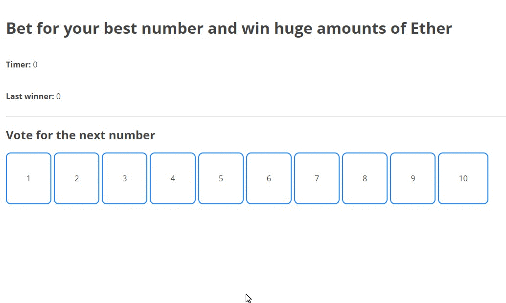

 Now let’s connect to the contract. We could use truffle to deploy the contract and get the data but in order to do that, you would have to download the entire blockchain which is several dozens of GB.

 Because I want it to be accessible for everybody, let’s just deploy the contract to the Remix IDE and get the ABI with the Address.

 Go to [remix.ethereum.org](http://remix.ethereum.org) and deploy the contract clicking on Create .

 Open the contract details right at the end:

 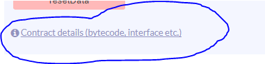

 Next copy the ABI interface:

 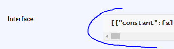

 Then go to you `index.js` and paste the following right in the constructor:

```javascript
constructor(props){
   super(props)
   this.state = {
      lastWinner: 0,
      numberOfBets: 0,
      minimumBet: 0,
      totalBet: 0,
      maxAmountOfBets: 0,
   }
   if(typeof web3 != 'undefined'){
      console.log("Using web3 detected from external source like Metamask")
      this.web3 = new Web3(web3.currentProvider)
   }else{
      this.web3 = new Web3(new Web3.providers.HttpProvider("http://localhost:8545"))
   }
   const MyContract = web3.eth.contract([here goes the ABI interface])
   this.state.ContractInstance = MyContract.at("0x925d81c01d878899adbb7d38f84ce9d5284fa2e7")
}
```

 Here is what I did:
 * First I create the constructor and set the initial `state` of the application.
 * Then I check if the `Web3` variable that we imported is defined or not. Web3 is defined when utilities like Metamask inject their web3. In fact, if you use metamask you’ll see in the chrome dev tools that message.
 * I set up the contract ABI so the app knows what functions are available for this contract.
 * Finally I set up the address of the contract with `MyContract.at()` . I saved the instance in the state as a property called `ContractInstance` but the important thing to know is that **MyContract.at() returns the instance**.

 Get the address of the contract clicking on the following in the Remix IDE:

 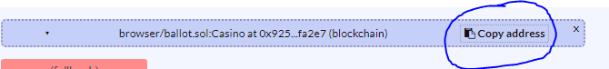 

 With the contract’s ABI and with it’s address you can use the functions of the contract in your front end application.

 Let’s say you want to execute the function `bet()` , in that case you’ll do:

```javascript
yourContractInstance.bet(7, {
   gas: 300000,
   from: web3.eth.accounts[0],
   value: web3.toWei(0.1, 'ether')
}, (err, result) => {
   // Result is the transaction address of that function
})
```

 1. Basically take your instance and execute the function.
 2. Send the parameters of the function, in my case `7` is the number to bet for.
 3. Send an object with `gas:` and `from:` . The value: is just the amount of ether the user will bet so that you can access it with `msg.value` in the contract.
 4. Finally the callback with `err` and `result` . Error is null if there was no error and result it’s just the transaction address so you can see in etherscan.io how it went the call. Use them to display messages that expain what happened after the execution.

 You will do something quite similar with constant functions and public variables. Because they don’t cost gas to run (except for big constant functions) you can execute them like this:

```javascript
yourContractInstance.maxAmountOfBets((err, result) => {
   if(result != null) // Do something
})
```

 That’s how you would get the public variable `maxAmountOfBets` .

 Now I developed the code of the frontend with my style. This is the **complete** code:

```javascript
import React from 'react'
import ReactDOM from 'react-dom'
import Web3 from 'web3'
import './../css/index.css'
class App extends React.Component {
   constructor(props){
      super(props)
      this.state = {
         lastWinner: 0,
         numberOfBets: 0,
         minimumBet: 0,
         totalBet: 0,
         maxAmountOfBets: 0,
      }
if(typeof web3 != 'undefined'){
         console.log("Using web3 detected from external source like Metamask")
         this.web3 = new Web3(web3.currentProvider)
      }else{
         console.log("No web3 detected. Falling back to http://localhost:8545. You should remove this fallback when you deploy live, as it's inherently insecure. Consider switching to Metamask for development. More info here: http://truffleframework.com/tutorials/truffle-and-metamask");
         this.web3 = new Web3(new Web3.providers.HttpProvider("http://localhost:8545"))
      }
const MyContract = web3.eth.contract([{"constant":false,"inputs":[],"name":"generateNumberWinner","outputs":[],"payable":false,"type":"function"},{"constant":true,"inputs":[],"name":"numberOfBets","outputs":[{"name":"","type":"uint256"}],"payable":false,"type":"function"},{"constant":false,"inputs":[{"name":"player","type":"address"}],"name":"checkPlayerExists","outputs":[{"name":"","type":"bool"}],"payable":false,"type":"function"},{"constant":false,"inputs":[],"name":"kill","outputs":[],"payable":false,"type":"function"},{"constant":false,"inputs":[],"name":"resetData","outputs":[],"payable":false,"type":"function"},{"constant":false,"inputs":[{"name":"maxBets","type":"uint256"}],"name":"setMaxAmountOfBets","outputs":[],"payable":false,"type":"function"},{"constant":false,"inputs":[{"name":"number","type":"uint256"}],"name":"bet","outputs":[],"payable":true,"type":"function"},{"constant":false,"inputs":[],"name":"distributePrizes","outputs":[],"payable":false,"type":"function"},{"constant":true,"inputs":[],"name":"numberWinner","outputs":[{"name":"","type":"uint256"}],"payable":false,"type":"function"},{"constant":true,"inputs":[],"name":"minimumBet","outputs":[{"name":"","type":"uint256"}],"payable":false,"type":"function"},{"constant":true,"inputs":[],"name":"maxAmountOfBets","outputs":[{"name":"","type":"uint256"}],"payable":false,"type":"function"},{"constant":true,"inputs":[{"name":"","type":"uint256"}],"name":"players","outputs":[{"name":"","type":"address"}],"payable":false,"type":"function"},{"constant":true,"inputs":[],"name":"totalBet","outputs":[{"name":"","type":"uint256"}],"payable":false,"type":"function"},{"inputs":[{"name":"_minimumBet","type":"uint256"},{"name":"_maxAmountOfBets","type":"uint256"}],"payable":false,"type":"constructor"},{"payable":true,"type":"fallback"}])
      this.state.ContractInstance = MyContract.at("0x7a684de06f473636e03e2d951c78d190eeecb411")
   }
componentDidMount(){
      this.updateState()
      this.setupListeners()
setInterval(this.updateState.bind(this), 10e3)
   }
updateState(){
      this.state.ContractInstance.minimumBet((err, result) => {
         if(result != null){
            this.setState({
               minimumBet: parseFloat(web3.fromWei(result, 'ether'))
            })
         }
      })
      this.state.ContractInstance.totalBet((err, result) => {
         if(result != null){
            this.setState({
               totalBet: parseFloat(web3.fromWei(result, 'ether'))
            })
         }
      })
      this.state.ContractInstance.numberOfBets((err, result) => {
         if(result != null){
            this.setState({
               numberOfBets: parseInt(result)
            })
         }
      })
      this.state.ContractInstance.maxAmountOfBets((err, result) => {
         if(result != null){
            this.setState({
               maxAmountOfBets: parseInt(result)
            })
         }
      })
   }
// Listen for events and executes the voteNumber method
   setupListeners(){
      let liNodes = this.refs.numbers.querySelectorAll('li')
      liNodes.forEach(number => {
         number.addEventListener('click', event => {
            event.target.className = 'number-selected'
            this.voteNumber(parseInt(event.target.innerHTML), done => {
// Remove the other number selected
               for(let i = 0; i < liNodes.length; i++){
                  liNodes[i].className = ''
               }
            })
         })
      })
   }
voteNumber(number, cb){
      let bet = this.refs['ether-bet'].value
if(!bet) bet = 0.1
if(parseFloat(bet) < this.state.minimumBet){
         alert('You must bet more than the minimum')
         cb()
      } else {
         this.state.ContractInstance.bet(number, {
            gas: 300000,
            from: web3.eth.accounts[0],
            value: web3.toWei(bet, 'ether')
         }, (err, result) => {
            cb()
         })
      }
   }
render(){
      return (
         <div className="main-container">
            <h1>Bet for your best number and win huge amounts of Ether</h1>
<div className="block">
               <b>Number of bets:</b> &nbsp;
               <span>{this.state.numberOfBets}</span>
            </div>
<div className="block">
               <b>Last number winner:</b> &nbsp;
               <span>{this.state.lastWinner}</span>
            </div>
<div className="block">
               <b>Total ether bet:</b> &nbsp;
               <span>{this.state.totalBet} ether</span>
            </div>
<div className="block">
               <b>Minimum bet:</b> &nbsp;
               <span>{this.state.minimumBet} ether</span>
            </div>
<div className="block">
               <b>Max amount of bets:</b> &nbsp;
               <span>{this.state.maxAmountOfBets} ether</span>
            </div>
<hr/>
<h2>Vote for the next number</h2>
<label>
               <b>How much Ether do you want to bet? <input className="bet-input" ref="ether-bet" type="number" placeholder={this.state.minimumBet}/></b> ether
               <br/>
            </label>
   <ul ref="numbers">
               <li>1</li>
               <li>2</li>
               <li>3</li>
               <li>4</li>
               <li>5</li>
               <li>6</li>
               <li>7</li>
               <li>8</li>
               <li>9</li>
               <li>10</li>
            </ul>
         </div>
      )
   }
}
ReactDOM.render(
   <App />,
   document.querySelector('#root')
)
```

 I update the state of the app at the begining, when the component is mount to set up the important variables like the **total ether bet**.

 Then I set up click event listeners for each `<li>` number so when you click it, it executes the `bet()` function of the contract with the correct number and the amount of ether you want to bet.

 Now it looks and works like this:

 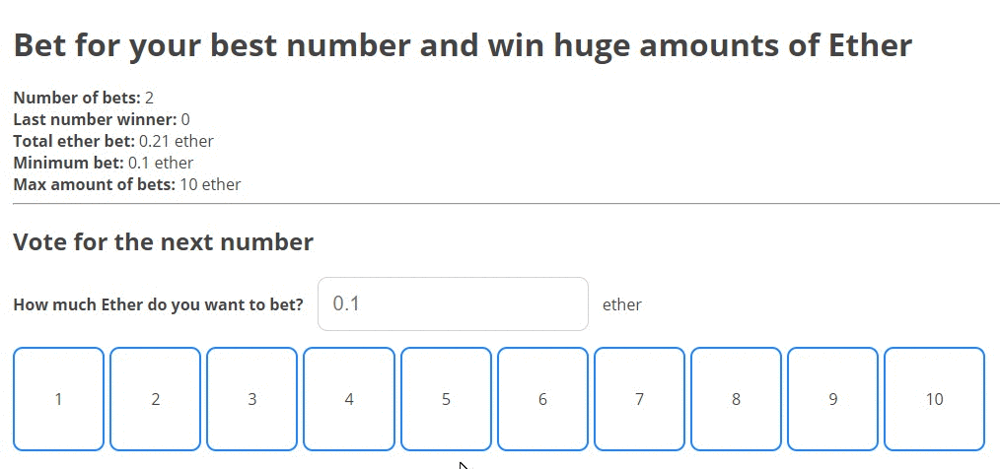

 The complete code is available in my github: https://github.com/merlox/casino-ethereum

 Congratulations if you made this far! Few people actually read the complete content, will you be one of them?


## Deploy the application online with IPFS
 Now that the application is complete, it’s time to move it to the online world with free hosting forever and decentralized, how cool is that?

 That’s the power of IPFS.

 Well, in reallity it isn’t so good because your app will be online as long as a node keeps it online. It’s like the torrent p2p movies, you can download it as long as somebody is seeding it.

 But it will be totally decentralized so it’s worth doing it.

 Let’s start by installing IPFS, go to their website and install the app: https://ipfs.io/docs/install/

 In windows I had to add the folder to the path variable to be able to execute the command ipfs from anywhere. If you’re reading this, you must know already how to modify the path variable.

 After installing it go to your desktop and execute the following commands:

```bash
ipfs daemon
```

This will create a node. In another command line or terminal do:

```bash
ipfs swarm peers
```

 This will get you peers that will share your content.

```bash
ipfs add -r dist/
```

 This will add your `dist` folder to the network. You’ll see a long hash that’s been generated for you. The last hash is a unique identifier for that folder:

```
added Qmc9HzLPur2ncuUArLjAaa4t2HrXFycgjUPb6122N6tzi2 dist/build.js
added QmZBaGYWsACJ5aCFhW459xHZ8hk4YazX1EQFiSenu3ANfR dist/index.html
added QmfZoCnPcgmHYmFJqHBcyuFh3FEYrTZqGdGyioSMrAZzw2 dist
```
 Copy that last hash and execute:

```bash
ipfs name publish QmfZoCnPcgmHYmFJqHBcyuFh3FEYrTZqGdGyioSMrAZzw2
```

 You’ll get something like this:

```
Published to QmRDVed784YwKrYAgiiBbh2rFGfCUemXWk3NkD7nWdstER: /ipfs/QmfZoCnPcgmHYmFJqHBcyuFh3FEYrTZqGdGyioSMrAZzw2
```

 That means that your content is available in that url, the first one. You can check it by going to gateway.ipfs.io/ipns/&lt;your-hash-here&gt;

 In my case is:
```
gateway.ipfs.io/ipns/QmRDVed784YwKrYAgiiBbh2rFGfCUemXWk3NkD7nWdstER
```

 It’ll take some time to load because the network isn’t so big at this moment. Then you’ll see that amazing Dapp! Remember to set Metamask on the Ropsten Test Network .

 If you make changes to your files remember to execute `webpack` then `ipfs add -r dist/` and `ipfs name publish <the-hash>` . You’ll realize that the publish name hash is always the same.

 Your Dapp is online.


## Use a custom domain for the application
 Now you may want to use your own domain because it’s a little bit unproffessional to use such a url for your projects.

 [This](https://github.com/ipfs/examples/tree/master/examples/websites) excellent tutorial example by IPFS will explain it to you clearly if you want full details.

 I’ll explain you how to do it with godaddy. It’s almost the same with other providers.

 1. First go to the DNS manager of your domain in godaddy.
 2. Add a new TXT record with Host: @ and Value: `dnslink=/ipns/<your-hash>`
 3. Save it and change or add an A record with Host: @ Pointing to: `217.182.195.23` . That’s the gateway.ipfs.io’s original IP.
 4. Remove any other A records because they may interfiere with this new A record.
 5. Save it, after some minutes go to that domain and check if it’s working.
 6. Also you can access it by going to: `gateway.ipfs.io/ipns/<yourdomain>`
 7. In this case the urls are `gateway.ipfs.io/peppo.es` and `peppo.es`

 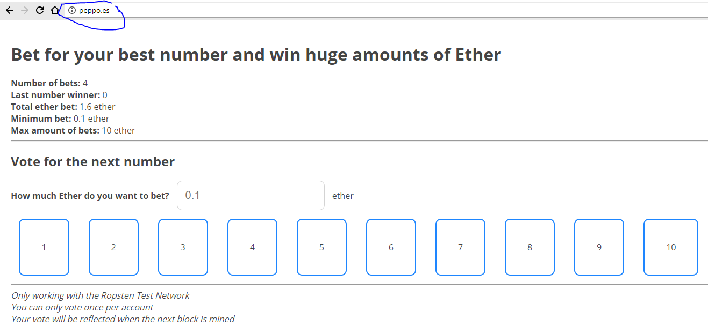


## Play with the final Dapp
 That’s the entire tutorial. If you read it till’ the end, congratulations! You are awsome and now capable of creating unstoppable applications as the ethereum.org page claims.
 
 Enjoy your efford and make sure to test the app as much as you can to find any bugs. If you’re brave enough, you can deploy it to the main Homestead network.

 The only difference is that you have to change your Metamask network when deploying.

 Also I recommend you to check the [Solidity Docs](http://solidity.readthedocs.io/en/develop/), the [Web3.js Docs](https://github.com/ethereum/wiki/wiki/JavaScript-API), the [Truffle Docs](http://truffleframework.com/docs/) and the [IPFS Docs](https://ipfs.io/docs/). They have all you need to learn more and create huge applications.

 You could learn to use truffle and develop apps faster because you just could deploy them from the command line, altough you need to download the entire blockchain for that.

 Also you can generate truly random numbers with the Oraclize contracts. Search for them if you’re interested in extending your Dapp to a professional one.

 Finally let me know if something is unclear, possible errors and questions about the project.

 Did you make it?

---
# UPDATED GUIDE FOR 2022

 