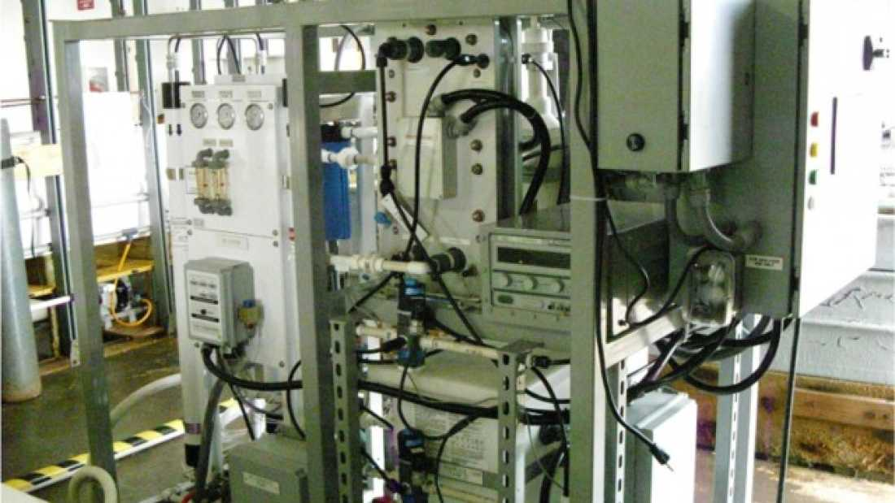



Jet fuel from sea water?!!!

"I fucking love Science!"


Scientists from the U.S. [Naval Research Laboratory](http://www.nrl.navy.mil/media/news-releases/2014/scale-model-wwii-craft-takes-flight-with-fuel-from-the-sea-concept) (NRL) have demonstrated significant progress in their novel gas-to-liquid process, which simultaneously recovers carbon dioxide and hydrogen from seawater, and report that it can produce a fuel-like hydrocarbon liquid which may eventually offer a renewable replacement for petroleum based fuel in jet engines.

The ability of Naval Vessels to generate fuel conveys numerous advantages. First off, during conflict this means that the aircraft carrier can maintain a constant supply of fuel without having to spend time away from the mission by returning to land to re-fuel. This time could be significant if the surrounding countries are not friendly forces. Second, fuel supplies are often targeted during conflict, which puts certain countries at an immediate disadvantage if a sufficient amount of fuel cannot be sourced. Generating fuel on-board would immediately remove this risk which has the potential to jeopardize missions. 

Seawater is a particularly attractive carbon source for fuel not only because of its obvious abundance, but it contains carbon in the form of CO2 in much higher concentrations than in the air. Scientists at NRL have developed a way to remove CO2 from seawater with a concomitant production of hydrogen (H2), which are the building blocks of hydrocarbons. They achieved this through the use of [electrochemical acidification cells](http://www.nrl.navy.mil/media/news-releases/2012/fueling-the-fleet-navy-looks-to-the-seas). 

The production of hydrocarbons, which are compounds solely made up of hydrogen and carbon, from the recovered gases is a [two-step process](http://www.nrl.navy.mil/media/news-releases/2012/fueling-the-fleet-navy-looks-to-the-seas). First, the CO2 and H2 are converted into unsaturated hydrocarbon starter molecules called olefins using an iron-based catalyst. Next, these olefins are converted into a liquid containing larger hydrocarbon molecules with a carbon range suitable for use in jet engines by polymerization. It should be stressed that this is currently a lab-based model system, although the team say that they have made significant advances in this gas-to-liquid system, and proved that the fuel-like liquid generated contained molecules in the required C9-C16 range. 

The team claim that the efficiency of this process is far superior to previously developed techniques for CO2 recovery from seawater; this technology removes CO2 at 92% efficiency. Obviously energy will be required as an input to drive the system, and currently this energy is going to come from fossil fuels. It's not a miracle "green" system that can create renewable energy from nothing, so at the moment there is still a reliance on fossil fuels. But it is not all doom and gloom- if this system can be coupled with a renewable energy source which is also built on the aircraft carrier, for example solar cells, or perhaps even more ideally a small nuclear reactor, then the system has the potential to be very sustainable in the long-term.

They predict that this technology could produce jet fuel at around only three to six dollars per gallon, which is impressive. With enough investment, they believe that it could become commercially viable in less than 10 years. 

In order to demonstrate that the technique works, the researchers flew a radio-controlled internal combustion powered model aircraft using the fuel-like fraction produced by this process, which is shown in the YouTube video below. The team are currently in progress of scaling-up the technique to a commercial channel reactor to increase output, but at this stage it is still a model system.

## video (01:53)
 Creating Fuel from seawater

 Navy researchers at the U.S. Naval Research Laboratory (NRL), Materials Science and Technology Division, demonstrate proof-of-concept of novel NRL technologies developed for the recovery of carbon dioxide (CO2) and hydrogen (H2) from seawater and conversion to a liquid hydrocarbon fuel. 



    start: 0,
    allowfullscreen: 1,
    autoplay: 0,
    hl: en,
    cc_lang_pref: en,
    cc_load_policy: 1,
    color: white,
    controls: 1,
    disablekb: 0,
    enablejsapi: 1,
    fs: 0,
    iv_load_policy: 3,
    loop: 0,
    modestbranding: 1,
    playsinline: 0,
    privacy_mode: yes,
    rel: 0,
    showinfo: 0,
    origin: blog.richiebartlett.com,
    widget_referrer: blog.richiebartlett.com

