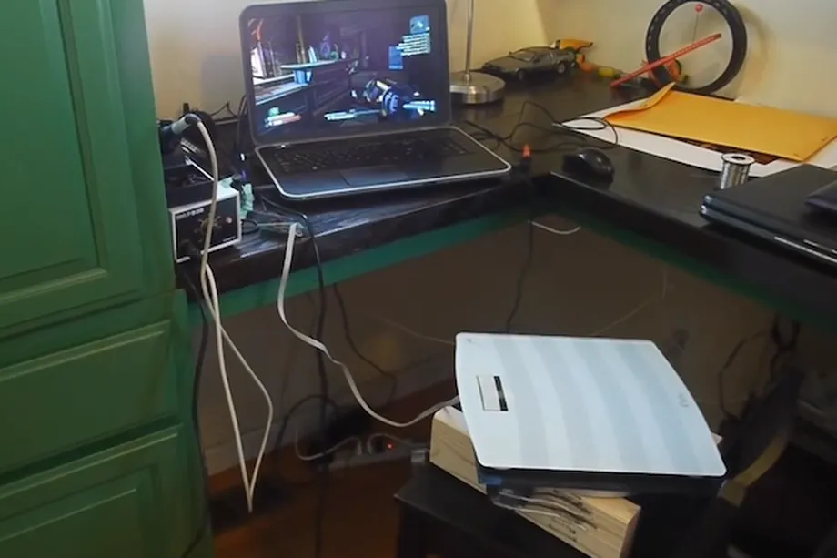



Hmm... Now where do I stick this controller again???


# Valve engineer invents new game controllers for your tongue and butt
 

 Just about every console maker has [revealed details of odd](http://www.theverge.com/2013/7/16/4527736/sony-biometric-sensors-dualshock-4-ps4-controller), [inventive controllers that they worked on and abandoned](http://www.theverge.com/2013/8/12/4615432/xbox-one-controller-concepts-screens-speakers-smells), but rarely do we actually get to see what such novel control schemes look like in action. Though they're personal projects, Valve engineer Ben Krasnow has released videos showing off two devices he's made that allow video games to be controlled by the tongue and by how a player is sitting. Krasnow calls the latter device a "posture-based" controller, which allows users to move around a game world by sitting on it and shifting weight on their butt forward, backward, or side-to-side. It takes the shape of a large pad, and it also allows gamers to swivel left and right to look around.

### Video (__ minutes)


    start: 0,
    allowfullscreen: 1,
    autoplay: 0,
    hl: en,
    cc_lang_pref: en,
    cc_load_policy: 1,
    color: white,
    controls: 1,
    disablekb: 0,
    enablejsapi: 1,
    fs: 0,
    iv_load_policy: 3,
    loop: 0,
    modestbranding: 1,
    playsinline: 0,
    privacy_mode: yes,
    rel: 0,
    showinfo: 0,
    origin: blog.richiebartlett.com,
    widget_referrer: blog.richiebartlett.com


 Krasnow admits that it may not beat the precision of a mouse, but he says that it might be a better choice under certain circumstances. "This works better for virtual reality," Krasnow says. Current virtual reality setups frequently still involve the use of a controller, but with Krasnow's device, in-game movement could be controlled entirely by how a gamer shifts and turns their body. Though he doesn't go into detail, Krasnow also teases that the controller may relate to some of his work on virtual reality at Valve — something that Valve [hasn't gone into detail about just yet](http://www.theverge.com/2013/11/19/5121206/valve-to-reveal-virtual-reality-prototype-big-plans-for-steam-support). For now though, the controller is a hacked-together prototype, built out of a "cheap" bathroom scale, an Xbox 360 controller, and a mouse.

 His tongue controller embodies the same spirit of building: it's more or less a retainer with a mouse's optical sensor attached to its underside. At the moment, Krasnow has it set up so that it works almost exactly like a normal mouse would — he can even control Windows using it, albeit quite poorly. "It would be basically pretty much impossible to play [a first-person shooter] this way," Krasnow says. "The precision needed for aiming and shooting at targets in a game like this is just far more than you can really do."

### Video (__ minutes)


    start: 0,
    allowfullscreen: 1,
    autoplay: 0,
    hl: en,
    cc_lang_pref: en,
    cc_load_policy: 1,
    color: white,
    controls: 1,
    disablekb: 0,
    enablejsapi: 1,
    fs: 0,
    iv_load_policy: 3,
    loop: 0,
    modestbranding: 1,
    playsinline: 0,
    privacy_mode: yes,
    rel: 0,
    showinfo: 0,
    origin: blog.richiebartlett.com,
    widget_referrer: blog.richiebartlett.com


 But Krasnow suggests that creating a version that's built around side-to-side swiping gestures would make it a lot more interesting. "For swiping and for gross movements ... there could be some possibilities there," Krasnow says when describing potential in-game uses. He's even attached a small button to it, which could allow users to click or perform an in-game action by pressing it with their tongue. While we don't know yet how much — if any — of these types of ideas will make it into Valve's eventual venture into virtual reality, we should start to find out soon: Valve has [promised to show off its idea of virtual-reality hardware](http://www.theverge.com/2013/11/19/5121206/valve-to-reveal-virtual-reality-prototype-big-plans-for-steam-support) next month.

## References
* [Eurogamer](http://www.eurogamer.net/articles/2013-12-05-valve-man-invents-tongue-and-bum-controllers)
* [Ben Krasnow (1)](http://www.youtube.com/watch?v=HyaiszgzIzo#t=125)
* [Ben Krasnow (2)](http://www.youtube.com/watch?v=vfqtKJAnJHg#t=81)
