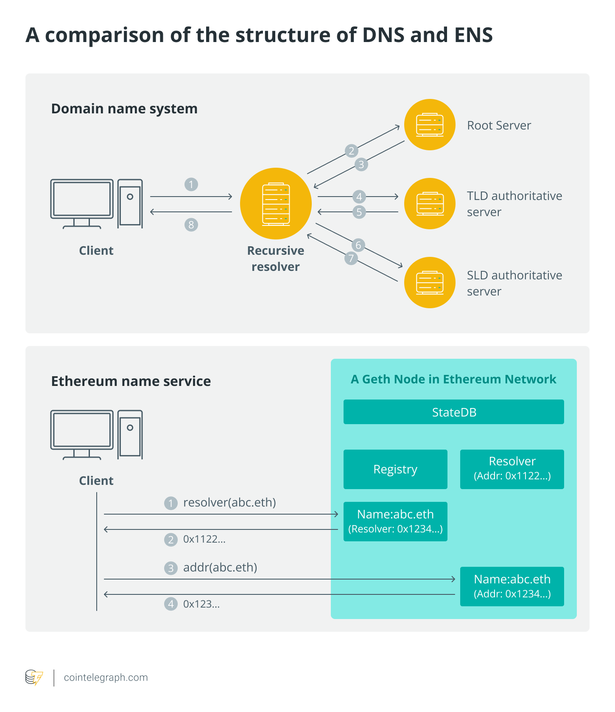
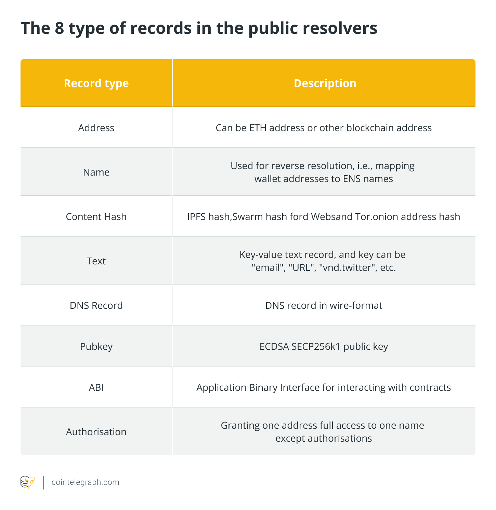
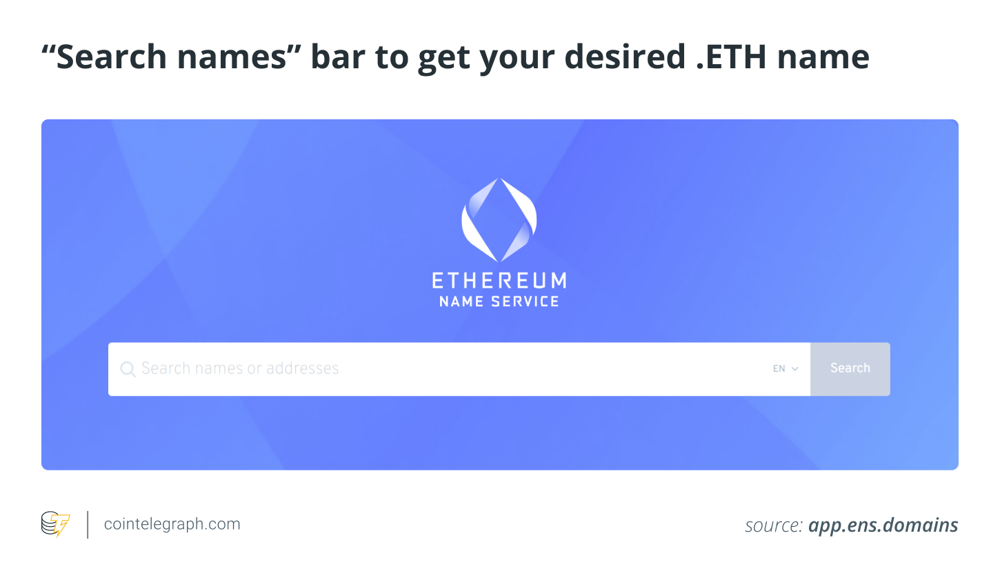
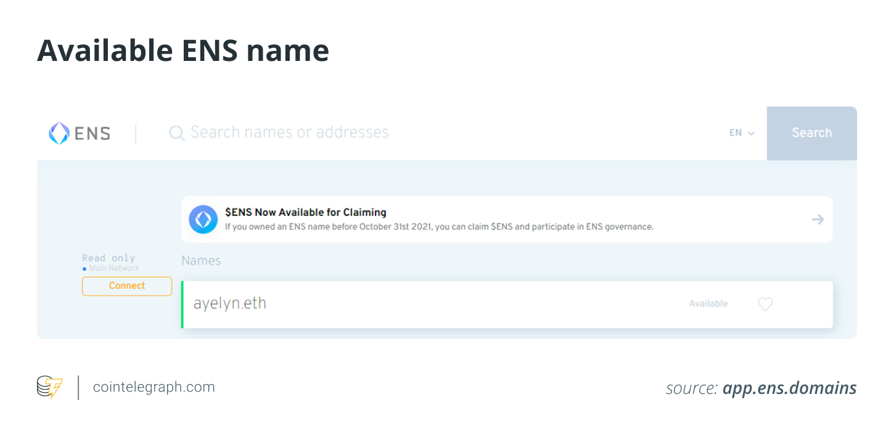
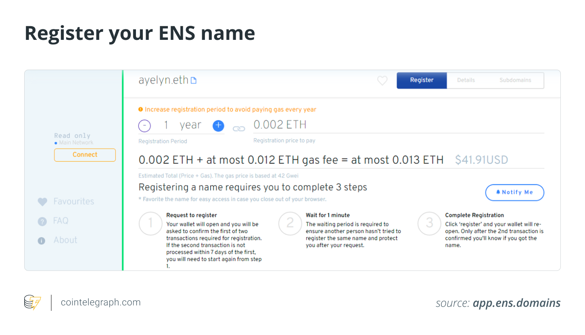

# The concept and future of decentralized Web3 domain names
 

## What are Web3 domains?
 *Web3 domains differ from standard domain name system (DNS) addresses such as Cointelegraph.com or thenewslack.io. A DNS is similar to a telephone directory, only it indexes public websites and their accompanying internet protocol (IP) addresses to enable the directory.*

 `Thenewslack.crypto` is the result of a 42-character hex string. However, in the case of Web3 blockchain domain name systems, one can simply remember a shorter phrase. [Web3 refers to the next generation](https://cointelegraph.com/blockchain-for-beginners/what-is-web-3-0-a-beginners-guide-to-the-decentralized-internet-of-the-future) of the web's legal, technical and monetary architecture, [including smart contracts](https://cointelegraph.com/explained/the-life-cycle-of-smart-contracts-in-the-blockchain-ecosystem), [blockchain and cryptocurrencies](https://cointelegraph.com/blockchain-for-beginners/what-is-a-cryptocurrency-a-beginners-guide-to-digital-money). Web3 projects fit into various categories like digital services, [decentralized finance (DeFi), and collectibles](https://cointelegraph.com/defi-101/defi-a-comprehensive-guide-to-decentralized-finance).

 A decentralized crypto domain is a human-readable address that serves as a stand-in for your crypto wallet, rather than offering a human-readable collection of characters as an IP address. These Web3 domain names are [nonfungible tokens (NFTs) or digital certificates of validity](https://cointelegraph.com/nonfungible-tokens-for-beginners/how-to-create-an-nft) that may be traded on platforms like Solana's Solsea or OpenSea. Moreover, Web3 domains have Web3 domain extensions like .crypto, .dao and .eth.

 The attractiveness of a Web3 domain name, which symbolizes a blockchain address, is straightforward. For instance, "Send the salary to bob.eth," rather than reciting some impossible-to-remember 42-character crypto wallet address, is considerably easier for the sender to remember and do.

 Web3, also known as the "read-write-trust web" and the "decentralized web," aspires to take control of the web away from monopolistic tech giants like Amazon, Google, Microsoft and give the control of users&rsquo; data and content back to the users. So, how will Web3 work and how is Web3 DNS different from traditional domains?

 A traditional blockchain currently has limitations that make it difficult to use and have reduced its widespread acceptance. An example of a standard wallet address is `0xC83107B60f42B5211727c7d7D1F9135ada395Ad0`. Any typical individual would be scared by this, which would prevent adoption. This same problem occured with IP addresses that the internet had to overcome to gain popularity.

 Blockchain organizations need a name service to establish digital identities across public addresses. Furthermore, consumers will find it much easier to interact with a named address than a stream of arbitrary alphabets and digits. For instance, a decentralized Web3 name service like the RIF name service is a DNS-inspired hierarchical namespace. RNS's design aims to provide a naming convention that can be used to refer to resources.

## What is an ENS and how does it work?
 *The primary purpose of the Ethereum name service (ENS) is to convert machine-readable identifiers like Ethereum addresses to human-readable names.*

 The web began as a decentralized system based on the DNS, with anybody able to buy, own and manage their domain name and move it from one host to another as needed, with complete control and ownership over all underlying data. But, how does a decentralized Web3 name service work?

 The community has shown a lot of interest in ENS, which is a new name service built on top of Ethereum. The Ethereum Name Service is a Web3 blockchain system that allows users to establish their own unique and memorable usernames.

 Therefore, ENS intends to provide a complementary solution to DNS by utilizing Ethereum smart contracts to govern domain name registration and resolution. Using the service, you can provide a single name to all of your wallet addresses and decentralized websites (DWebs). "alex.eth," for example, makes you recognize and quickly locate wallet addresses in a distributed environment.

 

 The registry, the registrars and the resolvers are three kinds of smart contracts in ENS, as explained in the sections below.

### The registry
 A single smart contract runs the ENS registry and keeps track of all domains and subdomains. The system purposefully has been kept basic, and its sole purpose is to link a name to the resolver that is accountable for it. It also saves the following three crucial pieces of data:

 * The **owner of the domain**: An external account or a smart contract can be the domain owner. The domain owner can update the domain's resolver and TTL, transfer the ownership of the domain to another address and alter the right of subdomains.
 * **Resolver of domain names**: The process of converting names into addresses is handled by resolvers. Any contract can become a resolver if it follows specific guidelines.&nbsp;
 * **ENS Namehash**: ENS saves names as hashes, which are produced using the "namehash" method. The namehash is calculated by combining the hash of the highest-level part of ENS domain names (known as "labelhash") with the namehash of the other parts and then performing another hash on it.

### The registrars
 A registrar is a smart contract that holds a domain name and can grant subdomain names to users depending on rules (*e.g.*, payment). The ENS team used the Vickrey auction registrar and the permanent registrar for .eth name registrations.

 On May 4, 2017, the ENS team released a smart contract implementing a Vickrey auction to register names longer than six characters. The Vickrey auction is a sort of sealed-bid auction in which buyers bid without knowing how many other bidders have bid, and the auction winner is the highest bidder who only has to pay the second-highest amount.

 On May 4, 2019, the ENS team introduced the "permanent registrar" in place of the auction registrar for registering names longer than six characters. The perpetual registrar is designed to run indefinitely until the registrar contract is replaced due to a severe flaw. The manner of billing for `.eth` names has been modified to an annual rent payment model, in which each name will be charged $5 per year.

 Along with the permanent registrar, the registrar controller idea was created to allow name owners to delegate name management. As a result, a name registered by the registrar controller can configure resolver and name records as part of the registration transaction, simplifying the procedure.

 Another auction called the short name auction for remaining short names with a length of 3&ndash;6 commenced in September 2019. The ENS team used OpenSea, a well-known crypto-asset marketplace, as the auction platform, with the English auction as the auction method.

 Bids in an English auction are open to the public, and bidders can place numerous bids. The highest bidder will get the name, and the number of deposits will be the first-year registration fee, which is considerably different from the Vickrey auction period.

### The resolvers
 The name-to-record mapping is saved in the resolver. The "public resolvers" implemented by the ENS team have preset eight categories of records (see image below), but ENS can hold any records.

 

 The ENS name resolving procedure is two-step. First, the user who wishes to resolve the name must search the registry for the relevant resolver and then obtain the resolver's resolution results.

## What are .eth domain names used for?
 *Long numbers can be converted into easy-to-remember words using ENS. This results in a more direct experience with fewer opportunities for mistakes.*

 The owner of an ENS domain can also construct subdomains to which they can allocate other data. However, it doesn't have to be a wallet address all of the time. Instead, it could be used to point to a smart contract, metadata or a transaction.

 The ENS.eth domain names are at the crossroads of two highly fascinating markets: traditional domain name investors and blockchain entrepreneurs. Unfortunately, only a few hundred thousand blockchain domain names have been registered even though there are millions of blockchain users globally!

 There is now a significant pent-up demand for domains as blockchain users have learned that choosing a blockchain domain name makes using their applications easier. Additionally, you can rent out your blockchain domains or even set up a lease-purchase agreement to enable others to create brand value on your property while leaving your options open, just like conventional domains.

## How to register a .eth ENS domain name
 *Web3 domain ideas can be turned into reality with the ENS service. If you are a crypto fan and want to know how to get a Web3 domain name, please keep reading to find out.*

### Sign into an Ethereum-enabled browser
 To buy Web3 domains like ENS, you must be signed into your Ethereum browser with the same wallet as the name you want to own, and you must have at least a small quantity of ETH in your wallet to cover transaction charges and the first year's annual fee for your NFT domain names.

 On the desktop, this could be Chrome with the MetaMask plugin installed or Brave with the crypto wallet feature enabled. TrustWallet, Coinbase Wallet, MetaMask Mobile or any mobile Ethereum browser could also be used.

### Navigate to the ENS manager to get your desired .eth name
 Go to [app.ens.domains](https://app.ens.domains) in your browser and type your desired .eth name (such as `ayelyn.eth`) in to the "Search names" section before clicking the "Search" button.

 

 You'll be able to get the desired `.eth` name if it isn't registered by someone else, as shown in the image below.

 

### Select the time interval and start the registration method
 If the name like `ayelyn.eth` is available, you'll be taken to a screen that asks how long you'd like to register it for, as shown in the image below.

 

 Select the number of years you'd want to pay the annual fee for the first time using the `-` and `+` buttons. When registering a name with ENS Manager, you must do so for a minimum of one year. You can register for an additional year by paying a fee. You have the option of extending your registration period to a later date.

 On the bottom right, click the blue "Request To Register" button. MetaMask (if it is your chosen wallet) should prompt you to confirm the transaction in a box. To prove it, click the "Confirm" button. Please wait until the green bar passes through ① &ldquo;request to register&rdquo; &nbsp;➡&nbsp; ② &ldquo;wait for a minute&rdquo; &nbsp;➡&nbsp; ③ &ldquo;complete registration.&rdquo;

### Finish the registration process
 When your wait period is over, you'll see orange writing that says "Click register to proceed to the third step." Then, click the blue "Register" button next to it.

 A new MetaMask window will appear, requesting that you complete a transaction to finalize your name and pay your registration cost. Select "Confirm" from the drop-down menu. "TX PENDING" will appear where the "Register" button is on the Manager page. Your name will be registered once the transaction is validated.

## The future of Web3 domain names
 *The Ethereum Name Service aims to make crypto transactions more convenient and accessible, similar to how PayPal can be used to pay a friend for lunch in crypto.*

 ENS is a step forward in terms of making blockchain interaction more accessible. However, because of its use and growing popularity, we may witness an increase in ENS names, just as we no longer use IP addresses to access the web.

 Businesses will become more transparent and user-centric due to Web3 hostings. It opens the door for blockchain, and in the future, individuals, apps and websites will use blockchain-based domains to enable users to access the decentralized web.