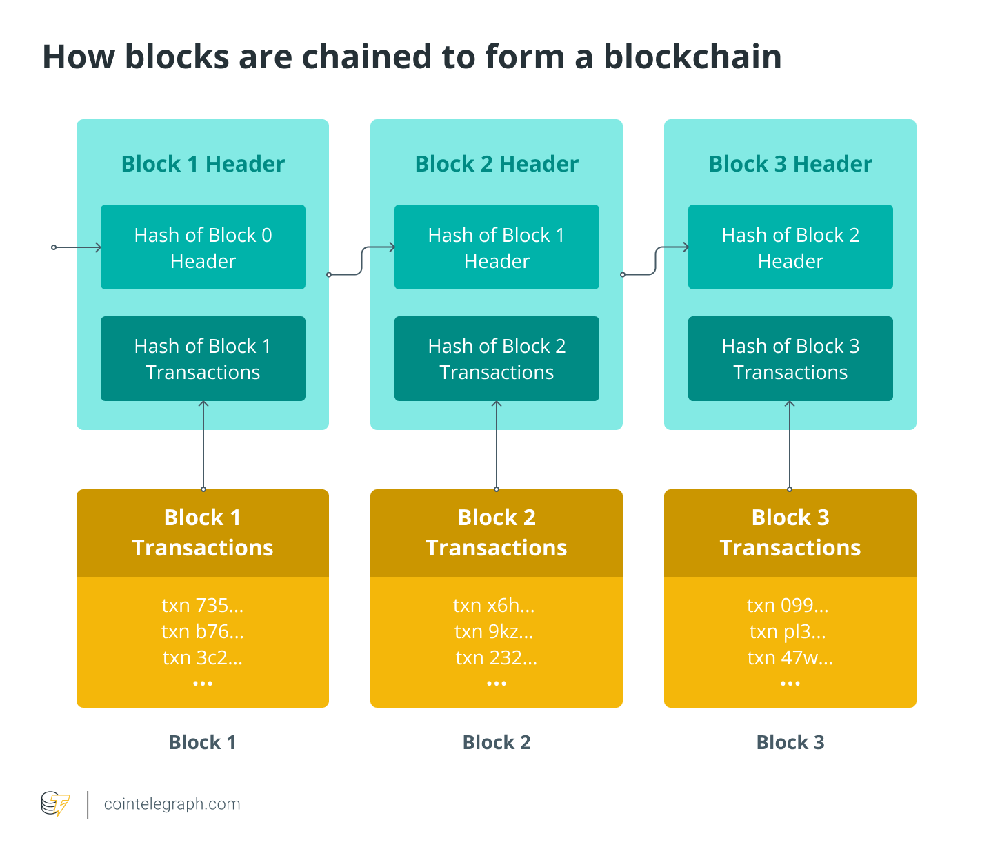

## What is chain reorganization?
*A reorganization, abbreviated as reorg, occurs when a block is deleted from the blockchain to make room for a longer chain.*

Despite its potential, [blockchain is beset by obstacles](https://cointelegraph.com/blockchain-for-beginners/five-major-challenges-in-the-blockchain-industry). For example, block conflict is now the most common type of blockchain flaw, which indicates that if two blocks are published nearly simultaneously, [a fork in the blockchain can occur](https://cointelegraph.com/blockchain-for-beginners/soft-fork-vs-hard-fork-differences-explained#:~:text=A%20fork%20is%20a%20change,by%20developers%20or%20community%20members.). 

The current conflict resolution method is based on the Longest Chain Rule (LCR), *i.e.*, if multiple blocks are present, treat the longest chain as valid. This means that each node follows the protocol requirement of only attempting to extend the most extended branch of which they are aware. Because transactions on the wrong side of the fork would be restructured into new blocks, this rule causes a few transactions on the wrong side of the fork to be delayed, leading to blockchain reorganization.

Chain reorganization can happen with [busier blockchains such as Bitcoin](https://cointelegraph.com/bitcoin-for-beginners/how-does-blockchain-work-a-beginners-guide-to-blockchain-technology) and [Ethereum, where nodes may generate a new block](https://cointelegraph.com/ethereum-for-beginners/history-of-eth-the-rise-of-the-ethereum-blockchain) simultaneously and in the same place. The two nodes update their copies of the ledger; if this happens, the node that produced the shorter follow-up chain reorganizes the chain. Chain rearrangement, in essence, ensures that all node operators have the same copy of [the distributed ledger](https://cointelegraph.com/blockchain-for-beginners/how-does-blockchain-work-everything-there-is-to-know).

## How does chain reorganization work?
*A blockchain reorganization attack refers to a chain split in which nodes receive blocks from a new chain while the old chain continues to exist.*

On May 25, [the Ethereum Beacon chain suffered a seven-block reorg](https://cointelegraph.com/news/ethereum-beacon-chain-experiences-7-block-reorg-what-s-going-on) and was exposed to a high-level security risk called chain organization. [Validators on the Eth2](https://cointelegraph.com/ethereum-for-beginners/ethereum-upgrades-a-beginners-guide-to-eth-2-0) (now consensus layer upgrade) Beacon Chain became out of sync after a client update elevated specific clients. However, during the process, validators on the blockchain network were confused and didn't update their clients.

Seven-block reorganization means that seven blocks of transactions were added to the eventually discarded fork before the network figured out it wasn't the canonical chain. Therefore, blockchain reorganization happens if some node operators are faster than others. During this scenario, faster nodes will be unable to agree on which block should be processed first and they'll continue to add blocks to their blockchain, leaving the shorter chain when the next block is created.

For instance, miners X and Y may both locate a valid block at the same time, but due to the way the blocks spread in [a peer-to-peer network](https://cointelegraph.com/news/what-is-p2p-trading-and-how-does-it-work-in-peer-to-peer-crypto-exchanges), a portion of the network will see X's block first, followed by Y's block. 

If the two blocks are of equal difficulty, there will be a tie, and clients will be given the option of picking at random or selecting the previously seen block. When a third miner, Z, creates a block on top of either X's or Y's block, the tie is usually broken, and the other block is forgotten, leading to blockchain reorganization.

In Ethereum's Beacon chain reorganization case, up-to-date nodes were around 12 seconds faster than validators that hadn't updated their clients at block 3,887,074. Ethereum chain reorganization occurs when updated clients submit the next block before the rest of the validators. This confused validators about who should submit the initial block.

Preston Van Loon, a core Ethereum developer, stated that the reorg of the Ethereum blockchain is due to the deployment of the Proposer Boost fork decision, which has not yet been fully rolled out to the network. Furthermore, this reorganization is a non-trivial segmentation of updated versus outdated client software, not a sign of a bad fork choice.

## How are blockchains chained together?
*[A nonce generates the cryptographic hash](https://cointelegraph.com/ethereum-for-beginners/architectural-components-of-the-ethereum-blockchain-what-are-they) when the first block of a chain is formed. Unless it is mined, the data in the block is regarded as signed and irrevocably linked to the nonce and hash.*

A header and several transactions are included in each block. Then, a [fixed-length hash output](https://cointelegraph.com/explained/proof-of-work-explained) is generated from the transactions in a block and added to the block header.

Following the generation of the first valid block, each subsequent valid block must include the previous or old block header's hash output. Every valid block is linked to those before it by the hash of the previous block header, which is contained in every block. As a result, a chain of blocks (data chain), called a blockchain, is formed by connecting each block to its predecessors.

## What is the impact of chain reorganization?
*Chain reorganization increases node costs, degrades user experience, and increases [the vulnerability of decentralized finance (DeFi) transactions](https://cointelegraph.com/defi-101/defi-a-comprehensive-guide-to-decentralized-finance) and [51% attacks](https://cointelegraph.com/news/ethereum-classic-51-attack-the-reality-of-proof-of-work).*

Due to the need to transition over to the new fork, state updates sometimes involve memory and disc costs when a reorg occurs. Consequently, because reorgs are possible, users will have to wait longer before they can confidently treat a transaction that involves them as confirmed. As a result, [businesses like exchanges](https://cointelegraph.com/defi-101/what-are-decentralized-exchanges-and-how-do-dexs-work), for example, may have to wait longer before accepting a deposit.

Chain reorganization raises the risk of DeFi transactions failing due to human error, resulting in lower-than-expected trading returns. Reorg also increases the vulnerability of 51% attacks, which means attackers no longer have to defeat all honest miners; instead, they must defeat the percentage of honest miners who aren't reorged. The attacker's job becomes much easier if reorganization occurs frequently.

## What are the advantages and disadvantages of PoS blockchains?
*Proof-of-stake (PoS) blockchains have numerous advantages over proof-of-work (PoW) blockchains as they are more environmentally friendly and have no centralization issues. However, there are also some disadvantages, such as double spending during blockchain reorganization.*

To begin with, [the PoS consensus mechanism](https://cointelegraph.com/blockchain-for-beginners/proof-of-stake-vs-proof-of-work:-differences-explained) is far more environmentally friendly than PoW. In essence, miners don't need to waste processing power on pointless calculations to safeguard the network. 

Second, there are no issues with centralization. Indeed, unlike PoW, where mining has mostly been dominated by specialist hardware equipment, and there is a significant risk that a single huge miner would take over and effectively monopolize the market, PoS is CPU friendly in the long run.

However, there are certain drawbacks to using PoS. For instance, the "nothing at stake" issue. By voting for multiple blockchain histories, miners have nothing to lose. This is because, unlike PoW, the cost of mining on several chains is low, and miners can try to double-spend at no cost in the case of blockchain reorganization.