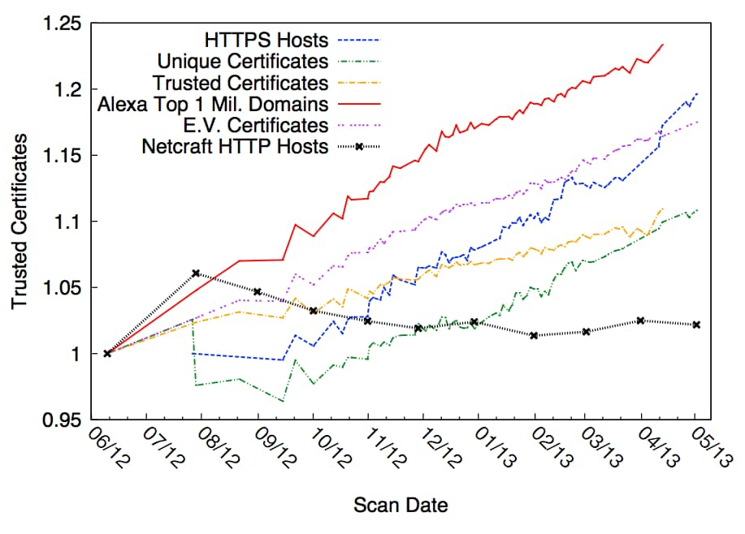
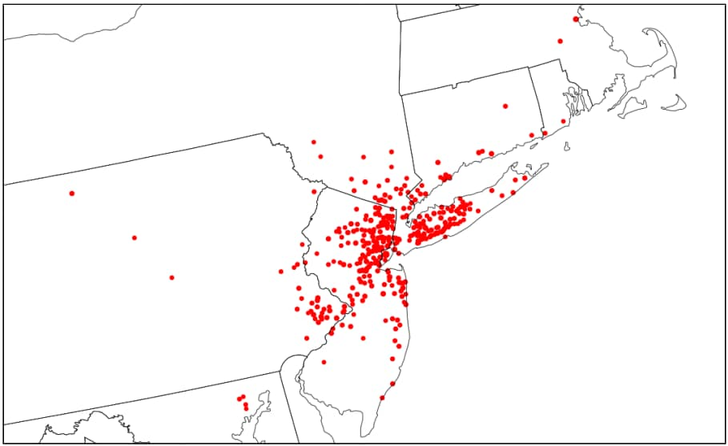
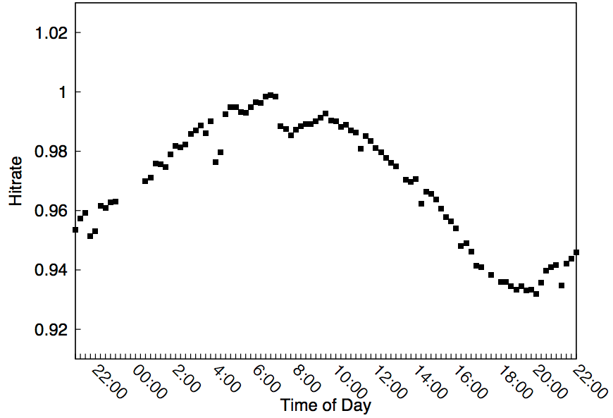
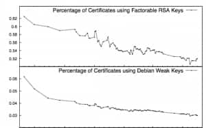

SOURCE: https://www.washingtonpost.com/news/the-switch/wp/2013/08/18/heres-what-you-find-when-you-scan-the-entire-internet-in-an-hour/
Timothy B. Lee
August 18, 2013

> Gotcha now my pretty! And, it only took 44 minutes to find you!

---

Until recently, scanning the entire Internet, with its billions of unique addresses, was a slow and labor-intensive process. For example, in 2010 the Electronic Frontier Foundation [conducted a scan](https://www.eff.org/files/DefconSSLiverse.pdf) to gather data on the use of encryption online. The process took two to three months.

 A team of researchers at the University of Michigan believed they could do better. A lot better. On Friday, at the Usenix security conference in Washington, they [announced ZMap](https://zmap.io/), a tool that allows an ordinary server to scan every address on the Internet in just 44 minutes.

 The EFF team used a tool called Nmap that sends a request to a machine and then listens for the recipient to reply. These requests can be conducted in parallel, but keeping records for each outstanding request still creates a lot of overhead, which slows down the scanning process.

 In contrast, ZMap is "stateless," meaning that it sends out requests and then forgets about them. Instead of keeping a list of oustanding requests, ZMap cleverly encodes identifying information in outgoing packets so that it will be able to identify responses. The lower overhead of this approach allows ZMap to send out packets more than 1,000 times faster than Nmap. So while an Internet-wide scan with Nmap takes weeks, ZMap can (with a gigabit network connection) scan the entire Internet in 44 minutes.

 The ability to rapidly and cheaply scan the entire Internet opens up some fascinating new possibilities for Internet-wide research. Here are some of the interesting things the Michigan team did with their new toy.

## The increasingly encrypted Web
 More and more Web sites are using the encrypted HTTPS version of the Web's fundamental protocol. How quickly are organizations switching? In the past, getting even a single estimate was a slow and expensive process. But ZMap can not only answer the question in under an hour, but through regular scanning it can track the growing popularity of HTTPS over time.

 Using ZMap, the Michigan researchers found that over the last year, HTTPS use by the top 1 million Web sites (the red line) has increased by about 23 percent, and the number of HTTPS overall (the blue line) increased by almost 20 percent.

 

## How hurricanes damage the Internet
 When major natural disasters strike, they can force computers offline. That provides a clever way to measure the extent of damage. From Oct. 29-31 of last year, as Hurricane Sandy was pounding the East Coast of the United States, the researchers conducted Internet-wide scans every two hours. After linking IP addresses to geographic locations, they could observe which areas saw the most severe disruptions. This map shows "locations with more than a 30 percent decrease in the number of listening hosts."

 

## The Internet's sleep cycle
 When scans took weeks, it didn't really matter when you started a scan. But when they take less than an hour, it does. So when is the best time to conduct a network-wide scan? To investigate this question, the researchers conducted scans at different times of the day and observed how many responses they got. Here's what they found:

 

 There are a couple of possible explanations for this pattern. It's possible that some online services are only available at certain times of day. But a more likely explanation has to do with congestion. By default, ZMap only sends one packet to each host. If a packet is sent during a period of high network congestion, the packet, or the recipient's response, is more likely to get lost. In any event, the best time to scan the Internet, at least from Michigan, seems to be early in the morning. The worst time is in the early evening.

## Widespread security flaws
 Security researchers regularly discover security flaws in existing software, forcing manufacturers to hastily put out bug fixes. But how long does it take for users to actually apply the fixes? ZMap provides a quick and efficient way to find out. In one experiment, the team scanned the Internet for a [major vulnerability](http://arstechnica.com/security/2013/01/to-prevent-hacking-disable-universal-plug-and-play-now/) discovered earlier this year in a technology known as Universal Plug and Play. A couple of weeks after the vulnerability was discovered, the researchers scanned the Internet to find out how many hosts had failed to upgrade. Out of 15.7 UPnP devices, they found 2.56 million (16.7 percent) had not yet upgraded.

 

 The ability to rapidly find computers with security vulnerabilities can be a good thing if it allows ethical security researchers and software vendors to find and notify systems administrators about problems before information is released to the general public. But ZMap could also be used for evil. A malicious hacker could use the tool to rapidly identify computers that have unpatched vulnerabilities and compromise them in parallel, creating a million-machine botnet in a matter of hours.

