 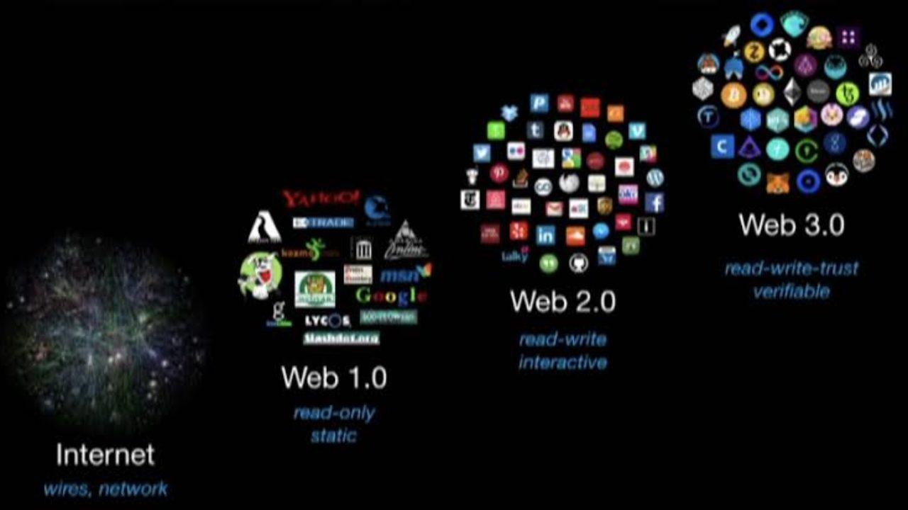

## The Web as we know it today
 The current interation of the 'net is more generally referred to as `WEB2.0`. We have responsive and dynamic websites that are very interactive. However, there is no cheap & reliable method to truly verify the trust of the content and users. All content is owned by the networks that host them. Everything is ephemeral and admissible by the State.

 The core technologies on which the Web2.0 is built embody some key design choices that:
 1. enable centralized control of software systems and data, whether by corporations or the state,
 2. allow for the pervasive spread of disinformation that is very costly to identify and correct relative to the cost to produce and distribute it, and
 3. make it quite difficult to implement solutions to those problems by building applications on top of them, rather than replacing them. 
    (To be clear, these are all statements about how these technologies operate through human psychology, and with our sociopolitical context. They are statements about technosocial systems.)

 The focus of "Web3" is to decentralize the content and build a "[zero trust](https://en.wikipedia.org/wiki/Zero_trust_security_model)" network whereby everyone has access to any content ever published. Web3 also enables blockchain applicatons to bypass the "walled gardens" were "trusted" intermediaries hold the keys to all content. Its overarching goal is to make the internet a lot more **intelligent**, **autonomous**, and **open**. 

 We can use cryptocurrency to completely transform the business model of applications that exist on the internet, instead of the ad-based model that we have today. As Chris Dixon says, we took “a wrong turn” in the current social web by allowing for walled-gardens and ad-based business models. The next version of the web will be built on open protocols and will have a built-in business model via crypto. If something feels off about the current version of the web, it’s not just you.

 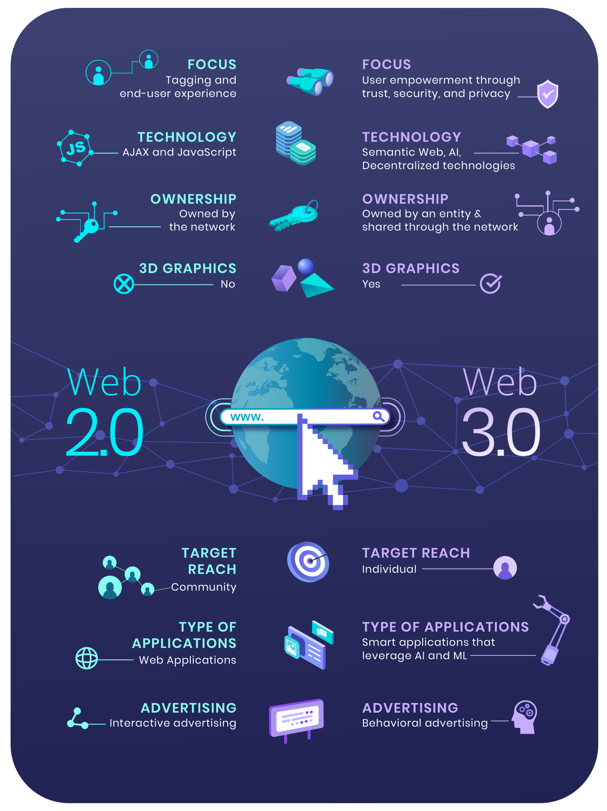


## Life cycle of companies & information
 If you've been around long enough to see the rise of the internet, you would have seen several companies come and go. I remember when the only method to get online was a 28kbps modem over an analog phone line with AOL-online. Back then (before the year 2000), the fastest method to get information on your PC was via a [CD-ROM](https://en.wikipedia.org/wiki/CD-ROM). After getting online, you had the ability to read or copy information sponsored by major corporations. However, you were limited to the quaility of your phone line and the local storage of your computer.

 After a while, digital "billboards" popped up online. These morphed into online forums and later appropriated by social media sites. I remember spending hours of each day browsing and building my own "webpage" on these platforms. Here is a list of companies that have joined the digital graveyard of years gone by:

 * [Geocities](https://www.cnet.com/tech/services-and-software/geocities-dies-in-march-2019-and-with-it-a-piece-of-internet-history/)
 * [Open Diary](https://cemeteryclub.wordpress.com/2014/02/13/opendiary/)
 * [Friendster](https://www.technologyreview.com/2013/02/27/253657/an-autopsy-of-a-dead-social-network/#:~:text=In%20July%202009%2C%20following%20some,simply%20curled%20up%20and%20died.&text=This%20is%20the%20company%20that,offer%20from%20Google%20in%202003.)
 * [MySpace](https://www.theguardian.com/technology/2015/mar/06/myspace-what-went-wrong-sean-percival-spotify)
 * [Google+](https://www.theverge.com/2019/4/2/18290637/google-plus-shutdown-consumer-personal-account-delete)
 * [Vine](https://www.theverge.com/2016/10/28/13456208/why-vine-died-twitter-shutdown)
 * [iTunes Ping](https://www.cnbc.com/id/47798334)
 * [Orkut](https://en.wikipedia.org/wiki/Orkut#:~:text=On%20June%2030%2C%202014%2C%20Google%20announced%20that%20Orkut%20would%20be,be%20exported%20until%20September%202016.)
 * [Eons](https://www.inc.com/staff-blog/2008/01/31/the_demise_of_eons.html)
 * [DailyBooth](https://www.fastcompany.com/3002885/daily-booth-pulls-down-shutters)
 * [FriendFeed](https://www.inc.com/quora/here-s-what-really-happened-with-friendfeed-the-social-network-that-wasn-t.html)
 * [Google Wave & Google Buzz](https://en.wikipedia.org/wiki/Google_Buzz#:~:text=Buzz%20was%20discontinued%20on%20December,friends%20each%20time%20they%20posted.)
 * [Meerkat](https://mashable.com/article/meerkat-app-eulogy)
 * [Yik Yak](https://www.cnet.com/tech/services-and-software/yik-yak-a-toxic-social-network-that-shut-down-four-years-ago-is-somehow-back/)

 This list is by no means comprehensive. If you were active on any of these platforms (as I was), then you probably wasted a lot of time and effort to share your thoughts and ideas. Unless you had a backup of those writings, you likely lost everything stored on those companies' servers. This is where Web3.0 changes things. 

 Today, you can launch your own blog with `Medium.com`, `WordPress.com`, or other blogging platforms. Alternatively, if you don't have the patience to setup your blog theme, you could rely on an existing platform like Facebook, Twitter, Weibo, WeChat, *etc*. Just know that you are limited to each platform's rules and censorship. Not to mention that most of these companies have binding agreements to ownership of your data as a condition to using their platforms. And, as I mentioned previously, none of these companies can be expected to be around for the remainder of your life. To me, Facebook already feels like it's starting to decline. (One of the many reasons I've migrated my data here.)


## Build your own site
 For those determined enough to control their own brand and content, rolling out a custom website makes perfect sense. There are several providers to choose from: CloudFlare, GoDaddy, Azure, Google Cloud, and AWS. I've done this several times employing various hosting services over the years. 

 However, this requires you have the technical knowledge or financial resources to employ an expert to build your site. You need a server, storage, domain name, and software to write the code. None of these are free and require an investment to keep online. If your credit cards or bank accounts suddenly stop working, then your Web2.0 website will likely go offline within a couple months...


## Censorship
 Lack of financial resources through traditional banks isn't the only avenue by which your data can be taken offline. In 2017, Turkey's state controlled [court decided to block Wikipedia](https://en.wikipedia.org/wiki/Block_of_Wikipedia_in_Turkey)! In the same year, [Spanish authorities try to shutter Catalan referendum websites](https://www.politico.eu/article/spanish-authorities-try-to-shutter-catalan-referendum-websites/). China and its [Great Firewall](https://en.wikipedia.org/wiki/Great_Firewall) is [notorious for blocking websites](https://en.wikipedia.org/wiki/List_of_websites_blocked_in_mainland_China) it deems "harmful to its citizens." While the United States has placed "Freedom of Speech" on a high pedestal, it's [not above blocking certain websites](https://en.wikipedia.org/wiki/Internet_censorship_in_the_United_States). Within the States, [companies are well known to have policies that block some websites](https://newsfeed.time.com/2013/09/24/top-blocked-websites-in-the-u-s/) from its internal networks.

 With Web3.0, it's completely possible to keep your data online provided you have enough cryptocurrency to keep it pinned on IPFS nodes. For as long as a single node stores a copy of your data, it will always be online for all to consume. 


## What is IPFS

The Interplanetary File System (IPFS) is a *decentralized* file system for building the next generation of the internet. [Filecoin](https://filecoin.io) and many popular Web3 projects are built on IPFS. Some call it the *hard drive* for blockchain and Web3, though its power extends much further.


 While there's lots of complex technology in IPFS, the fundamental ideas are about changing how networks of people and computers communicate. Today's world wide web is structured on ownership and access, meaning that you get files from whoever *owns* them &mdash; if they choose to grant you access. IPFS is based on the ideas of possession and participation, where many people possess each others' files and participate in making them available.

## Decentralization
 Making it possible to download a file from many locations that aren't managed by one organization:

 * **Supports a resilient internet.** If someone attacks Wikipedia's web servers or an engineer at Wikipedia makes a big mistake that causes their servers to catch fire, you can still get the same webpages from somewhere else.
 * **Makes it harder to censor content.** Because files on IPFS can come from many places, it's harder for anyone (whether they're states, corporations, or someone else) to block things. IPFS could help provide ways to circumvent actions like these when they happen.
 * **Can speed up the web when you're far away or disconnected.** If you can retrieve a file from someone nearby instead of hundreds or thousands of kilometers away, you can often get it faster. This is especially valuable if your community is networked locally but doesn't have a good connection to the wider internet. (Well-funded organizations with technical expertise do this today by using multiple data centers or [CDN](https://en.wikipedia.org/wiki/Content_delivery_network)s. IPFS hopes to make this possible for everyone.)

 That last point is actually where IPFS gets its full name: the **I**nter**P**lanetary **F**ile **S**ystem. Striving to build a system that works across places as disconnected or as far apart as planets.

## Why IPFS
 The interesting arguments for IPFS boil down to these three:
 1. **Ownership, control, censorship**
    
    At the end of the day, Medium the company controls what happens on `medium.com`, subject to the laws of the jurisdictions where it operates and the private decisions of its leaders and owners. To a first approximation, Medium’s interests are mostly aligned with authors who put their writing there. But that alignment is far from perfect, and an individual writer has almost no say in the decisions the company makes. In many ways, Medium has been better than some of its web predecessors about communicating its goals and values. But the fact remains that its users are wholly subject to its business decisions, without any right to appeal. Of course, Medium is beholden to its customers (*i.e.* advertisers) as a whole - but this is of no help to a user of the system whose needs diverge from the chosen path. In addition to, and intertwined with, this corporate control is the state’s ability to dictate how Medium should act, including prohibiting certain content and demanding that certain information be turned over upon demand.
 2. **Resilience**

    The most sophisticated modern web services still operate within the fundamental limitations of HTTP and DNS. And while it is possible to create systems using these technologies that are robust to many perturbations, outages, and catastrophic events... doing so is difficult, expensive, and harmful to the quality of the user experience. It does not make business sense for any profit-seeking entity to prioritize this kind of resilience &mdash; certainly not for consumer services based on ad or subscription revenue. From their point of view, the existing tools work well enough.

 3. **Elegance**

    What role should aesthetics play in these decisions? I don’t know, and I think I’m middle-of-the-road in the endless war between programmers who favor purity & formal elegance and those who prioritize outcomes & practical considerations. However, I will say that *content addressing* strikes me, and many software people who come across it, as obviously superior to *host-based addressing* along certain dimensions. But this beauty can certainly feel like a slender reed on which to place the design of a system that needs to get real work done. So weigh this as you will.

 These advantages are, to varying degrees, abstract and aspirational. Building anything on IPFS now represents a bet on a future in which priorities have changed, and engineering decisions are therefore made differently. Put another way: IPFS is a technology that belongs to a certain class of futures &mdash; a technology that will help the individual thrive without corporation or state censorship.

 The rest of this article assumes that you (or your expert) have the experience and technical skills to build & deploy a full-stack Web2.0 website.


## Prepare your website
 Using software development editor (*e.g.* VScode, Sublime Text), you can build your website using your favorite framework and libraries. ([HEXO.io](https://hexo.io/) in my case.) Generally, I design the layout using Adobe&reg; XD and grab select artwork from [Adobe Stock](https://stock.adobe.com)&reg;. Add some graphics from Adobe&reg; Illustrator. Then setup my HEXO theme. After testing and generating the final version, I'm ready to upload the site.

 The IPFS docs have a great tutorial that gets you started in a barebones website for upload.

 

 In general, you should have a folder with files like this:

 ```txt Basic_website
 .
├── index.html
├── about.html
├── favicon.ico
├── css
│   └── styles.css
├── img
│   ├── logo.svg
│   └── image.png
└── js
    └── scripts.js
```


## Deploy to IPFS
### Install the IPFS client


<!-- tab text -->
 Use IPFS Desktop to get acquainted with IPFS without needing to touch the terminal — or, if you're already experienced, use the powerful menubar/taskbar shortcuts alongside the [command line](https://docs.ipfs.io/install/command-line/) to make your IPFS workflow faster.

| [Windows](https://docs.ipfs.io/install/ipfs-desktop/#windows) | [macOS](https://docs.ipfs.io/install/ipfs-desktop/#macos) | [Ubuntu](https://docs.ipfs.io/install/ipfs-desktop/#ubuntu) |
| -- | -- | -- |
|  |  |  | 

 




<!-- endtab -->

<!-- tab video -->
 The InterPlanetary File System (IPFS) is a protocol and peer-to-peer network for storing and sharing data in a distributed file system. IPFS uses content-addressing to uniquely identify each file in a global namespace connecting all computing devices.

 In this video you will learn how to create and setup a node in IPFS network.


  allowfullscreen: 1,
  autoplay: 0,
  hl: en,
  cc_lang_pref: en,
  cc_load_policy: 1,
  color: white,
  controls: 1,
  disablekb: 0,
  enablejsapi: 1,
  fs: 0,
  iv_load_policy: 3,
  loop: 0,
  modestbranding: 1,
  playsinline: 0,
  privacy_mode: yes,
  rel: 0,
  showinfo: 0,
  origin: blog.richiebartlett.com,
  widget_referrer: blog.richiebartlett.com

<!-- endtab -->




### IPFS Browser Addon


<!-- tab text -->
  IPFS Companion allows you to interact with your IPFS node and the extended IPFS network through your browser. The add-on is available for Brave, Chrome, Edge, Firefox, and Opera. It enables support for ipfs:// addresses, automatically loads websites and file paths from an IPFS gateway, allows you to easily import and share a file with IPFS, and more.

 IPFS Companion works in tandem with an IPFS node running on your local machine, so make sure you have a node installed before installing this add-on.
 
 The easiest way to install IPFS Companion is through your browser's add-on store:

| [FireFox](https://www.mozilla.org/firefox/new/) \| [Firefox for Android](https://play.google.com/store/apps/details?id=org.mozilla.firefox) | [Chrome](https://www.google.com/chrome/) \| [Brave](https://brave.com) \| [Opera](https://www.opera.com) \| [Edge](https://www.microsoftedgeinsider.com)
| -- | -- |
|  |  |

Make sure you have [IPFS installed](https://ipfs.io/#install) (opens new window) on your computer as well. Because IPFS Companion (in its standard configuration) talks to your computer's local IPFS node to work its browser magic, you'll need to have IPFS running on your computer, too.

 

<!-- endtab -->

<!-- tab video -->
IPFS Companion allows you locally running IPFS node directly inside your favorite browser, enabling support for `ipfs:// addresses`, automatic IPFS gateway loading of websites and file paths, easy IPFS file import and sharing, and more.



  allowfullscreen: 1,
  autoplay: 0,
  hl: en,
  cc_lang_pref: en,
  cc_load_policy: 1,
  color: white,
  controls: 1,
  disablekb: 0,
  enablejsapi: 1,
  fs: 0,
  iv_load_policy: 3,
  loop: 0,
  modestbranding: 1,
  playsinline: 0,
  privacy_mode: yes,
  rel: 0,
  showinfo: 0,
  origin: blog.richiebartlett.com,
  widget_referrer: blog.richiebartlett.com

<!-- endtab -->




### Setup IPFS node
 The desktop client installation prepares the basic *private* node. However, if you wish to offer your node to the public, you will need to setup your router for either UPnP or IPv6. IPv6 requires support from your ISP. Additionally, you'll need to configure port-forwarding on your router. Router configurations are beyond the scope of this article. Please review your router manual. 

 You'll need to download and install the "Go" envionment.
 


#### Network configuration
 By default, IPFS and IPFS-Cluster use the following ports:
  IPFS
  4001 – Communication with other nodes
  5001 – API server
  8080 – Gateway server

  IPFS-CLUSTER
  9094 – HTTP API endpoint
  9095 – IPFS proxy endpoint
  9096 – Cluster swarm, used for communication between cluster nodes

#### Install IPFS node
 Get the current stable version of Go-IPFS.
  

 Once you have the binaries on your system, initialize the nodes.

```bash
ipfs init 
ipfs version
```
 
\* Repeat for all your servers/VMs.

### Build IPFS public node (optional)
 After setting up your nodes, you'll need to update the peers configuration. 

 If you want to install IPFS in a server environment **and offer IPFS as a service**, you should look at IPFS Cluster. IPFS Cluster provides data orchestration across a swarm of IPFS daemons by allocating, replicating, and tracking a global pin-set distributed among multiple peers. This makes it significantly easier to manage multiple IPFS nodes and ensure that data is available across an internal network.

 


### Upload to IPFN


<!-- tab text -->
 Now that you've got the project ready, we can add things to IPFS using the IPFS Desktop application. Instead of adding the files individually, we can add the whole project folder, and the IPFS Desktop app will take care of the rest for us!

 1. Open the IPFS Desktop application and select **Add** > **Folder**.
 2. Select the `multi-page-website` folder. Once it's loaded, you should be able to see the folder within the application.
 3. Click the triple dot menu to the right and select **Share link**.
 4. Click **Copy** and paste the link in a browser. You should be able to see your website with the logo!

<!-- endtab -->

<!-- tab video -->
A computer running IPFS can ask all the peers it's connected to whether they have a file with a particular hash and, if one of them does, they send back the whole file. Without a short, unique identifier like a cryptographic hash, that wouldn't be possible.



  allowfullscreen: 1,
  autoplay: 0,
  hl: en,
  cc_lang_pref: en,
  cc_load_policy: 1,
  color: white,
  controls: 1,
  disablekb: 0,
  enablejsapi: 1,
  fs: 0,
  iv_load_policy: 3,
  loop: 0,
  modestbranding: 1,
  playsinline: 0,
  privacy_mode: yes,
  rel: 0,
  showinfo: 0,
  origin: blog.richiebartlett.com,
  widget_referrer: blog.richiebartlett.com

<!-- endtab -->

<!-- tab CLI -->
 Here’s a full script to build and deploy a [Jekyll](https://jekyllrb.com/) website.
```bash Deploy_Jekyll_website_2_IPFS.sh
if [ ! -f ~/.ipfs/api ]; then
  echo "IPFS daemon not running"; exit 1;
fi

JEKYLL_ENV=production jekyll build --destination _blog_ipfs/
cd _blog_ipfs
all-relative
for file in *.html; do
  mv -- "$file" "${file%%.html}"
done
mv index index.html
cd ..
export NEW_CID=$(ipfs add -r --cid-version 1 _blog_ipfs | tail -1 | cut -d' ' -f2)
echo "New release CID:"
echo $NEW_CID
echo $NEW_CID > latest_ipfs_release.txt

curl "https://cloudflare-ipfs.com/ipfs/$NEW_CID/" > /dev/null

curl -X POST "https://api.pinata.cloud/pinning/pinByHash" \
-H "pinata_api_key: $PINATA_API_KEY" \
-H "pinata_secret_api_key: $PINATA_SECRET_API_KEY" \
-H "Content-Type: application/json" \
-d "{ \"hashToPin\":\"$NEW_CID\", \"pinataMetadata\": { \"name\":\"blog_release\" }}"

sleep 45

curl -X POST "https://ipfs.infura.io:5001/api/v0/pin/add?arg=$NEW_CID" \
-u "$INFURA_IPFS_PROJECT_ID:$INFURA_IPFS_PROJECT_SECRET"

curl -X PUT "https://api.cloudflare.com/client/v4/zones/$CLOUDFLARE_ZONE_ID/dns_records/$IPFS_DNS_ID" \
-H "X-Auth-Email: $CLOUDFLARE_EMAIL" \
-H "X-Auth-Key: $CLOUDFLARE_API_KEY" \
-H "Content-Type: application/json" \
-d "{ \"type\":\"TXT\", \"name\":\"_dnslink.ipfs\", \"ttl\":1, \"content\":\"dnslink=/ipfs/$NEW_CID\" }"
```
<!-- endtab -->



### Publish to IPNS (optional)
 

### Alternative upload method
 If you use GitHub to home your source code, you can directly upload it using github actions! 

 

 This is provided by the following developer:
 


## Register your ENS & DNS
 With Web2.0 websites, you rent a name with the [ICANN](https://www.icann.org) registrars (*i.e.* Godaddy.com, domain.com, CheapName.com, AWS) that adds it to a centralized database. Depending on the TLD (*e.g.* `.com`, `.net`, `.io` ...), you have to pay an annual subscription that varies in price. Some registrars will allow you to prepay for a number of years in advance. And, there are limitations on some TLDs as to who or what organization can use them.

 Enter Web3.0 with ENS &mdash; **E**thereum **n**aming **s**ervice &mdash; a *decentralized* way to address resources. Like DNS, which converts human-readable names to IP addresses, ENS converts human-readable names such as `randomplanetfacts.eth.link` to Ethereum addresses. These addresses can then be used to point to *CID*s on IPFS. Without going into too much detail, ENS aims to fix some of DNS's problems, mainly man-in-the-middle attacks and scalability. For more information on why DNS is broken, check out [Cynthia Taylor's post on recompilermag.com](https://recompilermag.com/issues/issue-1/the-web-is-broken-how-dns-breaks-almost-every-design-principle-of-the-internet/). 


### Things you'll need
 You need these things to get a domain name through ENS:

 * The [Metamask](https://metamask.io/download/) browser extension installed.
 * An Ethereum account with some `ETH` in it.
 * A website hosted on IPFS. If you've been following this tutorial, you should already have a website and CID ready.
 * A cool idea for a domain name!


**The price of domain names**
The cost of your domain depends on a few things:
- Which domain you want to purchase.
- The current price of ETH.
- The gas fees associated with your transaction.
- How long you want the domain.

The more years you choose to prepay, the less you will spend on gas fees overall: `(1 year + 1 gas fee) < (10 years + 1 gas fee) < (10 * (1 year + 1 gas fee))`



 
 Ethereum Name Service (ENS) is a service that makes it easy to send and receive cryptocurrency and access special websites by simple names rather than by long, complex strings of letters and numbers.

 https://ens.domains


  allowfullscreen: 1,
  autoplay: 0,
  hl: en,
  cc_lang_pref: en,
  cc_load_policy: 1,
  color: white,
  controls: 1,
  disablekb: 0,
  enablejsapi: 1,
  fs: 0,
  iv_load_policy: 3,
  loop: 0,
  modestbranding: 1,
  playsinline: 0,
  privacy_mode: yes,
  rel: 0,
  showinfo: 0,
  origin: blog.richiebartlett.com,
  widget_referrer: blog.richiebartlett.com

 


### Purchase an Ethereum domain name
 1. Go to `ens.eth` using a browser that supports ENS domains, like `Brave` or `Opera`. You can also go to [app.ens.domains](https://app.ens.domains) to use regular DNS and the centralized web.

 2. Log in to MetaMask:
  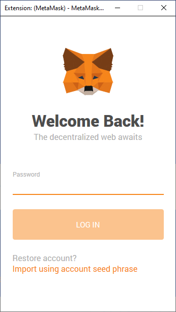

 3. Search for the domain you want to use:
  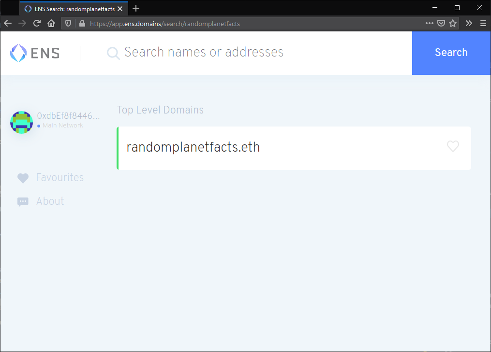

 4. Click on the domain if it's available.

 5. Click **Request To Register**:
  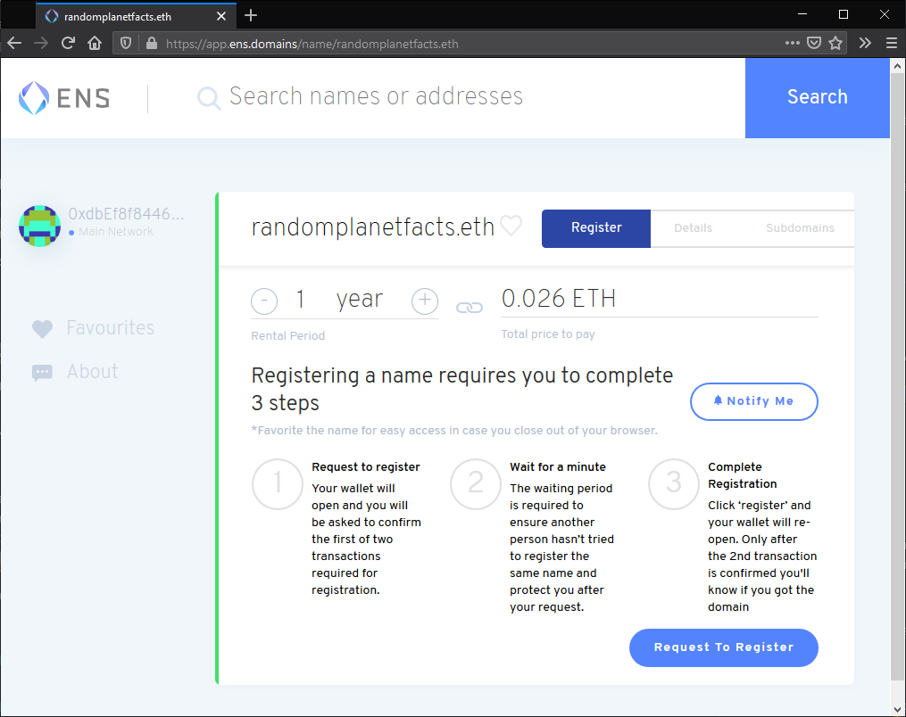

 6. In the MetaMask window that pops up, click **Confirm**. This action will cost you `ETH`.

 7. Wait for the *Request to register* transaction to complete. This process can take a several minutes:
  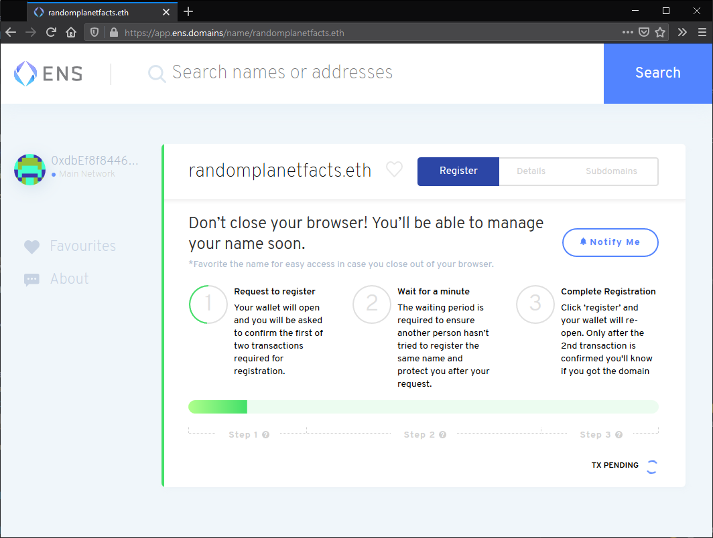

 8. ENS requires that you wait for around a minute once the transaction has been completed. This delay is to make sure there is no-one else attempting to purchase the same domain at the same time as you:
  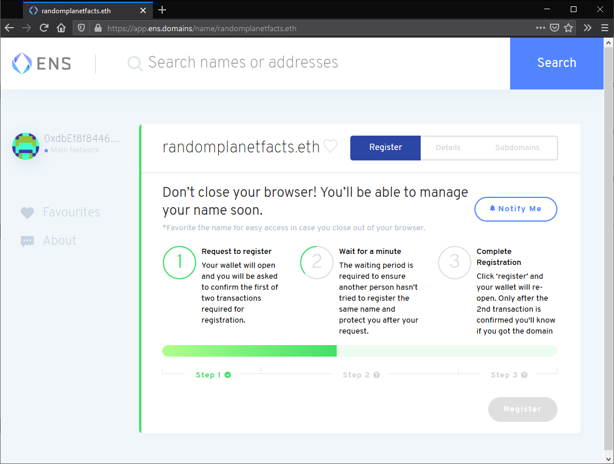

 9. Click Register. Then click Confirm in the MetaMask window that pops up:
  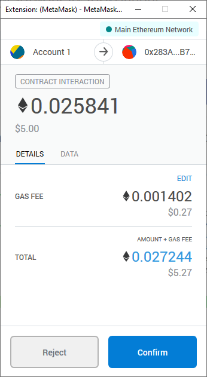

 10. Wait for the transaction to be confirmed. This process can take a couple of minutes:
  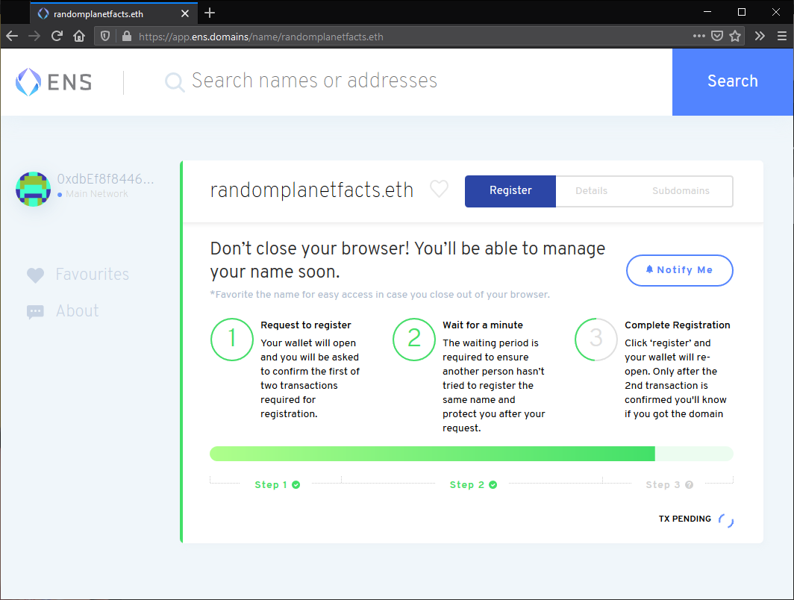

 You should now be able to see all the settings for your .eth domain:
  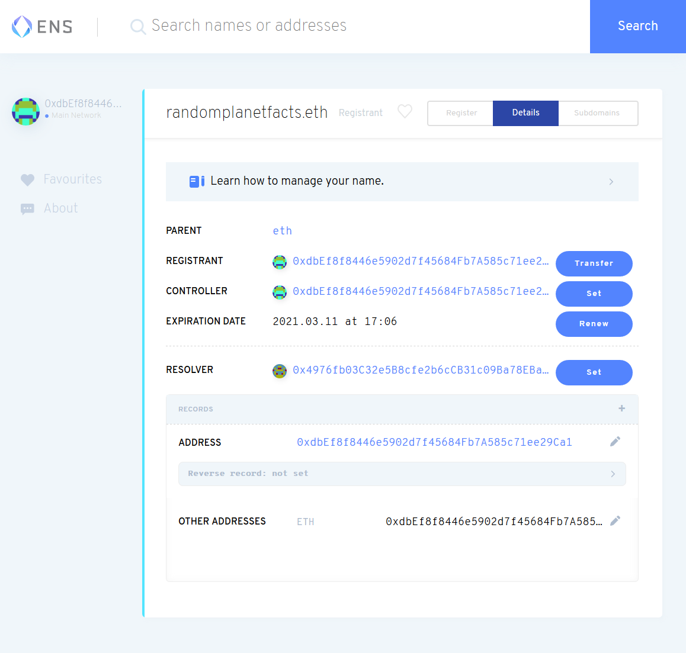


### Link your IPFS content identifier (CID)
 1. Click the plus + icon next to Records:
 

 2. Select Content from the dropdown:
 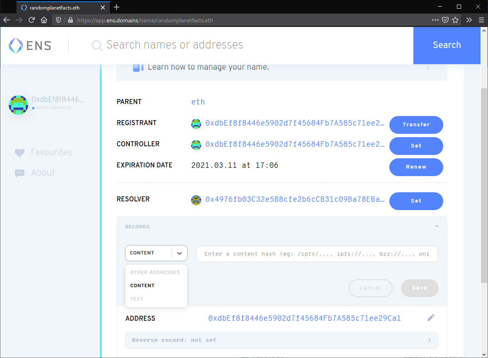

 3. Set the **Content** text box as the CID of your website, prefixed with `ipfs://`:
 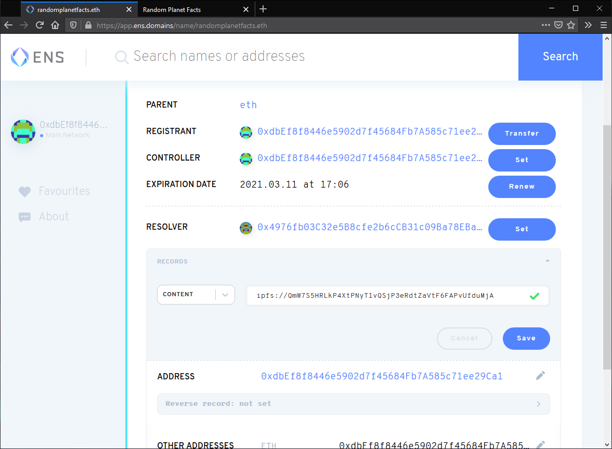

 4. Confirm this change by clicking Confirm in the MetaMask pop-up:
 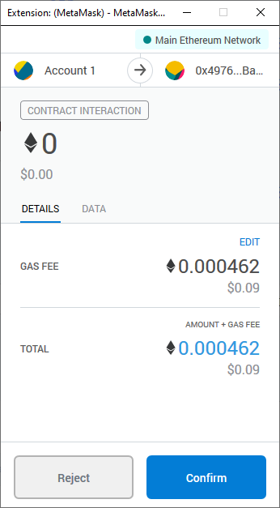
    This transaction can take a couple of minutes to complete.

 In a few minutes, you'll be able to go to `Your_Domain.eth/` and view your website. Note the trailing slash `/`. Because `.eth` is not a registered DNS top-level domain, it is normally inaccessible through regular browsers.

 [Eth.link](https://eth.link) provides a way for any browser to access your website. Just append `.link` to your domain. For example, `Your_Domain.eth.link`. There are no additional steps required for this.


### Handshake
 Handshake is a blockchain built specifically for DNS.

 When you attempt to visit a website like GitHub.com, your browser will first need to figure out how to get to .com’s servers. To find .com, your browser will consult something called the root zone file — you can think of it like a spreadsheet where Column A are the top-level domains like .com, .net, .org, .io, and Column B are the servers each TLD points to. Controlling the root zone file is a single entity called ICANN, and they alone dictate whether you’re allowed to have a top-level domain.

 Handshake is shifting control of the root zone file away from ICANN to a decentralized blockchain. From a practical standpoint, Handshake provides fully decentralized and uncensorable top-level domains that you can own and use for your websites. To learn more, visit the [Namebase Learning Center](https://learn.namebase.io).


#### Prerequisites
 Before we get started, you will need:

 * A [Handshake domain](https://learn.namebase.io/starting-from-zero/how-to-get-a-name)
 * The CID of your website hosted on IPFS
 * A [way for resolving Handshake domains](https://www.namebase.io/blog/how-to-access-handshake-domains/) (to test the setup)

#### Bare TLD
 1. Access your name's DNS records. You're looking for where you can add `ALIAS` and `TXT` records for your domain.

 2. Create an `ALIAS` record:
    A) Set the **Host** to `@`.
    B) Set the **Value** to `ipfs.namebase.io.` and notice the trailing dot `.` at the end of `ipfs.namebase.io.`
 
 3. Create a `TXT` record:
    A) Set the **Host** to `_dnslink`.
    B) Set the **value** to `dnslink=/ipfs/SITE_CID`, replacing `SITE_CID` with the *CID* of your website.

 4. Save your changes.

 You should now be able to visit your IPFS website at your Handshake domain! If your Handshake name is `yourname/`, you can visit your website at `http://yourname/` (no dots, just `yourname/`!)

#### Subdomain
 If you want to create your website on a subdomain rather than a bare TLD (*e.g.* `sub.yourname/` vs. `yourname/`), follow these instructions instead:

 1. Access your name's DNS records. You're looking for where you can add `CNAME` and `TXT` records for your domain.

 2. Create a CNAME record:
    A) Set the Host to `sub`, replacing `sub` with your desired subdomain name.
    B) Set the Value to `ipfs.namebase.io.` and notice the trailing dot `.` at the end of `ipfs.namebase.io.`

 3. Create a `TXT` record:
    A) Set the Host to `_dnslink.sub`, replacing `sub` with your desired subdomain name.
    B) Set the value to `dnslink=/ipfs/SITE_CID`, replacing `SITE_CID` with the *CID* of your website.

 4. Save your changes.

 You should now be able to visit your IPFS website at your Handshake domain! If your Handshake name is `sub.yourname/`, you can visit your website at `http://sub.yourname/`


**TIP**

If you prefer to use Handshake-powered DNSLink with your custom gateway, run `ipfs daemon` with config that has a Handshake resolver enabled for your domain: `ipfs config --json DNS.Resolvers '{ "yourname": "https://query.hdns.io/dns-query" }`. Learn how to run a self-hosted, site-specific DNSLink gateway from [gateway recipes in go-ipfs config docs](https://github.com/ipfs/go-ipfs/blob/master/docs/config.md#gateway-recipes).


 


## Common IPFS misconceptions
 * IPFS is not free storage in the cloud. No one will permanently host your files for free. Some nodes might cache them *temporarily*, but unless you use the so-called commercial “pinning service” or run a 24/7 node yourself, your files will eventually disappear from the network.
 * IPFS is uncensorable so that **files can be accessed as long as at least one copy remains in the peer-to-peer network**. 
 * Once you upload the file to IPFS, it cannot be removed as long as at least one node is hosting it. You cannot force other nodes to remove your file.
 * IPFS is not anonymous. All the nodes publicly advertise their IPs and which files they are hosting. It means that distributing illegal content might have consequences.
 * Unless configured otherwise, your node will temporarily cache all the content you’ve accessed and distribute it to the rest of the network. However, files that you’ve not accessed will never automatically be hosted by your node. There's no automatic replication of *all* files between nodes. Only the accessed files will be copied to your node.


## GitHub Repos
Note that the "Go" version of IPFS is considered "native" while the "JavaScript" version is recommended only for experimentation and development.
|  | |
| -- | -- |
|  |  |
|  |  |


## References
- https://eth.link/
- https://docs.ens.domains/
  - https://docs.ens.domains/dns-registrar-guide
  - https://docs.ens.domains/dapp-developer-guide/resolving-names
- https://docs.ipfs.io/how-to/
  - https://docs.ipfs.io/how-to/websites-on-ipfs/multipage-website/#prerequisites
  - https://ipfs.io/ipfs/QmR7GSQM93Cx5eAg6a6yRzNde1FQv7uL6X1o4k7zrJa3LX/ipfs.draft3.pdf
- https://filecoin.io/filecoin.pdf
- https://hackernoon.com/a-beginners-guide-to-ipfs-20673fedd3f
- https://betterprogramming.pub/a-guide-to-hosting-websites-on-ipfs-d2efad40ed3?gi=646ebd871f50
- https://labs.eleks.com/2019/03/ipfs-network-data-replication.html
- https://pawelurbanek.com/ipfs-ethereum-blog
- https://proto.school/blog/






