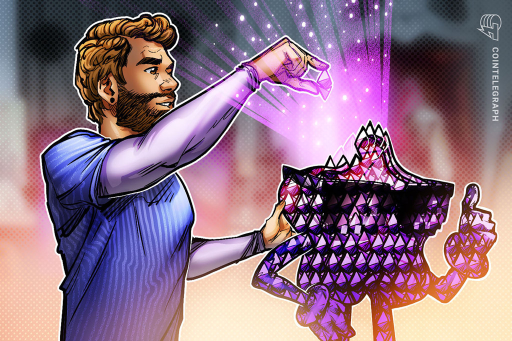
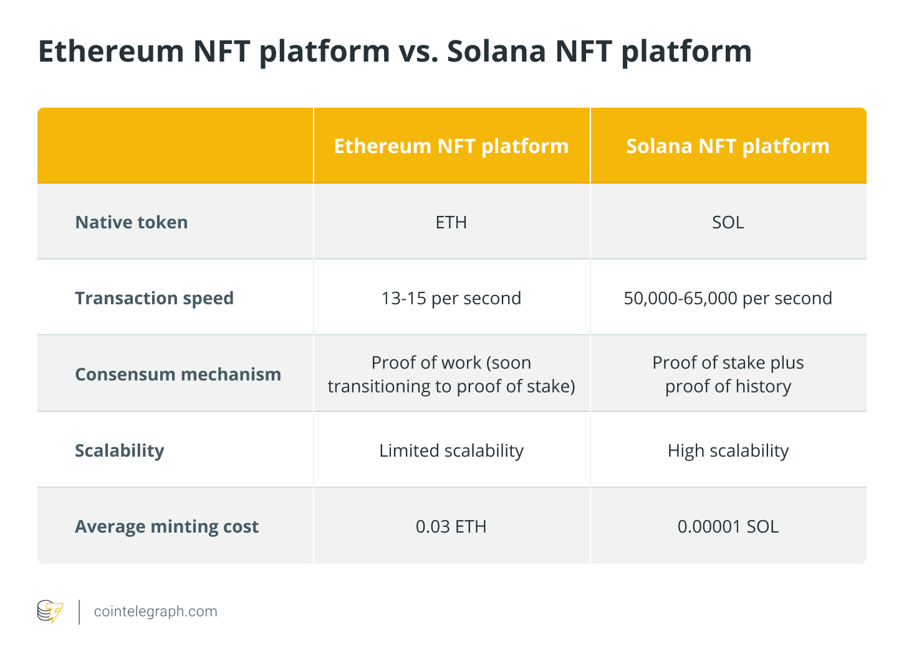

## Are NFTs based on Ethereum?
*[Nonfungible tokens (NFTs) are compatible](https://cointelegraph.com/nonfungible-tokens-for-beginners/nonfungible-tokens-how-to-get-started-using-nfts) with any Ethereum-based project. You could, for example, trade a piece of a portrait for a ticket!*

Most NFTs are part of [the Ethereum blockchain](https://cointelegraph.com/ethereum-for-beginners/history-of-eth-the-rise-of-the-ethereum-blockchain) at a high level. Ethereum (ETH), like Dogecoin (DOGE), is a cryptocurrency, but the Ethereum blockchain also enables these NFTs, which store additional information that allows them to function differently from digital currencies.

NFTs have incredible potential, and the [ERC-721](https://eips.ethereum.org/EIPS/eip-721) was created to address the need for unique tokens. Moreover, due to its rarity or age, the ERC-721 standard is distinct and can have a different value than another token from [the same smart contract](https://cointelegraph.com/ethereum-for-beginners/what-are-smart-contracts-a-beginners-guide-to-automated-agreements). The Etherscan NFT Tracker [ranks](https://etherscan.io/tokens-nft) the top NFTs on Ethereum by volume of transfers. 

But do you need Ethereum to make an NFT? The answer is no. Ethereum is not a prerequisite to creating NFTs. Other blockchains like Solana (SOL), Cardano (ADA), Tezos (XTZ), BNB Chain (BNB) and Tron (TRX) are [alternative platforms for minting or creating NFTs](https://cointelegraph.com/nonfungible-tokens-for-beginners/a-beginners-guide-to-the-popular-blockchains-used-in-nft-development).

So, if you want an answer to, “Is ETH the only way to buy NFT?” The answer, again, is no. Each platform requires the transaction fee to be paid in its native token. For instance, 2 ADA ([Cardano blockchain's native token](https://cointelegraph.com/blockchain-for-beginners/a-beginners-guide-to-the-cardano-network-and-the-ada-ecosystem)) is the cost for the NFT-MAKER PRO platform, which is paid to the customers' wallet together with the minted NFT (a requirement from Cardano).

## Why are most NFTs on Ethereum?
*Ethereum is the leader among other blockchain networks and NFTs were born on the Ethereum blockchain. As a result, NFTs sell for a substantially higher price on average, so creators prefer them over other platforms.*

Because of its highly-secure network and data architecture, the Ethereum blockchain leads the [decentralized finance (DeFi) market](https://cointelegraph.com/defi-101/defi-a-comprehensive-guide-to-decentralized-finance), with the bulk of NFT projects running on it as ERC-721 coins. In addition, the blockchain provides NFTs with extensive exposure to a large and growing market. Moreover, NFT systems should continue to be [Ethereum virtual machine compatible](https://cointelegraph.com/ethereum-for-beginners/architectural-components-of-the-ethereum-blockchain-what-are-they) so that Ethereum wallets like Metamask can support them.

However, the high volume of network traffic causes a significant transaction backlog, leading to a substantial increase in transaction fees. Rarible, OpenSea and Nifty Gateway are three popular [Ethereum-based NFT marketplaces](https://cointelegraph.com/nonfungible-tokens-for-beginners/the-nft-marketplace-how-to-buy-and-sell-nonfungible-tokens). Nonetheless, because of the Ethereum blockchain's limitations, NFT creators have turned to other solutions, such as the [Solana blockchain](https://cointelegraph.com/news/what-is-solana-and-how-does-it-work), to overcome these difficulties.

### Ethereum NFTs vs. Solana NFTs
The consensus process used by Solana and Ethereum is different. [Proof-of-work is used](https://cointelegraph.com/blockchain-for-beginners/proof-of-stake-vs-proof-of-work:-differences-explained) by Ethereum, which results in a more decentralized network with less scalability. The [ETH 2.0 is designed](https://cointelegraph.com/ethereum-for-beginners/ethereum-upgrades-a-beginners-guide-to-eth-2-0) to address the dreaded scalability issue that has threatened its NFT and DeFi market shares. As a result, the blockchain leader may lose its status unless the 2.0 upgrade is implemented quickly. 

In contrast, Solana uses a combination of [proof-of-stake and proof-of-history](https://cointelegraph.com/news/the-power-of-cheap-transactions-can-solana-s-growth-outpace-ethereum), a less secure but more efficient method that allows for fast and low-cost transactions using its native currency called SOL. However, Ethereum is a mature project with a significant market position, increasing creators' confidence in minting NFTs on the Ethereum blockchain.

SolSea is Solana's open NFT marketplace. When minting NFTs, it allows creators to choose and incorporate licenses. That said, collectors know what they're buying and creators know what they're selling. Solanart, a prominent NFT marketplace that launched before SolSea, is another popular NFT marketplace on Solana.

## Why do NFTs use Ethereum and not Bitcoin?
*The fundamental goal of Ether is to make the Ethereum smart contract and [decentralized applications (DApps) platform](https://cointelegraph.com/defi-101/what-are-dapps-everything-there-is-to-know-about-decentralized-applications) operations easier to use and monetize, rather than to establish itself as a new monetary system. However, Satoshi Nakamoto called [Bitcoin a peer-to-peer electronic cash system](https://bitcoin.org/bitcoin.pdf).*

Smart contracts that assign ownership and govern the transferability of NFTs are used to create nonfungible tokens, which the [Bitcoin blockchain](https://cointelegraph.com/bitcoin-for-beginners/how-does-blockchain-work-a-beginners-guide-to-blockchain-technology) doesn't support. NFTs are not fungible since they are not interchangeable. While each Bitcoin will have the same value, each NFT could represent a different underlying asset and hence, have a distinct value.

Smart contracts that assign ownership and govern the transferability of NFTs are used to create nonfungible tokens, which the Bitcoin blockchain doesn't support. NFTs are not fungible since they are not interchangeable. While each Bitcoin will have the same value, each NFT could represent a different underlying asset and hence, have a distinct value.

For example, when someone generates or mints an NFT, they are executing code that is stored in smart contracts that follow various standards, such as ERC-721. This data is stored on the blockchain, which is where the NFT is managed.

In addition to the above, each token has a distinct identity that is tied to a single Ethereum address. That said, each token has a unique owner who can be easily identified as they are Ethereum-based and can be purchased and traded on any Ethereum-based NFT exchange or market.

## Which blockchain is best for NFTs?
*When choosing any blockchain for minting NFTs, such as Ethereum for NFT development, ensure the robustness of its smart contracts, check the blockchain’s fee structure, security measures and transaction speed, and assess the possibility of forking.*

In the cryptocurrency market, NFTs are a significant niche. They provide further exposure to cryptocurrencies for people who might not otherwise have come into contact with these assets. In addition, they actively contribute to the mass adoption of blockchain technology because they are so closely linked to digital art and gaming.

However, the resilience of a blockchain's smart contracts is a major component of the overall security of distributed ledger technology. Smart contracts must go through extensive testing to provide the highest level of reliability and efficiency, ensuring minimal risk of downtime, breaches and hacks.

Additionally, cost-effective solutions are required for NFT-based transactions, which is critical for using and adopting nonfungible assets. As a result, the cost structure for NFTs on the blockchain is an important factor to consider, with feeless being the ideal option.

[Hard forks can jeopardize nonfungible features](https://cointelegraph.com/blockchain-for-beginners/soft-fork-vs-hard-fork-differences-explained), as duplicating NFTs calls their integrity into question. Therefore, it is critical to design NFTs and their marketplaces on fork-resistant blockchains.

Similarly, as blockchains are immutable by design, faster finality means attackers have fewer time frames in which to compromise the digital ledgers. Therefore, any platform that achieves faster transaction finality while maintaining decentralization is ideal for creating NFT marketplaces.

Other than these considerations, the final selection of blockchain for NFT development depends on your goals, like why you want to own NFTs, your budget and your investment objectives. If you are clear on the questions, you need to do your research and compare various NFT blockchains before spending your hard-earned money.

