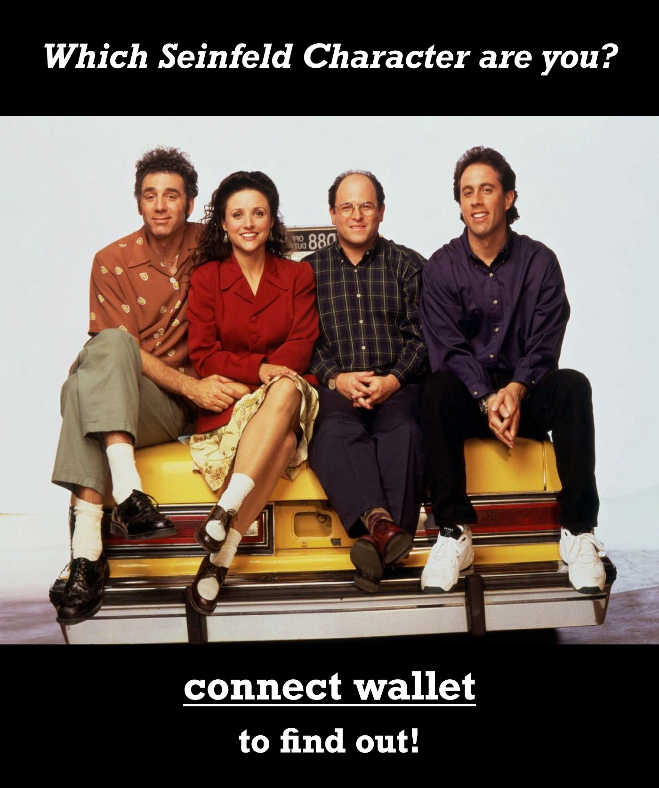
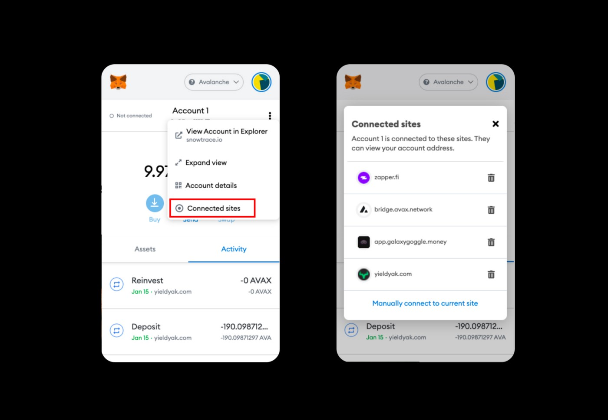

 *It was never a great concept anyway.*

 

 One of the major challenges of designing and building in the crypto space is that we’re used to thinking in money paradigms, like wallet. This is extremely limiting, considering the thing you’re referring to today as your “wallet” will soon become the passport to your entire online experience.

 The wallet concept was somewhat okay when we were only dealing with cryptocurrency but if we’re to [believe the promise](https://www.preethikasireddy.com/post/the-architecture-of-a-web-3-0-application) of Web3, your wallet will soon be more like your golden ticket online.

 It will be the key that unlocks everything about you: your finances, health, property, interests, preferences, your contacts, [your inventory](https://danajwright.medium.com/a-new-way-of-organizing-the-internet-ed98731ed103), your access, your permissions and your status.

 And you alone will control it.

 No more walled gardens owned by centralized monopolies. You will own all your stuff and take it all with you as you bop around online.

## Assuming that’s true…
 We the designers and developers pushing this massive evolution of the internet need to recognize something: The crypto “wallet” was deeply flawed from the very beginning.

 Check out my video of Andreas speaking to a bunch of bitcoin developers back in 2014 (in some basement somewhere in the Mission):

### Video (1:15:31 hours)
 Andreas Antonopoulos on Bitcoin Wallet Encryption

 In this video, Andreas Antonopoulos covers Elliptic Curve Crypto (ECC) & EC Digital Signature Algorithm (ECDSA), Key formats (hex, compressed, b58, b58check, Key types, Key mnemonic word list (BIP0039), and Key encryption (BIP0038).



    start: 170,
    allowfullscreen: 1,
    autoplay: 0,
    hl: en,
    cc_lang_pref: en,
    cc_load_policy: 1,
    color: white,
    controls: 1,
    disablekb: 0,
    enablejsapi: 1,
    fs: 0,
    iv_load_policy: 3,
    loop: 0,
    modestbranding: 1,
    playsinline: 0,
    privacy_mode: yes,
    rel: 0,
    showinfo: 0,
    origin: blog.richiebartlett.com,
    widget_referrer: blog.richiebartlett.com


 I’ll give you a moment to get past the fact that there was someone who understood crypto so well in 2014.

 For the unknowing, this is [Andreas Antonopoulos](https://aantonop.com). He wrote a book called [The Internet of Money](https://www.amazon.com/The-Internet-of-Money-audiobook/dp/B071KX8WP8/ref=sr_1_1?crid=244JGQ3S00783&keywords=the+internet+of+money&qid=1642292515&s=books&sprefix=the+internet+of+money%2Cstripbooks%2C124&sr=1-1) and, more recently, another one called [Mastering the Lightning Network](https://www.amazon.com/Mastering-Lightning-Network-Blockchain-Protocol/dp/1492054860).

 The point he made back then is more relevant today than ever: Crypto wallets don’t really have anything in them. They never have. The coins are on the blockchain. The wallet contains only keys.

## When you realize this, you’re half way to understanding why “wallet” was truly such a terrible name for this mechanism.
 What he says next is pretty mind blowing when you think about how it maps to today. Back when he gave this talk, the number of bitcoin wallets in existence could be counted on one hand: Electrum, Armory, Trezor, BitPay, and Blockchain.info. And they were all non custodial.

 Each implementation was a bit different, but fundamentally they all had the same data:

 * Public and private key pairs
 * Metadata
 * Human readable things like labels

 Today there are thousands of crypto wallets and probably hundreds of thousands of blockchains. Wallets like Metamask, Coinbase and Binance live in your browser and facilitate access to your funds as well as a growing list of other stuff that we’ll get into later.

 And yet the same basic data structures remain. The keys in the “wallet” are presented on a blockchain in order to “create encumbrances.” Or put another way, to satisfy the programatic conditions that must be met in order to access your stuff.

 There is nothing inside the wallet. It simply “unlocks” your stuff.

 

## The second half (UX)
 As far as I understand it, the only thing that makes “Web3” different than “crypto” is the massive expansion of stuff we can now unlock using our keys.

 Decentralized applications (DApps for short) prompt users to “connect wallet.” Once wallet is connected, the DApp becomes populated with all the things, according to what the keys in our respective wallets are able to unlock.

 Each DApp we access is leveraging one or more blockchains to show us what we want to see. Here are a few of my favorite DApps right now:

 * [NotLarvalabs](https://notlarvalabs.com)
 * [LooksRare](https://looksrare.org)
 * [ZapperFi](https://zapper.fi)
 * [Mirror](https://mirror.xyz)
 * [NearCrowd](https://nearcrowd.com/?utm_source=StateOfTheDApps)

 LooksRare and Notlarvalabs are NFT marketplaces, Zapper is a DeFi investing dashboard, Mirror is an on-chain writing platform, and NearCrowd is a game that rewards users in Near token for completing random tasks.
 
 With the exception of Zapper (which populates financial information), the financial connotation of the word “wallet” makes little to no sense. Worse, it might actually deter newbs who don’t intend to transact and may be worried about sharing financial info.

 
 ** *No we don’t, Chel$ea !*

 What you will actually be doing on most DApps (which will be non finance related) is much more like an authentication.

 For this new world, something like “**Web3 Auth**” would be a much better catch all.

## Use cases for DApps
 As more and more data becomes [tied to blockchains](https://onezero.medium.com/why-decentralization-matters-5e3f79f7638e), I think it’s safe to assume that more and more DApps will be built to facilitate access to that data and do interesting things with it. This in turn will grow the amount of data, and it will just be this insane flywheel of growth that powers the [next wave of the internet](https://medium.com/fabric-ventures/what-is-web-3-0-why-it-matters-934eb07f3d2b).

 Once the pattern reaches a certain level of adoption, nearly all online products and services will be forced to accommodate it and many legacy systems will as well.

 Perhaps the legacy systems will actually benefit most:

 ### Healthcare
  For example, I could see a future where all my healthcare data is on chain and I grant access to different doctors and healthcare providers as needed. In that situation, the healthcare provider becomes a DApp.

 ### Real estate
  I could see a future where I get qualified to buy a property simply by authorizing a real estate DApp to read certain information about my finances on chain.

 ### Elections
  I could see a future where I cast my vote in elections by giving a DApp permission to verify my identity, location and party affiliation, and to facilitate the secure submission of my votes for the appropriate races. After voting day, votes are synced up on chain and the DApp returns the results. No more need for human involvement in voting or vote counting.
 
 These are just a few pretty heavy use cases for Web3, and they are 100% coming. As are **social media**, **content creation/ ownership/ licensing**, **subscription services** and **games**.

## Security will be tricky
 With all this, there will soon be a kind of knowledge graph attached to the wallet. Some data will be highly sensitive like identity, health and finances. Some will be moderately sensitive, like a contact list or a list of blocked addresses. And some will be public, like an ENS domain or avatar.

 

 One problem we will definitely face is an onslaught of malicious DApps that try to exploit the Web3 auth system the same way malicious Web2 apps [did with oAuth](https://www.trendmicro.com/en_us/research/17/d/pawn-storm-abuses-open-authentication-advanced-social-engineering-attacks.html).

 Data rich Web3 wallets will be a similar attack vector. Big juicy targets with all kinds of valuable info. By building a DApp, the attacker does an end run around your seed phrase, password and two-factor auth. All they have to do is get you to connect and grant them unfettered access voluntarily.

 
 

 By the way, you’re probably already vulnerable. There are plenty of [malicious DApps](https://au.finance.yahoo.com/news/defi-rug-pull-scams-pulled-075933472.html) out there, most of which are DeFi platforms. And with crypto projects still getting [hacked regularly](https://www.theblockcrypto.com/post/123030/defi-exploits-total-680-million-so-far-in-2021), even legit ones can become compromised overnight.

 That’s why it’s a good idea to regularly disconnect from DApps you are not currently using. There’s a feature on Metamask that makes it easy enough to do (although it’s somewhat buried). You might be surprised how many DApps you are connected to right now.

 

 Easily revoking access to your data is one of the great promises of Web3, in my opinion.

 Wallets should make this feature more prominent or better yet, have a setting to automatically revoke access after x amount of time.

## Oh snap, here’s another idea💡
 Rather than connect to your main wallet, DApps could give you the option to generate a burner wallet. Then you could just move assets over to your main one later, if you want. Because let’s be honest, half the DApps we connect to are just curiosities. It would be kind of like the “skip” button on a login page. Everyone loves the skip button.

## Permissions will be key
 To help users protect their data, they will need a robust permissions and preferences schema built into their wallet of choice. Something that is unfortunately way easier said than done.

 Because blockchains have different architectures, there will actually need to be a different schema for each network. Different blockchains might store the same piece of data on layer 1, layer 2, or a side chain. Different DApps can even store data on IFPS or on an off chain database.

 These differences are only relevant to the developers tasked with figuring out how to build a permissions system that works as expected.

 From the user perspective, they can be obfuscated somewhat or perhaps entirely.

 The most important thing for the UX is to have a view where users can chose which categories of data to share with a DApp upon connecting.

 For a healthcare provider, something like this:

 ✅ Identity ✅ Health ✅ Contact 
 ❌ Finance ❌ Address book ❌ Education 
 ❌ Property ❌ Preferences ❌ Status 
 ❌ Work history ❌ Interests 
 ❌ Etcetera ❌ Etcetera ❌ Etcetera

## So what will replace the “wallet” ?
 Honestly, I have no idea. Perhaps we can make it different depending on context. Like, I think “Web3 Auth” is pretty good for the button in the upper right for connecting to a DApp.

 As far as what we generally call our little collection of key pairs, I’m afraid that ship may have sailed, as it so often does with technology naming conventions.

 Maybe it will be a quaint thing that doesn’t really matter in the end, like how everyone still calls their pocket super computer a “phone.”

 Or maybe as Andreas predicted, it will remain a terribly confusing and technically inaccurate metaphor that goes on to haunt us forever.
