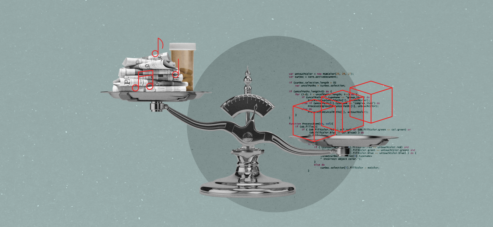

# Your Online Data Is In Peril. The Blockchain Could Save It
 *To solve our crisis of trust, we must create a system where none is required*

 

 The word “trust” is printed on things all around you. The dollar bill in your pocket. The box of Kleenex on your bedside table has a label that reads “trusted care.” In the physical world, it’s easy to prove that trust is indeed warranted: Trade that dollar (plus three more) for a latte and you can taste the power of U.S. currency. Wipe your nose without scratching your nostrils raw and, yes, Kleenex, I trust in your ability to produce soft tissues.

 In the virtual world, trust is far harder to envision. From posting on social media, checking a bank balance, or uploading pictures to the cloud, we’ve been conditioned to assume that we won’t get totally screwed every time we use the web. In recent years, however, thanks to various data breaches and general political mayhem, the era of suspension of disbelief in our digital lives is drawing to a close. We’ve glimpsed the men behind the proverbial curtain at the big tech companies. Often, they [are smaller](https://medium.com/s/story/the-smallness-of-mark-zuckerberg-4e94a88bba02) than we imagined them. They definitely don’t have our best interests at heart. Heart has nothing to do with their business models.

 As someone who has closely covered [tech and society](https://www.amazon.com/Bored-Brilliant-Spacing-Productive-Creative-ebook/dp/B06VTZYPTF) for the past several years, I’ve tried not to assume consumers can either take tech or leave it. Raising awareness about the need for more data privacy and building a trustworthy web has been an obsession of mine: The week after Donald Trump’s inauguration, in January 2017, I ran the [Privacy Paradox](https://project.wnyc.org/privacy-paradox/), a weeklong boot camp, with the help of experts like Bruce Schneier and Tim Berners-Lee, to educate more than 50,000 podcast listeners about problems with the platforms that handle their personal information every day. At the end of that week, of the participants we surveyed, 70 percent said they wanted to fight for protection of our digital rights.

 But here we are, more than a year later, and I’ve had to admit that for the vast majority of Americans (especially those on Capitol Hill), pushing the power button on a laptop still feels like summoning magic. Few understand how it works. Even fewer believe it can be improved. They wouldn’t know where to start. This moment of frustration is ripe for a conversation about blockchain.

 If you have heard of blockchain, you likely associate it with bitcoin, speculation, and maybe the [Winklevoss twins](https://www.bloomberg.com/news/videos/2018-02-07/winklevoss-brothers-are-long-on-cryptocurrencies-video). But make no mistake, despite all the [explainers](https://medium.com/@jimmysong/why-blockchain-is-hard-60416ea4c5c) and [opinion](https://medium.com/@kaistinchcombe/decentralized-and-trustless-crypto-paradise-is-actually-a-medieval-hellhole-c1ca122efdec) pieces on *Medium*, most people have never heard the words “block” and “chain” morphed into one. Just last month, I visited a top high school in New Jersey and asked a group of 60 students if they’d heard of the blockchain. Not a single 18-year-old, many of whom are headed to Ivy League universities, raised their hand.

 Until I finally understood the connection between bitcoin and blockchain, I dismissed anything crypto-related as murky; a plaything for bros whose biggest goal was to become the proud owner of a Lamborghini. But the actual link between the two is far more interesting than I’d thought and worth revisiting in the context of our growing distrust of Big Tech.
 
 Bitcoin was born out of the financial crisis of 2008, which was, for many, the first time we realized how unstable our entire financial infrastructure is. One mysterious coder, who went by the name Satoshi Nakamoto, thought he (or she, or they) had a technological way to bypass those unwieldy institutional systems. Nakamoto posted a research paper on November 1, 2008, outlining an idea for a new digital currency. The concept eliminated a middleman, like the government or a bank. No need to trust an institution to take care of your funds or a government to decide the value. No one person or entity would be in charge. Instead, a network of hundreds or thousands of computers would run special bitcoin software, linking them together into a “distributed ledger” called “the blockchain.”

 Here we are, a decade later, and blockchain enthusiasts are working to use distributed ledger technology to keep track of more than just money: Everything from health records to pharmaceuticals to music rights is being logged using blockchain. One of my favorite examples of blockchain’s potential is in monitoring our food-supply chain. Take the recent E. coli outbreak. Hundreds of people got sick in states across the country. Federal officials believe the contaminated lettuce came from farms in Yuma, Arizona, but the investigation is ongoing. As one [FDA](https://blogs.fda.gov/fdavoice/index.php/2018/05/fda-update-on-traceback-related-to-the-e-coli-o157h7-outbreak-linked-to-romaine-lettuce/) update stated: “*It’s a labor-intensive task. It requires collecting and evaluating thousands of records*.” In a blockchain world, the process would move far faster. Every step in the delivery route would be tracked and linked, from farm to table. In one test, Walmart compared conventional tracking methods with blockchain to see how quickly the source of some contaminated mangoes could be found. The results? Seven days versus 2.2 seconds.

 Bettina Warburg, a tech entrepreneur and researcher, describes blockchain as a high-tech update to how we traded during agrarian times, hundreds of years ago. “We had a lot more individual, one-to-one direct trade,” she says. “We could trust those relationships, and we had a lot more control.” Later, as trade routes became more complicated and global in scale, we created institutions like banks and regulators “to formalize how we could achieve our trade with greater certainty.” In the past two decades, marketplaces have moved online to platforms like Amazon and eBay. “They really just facilitate that exchange of value between people who maybe don’t know each other,” Warburg says. Blockchain, according to Warburg, is the next evolution in how we’ll do business. It will bring us back to direct one-to-one trade by using decentralized technology. Eventually, humans will be taken out of the picture entirely, and the machines will be left to trade between themselves according to the rules we give them. We won’t need to trust or even know the humans on the other end of any transaction.

 But there’s a paradox hidden here. Even as we imagine this future of “trust-free” trading, we urgently need to support the technologists putting ethics at the heart of their blockchain projects. Last month at the Ethereal conference, Joe Lubin, co-founder of a blockchain software called Ethereum and a leader in using blockchain for social good, told a group of reporters that personal privacy is one issue he thinks blockchain can fix. “Right now, there’s no good identity construct,” Lubin said. “Basically, we spray aspects of our identity throughout the internet.”

 With blockchain, Lubin claimed, “The business model of exploiting people [and] personal information is going to change. I think it’s going to be even better, potentially, for those companies. They’ll be less exposed to the risk if we are controlling our own data, encrypted, and enabling it to be selectively disclosed in situations that we designate.” Imagine owning all your digital health care records and granting providers or insurance agents access only to the data of your choosing. These kinds of experimental blockchain technologies will require cautious and careful experimentation worth investing in. But the goal shouldn’t be “hyper growth” and fast returns on those investments.

 There are lots of questions about how blockchain will work in the wild. How should it be regulated? Can it run without consuming vast amounts of energy? Is the technology mature enough to really go mainstream? A couple months ago, I discovered another use for blockchain and a project that might be ready for prime time. A collective of developers and journalists are launching a radical blockchain experiment called Civil.

 To the average reader, Civil will look like any other reputable news website. On the back end, however, articles will be archived on the blockchain so no publisher could ever [remove them](https://qz.com/1119220/the-archives-of-dnainfo-gothamist-chicagoist-laist-and-shanghaiist-are-not-deleted/). It will also have its own token economy in which consumers can participate, giving them the opportunity to help decide how this news platform is run and enforce strict journalistic [standards](https://civil.co/constitution/). Civil tokens will, in theory, end the need for clickbait headlines that can lead to fake news and shoddy reporting. To entice readers to Civil, its founders have recruited and given grants to a group of veteran journalists referred to as the “First Fleet,” which includes me and my business partner. We’ll be documenting whether the experiment works on our new [podcast](http://zigzagpod.com).

 In the end, blockchain technology may not be the savior of our online lives. Nonetheless, more conversations about how we might radically use technology to rebuild trust between citizens, companies, and institutions need to be had. If consumers think big change is possible and have the chance to better understand the mechanics behind that change, more of them will support worthy experimental endeavors.

 To make that happen, technologists need to earn back consumers’ trust, educate them, and listen to them. We’re at a crossroads—a crucial moment in time where we can restore the balance of power between builders and users. The collective philosophy behind the blockchain may be the path to making that happen.
