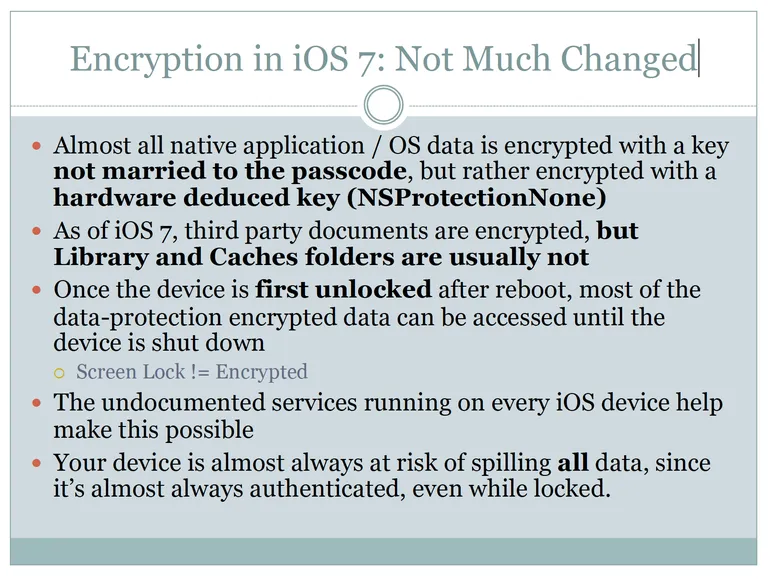
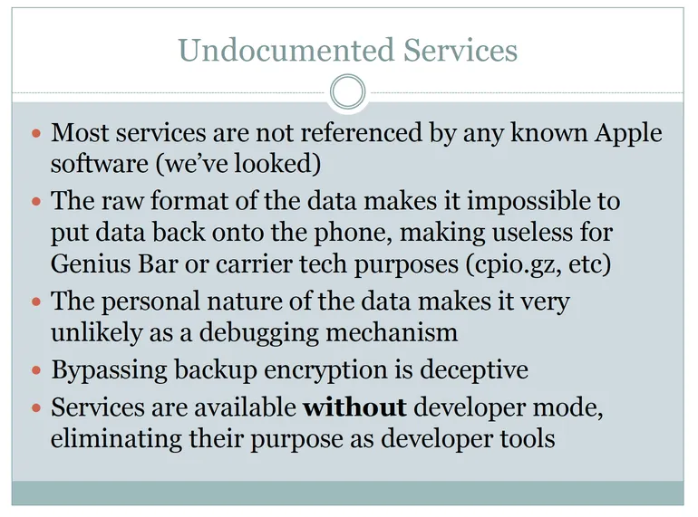


Overall, the otherwise great security of iOS has been compromised… by Apple… by design.


# Forensic scientist identifies suspicious 'back doors' running on every iOS device
Forensic scientist and author [Jonathan Zdziarski](https://twitter.com/JZdziarski) has posted the [slides](http://www.zdziarski.com/blog/wp-content/uploads/2014/07/iOS_Backdoors_Attack_Points_Surveillance_Mechanisms.pdf) (PDF) from his talk at the [Hackers On Planet Earth](http://www.hope.net) (HOPE/X) conference in New York called Identifying Backdoors, Attack Points, and Surveillance Mechanisms in iOS Devices. 

 

The HOPE conference started in 1994 and bills itself as "one of the most creative and diverse hacker events in the world."

Zdziarski, better known as the hacker "NerveGas" in the iPhone development community, worked as dev-team member on many of the early iOS jailbreaks and is the author of five iOS-related O’Reilly books including "[Hacking and Securing iOS Applications](http://shop.oreilly.com/product/0636920023234.do)."

In December 2013, an NSA program dubbed [DROPOUTJEEP](http://www.forbes.com/sites/erikkain/2013/12/30/the-nsa-reportedly-has-total-access-to-your-iphone/) was reveled by security researcher Jacob Appelbaum that reportedly gave the agency almost complete access to the iPhone.

The leaked document, dated 2008, noted that the malware required "implant via close access methods" (presumably physical access to the iPhone) but ominously noted that "a remote installation capability will be pursued for a future release."

In his talk, Zdziarski demonstrates "a number of undocumented high-value forensic services running on every iOS device" and "suspicious design omissions in iOS that make collection easier." He also provides examples of forensic artifacts acquired that "should never come off the device" without user consent.

According to one slide the iPhone is "reasonably secure" to a typical attacker and the iPhone 5 and iOS 7 are more secure from everybody except Apple and the government. But he notes that Apple has "worked hard to ensure that it can access data on end-user devices on behalf of law enforcement" and links to Apple's [Law Enforcement Process Guidelines](https://www.apple.com/legal/more-resources/law-enforcement/), which clearly spell this out. 

Zdziarski also notes that simply screen-locking an iPhone doesn't encrypt the data; the only true way to encrypt data is to shut down/power off the iPhone. "Your device is almost always at risk of spilling all data, since it’s almost always authenticated, even while locked." This is made possible by undocumented services running on every iOS device, according to Zdziarski's presentation:

The presentation notes that commercial forensic tools perform deep extraction using these "back door" services and that law enforcement can acquire a device during a routine traffic stop or during arrest, before it can be shut down and encryption enabled. Zdziarski also notes that the Feds have always been interested in so-called "black bag" acquisition techniques (compromised docking stations, alarm clocks, etc.), also known as "[juice jacking](https://www.zdnet.com/article/researchers-to-demo-iphone-hack-via-30-pin-dock-cable/)."

Undocumented iOS services exposed by Zdziarski (like "lockdownd," "pcapd" and "mobile.file_relay") can bypass encrypted backups and be accessed via USB, Wi-Fi and "maybe cellular." What's most suspicious about the undocumented services (and the data they collect) is that they're not referenced in any Apple software, the data is personal in nature (thus unlikely to be for debugging) and is stored in raw format, making it impossible to restore to the device (making it useless to carriers or during a trip to the Genius Bar). Zdziarski does a good job of refuting most plausible explanations for the code. 

Several commercial forensic software manufacturers including Cellebrite, AccessData, and Elcomsoft are currently using these backdoor iOS services and selling their wares to law enforcement agencies for huge profits, according to Zdziarski. 

Zdziarski's questions for Apple include:
 * Why is there a packet sniffer running on 600 million personal iOS devices instead of moved to the developer mount?
 * Why are there undocumented services that bypass user backup encryption that dump mass amounts of personal data from the phone?
 * Why is most of my user data still not encrypted with the PIN or passphrase, enabling the invasion of my personal privacy by YOU?
 * Why is there still no mechanism to review the devices my iPhone is paired with, so I can delete ones that don’t belong?

&#8230; and his last slide ([page 57](http://www.zdziarski.com/blog/wp-content/uploads/2014/07/iOS_Backdoors_Attack_Points_Surveillance_Mechanisms.pdf) of the PDF) sums it up nicely: 
 * Apple is dishing out a lot of data behind our backs
 * It’s a violation of the customer’s trust and privacy to bypass backup encryption
 * There is no valid excuse to leak personal data or allow packet sniffing without the user’s knowledge and permission.
 * Much of this data simply should never come off the phone, even during a backup.
 * Apple has added many conveniences for enterprises that make tasty attack points for .gov and criminals
 * Overall, the otherwise great security of iOS has been compromised… by Apple… by design.

Two solutions for the security conscious are to: a) set a [complex passcode](http://support.apple.com/kb/HT5949), and b) install the Apple Configurator application (free, [Mac App Store](https://itunes.apple.com/us/app/apple-configurator/id434433123?mt=12)), set enterprise Mobile Device Management (MDM) restrictions on your device then delete all pairing records (a.k.a. pair locking). Zdziarski notes that while pair locking might stop commercial forensics tools, it won't help if your device is sent to Apple for acquisition.

**Update 2014-0722**: Apple has posted a knowledgebase article that classifies the services identified by Zdziarski as "[diagnostic capabilities](https://www.zdnet.com/article/apple-refers-to-ios-back-doors-as-diagnostic-capabilities/)." 