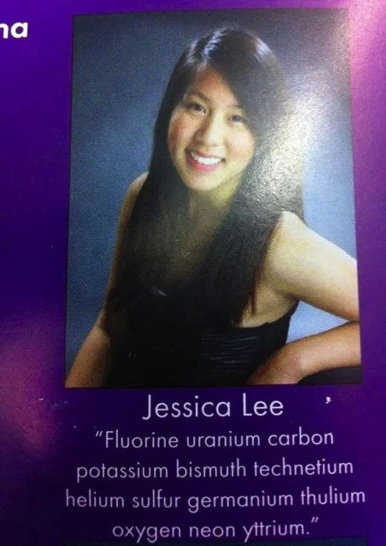

Before Jessica Lee graduated high school last year, she went out with more street cred than anybody else who has ever made a chemistry joke in school with her yearbook quote. While her peers were probably quoting [Ferris Bueller](http://1.bp.blogspot.com/-Ej9fm3T1AFo/UdU0Gymhx_I/AAAAAAAAy68/zrxkEYWXDJM/s400/Life+moves+pretty+fast+If+you+don't+stop+and+look+around+once+in+a+while+you+could+miss+it.png), [Ralph Waldo Emerson](http://blog.chamberlain.edu/wp-content/uploads/Ralph-Waldo-Emerson.jpg), or [Gandhi](http://consciouslifenews.com/wp-content/uploads/2012/11/Be_the_change_you_wish_to_see_Mahatma_Gandhi.jpg), the piece of advice she wanted to pass along to her classmates came from Christopher George Latore Wallace, better known to the world as [The Notorious B.I.G.](https://www.youtube.com/watch?v=aUaXAsMda9M):

 For those of you who don’t have a periodic table handy, this is the translation, taken from Biggie’s [song](https://www.youtube.com/watch?v=aUaXAsMda9M):

 

 While it hasn’t been made public knowledge what, if any, repercussions Lee faced because of her brilliant joke, it appears that Paris Gray’s similar-style joke caused more of an uproar with her school’s administration. As she and her fellow classmates get ready to embark on adulthood and the ups and downs associated with post-high school life, she had this to say to keep her peers motivated:

 

 Translation:

 

 While it seems to be a nod to Juvenile’s 1999 hit single “[Back That Azz Up](https://www.youtube.com/watch?v=z_ehXjZ_2D4),” Gray insists it has been a misunderstanding and that she has given it a new meaning with more encouragement and less dropping it like it’s hot.

"Basically, it was me just saying start all over again," she told Atlanta’s [WSB-TV](http://www.wsbtv.com/news/news/local/student-says-touchy-yearbook-quote-could-ruin-seni/nfzk4/). "You have to go back and start all over." 

Once her message was decoded, she was given in-school suspension and prohibited from attending her school’s senior walk. When she was threatened with not being able to attend the graduation ceremony, that took things too far. 

"I think their reaction was beyond what it should have been because nobody understood it," Gray continued. "It just completely destroyed me, and my mom's been telling me don't let it ruin my happiness but it's like really taking a big toll.”

What does her mother have to say about the ordeal? "My first reaction was, you are such a nerd,” Gray’s mother Zarinah Woods told WSB-TV. “She’s not a class cutter, she’s not a gang banger, [she’s] drug-free. I mean, she is, truly an inspiration.”

Paris Gray is a good student. She participated in Students Against Drunk Driving (SADD), the National Beta Club, and was Vice President of her senior class. Missing out on graduation would be more than just missing out on walking across the stage to receive her diploma, Gray was also slated to give the inspirational speech during the ceremony.

Gray and her mother sat down with the principal and the superintendent of the district today where it was decided that she would be allowed to participate in the ceremony and will give her commencement address. 

So what will Paris say when she stands up to address her fellow graduates next week and inspire them? No clues yet, but we can hope it will be just as memorable.

[Periodic table images created via [MyFunStudio.com](http://www.myfunstudio.com/designs/pt/)]

[Paris Gray yearbook photo via [WSB-TV](http://www.wsbtv.com/news/news/local/student-says-touchy-yearbook-quote-could-ruin-seni/nfzk4/)]

