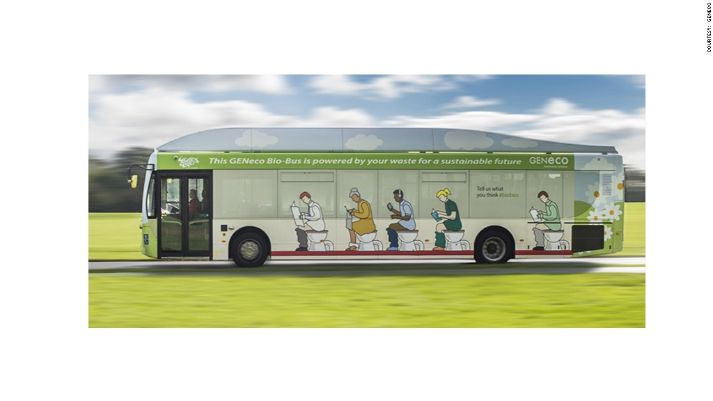


This shit is awesome! 😉


## The A4 bus service from Bristol to Bath in the United Kingdom might as well be called "the number two." It runs on human poop and food waste.

The U.K.'s first "bio-bus" is powered by biomethane gas, which is generated through the treatment of sewage.
With a full tank, the bus can travel up to 186 miles, while producing up to 30% fewer emissions compared to diesel-powered buses.
The eco-friendly bus started regular service on Monday and is expected to carry around 10,000 passengers a month between the Bristol airport and the historic town of Bath.
"The bus is powered by people living in the local area, including quite possibly those on the bus itself," said Mohammed Saddiq from GENeco, the company that runs the sewage treatment facility providing the fuel.
He said one person's annual waste could power the bus for around 37 miles.

But don't worry -- smelly fumes are not a problem.
Biomethane gas is generated from sewage using bacteria that breaks down bio-waste into methane and carbon dioxide. Throughout the process, all impurities are removed to produce odor-free emissions, said Saddiq.
The bio-bus is the latest invention to demonstrate that human waste can be a valuable source of green energy.
In the U.K., human waste is already used to heat thousands of homes. Experts estimate that biomethane produced from sewage could replace around 10% of the U.K.'s domestic gas needs if the nation's waste is used at full capacity.
