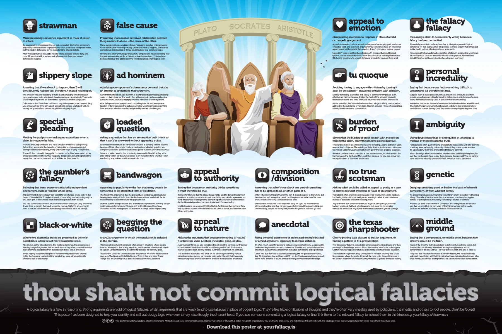
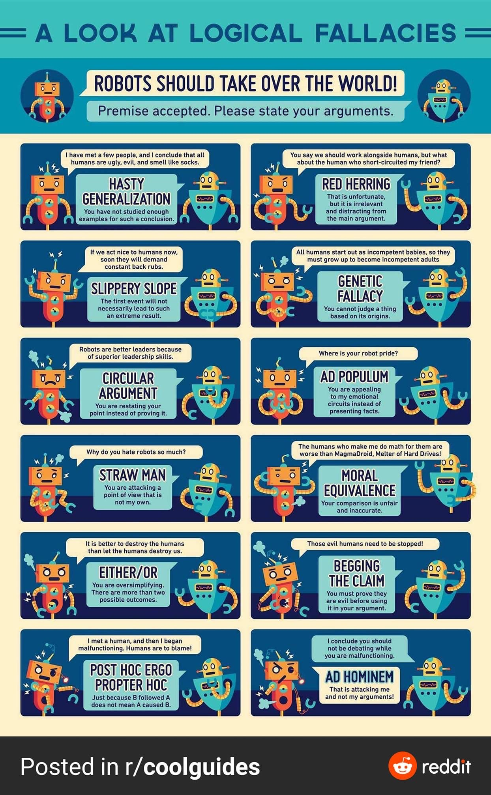

A logical fallacy is a flaw in reasoning. Logical fallacies are like tricks or illusions of thought, and they're often very sneakily used by politicians and the media to fool people. Don't be fooled! Below is a list of 24 fallacies to help you identify and call out dodgy logic wherever it may raise its ugly, incoherent head.

For a more complete list of fallacies, see Wikipedia's article: https://en.wikipedia.org/wiki/List_of_fallacies

## Logical Fallacy

### Straw man
**You misrepresented someone's argument to make it easier to attack.**
By exaggerating, misrepresenting, or just completely fabricating someone's argument, it's much easier to present your own position as being reasonable, but this kind of dishonesty serves to undermine honest rational debate.
ℹ: https://en.wikipedia.org/wiki/Straw_man


After Will said that we should put more money into health and education, Warren responded by saying that he was surprised that Will hates our country so much that he wants to leave it defenceless by cutting military spending.


### False cause
**You presumed that a real or perceived relationship between things means that one is the cause of the other.**
Many people confuse correlation (things happening together or in sequence) for causation (that one thing actually causes the other to happen). Sometimes correlation is coincidental, or it may be attributable to a common cause.
ℹ: https://en.wikipedia.org/wiki/Questionable_cause


Pointing to a fancy chart, Roger shows how temperatures have been rising over the past few centuries, whilst at the same time the numbers of pirates have been decreasing; thus pirates cool the world and global warming is a hoax.


### Begging the question
**You presented a circular argument in which the conclusion was included in the premise.**
This logically incoherent argument often arises in situations where people have an assumption that is very ingrained, and therefore taken in their minds as a given. Circular reasoning is bad mostly because it's not very good.
ℹ: https://en.wikipedia.org/wiki/Begging_the_question


The word of Zorbo the Great is flawless and perfect. We know this because it says so in The Great and Infallible Book of Zorbo's Best and Most Truest Things that are Definitely True and Should Not Ever Be Questioned.


### Bandwagon
**You appealed to popularity or the fact that many people do something as an attempted form of validation.**
The flaw in this argument is that the popularity of an idea has absolutely no bearing on its validity.
If it did, then the Earth would have made itself flat for most of history to accommodate this popular belief.
ℹ: https://www.wikiwand.com/en/Bandwagon_effect


Shamus pointed a drunken finger at Sean and asked him to explain how so many people could believe in leprechauns if they're only a silly old superstition. Sean, however, had had a few too many Guinness himself and fell off his chair.


### Composition/division
You assumed that one part of something has to be applied to all, or other, parts of it; or that the whole must apply to its parts.
Often when something is true for the part it does also apply to the whole, or vice versa, but the crucial difference is whether there exists good evidence to show that this is the case. Because we observe consistencies in things, our thinking can become biased so that we presume consistency to exist where it does not.
ℹ: https://en.wikipedia.org/wiki/Fallacy_of_composition
ℹ: https://en.wikipedia.org/wiki/Fallacy_of_division


Daniel was a precocious child and had a liking for logic. He reasoned that atoms are invisible, and that he was made of atoms and therefore invisible too. Unfortunately, despite his thinking skills, he lost the game of hide and go seek.


### Middle ground
**You claimed that a compromise, or middle point, between two extremes must be the truth.**
Much of the time the truth does indeed lie between two extreme points, but this can bias our thinking: sometimes a thing is simply untrue and a compromise of it is also untrue. Half way between truth and a lie, is still a lie.
ℹ: https://en.wikipedia.org/wiki/Argument_to_moderation


Holly said that vaccinations caused autism in children, but her scientifically well-read friend Caleb said that this claim had been debunked and proven false. Their friend Alice offered a compromise that vaccinations must cause some autism, just not all autism.


### Appeal to nature
**You argued that because something is 'natural' it is therefore valid, justified, inevitable, good or ideal.**
Many 'natural' things are also considered 'good', and this can bias our thinking; but naturalness itself doesn't make something good or bad. For instance murder could be seen as very natural, but that doesn't mean it's good or justifiable.
ℹ: https://en.wikipedia.org/wiki/Appeal_to_nature


The medicine man rolled into town on his bandwagon offering various natural remedies, such as very special plain water. He said that it was only natural that people should be wary of 'artificial' medicines such as antibiotics.


### Appeal to emotion
**You attempted to manipulate an emotional response in place of a valid or compelling argument.**
Appeals to emotion include appeals to fear, envy, hatred, pity, pride, and more. It's important to note that sometimes a logically coherent argument may inspire emotion or have an emotional aspect, but the problem and fallacy occurs when emotion is used instead of a logical argument, or to obscure the fact that no compelling rational reason exists for one's position. Everyone, bar sociopaths, is affected by emotion, and so appeals to emotion are a very common and effective argument tactic, but they're ultimately flawed, dishonest, and tend to make one's opponents justifiably emotional.
ℹ: https://en.wikipedia.org/wiki/Appeal_to_emotion


Luke didn't want to eat his sheep's brains with chopped liver and brussel sprouts, but his father told him to think about the poor, starving children in a third world country who weren't fortunate enough to have any food at all.


### The fallacy fallacy
**You presumed that because a claim has been poorly argued, or a fallacy has been made, that the claim itself must be wrong.**
It is entirely possible to make a claim that is false yet argue with logical coherency for that claim, just as it is possible to make a claim that is true and justify it with various fallacies and poor arguments.
ℹ: https://en.wikipedia.org/wiki/Argument_from_fallacy


Recognizing that Amanda had committed a fallacy in arguing that we should eat healthy food because a nutritionist said it was popular, Alyse said we should therefore eat bacon double cheeseburgers every day.


### Slippery slope
**You said that if we allow A to happen, then Z will eventually happen too, therefore A should not happen.**
The problem with this reasoning is that it avoids engaging with the issue at hand, and instead shifts attention to extreme hypotheticals. Because no proof is presented to show that such extreme hypotheticals will in fact occur, this fallacy has the form of an appeal to emotion fallacy by leveraging fear. In effect the argument at hand is unfairly tainted by unsubstantiated conjecture.
ℹ: https://en.wikipedia.org/wiki/Slippery_slope


Colin Closet asserts that if we allow same-sex couples to marry, then the next thing we know we'll be allowing people to marry their parents, their cars and even monkeys.


### Ad hominem
You attacked your opponent's character or personal traits in an attempt to undermine their argument.
*Ad hominem* attacks can take the form of overtly attacking somebody, or more subtly casting doubt on their character or personal attributes as a way to discredit their argument. The result of an *ad hominem* attack can be to undermine someone's case without actually having to engage with it.
ℹ: https://en.wikipedia.org/wiki/Ad_hominem


After Sally presents an eloquent and compelling case for a more equitable taxation system, Sam asks the audience whether we should believe anything from a woman who isn't married, was once arrested, and smells a bit weird.


### Tu quoque
**You avoided having to engage with criticism by turning it back on the accuser - you answered criticism with criticism.**
Pronounced too-kwo-kweh. Literally translating as 'you too' this fallacy is also known as the appeal to hypocrisy. It is commonly employed as an effective red herring because it takes the heat off someone having to defend their argument, and instead shifts the focus back on to the person making the criticism.
ℹ: https://en.wikipedia.org/wiki/Tu_quoque


Nicole identified that Hannah had committed a logical fallacy, but instead of addressing the substance of her claim, Hannah accused Nicole of committing a fallacy earlier on in the conversation.


### Personal incredulity
**Because you found something difficult to understand, or are unaware of how it works, you made out like it's probably not true.**
Complex subjects like biological evolution through natural selection require some amount of understanding before one is able to make an informed judgement about the subject at hand; this fallacy is usually used in place of that understanding.
ℹ: https://en.wikipedia.org/wiki/Argument_from_incredulity


Kirk drew a picture of a fish and a human and with effusive disdain asked Richard if he really thought we were stupid enough to believe that a fish somehow turned into a human through just, like, random things happening over time.


### Special pleading
**You moved the goalposts or made up an exception when your claim was shown to be false.**
Humans are funny creatures and have a foolish aversion to being wrong. Rather than appreciate the benefits of being able to change one's mind through better understanding, many will invent ways to cling to old beliefs. One of the most common ways that people do this is to post-rationalize a reason why what they thought to be true must remain to be true. It's usually very easy to find a reason to believe something that suits us, and it requires integrity and genuine honesty with oneself to examine one's own beliefs and motivations without falling into the trap of justifying our existing ways of seeing ourselves and the world around us.
ℹ: https://en.wikipedia.org/wiki/Special_pleading


Edward Johns claimed to be psychic, but when his 'abilities' were tested under proper scientific conditions, they magically disappeared. Edward explained this saying that one had to have faith in his abilities for them to work.


### Loaded question
**You asked a question that had a presumption built into it so that it couldn't be answered without appearing guilty.**
Loaded question fallacies are particularly effective at derailing rational debates because of their inflammatory nature - the recipient of the loaded question is compelled to defend themselves and may appear flustered or on the back foot.
ℹ: https://en.wikipedia.org/wiki/Loaded_question


Grace and Helen were both romantically interested in Brad. One day, with Brad sitting within earshot, Grace asked in an inquisitive tone whether Helen was still having problems with her drug habit.


### Burden of proof
**You said that the burden of proof lies not with the person making the claim, but with someone else to disprove.**
The burden of proof lies with someone who is making a claim, and is not upon anyone else to disprove. The inability, or disinclination, to disprove a claim does not render that claim valid, nor give it any credence whatsoever. However it is important to note that we can never be certain of anything, and so we must assign value to any claim based on the available evidence, and to dismiss something on the basis that it hasn't been proven beyond all doubt is also fallacious reasoning.
ℹ: https://en.wikipedia.org/wiki/Burden_of_proof_(philosophy)


Bertrand declares that a teapot is, at this very moment, in orbit around the Sun between the Earth and Mars, and that because no one can prove him wrong, his claim is therefore a valid one.


### Ambiguity
**You used a double meaning or ambiguity of language to mislead or misrepresent the truth.**
Politicians are often guilty of using ambiguity to mislead and will later point to how they were technically not outright lying if they come under scrutiny. The reason that it qualifies as a fallacy is that it is intrinsically misleading.
ℹ: https://en.wikipedia.org/wiki/Equivocation


When the judge asked the defendant why he hadn't paid his parking fines, he said that he shouldn't have to pay them because the sign said 'Fine for parking here' and so he naturally presumed that it would be fine to park there.


### The gambler's fallacy
**You said that 'runs' occur to statistically independent phenomena such as roulette wheel spins.**
This commonly believed fallacy can be said to have helped create an entire city in the desert of Nevada USA. Though the overall odds of a 'big run' happening may be low, each spin of the wheel is itself entirely independent from the last. So whilst there may be a very small chance that heads will come up 20 times in a row if you flip a coin, the chances of heads coming up on each individual flip remain 50/50, and aren't influenced by what happened before.
ℹ: https://en.wikipedia.org/wiki/Gambler%27s_fallacy


Red had come up six times in a row on the roulette wheel, so Greg knew that it was close to certain that black would be next up. Suffering an economic form of natural selection with this thinking, he soon lost all of his savings.


### Appeal to authority
**You said that because an authority thinks something, it must therefore be true.**
It's important to note that this fallacy should not be used to dismiss the claims of experts, or scientific consensus. Appeals to authority are not valid arguments, but nor is it reasonable to disregard the claims of experts who have a demonstrated depth of knowledge unless one has a similar level of understanding and/or access to empirical evidence. However, it is entirely possible that the opinion of a person or institution of authority is wrong; therefore the authority that such a person or institution holds does not have any intrinsic bearing upon whether their claims are true or not.
ℹ: https://en.wikipedia.org/wiki/Argument_from_authority


Not able to defend his position that evolution 'isn't true' Bob says that he knows a scientist who also questions evolution (and presumably isn't a primate).


### No true scotsman
**You made what could be called an appeal to purity as a way to dismiss relevant criticisms or flaws of your argument.**
In this form of faulty reasoning one's belief is rendered unfalsifiable because no matter how compelling the evidence is, one simply shifts the goalposts so that it wouldn't apply to a supposedly 'true' example. This kind of post-rationalization is a way of avoiding valid criticisms of one's argument.
ℹ: https://en.wikipedia.org/wiki/No_true_Scotsman


Angus declares that Scotsmen do not put sugar on their porridge, to which Lachlan points out that he is a Scotsman and puts sugar on his porridge. Furious, like a true Scot, Angus yells that no true Scotsman sugars his porridge.


### Genetic
**You judged something as either good or bad on the basis of where it comes from, or from whom it came.**
This fallacy avoids the argument by shifting focus onto something's or someone's origins. It's similar to an ad hominem fallacy in that it leverages existing negative perceptions to make someone's argument look bad, without actually presenting a case for why the argument itself lacks merit.
ℹ: https://en.wikipedia.org/wiki/Genetic_fallacy


Accused on the 6 o'clock news of corruption and taking bribes, the senator said that we should all be very wary of the things we hear in the media, because we all know how very unreliable the media can be.


### Black-or-white
**You presented two alternative states as the only possibilities, when in fact more possibilities exist.**
This binary tactic is also known as the false dilemma. This insidious tactic has the appearance of forming a logical argument, but under closer scrutiny it becomes evident that there are more possibilities than the either/or choice that is presented. Black-or-white thinking doesn't allow for the many different variables, conditions, and contexts in which there would exist more than just the two possibilities put forth. It frames the argument misleadingly and obscures rational, honest debate.
ℹ: https://en.wikipedia.org/wiki/False_dilemma


Whilst rallying support for his plan to fundamentally undermine citizens' rights, the Supreme Leader told the people they were either on his side, or they were on the side of the enemy.


### Anecdotal
**You used a personal experience or an isolated example instead of a sound argument or compelling evidence.**
It's often much easier for people to believe someone's testimony as opposed to understanding complex data and variation across a continuum. Quantitative scientific measures are almost always more accurate than personal perceptions and experiences, but our inclination is to believe that which is tangible to us, and/or the word of someone we trust over a more 'abstract' statistical reality.
ℹ: https://en.wikipedia.org/wiki/Argument_from_anecdote


Jason said that that was all cool and everything, but his grandfather smoked, like, 30 cigarettes a day and lived until 97 - so don't believe everything you read about meta analyses of methodologically sound studies showing proven causal relationships.


### The texas sharpshooter
You cherry-picked a data cluster to suit your argument, or found a pattern to fit a presumption.
This 'false cause' fallacy is coined after a marksman shooting randomly at barns and then painting bullseye targets around the spot where the most bullet holes appear, making it appear as if he's a really good shot. Clusters naturally appear by chance, but don't necessarily indicate that there is a causal relationship.
ℹ: https://en.wikipedia.org/wiki/Texas_sharpshooter_fallacy


The makers of Sugarette Candy Drinks point to research showing that of the five countries where Sugarette drinks sell the most units, three of them are in the top ten healthiest countries on Earth, therefore Sugarette drinks are healthy.


## BONUS

## Reference
* https://yourlogicalfallacyis.com
* https://www.visualcapitalist.com/here-are-15-common-data-fallacies-to-avoid/