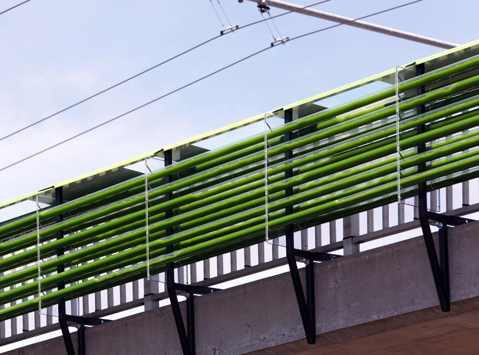
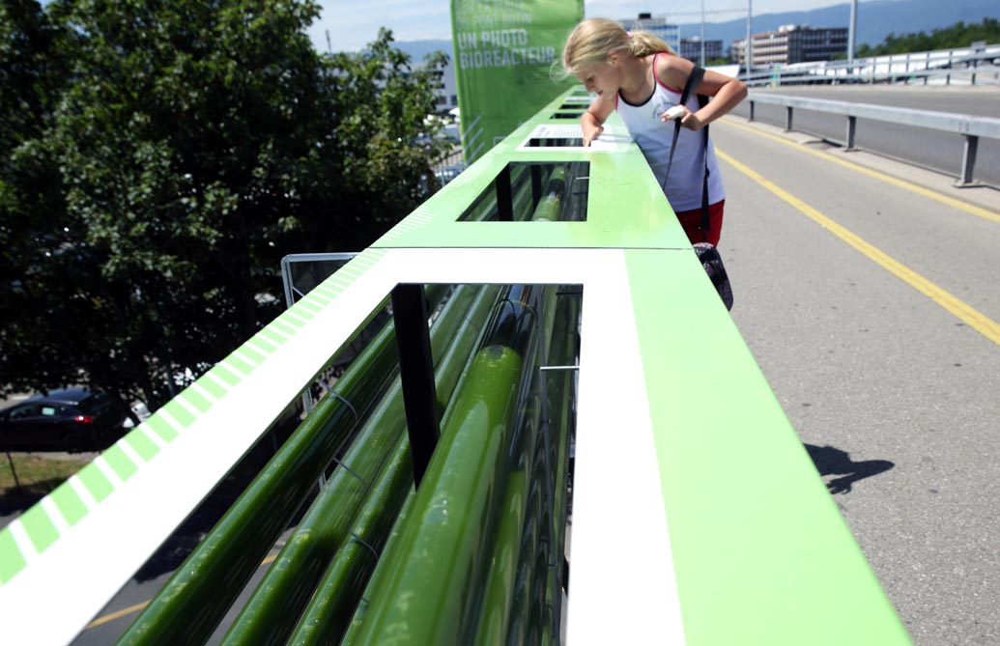

A [French and Dutch design firm](http://gizmodo.com/this-algae-farm-eats-pollution-from-the-highway-below-i-1653234583) has come up with an elegantly simple way to harness the wonderful power of nature in order to clean up the environment: an [algae farm](http://thecloudcollective.org/#/projects/culture-urbaine/) suspended over a small stretch of highway in Geneva, Switzerland.

Algae are a diverse group of organisms that, like plants, generate energy from photosynthesis using sunlight and carbon dioxide, churning out oxygen along the way. Since CO22</sub and sunlight, the algae will bloom and mature inside the tubes, filtering the air before being extracted and used for a variety of applications. According to the company that came up with the idea, [Cloud Collective](http://thecloudcollective.org/#/projects/culture-urbaine/), the material could be used to create biodiesel, green electricity, medication, cosmetic products or even foods. That’s quite an impressive list.

“The functioning and the placement of this bioreactor signal practices of the future: food production in an urban environment, the conservation of green space and the reinterpretation of existing infrastructures,” the Cloud Collective writes on their website.

At the moment, the bioreactor is a [proof of concept](http://gizmodo.com/this-algae-farm-eats-pollution-from-the-highway-below-i-1653234583) system that was built as part of a [garden festival](http://thecloudcollective.org/#/projects/culture-urbaine/) in Geneva, which “focuses on the co-habitation of the urban and the natural within the context of the urban expansion of Geneva.” However, it demonstrates how easy it could be to scale-up and install over larger areas.

Check out Cloud Collective’s video of the system.

