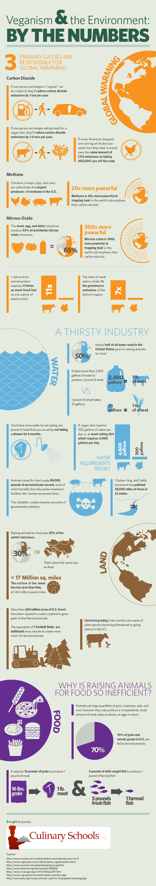

## Global Warming
3 Primary Gasses Are Responsible for Global Warming

### Carbon Dioxide
* If one person exchanges a "regular" car for a hybrid, they'll reduce carbon dioxide emissions by 1 ton per year.
* If one person exchanges eating meat for a vegan diet, they'll reduce carbon dioxide emissions by 1.5 tons per year.
* If every American dropped one serving of chicken per week from their diet, it would save the same amount of CO2</sub emissions as taking 500,000 cars off the road.

### Methane
* Chickens, turkeys, pigs and cows are are collectively the largest producer of methane in the United States.
* Methane is 20X more powerful at trapping heat in the Earth's atmosphere than carbon dioxide.

### Nitrus Oxide
* The meat, egg and dairy industries produce 65% of worldwide nitrous oxide emissions.
* Nitrus oxide is 300x more powerful at trapping heat in the Earth's atmosphere than carbon dioxide.

### Impact of Eating Meat
One calorie from animal protein requires eleven times as much fossil fuel as one calorie of plant protein.
The diets of meat eaters create seven times the greenhouse emissions compared with the diets of vegans.

## A Thirsty Industry
### Water
* Nearly half of all water used in the United States goes to raising animals for food.
* It takes more than 2,400 gallons of water to produce 1 pound of meat. It takes 25 gallons to make a pound of wheat.

### Water Requirements Per Diet
* You'd save more water by not eating one pound of meat than you would by not taking a shower for 6 months.
* A vegan diet requires 300 gallons of water per day versus a meat-eating diet which requires 4,000 gallons per day.
* Animals raised for food create 89,000 pounds of excrement per second, non of which benefit from the waste-treatment facilities human excrement doues. This creates a massive amount of groundwater pollution.
* Chicken, hog and cattle excrement has polluted 35,000 miles of rivers in 22 states.

### Land
* Raising animals for food uses 30% of the Earth's land mass, which is about the same size as Asia.
* This is the equivalent of 17 million square miles. The surface of the moon is only 14.6 million square miles.
* More than 260 million acres of United States forests have been cleared to create cropland to grow grain to feed farmed animals.
* The equivalent of 7 football fields of land are bulldozed every minute to create more room for farmed animals.
* Livestock grazing is the number one cause of plant species becoming threatened or going extinct in the United States.

## Why is Raising Animals for Food so Inefficient?
* Animals eat large quantities of grain, sybeans, oats and corn; however, they only produce a comparatively small amount of meat, dairy products, or eggs in return.
* 70% of grain and cereals grown in the United States are fed to farmed animals.
* It requires 16 pounds of grain to produce 1 pound of meat & 5 pounds of wild-caught fish to produce 1 pound of farmed fish.

## Infographic

