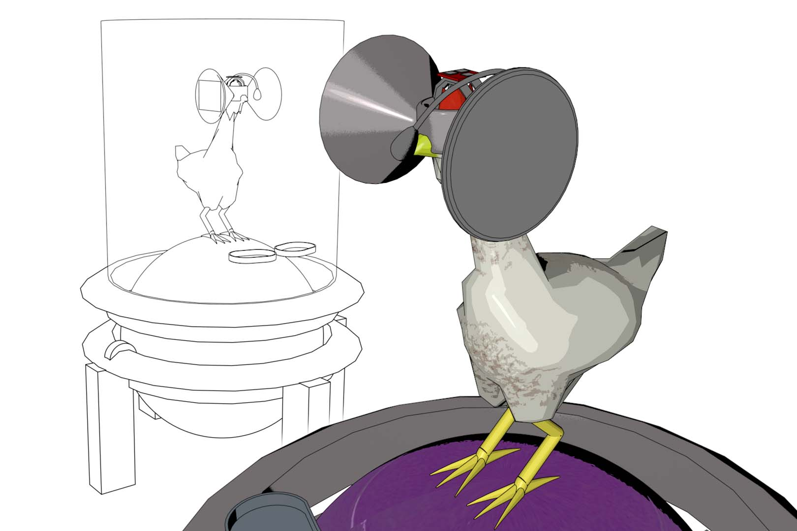



Who wants a virtual reality headset?
“Cluck cluck.” - I’ll take that as a resounding "yes."



In recent years, people have started to take animal welfare very seriously and slowly we are starting to see a change in the way that animals are treated. But what first springs to mind as a feasible idea to improve the lives of animals destined for human consumption? Bigger roaming areas? Free range? The Matrix? Wait… What?

An assistant professor in design at Iowa State University, Austin Stewart, has released ideas for a project named “[Second Livestock](http://www.theaustinstewart.com/secondlivestock.html)” which involves tricking chickens into thinking that they are free range, while they are actually contained within small enclosures. This would be achieved by strapping virtual reality headsets onto farmed chickens (stop laughing). These “Cockulus Rift” headsets would therefore make the chickens believe that they are in a nicer, less stressful environment (really, try to stop laughing).

Is this a big joke? Well, kind of, but not necessarily a futile one. Stewart created this project in order to spur people into [talking](http://www.takepart.com/article/2014/05/16/forget-about-free-range-these-oculus-rift-wearing-chickens-roam-virtually) about animal welfare, and also as a kind of [experiment](http://www.huffingtonpost.co.uk/2014/05/15/virtual-reality-for-chickens_n_5330879.html) to look at our relationship with technology, and of course to see how many people would actually believe that researchers intend on doing this. That being said, he told [Techcrunch](http://techcrunch.com/2014/05/15/an-oculus-rift-for-chickens-gives-animals-the-freedom-to-roam-without-the-roaming/) that he would be willing to work with anyone who is willing to offer their services to make it happen.

“In my presentations I try to present the project with an earnestness that makes the audience question whether or not it’s real,” Stewart told journalist [Liz Dwyer](http://www.takepart.com/article/2014/05/16/forget-about-free-range-these-oculus-rift-wearing-chickens-roam-virtually). “Most people are on the ‘this is fake’ side of the fence until I announce that they will be able to try out the technology behind Second Livestock in a few minutes. It is pretty great to watch the faces of the audience at this moment.”

So- any takers? 
