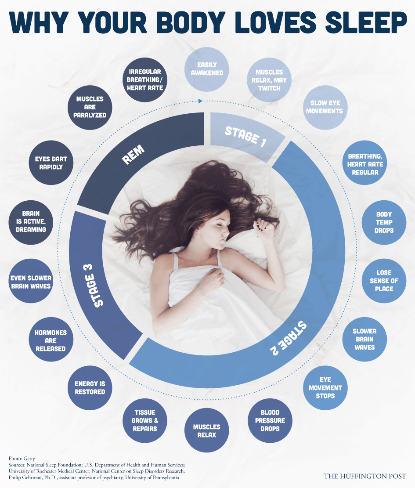


Sleep should be in your top 5 priorities.


We spend (or at least are supposed to spend) a third of our day sleeping. Sleep is much more than a passive activity; we need that time to clear our minds and restore our bodies. If we don’t [get enough rest](http://www.iflscience.com/health-and-medicine/how-much-sleep-do-you-really-need) each night, we become cognitively impaired, just as if we had been drinking alcohol.

Jan Diehm from [Huffington Post](http://www.huffingtonpost.com/2014/03/07/your-body-does-incredible_n_4914577.html) created this infographic, explaining what the body actually does during those resting hours:

Laura Schocker then elaborated on the graphic, explaining the image in greater detail. There are four stages of sleep, and it takes 90-110 minutes to complete an entire cycle, which translates into about five cycles per night. 

Stage 1 happens during the first 5-10 minutes of the sleep cycle. This is when it is easiest to be awoken and your muscles begin to relax. This is also when you are most likely to experience a [hypnagogic jerk](http://www.livescience.com/39225-why-people-twitch-falling-asleep.html), when muscles suddenly twitch, or you may feel like you are falling.

Stage 2 takes up half of the sleep cycle, lasting around 45-50 minutes. If you are woken up at this time, you will likely feel very disoriented. Breathing becomes relaxed and slowed as the body temperature drops, giving your heart a bit of a break, Schocker explains. Neural activity also decreases during this time, as the body prepares for the next phase of the cycle.

Stage 3 is when deep sleep occurs for about 20 minutes and the body is given the chance to restore itself. Brain waves become slow and steady, muscle and tissues are repaired (which is why proper sleep is a crucial factor when building muscle), and various hormones are secreted around the body. Waste management systems in the brain become very active, flushing out that which impairs cognitive function. Despite being the time when most rejuvenation happens, this is also the phase in which someone is most likely to walk or talk in their sleep. It is incredibly hard to wake someone up during this phase, as anyone who has dealt with a sleepwalker can attest to.

Rapid Eye Movement (REM) is the final stage in the cycle, lasting about 20 minutes. Though the eyes are closed, they move very quickly underneath the eyelid. Brain activity is high and the bulk of dreaming takes place during this time. However, muscles are paralyzed, preventing voluntary muscle movement. 

The average adult should get between [7-9 hours](http://sleepfoundation.org/how-sleep-works/how-much-sleep-do-we-really-need) per night, but about [40% of American adults](http://www.gallup.com/poll/166553/less-recommended-amount-sleep.aspx) average six or fewer. Hopefully this infographic and Schocker’s explanations inspire you to hit the hay a little bit earlier, giving your body all the time it needs to perform maintenance so you can get more out of your day.