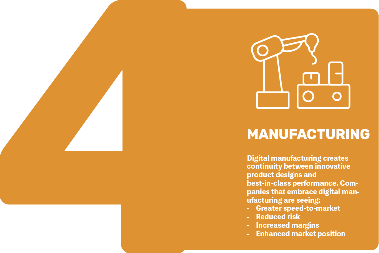

While researching topics that Humanity needs solved for my entrepreneurial endeavors, I came across a TEDx video by Yuko HARAYAMA about "Society 5.0." This is an initiative sponsored by the late Prime Minister of Japan - [Shinzo ABE](https://en.wikipedia.org/wiki/Shinzo_Abe). I found the video graphics for this _ideal_ future rather inspiring. 

Before we jump directly to Society 5.0, it helps to reflect on how Human innovation has progressed through time. As social creatures, Humans have proven to be quite adaptive and clever. Each society illustrates that progression through this set of unique traits.

## Iterations of Society

### Society 0.0


Earth’s beginnings can be traced back 4.5 billion years, but human evolution only counts for a tiny speck of its history. The Prehistoric Period &mdash; or when human life began before records documented human activity &mdash; roughly dates from 2.5 million years ago to 1,200 B.C.

At this stage, Humans shared the Earth with our cousins (*i.e.* Neanderthals *et al*) and started to diverge from our primate ancestors. Along the way, our brains grew in size and we began developing small communities for which to travel. Our physiology also began to shed the excess fur from our bodies as we were able to sweat for long distances. Our capacity for long-distance endurance became an asset as early Humans traveled the lands in search of food. 

### Society 1.0


Until approximately 12,000 years ago, all humans practiced hunting and gathering. Often foraging for vegetation and any other nutrients available for food. Many groups relied on scavenging animal remains that predators left behind.

Because hunter-gatherers did not rely on agriculture, they used mobility as a survival strategy. Indeed, the hunter-gatherer lifestyle required access to large areas of land, between seven and 500 square miles, to find the food they needed to survive. This made establishing long-term settlements impractical and most hunter-gatherers were nomadic. Hunter-gatherer groups tended to range in size from an extended family to a larger band of no more than about 100 people.

Eventually, with the beginnings of the [Paleolithic](https://en.wikipedia.org/wiki/Paleolithic) period (beginning of the Stone Age) about 12,000 years ago, when agricultural practices were first developed, some groups abandoned hunter-gatherer practices to establish permanent settlements that could provide for much larger populations. Larger populations provided better survival and security of the community. During this time, we find abundent evidence of tool making amongs various tribes. The start of our technological revolution is now on the horizon.

### Society 2.0


As Humans started to advance their understanding of Earth and how to cultivate plants for food, permanent communites started becoming rooted around areas on the globe. There was no single factor, or combination of factors, that led people to take up farming in different parts of the world. In the Near East, for example, it’s thought that climatic changes at the end of the last ice age brought seasonal conditions that favored annual plants like wild cereals. Elsewhere, such as in East Asia, increased pressure on natural food resources may have forced people to find homegrown solutions. But whatever the reasons for its independent origins, farming sowed the seeds for the modern age.

The wild progenitors of crops including wheat, barley, and peas are traced to the Near East region. Cereals were grown in Syria as long as 9,000 years ago, while figs were cultivated even earlier; prehistoric seedless fruits discovered in the Jordan Valley suggest fig trees were being planted some 11,300 years ago. Though the transition from wild harvesting was gradual, the switch from a nomadic to a settled way of life is marked by the appearance of early Neolithic villages with homes equipped with grinding stones for processing grain.

The origins of rice and millet farming date to the same Neolithic period in China. The world’s oldest known rice paddy fields, discovered in eastern China in 2007, reveal evidence of ancient cultivation techniques such as flood and fire control.

In Mexico, squash cultivation began around 10,000 years ago, but corn (*maize*) had to wait for natural genetic mutations to be selected for in its wild ancestor, teosinte. While maize-like plants derived from teosinte appear to have been cultivated at least 9,000 years ago, the first directly dated corn cob dates only to around 5,500 years ago.

Corn later reached North America, where cultivated sunflowers also started to bloom some 5,000 years ago. This is also when potato growing in the Andes region of South America began.

#### Stone Age


#### Bronze Age


It's estimated that the total world population of humans grew to around 27 million people.

#### Iron Age


### Society 3.0



We see the emergence of printing press, assembly lines with machines, and bigger machines for everything along with mass production.

#### Middle Ages


After the Iron Age, we start to see the mechanization of processes (machines). The [printing-press](https://en.wikipedia.org/wiki/Printing_press) is invented &mdash; making knowledge cheaper to share and faster to create. Steam and water power start to emerge. This is the world where science starts to make advances as knowledge is passed down through families and apprentices.

Humans have managed to grow to almost half billion individuals by this stage in our history. As the population continues to grow, more people are able to specialize in various trades and specialties. Some dedicate their lives to the pursuit of philosophy (knowledge) to better understand what we now refer to as science.

#### Industry 1.0


The First Industrial Revolution began in the 18th century through the use of steam power and mechanization of production. What before produced threads on simple spinning wheels, the mechanized version achieved eight times the volume in the same time. Steam power was already known. The use of it for industrial purposes was the greatest breakthrough for increasing human productivity. Instead of weaving looms powered by muscle, steam-engines could be used for power. Weaving looms made production of linen and clothes much faster and cheaper. Developments such as the steamship or (some 100 years later) the steam-powered locomotive brought about further massive changes because humans and goods could move great distances in fewer hours.

#### Industry 2.0
Mass production, assembly line, electricity.


The Second Industrial Revolution began in the 19th century through the discovery of electricity and assembly line production. Henry Ford (1863-1947) took the idea of mass production from a slaughterhouse in Chicago: The pigs hung from conveyor belts and each butcher performed only a part of the task of butchering the animal. Henry Ford carried over these principles into automobile production and drastically altered it in the process. While before one station assembled an entire automobile, now the vehicles were produced in partial steps on the conveyor belt - significantly faster and at lower cost.

World wars over natural resources also forced countries to intensify their efforts in science advancements. Be it for weapons or defensive measures, the developement of more efficient means of moving resources became critical during the wars. Fortunately, some of those developments have proven to have positive impacts on humanity. For example, we would not have advanced aviation technology so quickly if we didn't mass produce them during WW2. 

At this point in history, the established communities of the previous eras have grown the world population to about one billion Humans. Over 1% of the population continue to improve our understanding of the world through dedicated studies of science.

### Society 4.0


*The one we are living in now.* We've started connecting to each other over the internet. But information is unevenly distributed. Technology is secondary to everything. We start using automation with robots. Mass production is mostly driven with mechanical automation with only few parts dedicated to human interaction. Issues and breakdowns in production are still monitored manually by humans.

#### Industry 3.0
Computers, the internet, and automation.


The Third Industrial Revolution began in the 1970s in the 20th century through partial automation using memory-programmable controls and computers. Since the introduction of these technologies, we are now able to automate an entire production process - without human assistance. Known examples of this are robots that perform programmed sequences without human intervention.

Today, humans number about 8 billion in population with a steady 1% dedicated to science. There appears to be a trend where science progressively expedites our understanding of the universe as our population continues to grow. Engineers take the theoretical knowledge and apply them to practical applications that benefit society. 

## Society 5.0


We are slowly transitioning into this era as we integrate more technology (social media, Cloud, Internet of Things, Artificial Intelligence, Augmented Reality / Virtual Reality, Machine Learning, cybernetics, *etc.*) into our daily lives. Cyber-physical integrations. Technology and science are prized for the growth of our society.

In its [latest report](http://www.keidanren.or.jp/en/policy/2018/095.html), *Keidanren* (Japan Business Federation) has redefined Society 5.0 as the "Imagination Society." Where digital transformation combines with the creativity of diverse people to bring about "problem solving" and "value creation" that lead us to sustainable development. It is a concept that can contribute to the achievement of the [Sustainable Development Goals](https://en.wikipedia.org/wiki/Sustainable_Development_Goals) (SDGs) adopted by the United Nations.

## Sustainable Development Goals

The *Imagination Society* is:
- Human-centered society
- Balance economic advancement with the resolution of social problems
- Open, sustainable, and inclusive
- Experimentation driven
- Highly integrated with cyberspace and physical space.

The 17 SDGs are: 
1. [No poverty](https://en.wikipedia.org/wiki/Sustainable_Development_Goal_1)
2. [Zero hunger](https://en.wikipedia.org/wiki/Sustainable_Development_Goal_2)
3. [Good health and well-being](https://en.wikipedia.org/wiki/Sustainable_Development_Goal_3)
4. [Quality education](https://en.wikipedia.org/wiki/Sustainable_Development_Goal_4)
5. [Gender equality](https://en.wikipedia.org/wiki/Sustainable_Development_Goal_5)
6. [Clean water and sanitation](https://en.wikipedia.org/wiki/Sustainable_Development_Goal_6)
7. [Affordable and clean energy](https://en.wikipedia.org/wiki/Sustainable_Development_Goal_7)
8. [Decent work and economic growth](https://en.wikipedia.org/wiki/Sustainable_Development_Goal_8)
9. [industry, innovation and infrastructure](https://en.wikipedia.org/wiki/Sustainable_Development_Goal_9)
10. [Reduced Inequality](https://en.wikipedia.org/wiki/Sustainable_Development_Goal_10)
11. [Sustainable Cities and Communities](https://en.wikipedia.org/wiki/Sustainable_Development_Goal_11)
12. [Responsible Consumption and Production](https://en.wikipedia.org/wiki/Sustainable_Development_Goal_12)
13. [Climate Action](https://en.wikipedia.org/wiki/Sustainable_Development_Goal_13)
14. [Life Below Water](https://en.wikipedia.org/wiki/Sustainable_Development_Goal_14)
15. [Life On Land](https://en.wikipedia.org/wiki/Sustainable_Development_Goal_15)
16. [Peace, Justice, and Strong Institutions](https://en.wikipedia.org/wiki/Sustainable_Development_Goal_16)
17. [Partnerships for the Goals](https://en.wikipedia.org/wiki/Sustainable_Development_Goal_17)

What could the future of our society be? _Society 5.0_ aims to inspire how that could evolve with the seamless integration of science and technology in everyday life. It further fuses the ideals from [Corporate social responsibility](https://en.wikipedia.org/wiki/Corporate_social_responsibility) (CSR) and [Environmental, social, and corporate governance](https://en.wikipedia.org/wiki/Environmental,_social,_and_corporate_governance) (ESG). Below, you can find more in-depth information and current research into these goals. 

Which goal can you build a solution that the community needs? What can you do for the community? It's not that any business you create would reward you monetarily. Rather, it's how you can improve the world for future generations. Take care of the community and the community will take care of your needs. The ideas I freely share below are by no means exhaustive nor complete. What more, no matter how small, could you do? Can you build something within the scope of these goals?

### No poverty





**What can we do to address this goal?**
* Create non-profit (and non-government) organizations (NPO/NGO) to directly work with your local community's poorest areas.
* Work with your local governments to provide better social programs to help everyone in the community.

### Zero hunger





**What can we do to address this goal?**
* Need to further invest and research vertical-farming where crops can be grown locally in each city-center. By having everyone "buy local" we can further mitigate climate issues as we reduce the need for transporting the goods between cities/countries. Vertical-farming also allows for specialty crops to be grown as each room or warehouse can be dedicated to certain climate zones.
* Continue to research and identify strains of plants that would be resilient for growing in vertical-farms. 
* Create volunteer programs to teach community members how to create and maintain "roof-top farms. "
* Strongly encourage everyone to eat more plant-based meals and reduce (or eliminate) animal products from the dinner plate. All the lands we have destroyed for cattle grazing could be restored. Instead of feeding billions of livestock, we can directly feed billions of humans with a surplus from existing crops. 
* Form a local NPO/NGO to provide better access to healthy foods in areas of "food deserts." 
* Provide educational programs about nutrition to the poorest regions with "free food" with volunteer cooks.
* Further research on the "optimal and nutritional" diet for humans.

### Good health and well-being





**What can we do to address this goal?**
* Work with your local governments to provide better social programs to help everyone in the community.
* Provide better access to educational materials around reproduction - especially to women in developing nations.
* Remove profit driven incentives for healthcare plans. This should be provided unconditionally by the State. 
* Build a universal system to monitor and track individuals' health (perhaps on the blockchain) so that every hospital has instant access to critical life-saving records. Currently, hospitals don't share patient records and what records they have are incomplete. Making it harder for physicians to diagnose patient issues.
* Build more machine-learning algorithms to identify disease in it's early stages. Have it send friendly alerts to the user to visit a medical facility to get it addressed.

### Quality education





**What can we do to address this goal?**
* Work with your local governments to provide better education programs to help everyone in the community.
* Build a non-profit organization to provide free education for primary school and secondary school plus technical and vocational training.
* Offer apprenticeships for technical and vocational training programs.
* Build more "playful toys" that teach numeracy and literacy to the young. These must be provided at affordable pricing or near free &mdash; especially for the poorer regions.
* Create educational songs and videos that captivate the young into lifelong-learning.
* In addition to [STEM programs](https://www.ed.gov/stem), sponsor more arts driven education. 
* Enhance the classroom curricula with more engaging, fun, but practical applications for our everyday lives. 
* Ensure all educators are well compensated for their work as teachers for the next generation. 
* Build virtual environments that enable students to test themselves both physically and mentally without risk of real-world-failures. These could be called games, but in a VR/AR environment controlled in the classroom. This could be built in the Metaverse. 
* Remove the profit incentive from education programs. These should be fully funded by the state for public education. 

### Gender equality





**What can we do to address this goal?**
* Promote empowerment of women and LGBTQ through technology.
* Provide better access to educational materials around equality - especially to women in developing nations.
* Create more entertainment driven media (games, movies, books, and songs) around the equality between all humans &mdash; not just cisgender men. 
* Encourage all businesses to be open about all employees' salaries. This ensures that everyone gets paid equally for the level of value provided to the company.

### Clean water and sanitation





**What can we do to address this goal?**
* Build cheap water sequestration systems for each region. For example, high mountainous regions could benefit from a cheap mesh system that captures moisture from the clouds and fog. 
* Research methods to use desalinated water from the ocean without dumping the highly acidic brine back into the ocean. Perhaps have the water plant double as a salt refinery? Plus, have all the electrical needs of the desalination plant met by hydro-generators in the ocean. Something similar to wave-generator tech.
* Develop cheap water decontamination treatment devices that everyone could use. Make them free for the poorest regions. The challenge is to reduce or eliminate the replaceable filter (waste) products. Build a filter that you can endlessly recycle.
* Provide better education for all communities around water sanitation methods. How to build a rudimentary filtration system. How to boil water and remove viruses, bacteria, and fungi.

### Affordable and clean energy





**What can we do to address this goal?**
* Urge the national governments to invest in drilling technology for geothermal power plants. We need to expand the conversation and awareness of this ancient technology. It's not limited to just Japan or Iceland! A byproduct of this tech is the ability to enhance [CCS technologies](https://en.wikipedia.org/wiki/Carbon_capture_and_storage).
* Invest more research in materials development for more efficient solar panels.
* Invest more research in materials development for energy storage (battery) technologies.
* Research more into building smaller scale wind-farms with more efficient blade designs for more compact installations.
* Invest more into building designs that require less energy to keep the occupants comfortable. This is similar to *[Passivhaus](/2022/0502/Science_科学/Technology_技術/Passive-House-vs-ZEB.html)* and ZEH buildings.
* Research better window designs with higher R-values to match the same insulating values as the walls. Current designs are horrible at keeping the home energy-efficient.
* Promote more incentives and subsidies for home-owners to install battery backups with solar panels on the roofs.
* Provide subsidies to business owners of skyscrapers when they are designed with green-walls and green-roofs.
* Provide energy efficient appliances for the home that require less input to achieve the same standard of comfort today.
* For regions with rivers that run deep or fast enough, develop in-river hydro-generators that capture the energy of the running water.
* Develop cheaper energy capture technologies for systems that currently reject heat-waste directly into the air.
* Encourage development of "SuperGrids" where power from renewable sources interconnect between countries. Or, like the China proposed idea of a "Global Grid."

### Decent work and economic growth





**What can we do to address this goal?**
* Further develop a means to provide "universal banking" such as that proposed by cryptocurrencies. 
* Build more checks and audits into the cryptocurrency technologies.
* Further build out the infrastructure for increasing the global reach of the internet.
* Encourage more infrastructure projects for each region: water, electricity, sewage, mass transportation, and internet.
* Build more recycling programs that actually work.
* Discourage production of materials that are too difficult to recycle. Perhaps impose a tax on such production. This tax should be used to further research on recycling.
* By adding monitoring stations and inspectors along with solar/wind technicians, the number of job opportunities would exceed those currently used to support the fossil industries.
* Research projects for alternative energies would explode in job growth over the current decade.
* Encourage more worker-owned-cooperatives where all employee share in the profits rather than profits going directly to share-holders.

### industry, innovation and infrastructure





**What can we do to address this goal?**
* Sponsor contest for technological innovations *twice* a year. Select the best inventions that provide direct benefit to the community. 
* Provide more subsidies to industries that promote (and build) green technologies and tax companies that continue to pollute the ground, air, and water. 
* Build better monitoring technologies for all infrastructure.
* Build more interfaces for Metaverse interactions. Make it easier to test-drive policies before implementing them in the real-world.

### Reduced Inequality





**What can we do to address this goal?**
* Sponsor better education programs that reach the young to ensure a minimum level of numeracy and literacy.
* Encourage a change in mindset about the "differences" between men and women. We are all conceived the same and potentially develop into amazing minds. Why don't we celebrate our similarities instead of focusing on our differences?
* Make access to the internet and Metaverse a right provided to all. This way we can all share information quickly. And hopefully learn faster.

### Sustainable Cities and Communities





**What can we do to address this goal?**
* Invest more into building designs similar to *Passivhaus* and [ZEH buildings](https://www.iea.org/policies/1163-promotion-of-zero-energy-building-zeb-and-zero-energy-houses-zeh) that require less energy to keep the occupants comfortable.
* Promote more "universal housing" so the homeless can be sheltered. 
* Develope more green spaces like parks and walkways.
* Design cities to be more human-centric rather than around car traffic. 
* Promote more bicycle (or human-powered vehicle) trails and limit car traffic in densely populated areas. Make the "roads" more friendly to pedestrians so kids can go outside and play more often. [🎥The Car-Replacement Bicycle (the bakfiets)](https://youtu.be/rQhzEnWCgHA)
* Fund more art such as murals and sculptures along parks and trails for bicyclist and pedestrians.
* Develop more mass transit systems that enable everyone to travel everywhere within the country - regardless of the community size, there should be a train stop.
* Research more about "[Bioreactor Buildings](https://youtu.be/L2AHFsKwJwg)" and how we can lower energy costs by employing algae-photosynthesis processes in window-like panels for towering buildings.

### Responsible Consumption and Production





**What can we do to address this goal?**
* Promote more "circular economies" where waste is pushed to the absolute minimum. Ideally, all products should be 100% recyclable. 
* Ban "fast-fashion" industries from operating in all regions.
* Encourage grocery stores to reduce prices on all foods as they approach the expiration date. Allow the poor to take foods that are near the expiration date at no cost. This way we can minimize food waste.
* Separate food wastes to be used for farming as fertilizer.
* Ensure environmental audits are properly carried out and all offenders held accountable.
* Build methane capturing facilities at all landfills. The methane can be sold for use in other industrial processes.
* Create a methane trade industry similar to the carbon tax trade industry.
* Tax all agribusinesses additional taxes for each cattle head raised for both carbon and methane taxes. 
* Invest in more research for recycling technologies.
* Build agencies to monitor companies that sell "green-washing" rather than actual environmental repair.

### Climate Action





**What can we do to address this goal?**
* Develop and install monitoring sensors around the globe to check for ocean currents, temperature deviations, and the chemical changes to each environment.
* Research *temporary* measures to minimize sunlight absorption into our atmosphere. Using high-altitude flying drones either near space (mesosphere) or in the upper stratosphere. These could also act as weather monitoring stations as well as internet nodes.
* Further develop concepts similar to the "[Artificial Tree](https://www.bbc.com/future/article/20121004-fake-trees-to-clean-the-skies)" or other carbon sequestration technology. 
* Promote "green" or white-painted roofs to minimize sunlight absorption thus reducing the demand to cool the building during hot summers.
* Revoke [all subsidies for fossil-fuel](/2022/0609/Politics_政治的/Energy-to-change.html) corporations.
* Provide incentives for everyone to stop driving vehicles that require fossil-fuels.
* Invest in clean, responsible power generation plants (_e.g._ wind, solar, and geothermal energy).
* Follow the recommendations of the [IPCC Sixth Assessment Report](https://www.ipcc.ch/report/ar6/wg3/). 
* Build education programs that show how our choices directly impact the planet and eventually cycles back to impact our lives.
* Aggressively work to decommission all coal-powered energy plants in favor of Nuclear, wind, solar, and geothermal power.
* Invest in better battery technologies and electrical motors that could power an international flight across the oceans. This way we can remove the need for jet-fuel.
* Build an inventory of Earth's resources using Blockchain technology. Issue tokens to people that have the resources (land, trees, sequestration tech, etc.) and allow them to sell those tokens to countries or companies that wish to offset their emissions. Make sure the chain is publicly accessible and readable. Use funds from transaction fees to invest in more sequestration research.

### Life Below Water





**What can we do to address this goal?**
* Institute temporary and permanent moratoriums on certain types of fishing. We will deplete not only the fish reserves, but devastate the ocean environments beyond the point of repair.
* Ban all ocean trawling from scraping up the ocean floor just to collect fish that not only destroys the entire ecosystem, but isn't profitable to the types of fish wanted. 
* Require licenses for all fishermen and regular inspections from independent auditors over all fishing company's operations. The inspections should not be paid by the fishing company as it creates a conflict of interest for the inspectors.
* Build more education programs to increase awareness of how interconnected we are to the oceans. If the oceans die, we die quickly thereafter. Increased ocean temperatures and oxygen loss act concurrently with ocean acidification and constitute the "deadly trio" of climate change pressures on the marine environment.
* Aggressively prosecute major polluters of our oceans.
* Build more monitoring stations around the coastlines and in the oceans
* Develop technologies to collect the existing plastic (and other) wastes floating in several "garbage patches" around the planet. 
* Promote more movies/anime for "[captain planet](https://en.wikipedia.org/wiki/Captain_Planet_and_the_Planeteers)" type of heros that guard our planet.
* Revoke all offshore mining operators' licenses when they fail to fully cleanup their "accidents." Hold them fully accountable for the ecological damage. This includes prison terms for the executives of each company.
* Create sanctuaries where all fishing is completely banned.
* Research more about [Azzola](https://en.wikipedia.org/wiki/Azolla)'s ability to grow fast and sequester Carbon and Nitrogen from the environment.

### Life On Land





**What can we do to address this goal?**
* Ban burning of forest just for expansion of cattle ranchers.
* Hold all major polluters accountable with aggressive fines and force them to clean up the damage and restore the land.
* Designate and monitor areas as national parks, life reserves, and sanctuaries for wildlife. Aggressively prosecute any violations leading to the deaths of animals in those regions.
* All pesticides should be put through multiyear research and inspections just like human drug trials are required. This is to ensure that not only do we minimize damage to the ecosystems but to human health as well.
* Invest and develop more "alternative meats" that don't require livestock animals. This is to help encourage more people to transition to a plant-based diet.

### Peace, Justice, and Strong Institutions





**What can we do to address this goal?**
* IF we can build better social safety nets across the globe, we can significantly reduce illicit activities and abuses against fellow Earthlings. 
* Build more educational systems that empower women both mentally and physically.
* Develop a "universal identity" system. (Perhaps using blockchain?)
* Remove corrupting influences of profit in governmental decision making. The government should be for and by the people. Not run by corporations and the wealthy.

### Partnerships for the Goals





**What can we do to address this goal?**
* Sponsor international contests that promote all of these goals.
* Promote more science, technology, and innovation with knowledge sharing among the international community.
* Further assist the least-developed countries and identify economic sectors that could quickly benefit from proven business models from developed countries.

## Fourth Industrial Revolution

Cyber-Physical systems integrated with social media, cloud, Internet of Things, Agumented Reality / Virtual Reality, Machine Learning, Artifacial Intelligence, and cybernetics.


We are currently implementing the Fourth Industrial Revolution. This is characterised by the application of information and communication technologies to industry and is also known as "Industry 4.0." It builds on the developments of the Third Industrial Revolution. Production systems that already have computer technology are expanded by a network connection and have a digital twin on the Internet so to speak. These allow communication with other facilities and the output of information about themselves. This is the next step in production automation. The networking of all systems leads to "cyber-physical production systems" and therefore smart factories, in which production systems, components and people communicate via a network and production is nearly autonomous.

When these enablers come together, Industry 4.0 has the potential to deliver some incredible advances in factory environments. Examples include machines which can predict failures and trigger maintenance processes autonomously or self-organized logistics which react to unexpected changes in production.

And it has the power to change the way that people work. Industry 4.0 can pull individuals into smarter networks, with the potential of more efficient working. The digitalization of the manufacturing environment allows for more flexible methods of getting the right information to the right person at the right time. The increasing use of digital devices inside factories and out in the field means maintenance professionals can be provided with equipment documentation and service history in a timelier manner, and at the point of use. Maintenance professionals want to be solving problems, not wasting time trying to source the technical information that they need.

In short, Industry 4.0 is a game-changer, across industrial settings. The digitalization of manufacturing will change the way that goods are made and distributed, and how products are serviced and refined. On that basis, it can truly lay claim to represent the beginning of the fourth industrial revolution.

Below are the areas where further development is expected to take place.

### Industry 4.0

### BlockChain

### Automation

### Manufacturing

3-D printing and additive manufacturing...

### Computing

### Digitalization

### Smart Factory

### Cybersecurity

### Internet of Things

### Big Data and Predictive ›Analytics

## How do we transcend?
The transition from Society 4.0 to 5.0 will undoubtedly be slow with many detours. The technologies that would make Society 5.0 (and Industry 4.0) possible are already here, for the most part. However, the information and processes that would tie them all together are not evenly distributed across the globe. While the current information age has shorten the gap of that knowledge distribution, we will continue to narrow that gap as we grow ever more depended on technology to reduce the low-value, tedious tasks around us.



Beyond 4IR is Industry 5.0 where we will pave the way for innovations drawing humans and machines together for mass customization and collaboration. Deeper cognitive systems with A.I. for Humans interaction.

## Reference
* 📔 [Society 5.0 - Japan Cabinet Office](https://www8.cao.go.jp/cstp/english/society5_0/index.html)
* 🎥 [Why Society 5.0 | Yuko Harayama | TEDxRoma | Video 15:14](https://youtu.be/C2uG2WmMDuA)
* 📔 [Yuko Harayama presentation for Society 5.0](./What-is-Society-5/20201214_Pr%C3%A4sentation-Harayama.pdf)
* 📔 [Realizing Society 5.0](./What-is-Society-5/society_5.0.pdf)
* 📔 [Living Concept “Society 5.0”](./What-is-Society-5/Harayama%20Society5%20Finland.pdf)
* 🎥 [Society 5.0 - 22nd June - Welcome and Keynote](https://youtu.be/P1Tmu4_tve4?t=157)
* 📔 [WEF - Modern society has reached its limits. Society 5.0 will liberate us](https://www.weforum.org/agenda/2019/01/modern-society-has-reached-its-limits-society-5-0-will-liberate-us/)
* 🎥 [“The Fourth Industrial Revolution and Society 5.0” Mr. David Aikman (WEF) | Video 25:34](https://youtu.be/faC-9rDZWUQ)
* 💻 [An Investigation upon Industry 4.0 and Society 5.0 within the Context of Sustainable Development Goals](https://www.mdpi.com/2071-1050/13/5/2682)
* 💻 [Japan’s Science and Technology Strategy for the SDGs](https://www.japanpolicyforum.jp/diplomacy/pt201908210756319679.html)
* 📔 [Business Strategies Helping avoid Climate Collapse](./What-is-Society-5/Society_5.0-climate-impact.pdf)
* 📔 [Program 2022](https://www.conference-society5.org/program)
* 💻 [The Prehistoric Ages: How Humans Lived Before Written Records](https://www.history.com/news/prehistoric-ages-timeline)
* 💻 [Hunter-Gatherer Culture](https://education.nationalgeographic.org/resource/hunter-gatherer-culture)
* 💻 [Development of Agriculture](https://education.nationalgeographic.org/resource/development-agriculture)
* 💻 [Estimates of historical world population](https://en.wikipedia.org/wiki/Estimates_of_historical_world_population)
* 💻 [Blockchain technology applications for Industry 4.0](https://www.sciencedirect.com/science/article/pii/S2096720921000221)
* 💻 [Automation in industry 4.0](https://nexusintegra.io/automation-in-industry-4-0/)
* 💻 [Cloud Computing as the Foundation of Industry 4.0](https://blog.rgbsi.com/cloud-computing-foundation-of-industry-4.0)
* 💻 [Industry 4.0, digitization, and opportunities for sustainability](https://www.sciencedirect.com/science/article/abs/pii/S0959652619347390)
* 💻 [How Industry 4.0 technologies are changing manufacturing](https://www.ibm.com/topics/industry-4-0)
* 📔 [Framework for Cyber-Physical Systems](https://nvlpubs.nist.gov/nistpubs/SpecialPublications/NIST.SP.1500-201.pdf)
* 📔 [Industry 4.0 and cybersecurity](https://www2.deloitte.com/content/dam/insights/us/articles/3749_Industry4-0_cybersecurity/DUP_Industry4-0_cybersecurity.pdf)
* 💻 [Industrial IoT Use Cases and Applications](https://tulip.co/blog/industrial-iot-use-cases-and-applications/)
* 💻 [Why is Big Data the core of the 4.0 industry?](https://nexusintegra.io/big-data-industry-4-0/)
* 💻 [The Role of Big Data Analytics in Industry 4.0](https://blog.rgbsi.com/big-data-analytics-in-industry-4.0)
* 🎥 [How Long Until We Run Out Of Food? | Avoiding Apocalypse | Spark | Video 50:50](https://youtu.be/BT4RgpcyfLg)
* 🎥 [Society 5.0 - 23rd June - Session 3b & 4b](https://youtu.be/2e91CN7emKc) : An Indoor Farming Framework for decision support towards food security in Society 5.0 | 
Amore van Zyl and Hanlie Smuts
* 🎥 [Are We Running Out Of Water? | Avoiding Apocalypse | Spark | Video 50:51](https://youtu.be/m-aqWZFCOiY)
* 📚 [Factor Five: Transforming the Global Economy through 80% Improvements in Resource Productivity](https://www.amazon.com/Factor-Five-Transforming-Improvements-Productivity/dp/1844075915)
* 📚 [ファクター5―エネルギー効率の5倍向上をめざすイノベーションと経済的方策](https://www.amazon.co.jp/%E3%83%95%E3%82%A1%E3%82%AF%E3%82%BF%E3%83%BC5%E2%80%95%E3%82%A8%E3%83%8D%E3%83%AB%E3%82%AE%E3%83%BC%E5%8A%B9%E7%8E%87%E3%81%AE5%E5%80%8D%E5%90%91%E4%B8%8A%E3%82%92%E3%82%81%E3%81%96%E3%81%99%E3%82%A4%E3%83%8E%E3%83%99%E3%83%BC%E3%82%B7%E3%83%A7%E3%83%B3%E3%81%A8%E7%B5%8C%E6%B8%88%E7%9A%84%E6%96%B9%E7%AD%96-%E3%82%A8%E3%83%AB%E3%83%B3%E3%82%B9%E3%83%88%E3%83%BB%E3%82%A6%E3%83%AB%E3%83%AA%E3%83%83%E3%83%92%E3%83%BB%E3%83%95%E3%82%A9%E3%83%B3%E3%83%BB%E3%83%AF%E3%82%A4%E3%83%84%E3%82%BC/dp/4750339903)
* 🎥 [Blockchain and IoT integration for Society 5.0 | Video (From 20:41) 15:00](https://youtu.be/gTmW2ojHWks?t=1243)
* 🎥 [Big data analysis and the raise of human centered retailing | Siti Afiqah Zainuddin | Video 1:07:57](https://youtu.be/g8wmpmtNJQg)
* 🎥 [IoT and AR | Sebastián Duque | Video 23:51](https://youtu.be/o1DnXigAuI4)
* 🎥 [History of Artificial Intelligence [4K] | CyberWork And The American Dreams | Spark | Video 55:37](https://youtu.be/q6U9mhKAFFA)
* 🎥 [From Managing Diversity to Managing Opportunities](https://youtu.be/k9kbx9SZn0o?t=650s)
* 🎥 [What Will Happen If Earth Keeps Getting Warmer? | Avoiding Apocalypse | Spark | Video 51:11](https://youtu.be/K3Q5OEfD9u8)
* 🎥 [Can We Cool the Planet? | Full Documentary I NOVA | PBS | Video 53:38](https://youtu.be/PeYJTluQ5tM)
* 🎥 [Are We Too Late To Stop Climate Change? | Carbon Nation | Spark | Video 1:14:51](https://youtu.be/vqJ9-U8o_Rs)
* 🎥 [See what three degrees of global warming looks like | The Economist| Video 1:14:32](https://youtu.be/uynhvHZUOOo)
* 🎥 [Six degrees could change the world | Video 16:23](https://youtu.be/EU5tUY3W3WI)
* 🎥 [These Companies Are Making Profit From Saving The Planet | Banking Nature | Spark | Video 1:26:47](https://youtu.be/y1EdZeRHgbM)
* 🎥 [The Antarctica Challenge: A Global Warning | Video 52:00](https://youtu.be/9Im2O6dzpUE)
* 🎥 [The World Needs Supergrids, But There's a Problem | Video 15:15](https://youtu.be/DN1mPBQd7fY)
* 🎥 [How To END The Climate Crisis In One Generation | Paul Hawken on The Rich Roll Podcast | Video 2:23:14](https://youtu.be/XGE_TZfTaH8)

## Related
