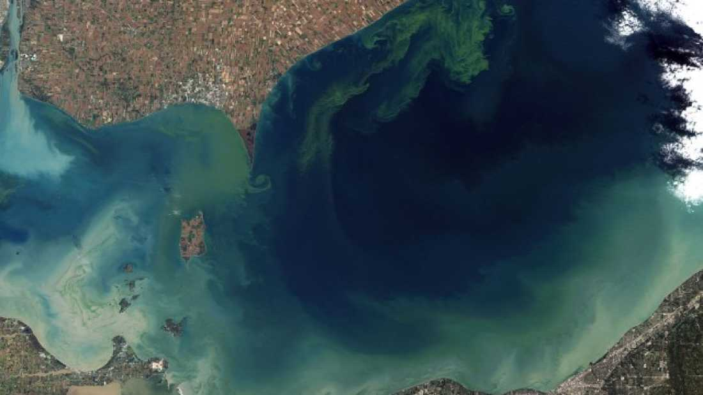

Toledo, Ohio is the fourth largest city in Ohio, which made this weekend’s [ban on tap water](http://www.npr.org/blogs/thetwo-way/2014/08/03/337545914/algae-toxins-prompt-toledo-to-ban-its-drinking-water) incredibly problematic. For three days, nearly 500,000 people and their pets were not able to utilize water municipal water for drinking, cooking, or brushing teeth. Even bathing or washing hands in the water was out, except for healthy adults. Cyanobacteria (also called blue-green algae) blooms in Lake Erie, the source of Toledo’s tap water, had created [toxic levels of microcystin](http://www.nytimes.com/2014/08/04/us/toledo-faces-second-day-of-water-ban.html). Boiling the water would actually exacerbate the microcystin’s effects, leading citizens to scramble to find bottled water.

Cyanobacteria create peptides known as microcystin as a byproduct. When they bloom and exist in huge amounts, the microcystin levels become high enough that they can cause dizziness, nausea, vomiting, diarrhea, and liver damage when ingested. Even contact with the water could induce rashes, which is why immunocompromised people have been asked to avoid the water completely.

Toledo’s Mayor D. Michael Collins [lifted the ban](http://www.npr.org/blogs/thetwo-way/2014/08/04/337729232/despite-tests-showing-toxins-at-safe-level-toledo-mayor-keeps-water-ban) today (Monday) as state and federal Environmental Protection Agency officials have determined the microcystin levels have [returned to a safe level](http://www.toledoblade.com/local/2014/08/04/Toledo-Mayor-D-Michael-Collins-System-safe-but-water-advisory-remains-in-effect.html). However, there are no federal or state guidelines in place, so the EPA is operating under the World Health Organization’s recommended <1.0 ppb figure, which equates to a size of one drop per Olympic-sized swimming pool. Officials are asking residents to run their faucets for 15 minutes to flush out the pipes before using the water.

Officials have reported that irresponsible farming and lawn care largely appear to be the culprit behind this bloom, which caused the drinking water to resemble a spinach smoothie. Excessive nitrogen and phosphorus from fertilizer, livestock incorrectly positioned near water sources, and pesticides were caught in the runoff water, and the warm water from summer made conditions ideal for the cyanobacteria to grow to such extreme quantities.

Regulations concerning phosphorus use have led to a decline in blooms, but [nearly 20 percent of the lake](http://www.nytimes.com/2013/03/15/science/earth/algae-blooms-threaten-lake-erie.html?pagewanted=all&_r=0) was overcome with slimy algae blooms back in 2011 due to the massive influx of rain. Microcystin levels topped 1,200 times WHO’s recommended limits for the drinking water of nearly 2.8 million people. Aside from the lack of drinking water for people, algae blooms have catastrophic effects on marine life. The blooms choke out fish and their food sources at the bottom of the lake, creating massive dead areas.

It is important to remember that these issues aren’t restricted to Lake Erie; they could happen anywhere. As climate change progresses and water becomes warmer on average, these blooms could be more frequent and more widespread. However, that does not mean the problem is completely hopeless. Enforcing responsible habits like not over-fertilizing and cutting down on the amount of phosphorus entering the watershed reduces the amounts of nutrients available to the cyanobacteria, cutting down on its growth potential.