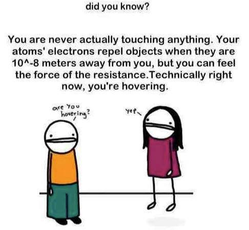


Did you know?

You are never actually touching anything. Your atoms' electrons repel objects when they are 10^-8 meters away from you, but you can feel the force of the resistance. Technically right now, you're hovering.

