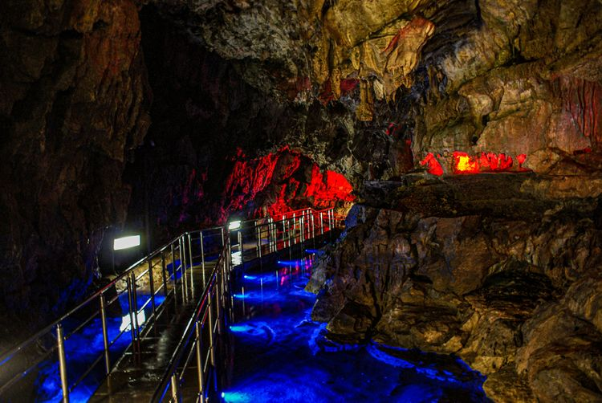
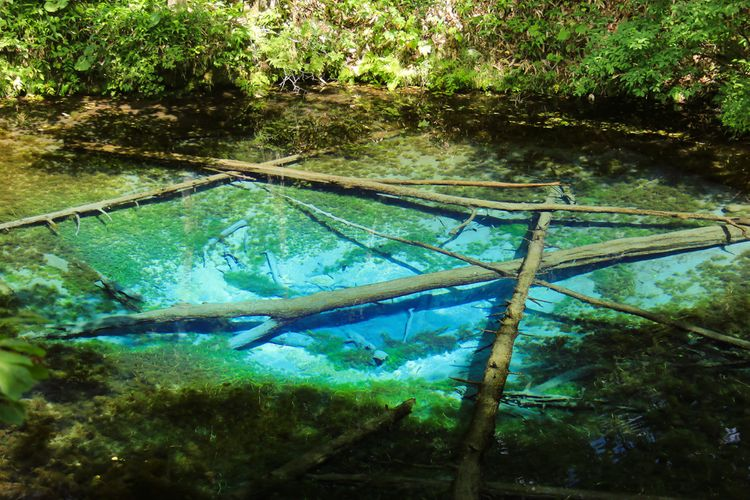
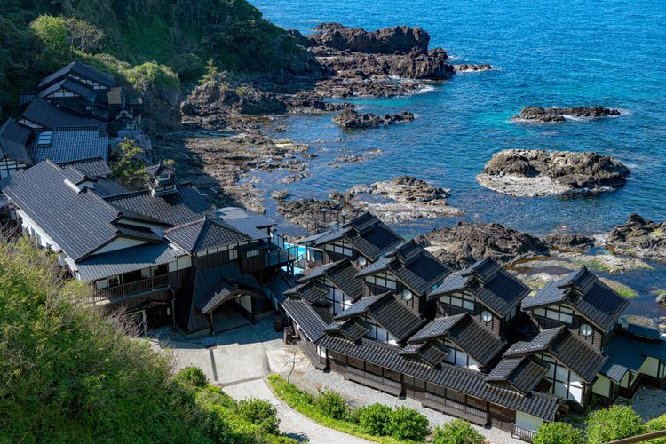

Making a bucket list of the things you should do before you die? Well, if Japan isn't on it, it should be! Japan isn't just about robots and cats - it has a lot to offer in terms of breathtaking scenery. This article introduces 30 amazing sights worth conquering before your time is up. We'll let the pictures do the talking!

## Hoshitouge Rice Terraces (Niigata)

The "water mirror," which you can see before spring, is a wondrous sight! The Matsudai area is well-known as one of the venues of the Echigo-Tsumari Art Triennale, which is held once every 3 years.

## Icicles of Misotsuchi (Saitama)

In mid-winter, icicles appear on the surface of a mountain facing the Arakawa River. During the "Otaki Ice Festival," the scene is lit up in a whimsical display!

## Hida Great Limestone Cave (Gifu)

The Hida Great Limestone Cave was discovered in 1965. It is said that 250 million years ago it was at the bottom of the sea.

## Firefly Squid Spawn (Toyama)

When firefly squid move into shallow waters, the coastline of Toyama turns an ephemeral blue. You can witness this phenomenon during the spawning season from March to May. It normally happens at night when the sea is quiet without moonlight.

## Shirakawa-go (Gifu)
.jpg)

In 1995, Shirakawa-go was registered as a UNESCO World Heritage site. The area is lit up at night every weekend in July.

## Blue Pond (Hokkaido)

"Blue pond" is the nickname of this stunning artificial pond in central Hokkaido. The pond was selected as part of OS X Mountain Lion's wallpaper package by Apple Inc.

## The Philosophy Tree (Hokkaido)

This poplar tree stands in a way reminiscent of a pondering philosopher, earning it the nickname "The Philosophy Tree."

## Kawachi Fuji Garden (Fukuoka)

Kawachi Fuji Garden is open only in the spring and autumn. Highlights include a 73-meter wisteria trellis and 200-meter wisteria tunnel. There are also around 700 maple trees, of which 18 are 70-80 years old.

## Mifuneyama Rakuen (Saga)

This Japanese-style garden is in Saga, Kyushu, and was built in 1845. Here you can enjoy 200,000 azalea, 5,000 cherry blossom trees, and 170-year-old Japanese wisteria.

## Adachi Museum of Art (Shimane)

The Adachi Museum of Art is popular due to its breathtaking Japanese garden and collection of Taikan Yokoyama artwork.

## Kaminoko-ike (Hokkaido)

The water of Kaminoko-ike is almost completely transparent, so you can see the trees lying at the bottom.

## Takeda Castle (Hyogo)

While Takeda Castle was destroyed 400 years ago, its stone wall remains in its original style. Among Japan's castles, Takeda is regarded as one of the finest.

## Takachiho Gorge (Miyazaki)

Navigating a row boat through the enchanting Takachiho Gorge will make you feel like you've already ascended to the heavens!

## Suspension Bridges of the Sumatakyo (Shizuoka)

The suspension bridges hovering over the stunning Sumatakyo Gorge run up to 90 meters long!

## Ogasawara Islands (Tokyo)

Believe it or not, the Ogasawara Islands are part of Tokyo! You can reach them via a ship tour from Tokyo City, which takes a whopping 25 hours! 

## Kouri Bridge (Okinawa)

Kouri Bridge runs for 1,960 meters, making it the 2nd longest in Japan!

## Nanatsugama Godan Falls (Yamanashi)

Nanatsugama Godan Falls is known as one of Japan's three biggest ravines. It cascades into several "pots," and was selected as one of "Japan's 100 Best Falls."

## Naruto Whirlpools (Tokushima)

The Naruto Whirlpools are amongst the largest in the world! And you can get right up close on a cruise tour!

## Nabegataki Falls (Kumamoto)

While appearing small from the front, a huge space exists in the back.

## Okoshiki Beach (Kumamoto)

Selected as one of the Best 100 Beaches in Japan!

## Bitchu Matsuyama Castle (Okayama)

Bicchu Matsuyama Castle sits upon the top of Mt. Gagyu, making it the highest castle tower in Japan. It is also the oldest surviving castle in Japan!

## Shimonada Station (Ehime)

Shimonada Station flaunts sweeping views of the Iyo Nada Sea from the station platform, making it a popular haunt for keen photographers. 

## Kurobe Gorge Railway (Toyama)

Kurobe Gorge was elected as one of the Top 3 Valleys in Japan. The best time to see the area's vivid maple trees is from mid to late November.

## Higanbana in Kinchakuda (Saitama)

Here you can see the beautiful sight of blooming red spider lilies every year from September to October.

## Shunan Complex (Yamaguchi)

This stunning industrial night view is found in the Shunan area of Yamaguchi Prefecture.

## Oya Stone Mining (Tochigi)

Here you can discover the fascinating history of Oya stone excavation. There is also a church where you can get married!

## Akiyoshido Cave (Yamaguchi)

This massive limestone cave is 10 km long with ceilings of up to 80 m high! In the photo is the famous "One-Hundred Plates." 

## Night View From Inasa-yama (Nagasaki)

Inasa-yama (Mt. Inasa) is the best spot to enjoy the after-dark scenery of Nagasaki. It's also considered one of the world's top 3 night views.

## Unkai Terrace (Hokkaido)

Only those who wake up early in summer can relish this otherworldly experience. Even during the peak season, "unkai" (sea of clouds) only appear during very specific weather patterns, so there's no guarantee!

## Yoshigaura Onsen Lamp no Yado (Ishikawa)

This "Onsen Yado" (hot spring hotel) opened in 1578! The open-air and cave baths facing the beach are super popular!