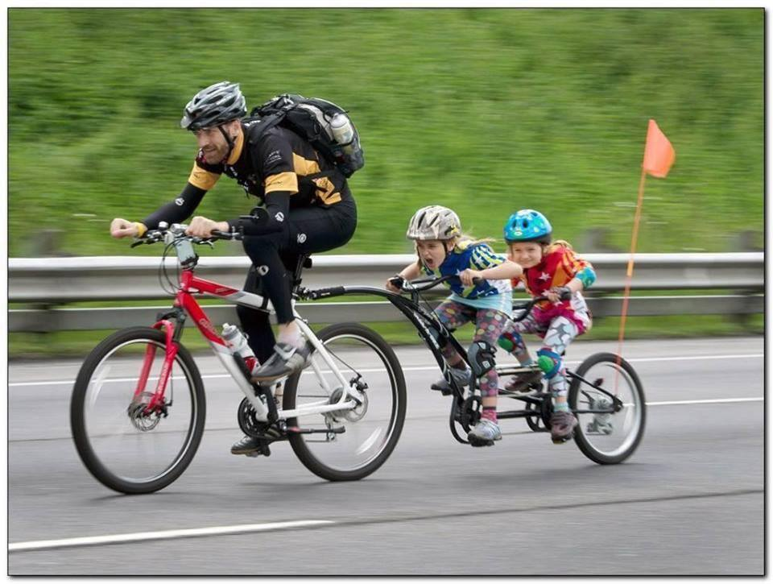

> Thrilling fun for the whole family!



    サイクリングッ！！
    December 10, 2013  · 
    【世界のサイクリング風景から　001】
    とあるイタリア人一家のサイクリング風景。
    なんですが、す、すごいっ！！
    なんという疾走感！！
    かっこ良過ぎます！！
    真ん中の女の子の表情なんて、
    スプリント中のプロ選手のそれですよね！？
    自転車を楽しんでますね～！
    もし近所でこんな送り迎えの風景を見かけたら、
    ビックリするだろうなぁw
    危険だとかいろいろと言われそうですが、
    日本でもこんな風に家族で自転車を楽しんでみたい！
    みなさんも家族で自転車に親しまれてますか？
    ファミリーサイクリングの思い出、教えてください！

