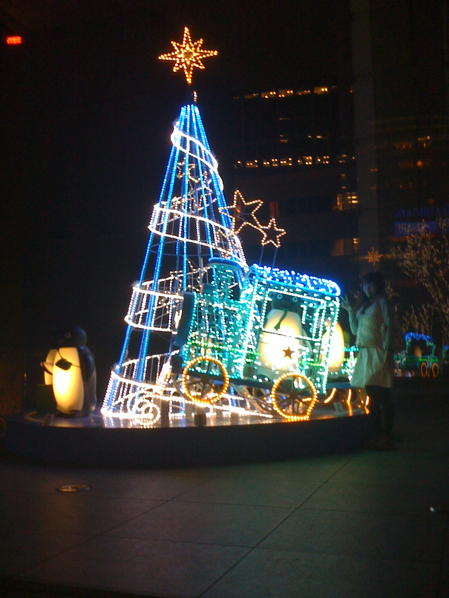

 Every December, near the South Exit of Shinjuku Station, is a plaza that is well decorated with lights. This is a great place to visit and pick up some Star Bucks coffee and Krispy Kreme donuts! Enjoy the pictures below...
 
 

 

 

 

 
 
 BTW, I took all these photos with my iPhone4 camera... So the quality is not as good as my Canon G9.