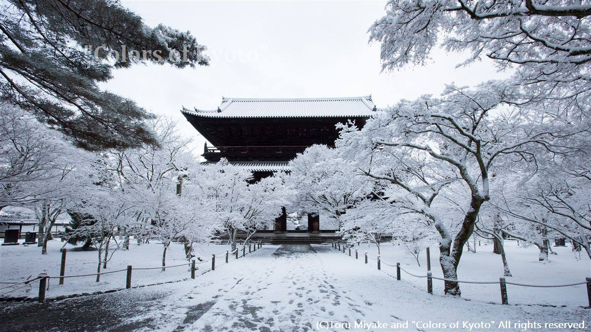



きょうのいろ　 "Colors of Kyoto"
January 20, 2014
昨日の南禅寺。
(Nanzen-ji temple,Sakyo-ward,Kyoto city,Japan)
昨日は京都市でも、割合南のほうまで積雪があったそうです。
京都では、雪の日は非常に貴重なため、
いつも「ここを撮っていていいのか」と迷います。
終わってからも、あそこに行けばよかった、
と反省することしきりです。
この眺めがどんなに素敵だったとしても、やはり、思ってしまいます。

