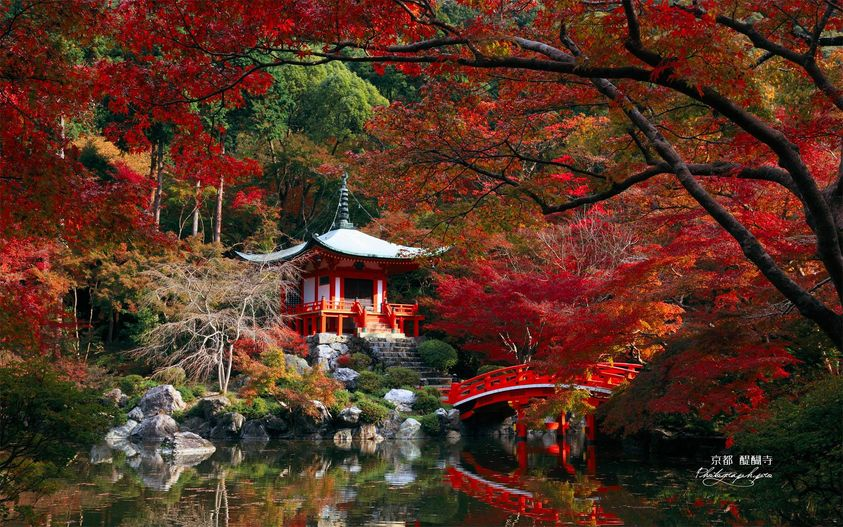



    November 27, 2013  · 
    Autumn has arrived at Daigo-ji Temple in Kyoto, decorating the National Treasure of Japan with red leaves and an absolutely mystical feel.
    The five-storey pagoda at Daigoji temple was built in 951 and is the oldest building in Kyoto.

