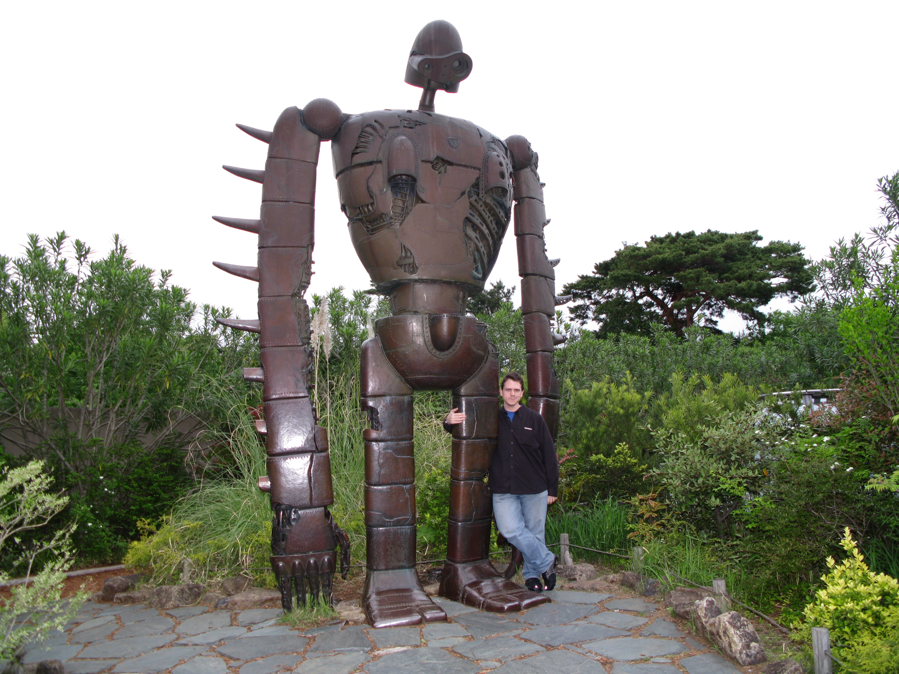

My visit to Ghibli Studios Japan (museum)...

If you are a fan of any movie/anime ever produced by Hayao Miyazaki, then this is **THE** place to see. This place is more like a theme park than museum. One can easily get spirited away with the very clever puzzles and architecture. Even the little cafe has Ghibli films' themed foods! I particularly enjoyed the Laputa robot on the roof in the middle of a gorgeous garden. 

It's easy to spend a good day browsing around this place. Miyazaki has a long history of outstanding films. Let your inner-child enjoy the day. Be warned, the tickets are sold by advanced reservation only. So, try to pick up your tickets a day or two before going in.

Visit http://www.ghibli-museum.jp for more details.
