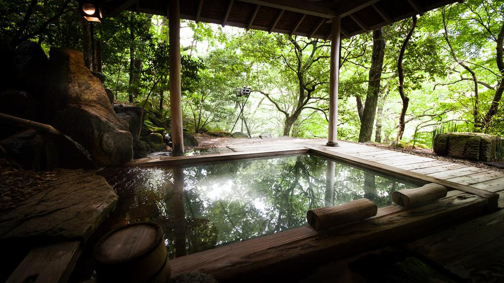



February 22, 2014
【Hakone Onsen/ Kanagawa】
As you know, Onsen (hot spring) is one of the biggest Japanese culture and if you are interested in that, Hakone is a must to visit. You can totally refresh your mind and enjoy Japanese food. You also can try to ride a rope way there. If you are lucky, you could see beautiful Mt. Fuji from the car. 
MATCHA - JAPAN TRAVEL WEB MAGAZINE
English ⇨ http://mcha.jp/en
Japanese ⇨ http://mcha.jp/
Korean ⇨ http://mcha.jp/kr


 

