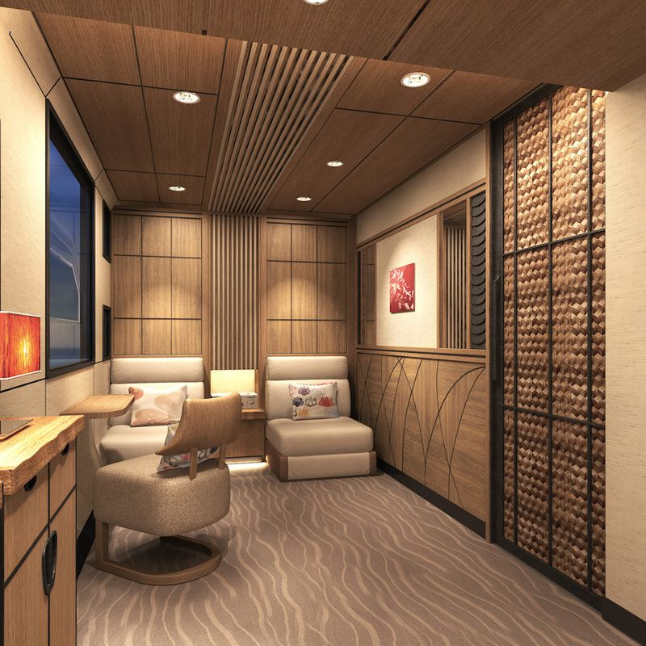


WOW
乗りたい


*The design looks more like an upscale hotel than an Amtrak car.*

Japan is already a global leader in train technology, so it would only follow that they'd be lapping the rest of the world in train design, too. Already, the country has produced [gorgeous fleets](http://www.core77.com/blog/transportation/from_retro_to_futuristic_to_super-luxurious_the_unusual_train_designs_of_eiji_mitooka_25606.asp) of luxury trains with chic, retro stylings. Now, Japan's JR East railway company has commissioned a new luxury train, the Cruise Train, which will be a way for Japanese one-percenters to check out the country in style. The opulent transport, which will cost about $50 million to develop and seats 34 people, will begin running in 2017. *All images courtesy of the East Japan Railway Company.*



