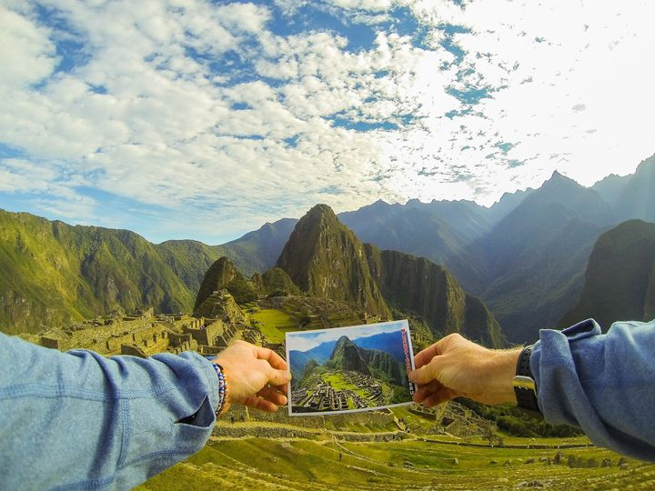


August 21, 2014
What's better than getting a postcard? Living it. Mark Garonzik hiked the Salkantay Trail to replicate a postcard view from [Machu Picchu](https://en.wikipedia.org/wiki/Machu_Picchu).
