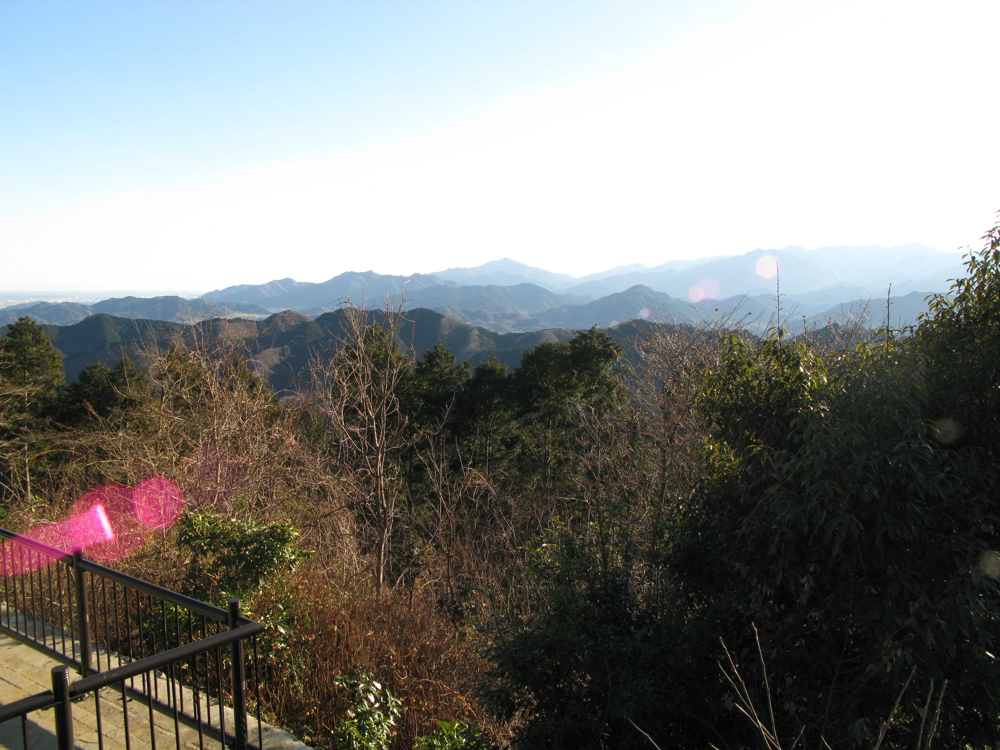
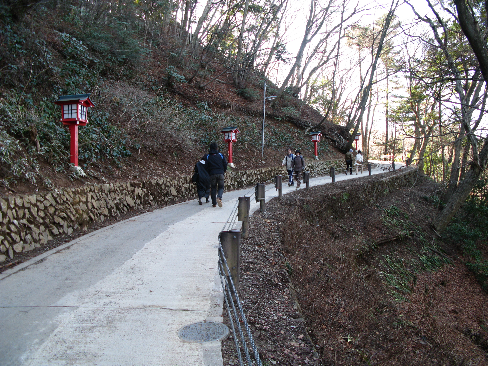

If you love the city, but also enjoy hiking: Mt. Takao (高尾山) is the place to go!
 

I have been to this place twice in my year-and-half time here in Tokyo. This Winter, I plan to go back and try capturing some pictures of the landscape covered in snow. This depends heavily upon this year's weather. 

While not a difficult hike, some basic gear is recommended. I took a liter of water and wore my good hiking boots. It's also a good idea to check the weather reports for rain. I can tell you from experience that rain does not make hiking fun... 

Anyway, this is one "mountain" that is within the Tokyo metro area and easy to reach with an hour train ride.

For more info, visit http://www.japan-guide.com/e/e3029.html .
