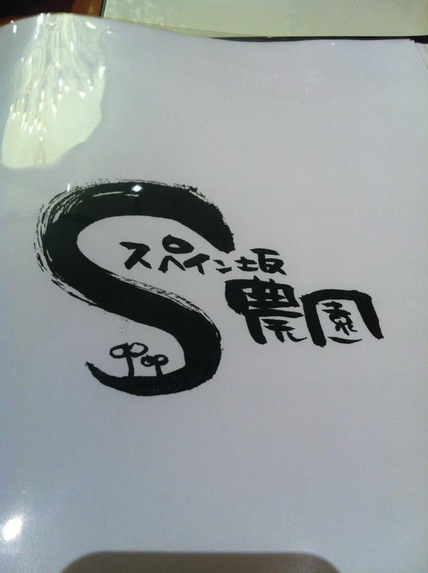
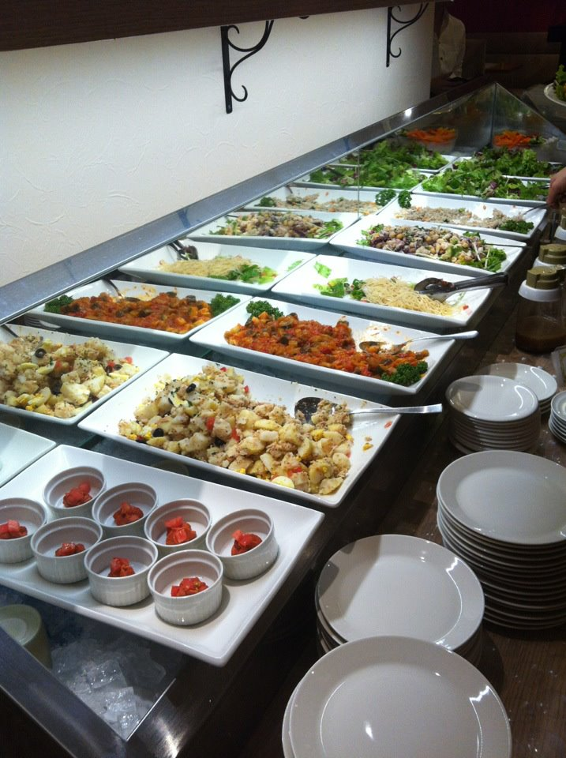

 Place: 宇田川カフェ別館 (35.662010494855, 139.69745685329)
 
 
 美味しぃぃ ビュッフェ！ ランチタイム 70分で1380円 安い！ 野菜たっぷり バー や カレー や ドリンク があり サラダある。 でも、 一つ悪くポイント：タバコをひいてる人がいれば、タバコ臭いなれる。 タバコ場所は別部屋では無い。みんなにご迷惑するね。 :'(

 
 
 
 
