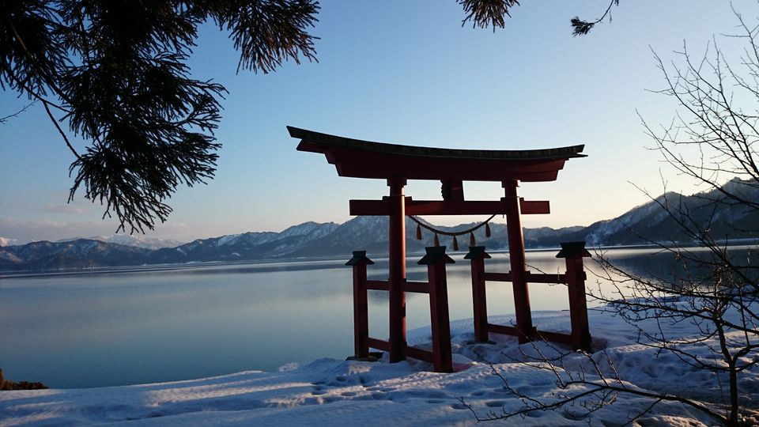

To reach **Gozanoishi**, I scrambled down a low snow-covered embankment, with the grace of a newborn three-legged deer, nearly falling over as I slid down on unsteady legs. It was a performance enjoyed by my three companions, who had a hearty laugh at my expense.  The view from Gozanoishi, where a **large red *torii*** was now partially covered in **brilliant white snow**, was well worth the clumsy comedy routine I performed to get there.

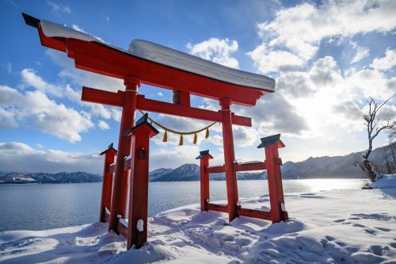

It is little wonder that when Lord Yoshitaka, who once ruled Akita, came to survey his lake, this was the spot he chose to enjoy the view. On the opposite side, snow covered **Akita-Komagatake, one of the highest peaks in Akita Prefecture**, rises into a shroud of mist. To the south, brilliant sunlight pours through the clouds, eventually falling on the impossibly blue lake, the deepest in all of Japan.

## About the Tazawako Area (Semboku City)
**Tazawako**, or *Lake Tazawa* is a modest sized lake in Akita Prefecture in the Northwest quadrant of Honshu, Japan’s main island. **Akita Prefecture is a well kept secret for tourists who love snow sports** because the powder snow that falls here each winter is considered some of the best in the world. Many foreign tourists travel farther north to better known Hokkaido to ski or snowboard, leaving the slopes at resorts like Tazawako Ski Resort largely uncrowded.

The fact is that Tazawako is easily accessible from Tokyo by the **Akita Shinkansen** line, which delivers you in comfort to Tazawako in just 3 hours. All the while, you can enjoy the view as you speed through the Tohoku countryside into an area of Japan that is largely unexplored by foreign tourists. In 2005, Tazawako was merged along with several neighboring towns and villages to form the [Semboku city](https://semboku-gt.jp/en/) area. Besides the lake, Semboku contains **several famous *onsen* hot springs** areas and the **well preserved *samurai* town of Kakunodate**, nationally famous for its spring cherry blossoms.

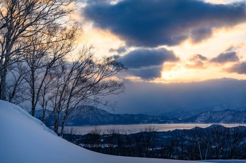

The lake itself was formed by a volcanic eruption and is 423.4 meters deep, the lowest point being well below sea level. The depth of the lake ensures it is impossible for it to freeze over in the winter. It also has no natural outlet and the hot spring waters from nearby Tamagawa onsen have made the water too acidic to be used for agricultural irrigation. That water has also contributed to the slightly cloudy quality of the lake which limits visibility to only a few meters in depth.

## Touring the Tazawako Lakefront
In the middle of winter, with frozen roads and sub zero Celsius weather, my companions and I toured Tazawako by car. Tazawako is not a large lake; in good weather conditions you can drive around the whole lake in about half an hour without stopping. But the whole point of driving the Tazawako lakefront is stopping: to enjoy the view, learn a bit about the history of the area, which is now stuff of legends, and of course, enjoy the local shops and eateries.

Our first stop was Gozanoishi, site of the red torii, and just a few meters up the hill on the opposite side of the road, the Gozanoishi shrine. The shrine was erected on this site in 1911, but the buildings are far older, having been moved from former locations twice before. Though three centuries had passed since Lord Yoshitaka relaxed on the lake shore and enjoyed the view of his backyard, he had apparently visited the shrine before at a former location.

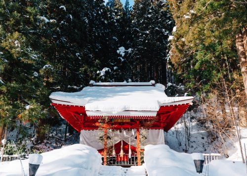

Around the site of Gozanoishi, there are several other locations that are part of Tazawako’s legendary past, often relating to Tatsuko, whose statue we would later visit on another part of the lake. Tatsuko was a girl of incredible beauty who desired that she would stay beautiful forever. She prayed at a particular shrine for 100 nights, and received instructions from a god that she should drink from a sacred spring. After searching the mountains for the spring, she finally found it and took a sip. But she was so thirsty, she kept drinking and drinking, mindless of the fact that a large storm was forming overhead. She was temporarily blinded by the lightning from the storm and when she could see again, she realized she had been transformed into a dragon. As a dragon, Tatsuko lived in the lake and became its protector.

Around this area is the **spring of Katagashira** where Tatsuko was instructed to drink to preserve her beauty. There is also the **Mirror Stone**, a rock which Tatsuko was said to have used to apply her makeup. On the site of the shrine itself, a smaller statue of Tatsuko was erected, this one in a contrite pose with a sad expression, representing her regret for chasing after vanity.

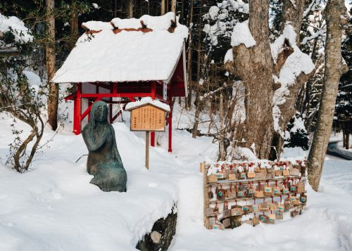

Heading south (counter-clockwise) along the lake front, we come to the **original statue of Tatsuko**, a striking gold figure standing out against the blue lake and skies.


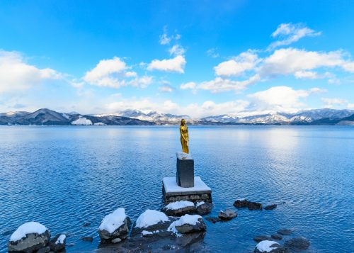
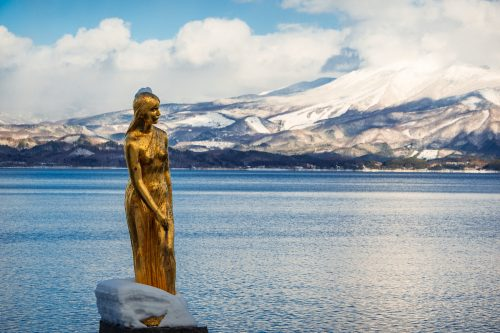


To the right side of the Tatsuko statue, the cute Kansagu Shrine sits at the end of a bridge right on the water. In the Spring it is flanked by lovely white blossomed cherry trees.

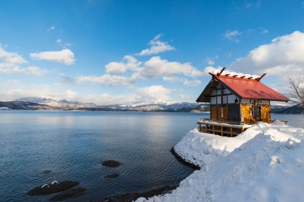

## Tazawako’s Warm Weather Activities
Though Tazawako is clearly lovely in the winter, the warmer seasons open up a host of other options for touring the area that are not available in winter. The relatively small size of the lake makes it a perfect size for cycling around and fortunately reasonably price bicycle rental is available nearby, from leisurely cruisers to speedy road bikes.

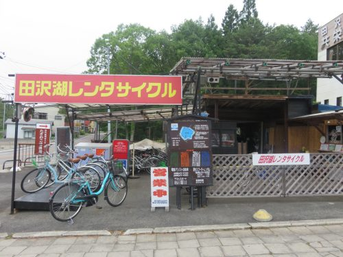

Besides the lake, there are plenty of courses from beginner to advanced, on which to ride in the Semboku area. There are mountainous roads for more advanced riders and leisurely flat routes along scenic rivers and rice paddies suitable for families. Route maps are available from the [NorthTime Bikeway webpage](http://northtime-bikeway.com) or pick up a hard copy at one of the local tourist information areas.

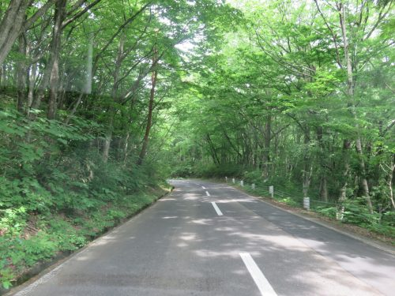

If you prefer to be on the water, there are also many options to tour the area by boat. Canoeing and kayaking experiences are available through [Tazawako Outdoor Tours](http://tazawako.net) from late April to early November. If you prefer to tour the lake without exerting yourself, a pleasure boat makes a 40-minute round trip tour from Tatsuko statue during the same time period.


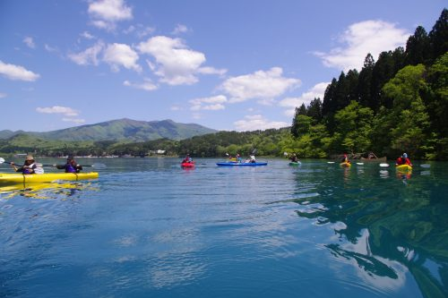
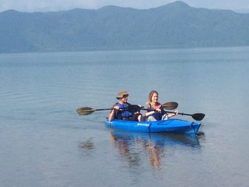


## Tazawako’s Surprises
In the large Japanese cities like Tokyo, the march of progress quietly takes its toll on the world around us. Seemingly overnight, plum tree orchards become housing tracts. Grassy fields become supermarkets. Historic buildings, full of character, are demolished to build modern, generic ones. One of the pleasures of visiting the rural areas is the persistence of history, often in the form of older buildings that have been preserved instead of destroyed.

Omoide-no-kata Branch School is one of these places, suspended in time but not without purpose. This former elementary school has been repurposed as a museum and community event center. Several of the classrooms are maintained in their original design, providing a glimpse into a nostalgic era of Japanese history. Though the building was closed the day we visited, the charm of the building was evident even from the exterior.


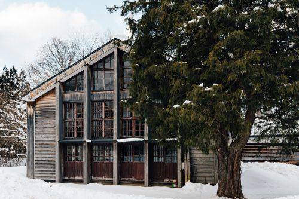
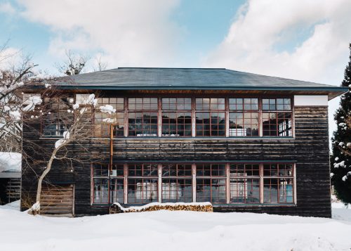


Around this time my companions and I were getting hungry for a snack, and what better snack on a wintery day than…ice cream! Okay, we did not go in search of ice cream, but the Ya**ma no Hachimitsuya** (Mountain Honey Shop) had a delicious sounding honey soft cream, so we went for it. The soft cream comes with a little chocolate bee, but if you roll an ‘8’ on the eight-sided-die they give you, you get eight bees instead of one. Guess who got lucky?

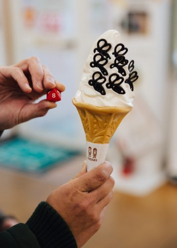

The shop maintains hives near Tazawako Ski Resort, so this is true local honey. There are a variety of honey flavors and honey and vinegar drinks, which taste better than it sounds. There are also honey-related health and beauty products. Best of all, tasting almost anything in the shop is free and the friendly staff is happy to help you find something that you can enjoy.


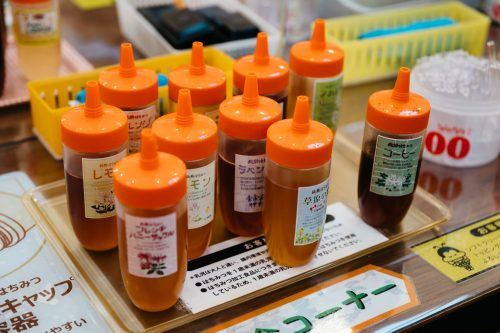
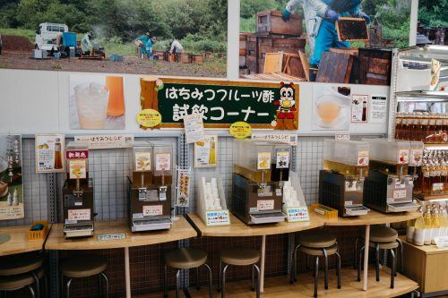


A trip to the Tazawako area is best done in tandem with a visit to Kakunodate, the nearby former samurai town that has been well preserved, or if you enjoy nature or sports, a day or two at **Tazawako Ski Resort** for winter sports or warm weather trekking. Either way, experiencing this lesser-known part of Japan’s great north will be worth your while, all the more so because of the convenient travel from Tokyo.

## Getting to Tazawako
**Tazawako Station** is just under 3 hours from Tokyo Station by *Komachi bullet train* on the Tohoku/Akita Shinkansen line. If you have already purchased a JR Rail Pass, this route is fully covered by the cost of the pass. With that in mind, how could you pass up an opportunity to visit lovely **Semboku** in **Akita Prefecture**?