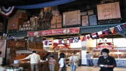

  Once again, I have bought a return ticket to  childhood! It's been six months since my last visit to Disney. I had  hand-made my very own Micky Mouse [Jinbei](./Tokyo-Disney-Sea-September-2011/http://en.wikipedia.org/wiki/Jinbei) for the intent of wearing it for my next Disney visit. This time, I  decided to check out Disney Sea. I was told that there are more shows  than rides. So, my expectation was set low for the jet coasters assuming there were any. This year, Disney Sea is celebrating it's tenth year of  childhood fantasia and aspirations. Disney Land is right in front of  the train station. However, Disney Sea takes a longer ride to reach. 

  So, I picked up a full day pass on the Disney  monorail. I had previously promised myself to ride this at least once on  my previous visits. I liked the unique design and very comfortable  benches. The benches wrapped around to enable families to sit facing  either a window or sitting forward. The train looked to be very kid  friendly. The only issue I had was the ceiling. It was too short for a  big kid like me to wear my Mickey magic hat and stand too. I thought the  Mickey-shaped windows were neat. They allowed a grand view of the play  grounds for which we all come to enjoy.

 

 
 Upon exiting the Monorail station, you are greeted by  a statue of the Hero of childhood dreams: Mickey. Weekdays are  definitely the best to go. Especially, when there are no adjacent  holidays during the week and the forecast suggest the possibility of  rain. This minimizes the crowds and the waiting times for each ride.  Similar to how DisneyLand opens the park with shops full of trinkets to  remind you of these dreamy days, Disney sea opens with a grand display  of a rotating globe and Disney friends over a pool of dancing waters.  Following this display, the shops lead you to the central lagoon where  the "Fanatasmic" show promises exciting fireworks and fantastic  performances by all the beloved characters.
 
   Every step of the way, there's always a playful smile from Mickey and  his friends. Today, the press was there and asked to take a few  photographs of me in my outfit. The entire theme was Mickey, Mickey, and  more Mickey mouse. The jinbei and Mickey Magic hat definitely had their  attention. Of coarse, the jinbei is a one-of-a-kind. It can't be found  anywhere but with me. I'm sure I had many people wondering where I  bought it. If they only knew that I made it myself!
 I captured this  excellent display in one of the shop's windows. I love how it shows  Mickey at the center of it all and magically bringing his friends  together.
 
 I liked how they used the lights to  swirl around Mickey as though he were casting a spell. After passing  through the shops, I found a crowd amassing in front of the lagoon. It  appears they were waiting for the next big show to start. Looking at the  schedule, I really didn't want to wait 40 minutes for the show to  start. So, I decided to see if I can catch a few rides. It was still  early... I didn't want to spend half the day in lines waiting. This is  where the [fastpass](./Tokyo-Disney-Sea-September-2011/http://www.tokyodisneyresort.co.jp/en/tds/guest/service/fastpass/index.html) system  is perfect. I can grab a pass for a long waiting ride and catch a  short-wait ride or show. 
 
 While walking my way  around the lagoon, I found Pinocchio and his father greeting all the  "kids." I just had to have a photo. 😉 Thinking forward, I wondered  where I would find a buffet. Surely if Disneyland has a buffet, then  Disney Sea would as well. As I continued around the lagoon, I kept an  eye out for such a place. It wasn't lunch time yet, but I wanted to know  where I would need to return once I found it. 

 Exiting the lagoon, I found myself at the "Mysterious Island." There are 2 big attractions here: <a href="http://www.tokyodisneyresort.co.jp/en/tds/atrc/mysterious/center/index.html">Journey to the Center of the Earth</a> and <a href="http://www.tokyodisneyresort.co.jp/en/tds/atrc/mysterious/m20000/index.html">20,000 Leagues Under the Sea</a>.  I noticed they have these interactive displays of different Disney  character statues where you could wave a wand and place your hand on a  sensor. Depending on which you used (wand or hand) would determine the  sound and lights on the display. I thought this was a neat idea. I  didn't have a wand, but I saw a kid wave his at the statue. The wand  looked like one I saw in one of the shops. I grabbed a fast-pass for the  Leagues ride and continued exploring around the area. 
 
 The fastpass was vaild for a couple of hours. This would be  plenty of time to find something else to entertain myself. While  wondering around, I thought I would check out the shops along the way. I  started looking for things that I could add to my outfit.


 
 
 


 I found my way towards the "Port Discovery" area. It didn't take me long to find a very short 5 min long line for the <a href="http://www.tokyodisneyresort.co.jp/en/tds/atrc/discovery/railway/index.html">DisneySea Electric Railway</a>  ride. I didn't know where the train went, but I didn't really care  either. The train had only 2 cars and could seat about 20 or so people  per car. It was designed to be sat in so there was no standing area  on-board. The ride proved to be a good way to see half the park and get  an idea of what attractions to see later. I noticed a long line for what  looked like a show next to the "bumper boats." I figured I may check it  out depending on my time. I saw what looked like bumper boats and  definitely wanted to wreck some havoc on the waves. 
  I also saw the cruise ship "Columbia" and was curious to see what they  kept inside. The ship is about 4 decks tall with 3 smoke stacks. I could  imagine that it would have a dining hall on-board. I would certainly  take a look at it later...


 
 


 After arriving in the "American Waterfront" area, I was just in time to catch  some more Disney friends coming out to roam the park. First came out  Stitch. Followed by Goofy and Winnie the Pooh. Plus Pooh's friends  Rabbit, Eeyore, and Tiger. A small parade quickly formed as nearby kids  gathered at the sidewalks to wave at their favorite characters. 
 Of  these characters, I'm fond of Goofy and Pooh the most. I have typically  related myself to that of a bear. More specifically a "polar bear..."  I'm "white" and harry and love snow and cold weather. Plus, I could eat  sushi all day long. I'm not a bad swimmer either. Does that not sound  like a polar bear? ;-)

 
 Walking about the American Waterfront, I found a huge line  for a "Big Band Beat" broadway type of show. Again, I didn't feel like  waiting in such a long line. There was no fastpass option for it as it  was on a set schedule. Although I had some interest... I wanted to focus  on the attractions more than shows.

 

 It  was getting close to lunch time - about 11:30am. I figured that I would  start looking for the buffet that I knew must be around _somewhere_!  After passing by the "Tower of Terror," I found what I was looking for!  The buffet was called "A Table is Waiting..." What a curious, if not  long, name.  (Also known as the "[Sailing Day Buffet](./Tokyo-Disney-Sea-September-2011/http://www.tokyodisneyresort.co.jp/en/tds/rest/waterfront/sailing/index.html)")  Nevertheless, I strode up to the sign and found all the pertain  details. The buffet was an "Unlimited" all-you-can-stuff-in-your-face service. And for a reasonable price of 3000 Yen. (That's about $30  Dollars.)  

 
 It's a Disney meal with a Disney  price. But it comes with that famous Disney quality! I told myself not  to stuff myself. Instead, simply take my time and get only one plate at a  time. This way, I force myself to get up for the next plate. I have to  get some exercise somehow. :) 

 I started with a simple plate of  "salad" and followed it with the main course. 
 
 I  wanted to sample a little of everything! The menu had a vareity of  foods. Just like last time, I brought some ziplock bags for my "leftover  treats." I made sure to have enough for ... err, Goofy. Yeah, I need a  doggy bag too. 😉 I prepared two plates for my "to-go order." My  doggy-bag included some rolls, shrimp tempura, chicken nuggets, and  takoyaki (with no sauce). I had enough to snack food to last the rest of  the day. Since I'm by myself, I can not leave the line without losing  my spot. None of the lines have vendors, so you can't buy food or drinks  while standing in line. It's very convenient to have a snack ready  while standing in a long line.


 
 
 
 
 
 

 
 Here's the menu (that I could remember):
  
- Salad Bar:
    - Oranges
    - Apples
    - Assorted Fruits
    - Cabbage
    - Iceberg lettuce
    - Corn (for topping)
    - Assorted dressings
    - Potato Salad
    - Tuna Salad 
- Sushi Bar:
    - Inari with ikura
    - Tamago (eggs)
    - Cucumbers
    - Fish cakes
- Carving:
    - Roast beef with onion sauce
- Breads:
    - Butter rolls
    - Croissants
    - Biscuits
    - (optional butter)
- Soups:
    - Minestrone
    - Onion
- Hot Plate bars:
    - Chicken “nuggets”
    - Spaghetti (tomato sauce and pesto sauce)
    - [Yakisoba](./Tokyo-Disney-Sea-September-2011/http://en.wikipedia.org/wiki/Yakisoba)
    - Rice
    - Hot sauce (like Picante)
    - Tortillas (to build your own soft-tacos/burritos)
    - Chicken strips
    - Shrimp Gratin
    - [Takoyaki](./Tokyo-Disney-Sea-September-2011/http://en.wikipedia.org/wiki/Takoyaki)
    - Yaki-onigiri (fried rice shape) that looks like Mickey
    - Build-your-own mini-burgers (buns, meat with cheese, sauce, and lettuce)
 - Desert Bar:
    - Jello
    - Anko (Japanese sweet beans)
    - Apple pie
    - Chopped sweet fruits
    - Chocolate Tiramisu
    - Cheesecake
    - Vanilia sponge cake
    - Something resembling an Éclair (whipped cream and blueberry filling)
 

 
 
  Remembering my fastpass to the Leagues ride, I  stuffed my backpack and bolted for the door. I had only 10 minutes  remaining before my pass expired. I quickly figured out my route using  my overview map of the park. This time, I didn't stuff myself but I was  satisfactory full. I estimated that I could walk quickly and still make  it in time. After all, it's not a good idea to run on a full stomach. I  took a shortcut through the west side of the Mediterranean Harbor. I  made it to the ride with a minute to spare. The fastpass line was only a  5 minute wait. I recalled riding something similar to this as a child.  It was a submarine ride that actually went under water. Very cool.  However, Disney Sea's version of it used clever lighting and simulated  water to produce the effect of riding under water. The glass was thick  and concave. Plus, it was filled with water. At least it was nicely air  conditioned. I do love the cold temperatures. I imagine this ride was  designed for younger kids. No less, I chose to enjoy it. Upon exiting  the ride, I saw a ferry boat touring the area.

 
 Next, I decided to head towards the Arabian Coast section of  the park. I found another interactive statue with Ariel the mermaid  nearby the entrance to this part of the park. I saw they had an  attaction called "[The Magic Lamp Theater](./Tokyo-Disney-Sea-September-2011/http://www.tokyodisneyresort.co.jp/en/tds/atrc/arabian/magic/index.html)."  I picked up a fastpass and continued exploring the area. I've seen  carousels before, but never have I seen a two story (double decked)  carousel! I was tempted to ride it, but I wanted to manage my time for  the bigger rides. 
  
 Continuing my exploration, I  found the "[magic carpet](./Tokyo-Disney-Sea-September-2011/http://www.tokyodisneyresort.co.jp/en/tds/atrc/arabian/jasmine/index.html)"  ride. The wait was a short 10 minutes, but again I was looking for bigger rides. My impression of the Arabian coast is that it's mostly a  kids area. No less, it was beautifully built eye candy. I  did, however, find a mini-roller coaster called "[Flounder's Flying Fish](./Tokyo-Disney-Sea-September-2011/http://www.tokyodisneyresort.co.jp/en/tds/atrc/mermaid/flounder/index.html)"  that reminded me of my younger years. My fastpass for the Lamp show  still had another 20 minutes on it and this ride was a 10 minute wait.  So, I decided to enjoy some time on this little ride. It was neat!
 
 On my way back to the Magic Lamp show, I noticed the  fine print on my fastpass. It indicated the earliest time I could get  another fasspass. My timing was perfect. I stopped by the "Raging  Spirits" ride and picked up my fastpass! At this point, I actually had 2  fastpasses in my hand. Cool! The Magic Lamp show was a combination of  2D, 3D, and live action. I thought they blended it pretty well. Even if  the story a bit predictable, it was still enjoyable because of the  laughs and nifty 3D effects.
 
 Throughout my day, I noticed a number of  people that would stare at me. It might have been due to the fact I was  wearing my Mickey mouse jinbei, the Magic Mickey Hat, the Mickey hand  attached to my camera, and my new light-up Mickey figurine. Even in  Tokyo Disney, foreignors (外国人) still get attention of the Japanese. By  the expressions on their faces, I can see them saying "wow, that's a lot  of Mickey." Others, I could see curiosity in their eyes. Perhaps they  were wondering where I bought my outfit... Only a rare few thought that I  was nuts or crazy. One (presumably) Japanese guy asked me if I had just  woke up. Namely because the Japanese don't typically wear jinbei  outside. I didn't care. This was my day to be a kid.
 
 After circling the Arabian Coast once more, I saw they just opened the [SinBad](./Tokyo-Disney-Sea-September-2011/http://www.tokyodisneyresort.co.jp/en/tds/atrc/arabian/sindbad/index.html) ride. The ride is setup similarly to DisneyLand's Small world ride.  Aside from the different story, the ride's format was pretty much the  same. A boat that follows a rail while anima-tronics simulate a story.  Again, the air conditioning was great and the benches on the boat were  spacious and comfortable. 
  
 After sitting in a  boat ride, I thought I would head back to the Port Discovery area and  see if that "[bumper boat](./Tokyo-Disney-Sea-September-2011/http://www.tokyodisneyresort.co.jp/en/tds/atrc/discovery/aqua/index.html)" ride was what I thought it was. The line was only a 15 minute wait.  When I took a closer look, I realized that none of the "boats" actually  made contact. Further more, you couldn't control the direction or speed.  I was disappointed. I thought how thrilling it would be if we could all  just randomly bump into each other. Instead, each car follows a set  (pre-programmed) path. Nevertheless, I chose to enjoy myself. I even  took a few photos of other riders whom were lost in laughter. A couple  of ladies waved at me... Of coarse, I'm the only cute foreigner in a complete Mickey Mouse outfit. 😉
 After the bump with the computer controlled  "boats," I continued to explore the rest of the park. I checked out the  SS Columbia ship. It had a bar on the 2nd deck and a dinning room on the  3rd deck. The 4th deck was closed to the public. While visiting, I saw a  group get greeted by Mickey Mouse. I wanted to get a photo with  "Captain Mickey" but it was a closed party of sorts. I asked how I could  meet with Mickey and I learned about the [guided tours](./Tokyo-Disney-Sea-September-2011/http://www.tokyodisneyresort.co.jp/tds/japanese/guidetour/premiumtour.html) they offer.  Apparently, you need to reserve your tour at guest relations early in the morning. And for  upto 6 people it cost 21000 Yen (About $200). I thought that  would be awesome, but I would only do that if I had a couple of friends  to join me.

 
 Circling the park, I found myself back on the "Lost River Delta" section of the park. Unfortunately, all the fastpass machines had shutdown for the day and it was becoming nightfall. So, this meant that I had to wait in the hour long lines to reach the ride. I hopped on the jeep for the "[Indiana Jones® Adventure: Temple of the Crystal Skull](./Tokyo-Disney-Sea-September-2011/http://www.tokyodisneyresort.co.jp/en/tds/atrc/lostriver/indiana/index.html)" attraction. I liked the premise. A story-ride that isn't for little kids. The jeep will bump you around as you descend the steps of the temple. Keep your hands inside the vehicle if you don't want to feed the snakes. Towards the end, you'll see Indy escaping a giant boulder rolling towards him (_and you_)! Mind your eyes here, I was blinded for a minute by the bright flash of the camera lights.
 
 After refreshing myself at the nearby restrooms, I found the [greeting trails](./Tokyo-Disney-Sea-September-2011/http://www.tokyodisneyresort.co.jp/en/tds/atrc/lostriver/friends/index.html) for the three big Disney characters. I just couldn't resist getting a photo-op with these guys. Minnie just loved my outfit! Mickey Mouse jinbei, hat, hand (for camera), light-up figurine, and Fantasmic necklace. I was literally a big Mickey fan. Later, I stopped by Goofy's place to hang for a bit. Of course, no Disney-day is complete without a photo with Mickey himself. Unfortunately, while waiting to get my photo with Mickey, I missed the Fantasmic show! :( I'll definitely have to come back to check that out!

 
 
 


 
 Following my meeting with the stars of this dream land, I wandered my way back towards the center of the park. Where the "Mysterious Island" is located. By this point, there was only an hour left until closing time. I decided to find one more major attraction. The big ride of the park is "[Journey to the Center of the Earth](./Tokyo-Disney-Sea-September-2011/http://www.tokyodisneyresort.co.jp/en/tds/atrc/mysterious/center/index.html)." The line was about 70 minute wait. This is one where I wished I could have grabbed a fastpass. However, the line has a number of entertaining prop's to keep you from getting bored. This ride is similar to the Indiana Jones ride except that it's a lot faster. 
  
 There is still a story element to the ride, which is cool. Who wouldn't want to experience an unbelievable adventure that takes you towards the center of the Earth? Towards the end of the adventure, you race back to the surface in a thrilling roller-coaster like fashion that makes you want to ride again and again! 

  
 It's closing time... Slowly, I make my way as the day of dreams has finally come to an end. I have no need to vacate the park with the mass rush of people trying to catch a train ride home. I noticed how the park looks so different at night compared to the day. I just had to take a few more photos. While I believe life is best lived with the heart of a child, it's not everyday that you can actually act like a child. These are the days that truly make life a treasure to enjoy. While most have already exited the park, I couldn't resist dancing around the Mediterranean Harbor. While skip-hopping towards the exit, I found a few others behind me doing the same! Apparently, I'm not the only "kid" in town that likes to enjoy the essence of Disney.
 
 Before the bazaar of the main shops and on the center stage, I simply danced around. Twirling about on my heels and toes. I noticed in the hotel above that I had an audience. I danced a bit more before taking a bow and finally exit the park. I can only imagine what they were thinking. But best of all, I imagined that they wished to do the same! Few people simply take the time to actually be a "kid" and just enjoy. 

 This kid, will definitely be back. Until then, remember there is still a kid left in all of us. Give yourself permission to have fun!
  
