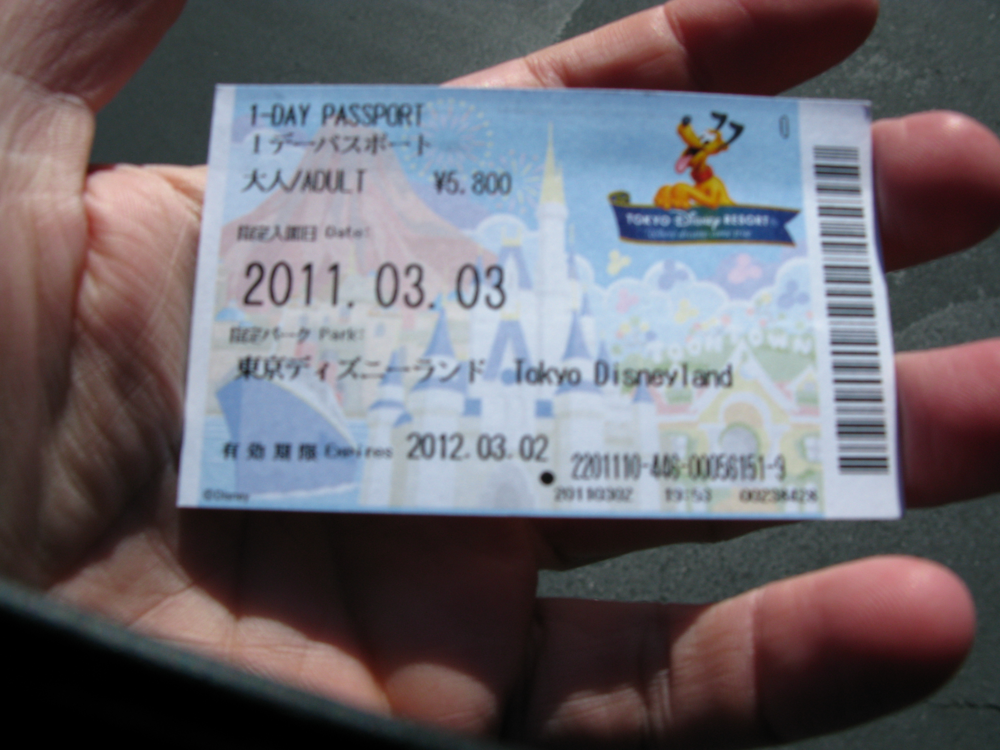
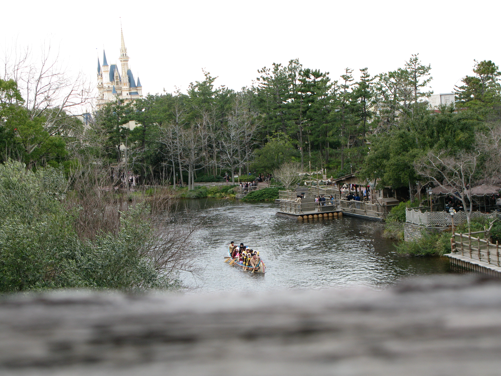
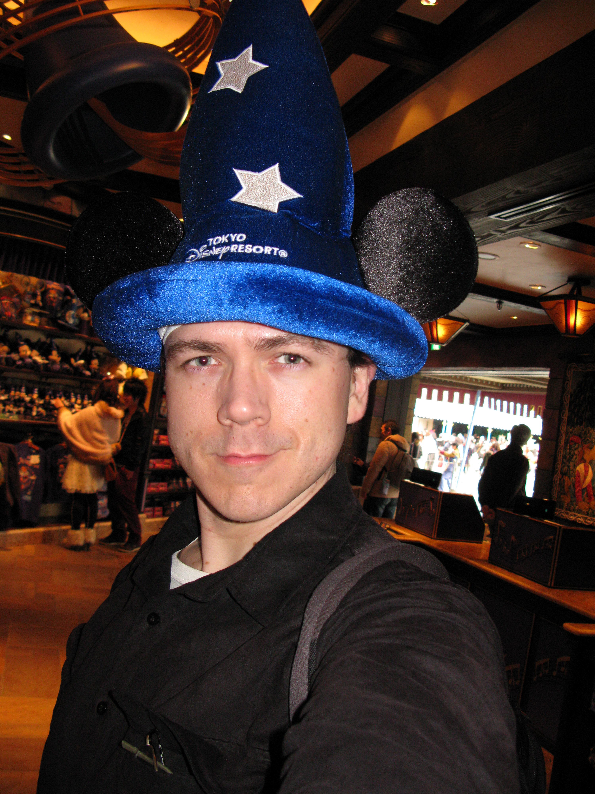
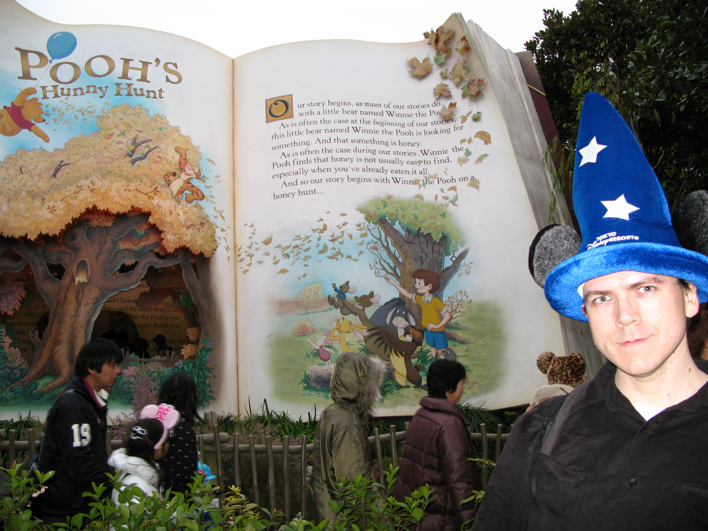
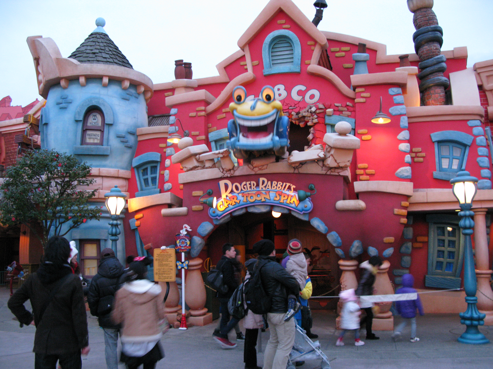
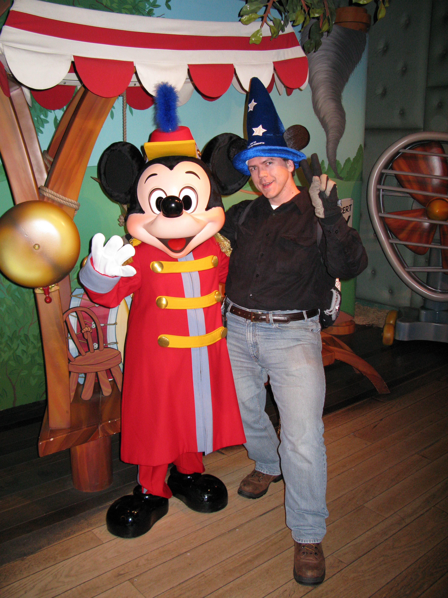
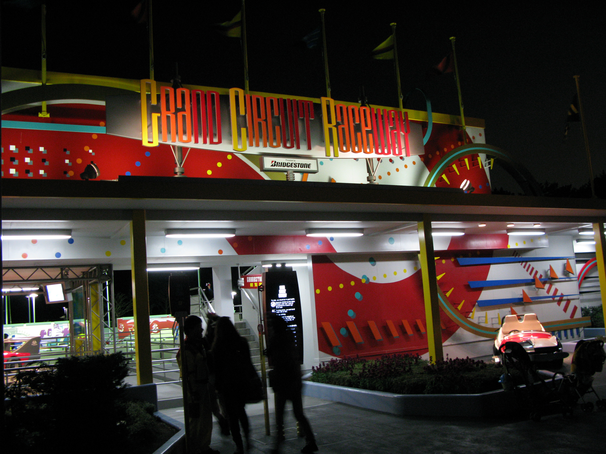
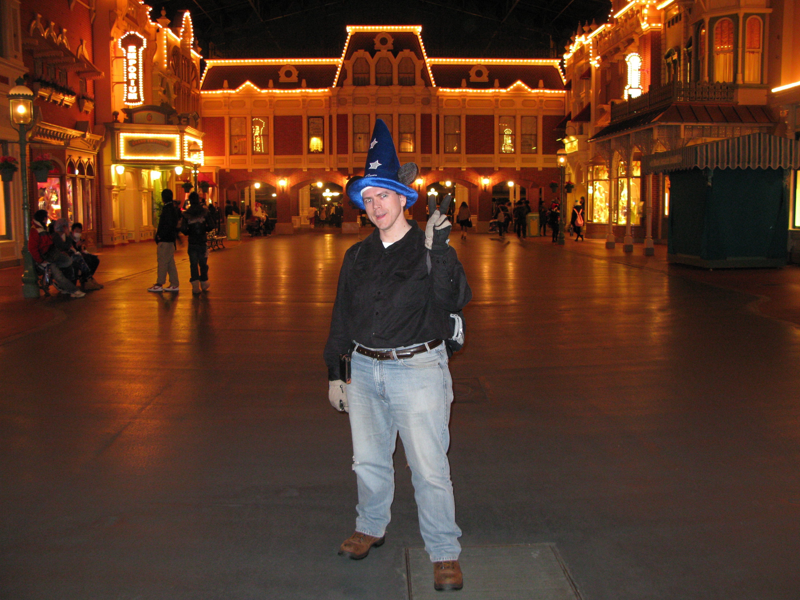

 

 Walt Disney had a dream that he wanted to share with everyone. In the words of Walt Disney on the opening day of Disneyland California (July 18, 1955):

 
  To all who come to this happy place; welcome. Disneyland is your land. Here age relives fond memories of the past .... and here youth may savor the challenge and promise of the future. Disneyland is dedicated to the ideals, the dreams and the hard facts that have created America ... with the hope that it will be a source of joy and inspiration to all the world.
 

 Indeed, a ticket to Disney is a ticket to be a kid for the duration of the visit. You are free to release all worries and forget (for a short while) the troubles of the world. For being a kid, means to <b>have fun</b>!! 😏
 

 This would not be my first time to Disney. As a child, I had visited Disney World Florida about 5 times! I loved it there! Unfortunately, the distance and cost of travel between Florida and Texas was a bit too much. However, Tokyo Disneyland is only 45 minutes by train from my home in 埼玉 [<i>Saitama</i>]!
 So, after sleeping in and getting a nice long hot shower, I began my journey to the joyful place to play out my childhood. I had intended to be at the gates before 9am when the park opens. But the child in me slept in. 😃

 I arrived at the park about 11am. Just in time for lunch. I knew of a buffet place called the Crystal Palace with a view of the famous Castle. Luckily for me, I came to the park on a cold weekday and the crowd was minimum! They accepted credit cards and the cost was a reasonable (for Japan) ２５００円。There was no line for me at the buffet. I promptly found my table and began the feast. The sign said <i>unlimited</i> buffet... I assumed that meant unlimited time as no one mentioned a limit on time. So, I slowly enjoyed the good selection of foods starting with soup and salad. The breads and main course entries were excellent. I practically polished my plates while the kids at the neighboring table were digging in. 😏
 The cute staff were quick to help with anything you needed. The dishes never piled up on the table and the food never stopped coming! After an hour of gorging myself, I decided that I should get some desert before my adventure through the park. I couldn't decide on what to enjoy for desert, so I just picked up a little of everything (small portions of course)... 
  Since I planned a bit ahead, I brought some ziplock bags to take some leftovers in. 😏 I wanted to minimize my food costs. So, just before leaving... I took a <b>Mickey</b> plate full of goodies that would last the rest of the day and stuffed three <i>doggie (Pluto) bags</i> of food.

 With a full tank, I began touring about the AdventureLand section of the park. I planned to see a couple of shows and enjoy 3 major rides. Anything after that was bonus!  I didn't want to do any exercise without a short rest. There were a few shows starting about this time. I choose the outdoor show: <i>Minnie! Oh Minnie</i>. I was pleasantly surprised by the quality of the live singing and the costumes. The show ran for about 30 minutes. The kid in me was just ready to run off all this extra energy, so I found my way to <i>Tom Sawyers Island</i> in the middle of the Adventure land.  This is the area where there are all kinds of caves, suspension bridges, hiding places... Just about anything to bring out the kid in anyone. And it's more fun if there are kids to play with too! I recall jumping up and down on a floating bridge. I had a huge smile on my face. I noticed a staff member watching from the far side of the bridge. Upon exiting, I told her in Japanese that "I'm an adult everyday, but not today..." She smiled and nodded at me. I had fun roaming about the caves that seem to go in every direction both above and below ground level. 

 It was getting pretty cold and decided to cross back over to the main AdventureLand. I decided to check out the shops and see if there was anything interesting. Indulging the inner-child, I picked up a Mickey Wizard hat. This also served as a means to keep my ears warm and the sun out of my eyes. 
 

 I started touring around the park looking for the major rides that I would enjoy. I wanted to ride the Big Thunder Mountain ride, but the line was 70 minutes long. I've rode it before, so it wasn't a big deal to miss it this time. I'm sure that I'll catch a ride on it the next visit.  My last visit completely missed ToonTown section of the park. So this time, I focused on the attractions in this area. :)
 This year's newest ride is "[Pooh's Honey Hunt](./Tokyo-DisneyLand-March-2011/http://en.wikipedia.org/wiki/Pooh's_Hunny_Hunt)." I decided to check this one out. The line was about 50 minutes long. I had to remind myself that this is probably the shortest wait time for any ride at the park. The Honey Hunt ride is quite interesting as there are no rails, cables, or restrictive roads for each car to follow. Rather, each car is independently controlled (via on-board computers) to dynamically take a route to follow the story line throughout the ride. I was very impressed by the choreography of the movements and how they seem to resemble a dance. 
 Later on, I decided to take a crazy ride around in [Roger Rabbit's Car Toon Spin](./Tokyo-DisneyLand-March-2011/http://en.wikipedia.org/wiki/Roger_Rabbit's_Car_Toon_Spin) in ToonTown. The props that entertain you while waiting in line are quite interesting. I remember the ["Baby" Herman](./Tokyo-DisneyLand-March-2011/https://disney.wikia.com/wiki/Baby_Herman) character speaking in an odd Japanese accent about the cops etc... The two ladies behind me mentioned that is was odd that a baby would hold a cigar and smoke... I gave them a brief history of the toon and why he disguises himself as a baby to escape the cops. They laughed at the idea of an adult dressing "down" as a baby in public. How odd indeed...😅

 Exiting the cab ride, I decided it was time to visit Minnie and Mickey's houses. I got lucky and found Mickey inside. So, I couldn't pass the chance (like any other kid-at-heart person) to get a photo with Mickey! Mickey was very light. I surprised everyone when I returned Mickey's hug with a bear hug of my own. Lifting Mickey off the ground like I would a child. Mickey was a bit startled but everyone got a good chuckle out of it. 

 By this point, the day was fast approaching closing time, 10 pm. I wanted to ride the Space Mountain ride, but the time was 110 minutes! So, I decided to relive my childhood cart racing days on the "[Grand Circuit Raceway](./Tokyo-DisneyLand-March-2011/http://en.wikipedia.org/wiki/Autopia)" ride. Fortunately, the wait was only 10 minutes. 😃 So, I hopped in a car and took a ride around the course. I even took a video movie with my camera for most of the ride. 😏 

 By the time I exited the ride, the nightly parade was already in progress. I didn't want to miss this.  I managed to find a couple of spots where I could get some good photos. I was surprised to see they had a float with roller skaters skating around on the street. As an avid skater myself, it's a joy to see. But in Japan, very rare to see anyone in public with skates.

 With a short time remaining, I hopped on the [Star Tours](./Tokyo-DisneyLand-March-2011/http://en.wikipedia.org/wiki/Star_Tours) ride like any other Jedi wanting to travel to Degoba. This is an old, but still fun, ride that simulates the Star Wars universe. The simulator gives you a sense of riding inside a space craft through a space fight and large comets. I was quick to jump on the Space Mountain ride just before closing. I remember this ride quite well from my childhood days. The only difference is that it doesn't scare me anymore. In fact, I choose to remove my glasses and try to keep my eyes closed so I couldn't anticipate the next curve of the track. This made the ride slightly more thrilling. 😃

 Upon exiting the last joy of the night, I slowly made my way towards the park entrance. Most of the shops had closed and were escorting customers out the exits. As I made my way down the Grand Bazaar, I just had to get one more photo. With that thought, I decided that I will return again. Perhaps, I'll visit the DisneySea side of the park. But until then, see ya next time. :-)

 