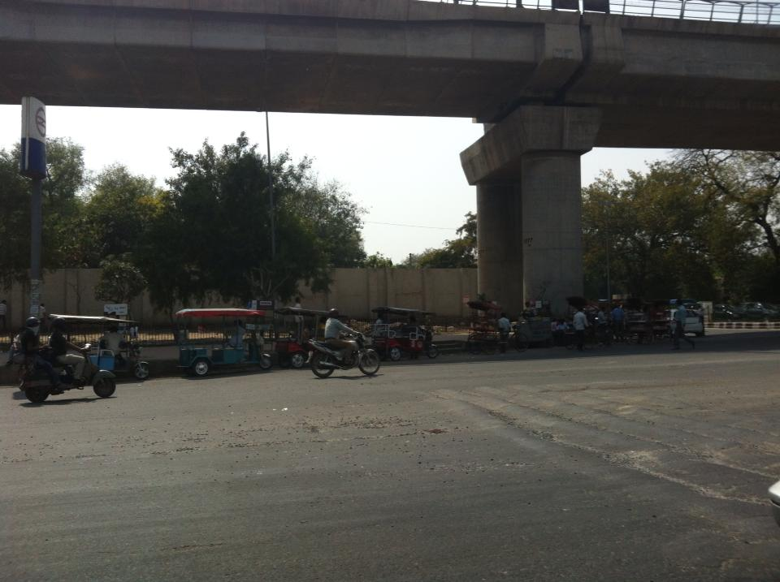
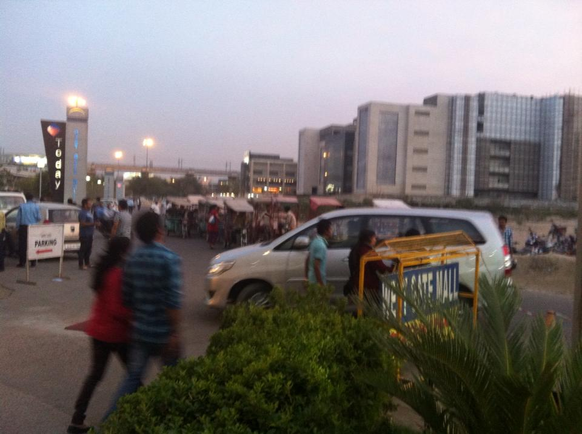

 On my way to India! This is for both business and sightseeing.

 Third-world country... This is my first time in India. Everyone is a crazy driver! It's hard to believe there are apparently so few major wrecks! Seems like the road rules are taken little more than as a suggestion. No one cares about the lights much less the painted lines on the road. I should be thankful that my accommodations have a working shower and air conditioner. Still having a time getting used to the strange smell in the air. Seems like the whole city smells like some type of curry.

 
 
 
 
 
 
 
 

 
 
 
 
 
 

 Looking around India and its rapid developments, I'm imaginging what the USA was like over a century ago. It's like time-traveling without using a worm-hole to traverse.
 
 
 
 
 
 
 
 
 
 
 
 
 
 
 
 
 
 
 
 
 
 
 
 
 
 
 
 

  One of the many things that surprised me was the level security they have at the mall. At all the entrances, you must pass through an invasive security search of your baggage and clothes. 
 
 
 
 
 
 
 
 
 
 
 

 

 
 

 
 
 
 

 
