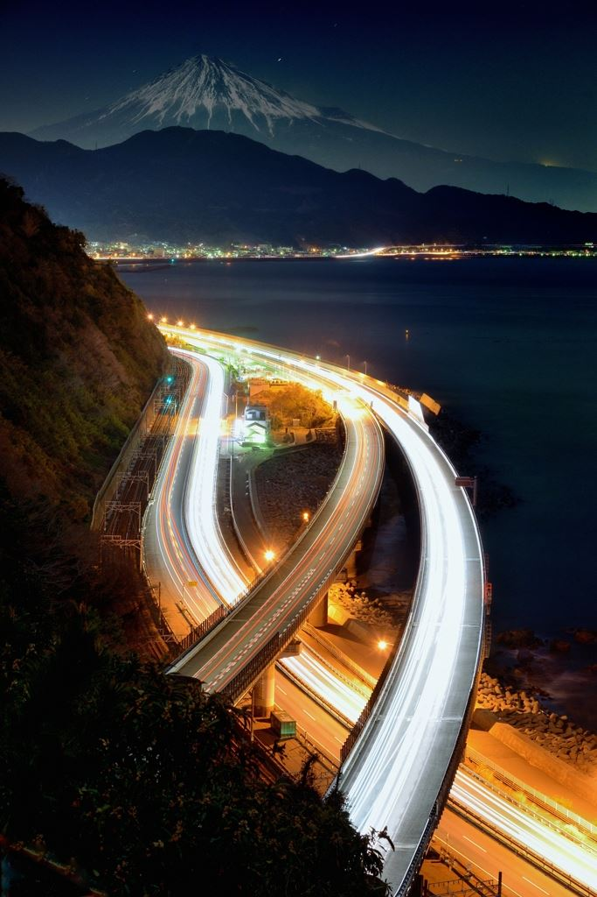



January 16, 2014
「white moonlight」　撮影：クリッパさん
http://photohito.com/photo/3067498/?cid=FB
静岡で撮影された、富士山と東名高速。
闇に浮かび上がる雄大な富士山と、長秒露出により近未来的な印象が増した高速道路の対比が印象的です。
[SS30、焦点距離65mm、f/7.1、ISO500]
by.写真共有サイト PHOTOHITO



