知恩院ちおんいんは京都市 東山区林下町にある浄土宗の総本山の寺院 山号は華頂山かちょうざん 本尊は法然上人像御影堂および阿弥陀如来像阿弥陀堂 開山は法然である詳名は華頂山知恩教院大谷寺かちょうざん ちおんきょういん おおたにでら. 八栗寺は香川県高松市牟礼町にある寺院です第85番札所 五剣山観自在院 八栗寺です.

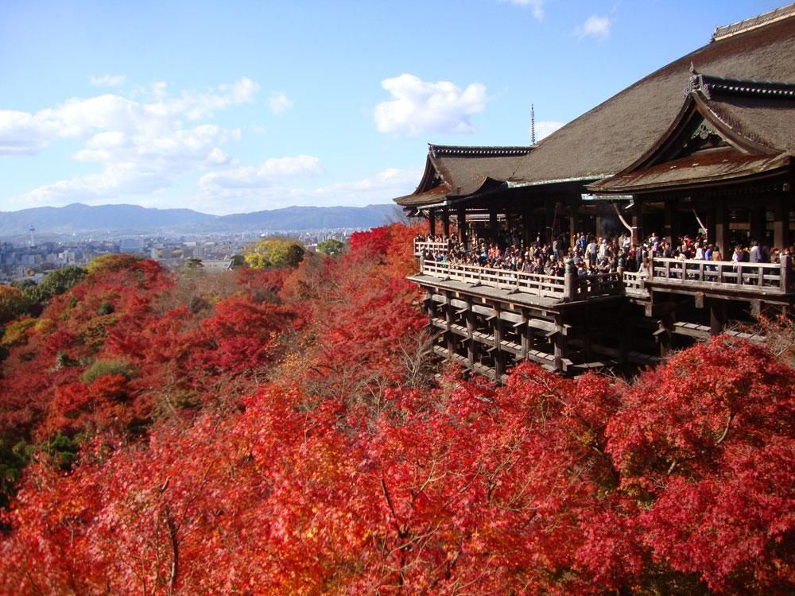

**602-8386 京都市上京区馬喰町 北野天満宮社務所**

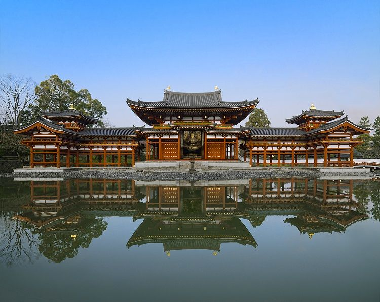
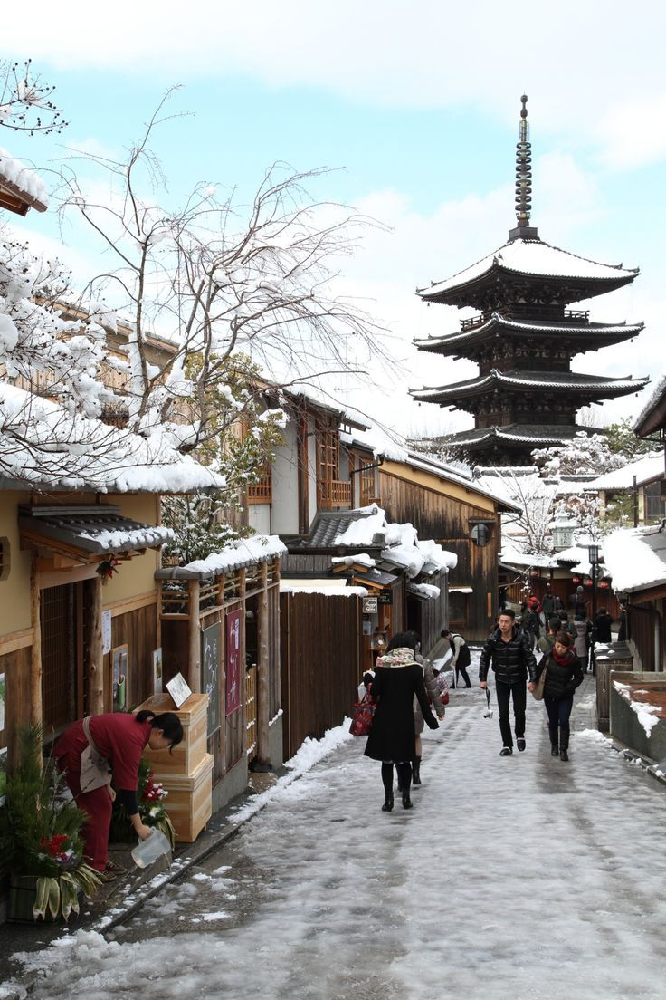
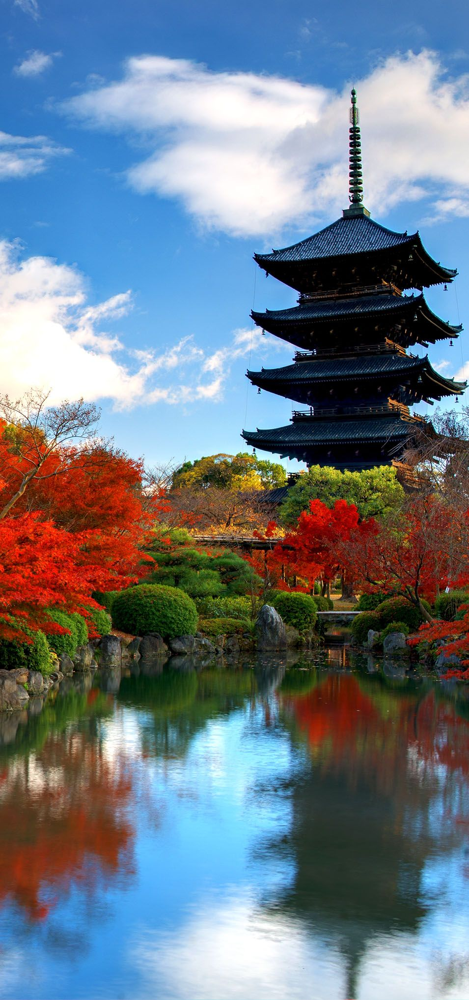
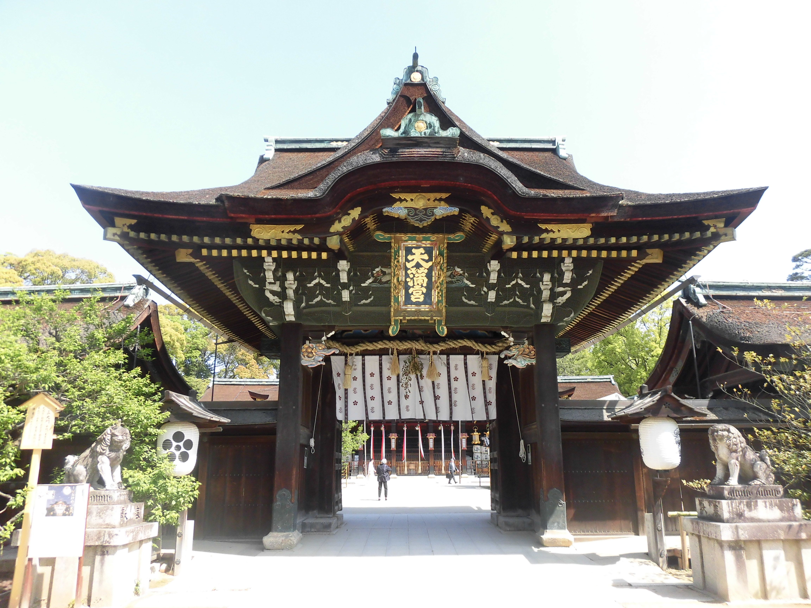
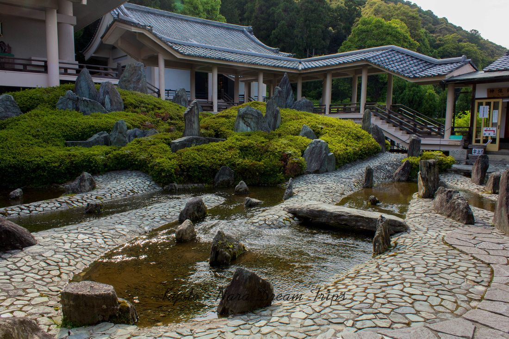
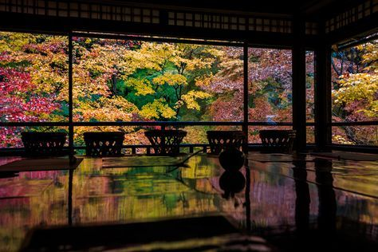
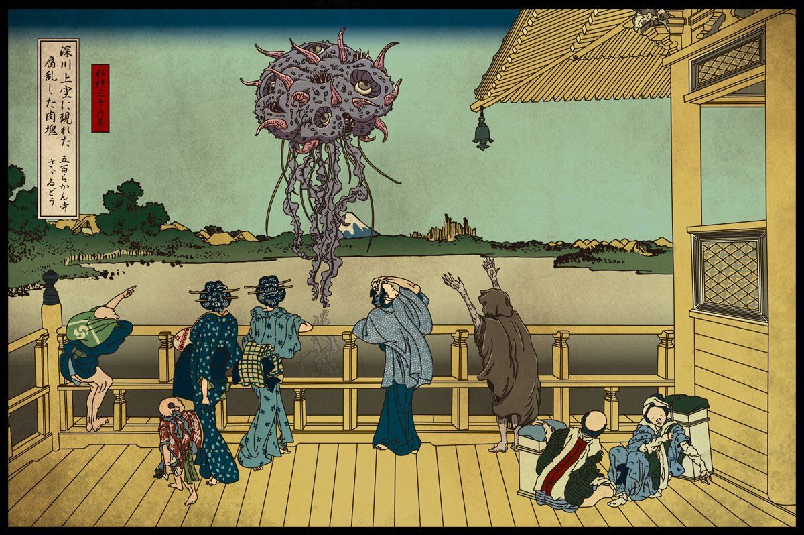
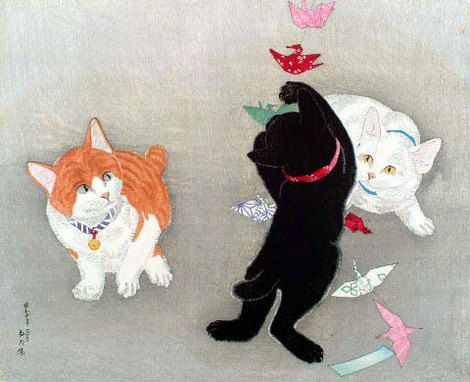
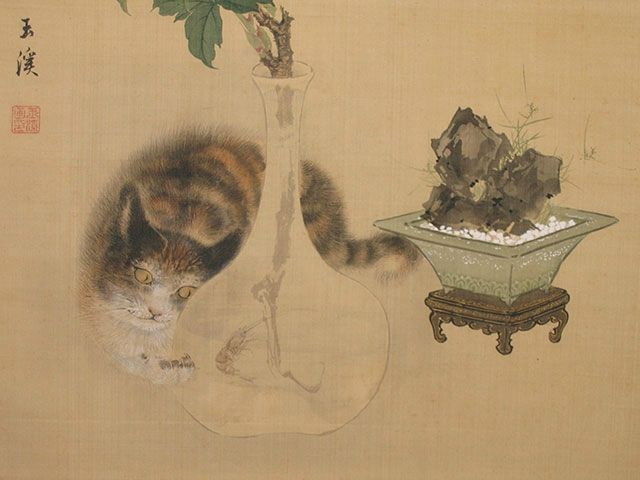
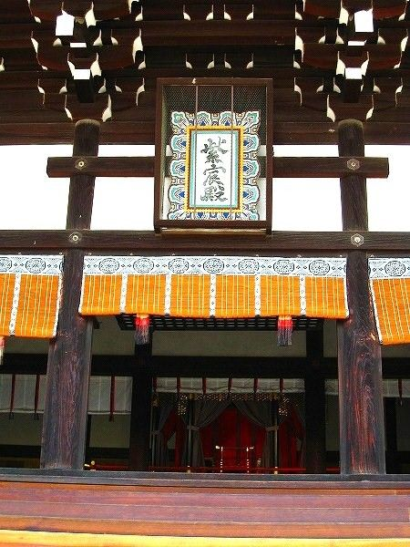
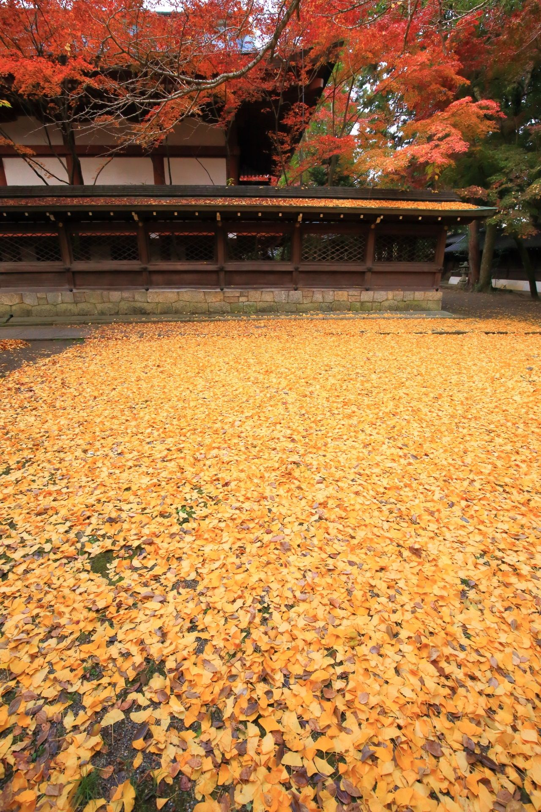
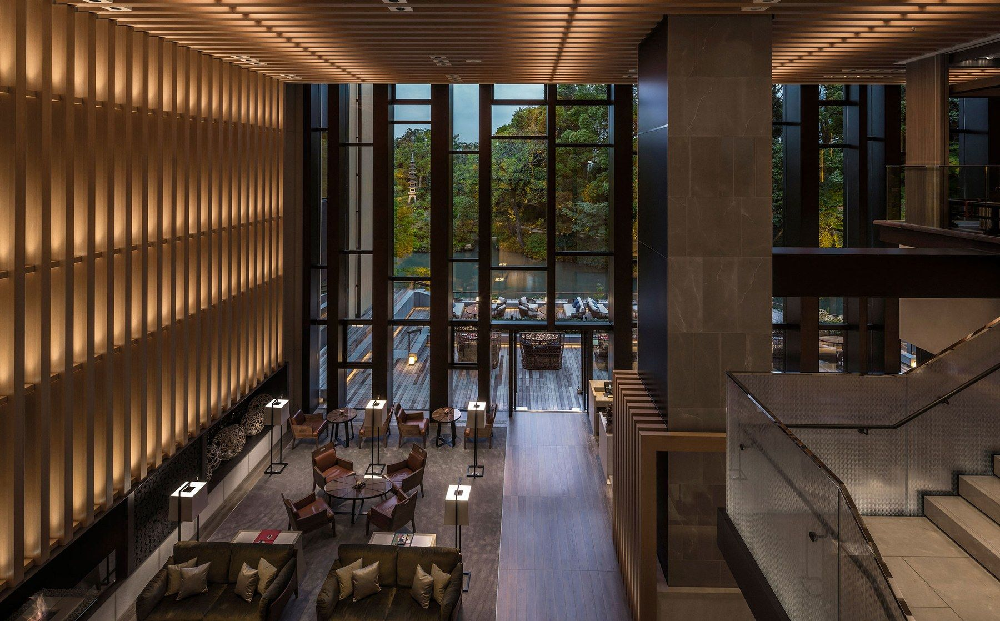
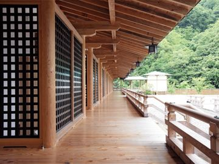
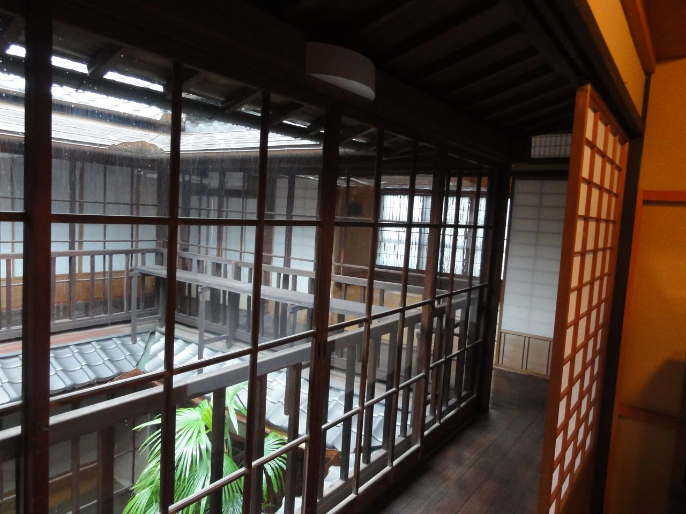
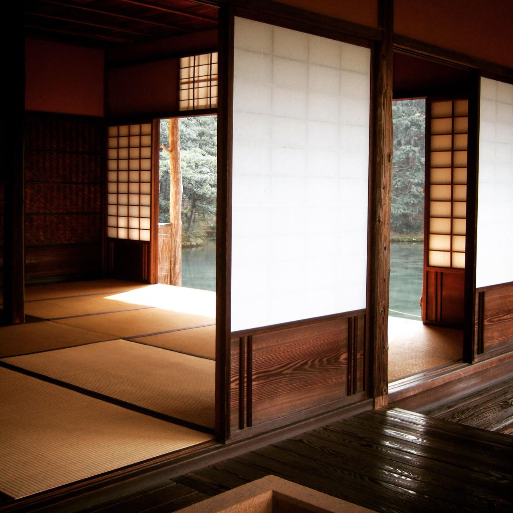
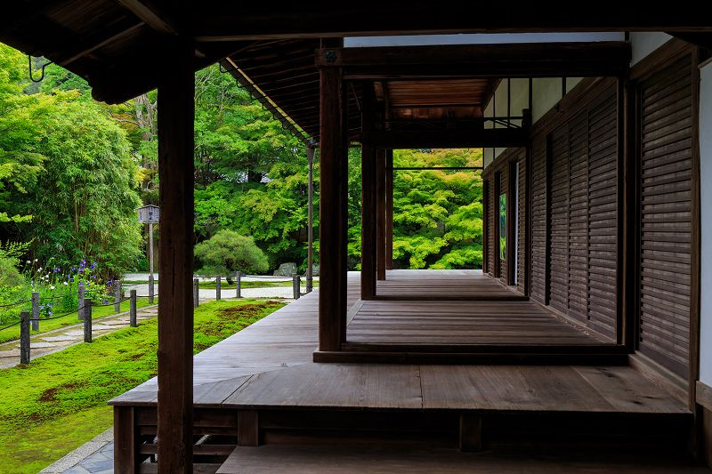
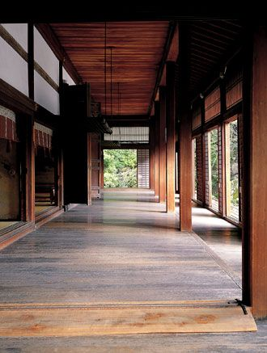
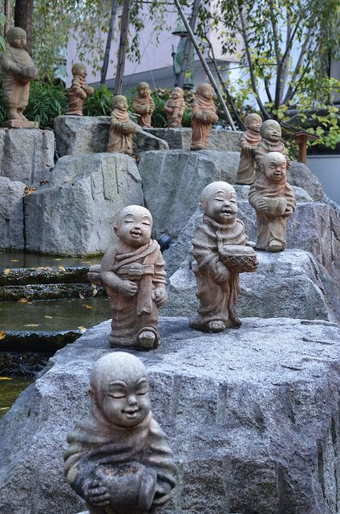
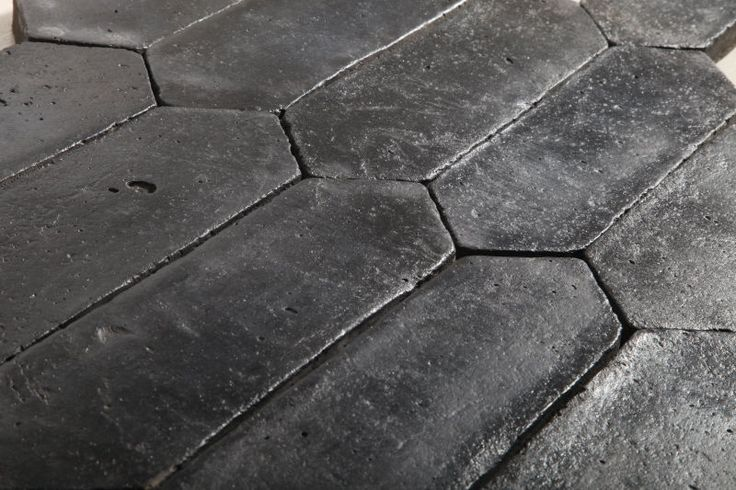
