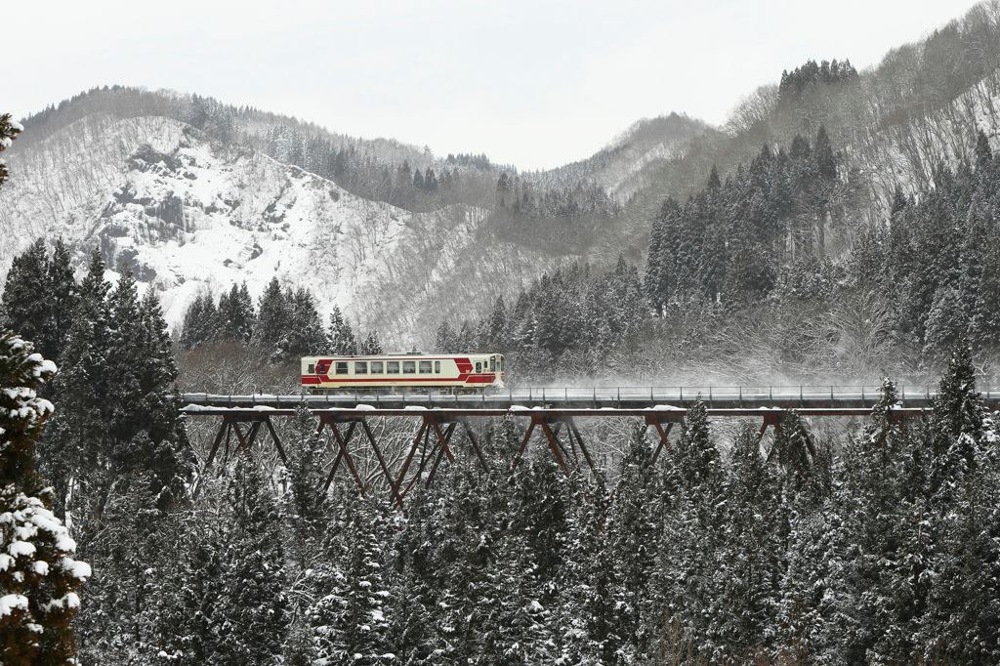



February 6, 2014
「冬の秋田内陸線」　撮影：taromatuさん
http://photohito.com/photo/3113469/?cid=FB
コメントにもありましたが、まるで白黒の世界を走っているようです。その世界に日本らしさを感じました。背景の山並みの様子からも構図をしっかり決めていることが分かります。
[SS1/320、焦点距離70mm、f/7.1、ISO400]
by.写真共有サイト PHOTOHITO


