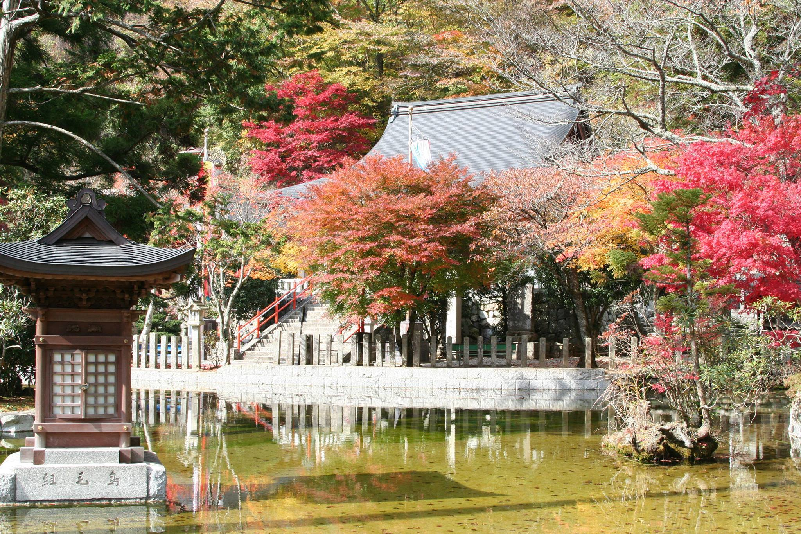
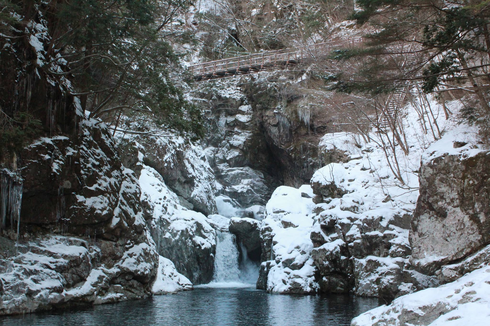
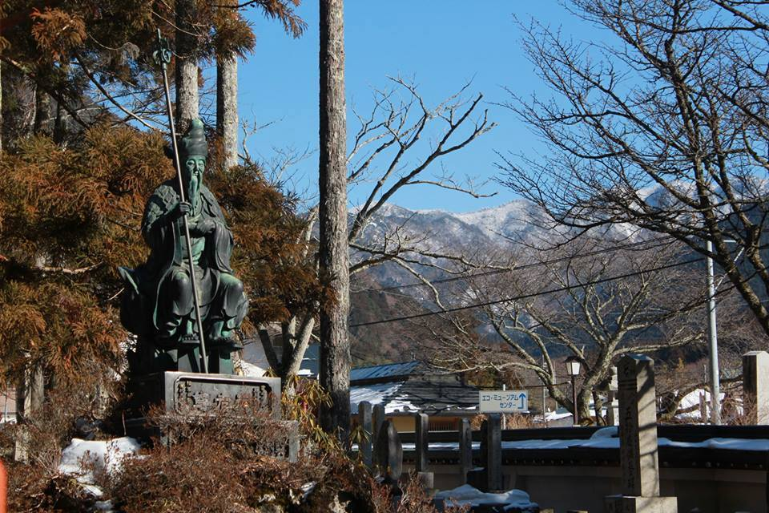
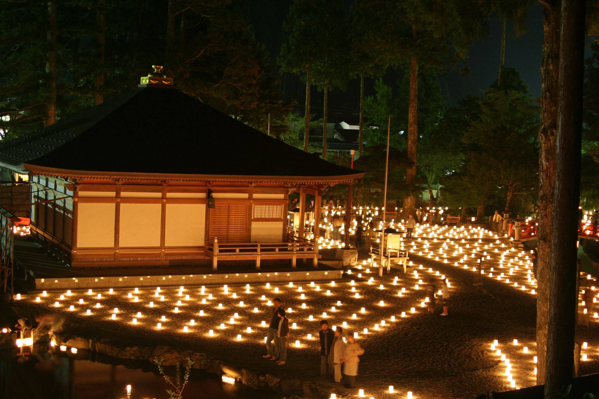
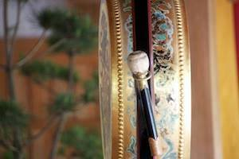
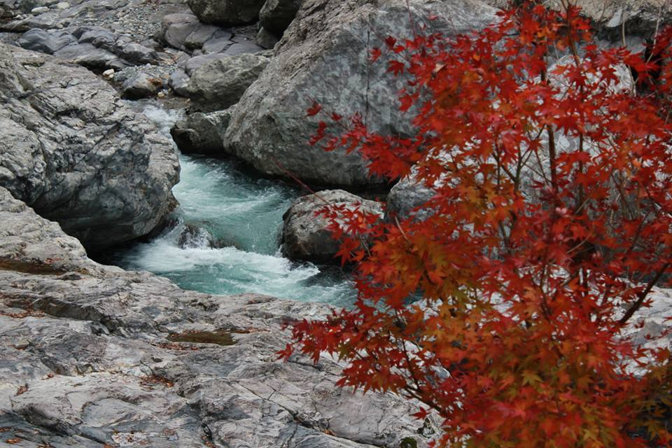
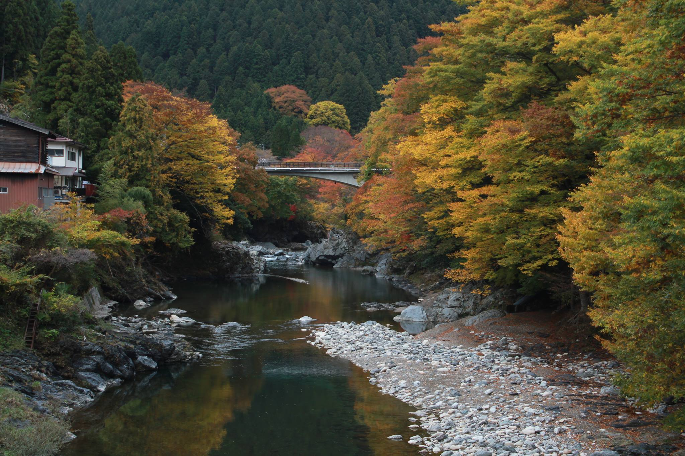
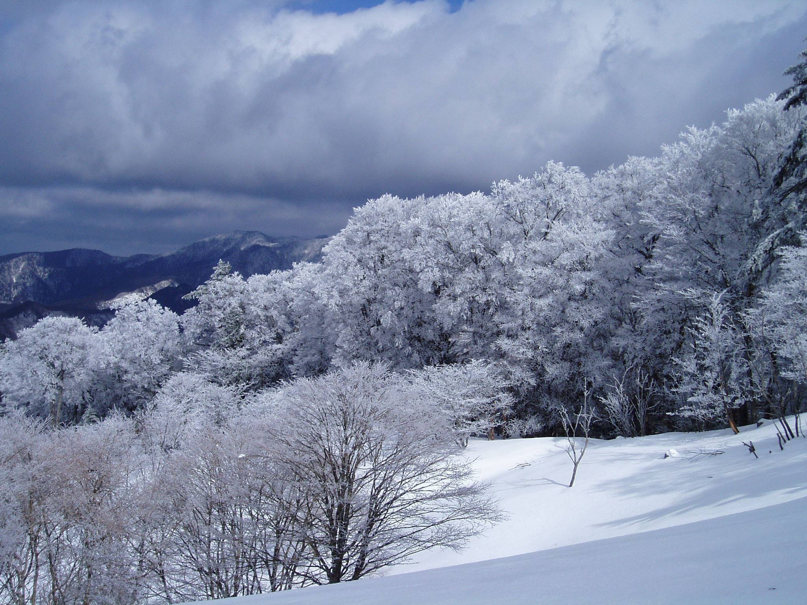







Japanese Culture & Style added 8 new photos to the album: Tenkawa Village （天川村） in Nara, Japan — in 天川村.
February 10, 2014
Beautiful! Tenkawa Village in Yoshino, Nara, Japan
Sacred pilgrimage routes with 1,300 years history registered as World Heritage by UNESCO in 2004. Tenkawa Village surrounded by highest ridges in Kansai area up to 1,900 meters covered by snow in whole winter. Peaceful to your mind, body & spirit. Tasty air and water, holly mountains, deep history, hot-springs area has classic mood and warm atmosphere. Village people often said you visit once, you will come back again.
Link below is a blog of Makoto Matsumaru, who works in the village office. It is a nice blog that shows the lives of people and the beautiful scenery of Tenkawa.
Please check it. 
http://p.tl/eGcq


