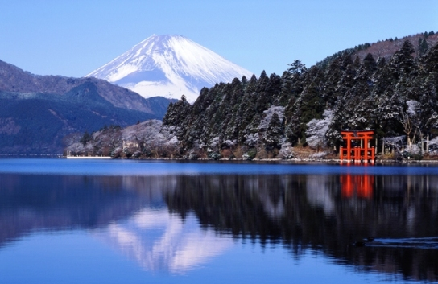
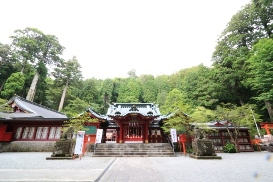
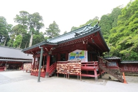
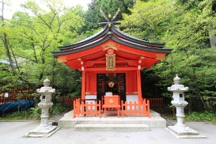
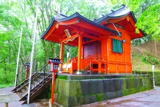
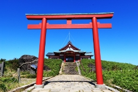
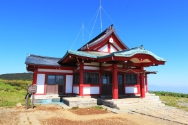


Don't care for the "power spot" stuff, but looks like a great location "near" Mt.Fuji! (Around Hakone.)


# 開運の神社・パワースポット【関東編】 - 箱根神社（九頭龍神社・箱根元宮）

● 財界にも信奉者の多い、関東総鎮守
  「箱根を背にするものは天下を制す」と言われる関東屈指の神社。
  関東で仕事をされる方は、必ずご参拝しましょう。
  元宮のある駒ヶ岳は、古代から山岳信仰の霊場でした。
  757年に万巻上人（まんがんしょうにん）が霊夢を得て、箱根神社を創建したとされます。

● 着実に事業や物事を進める力をもたらす、関東屈指のパワースポット
  富士山の南側（富士宮・三島・熱海など）が陽の働きに対して、箱根は陰の働き。
  着実に事業や物事を進める力をもたらす、強力パワースポットです。
  九頭龍神社 本宮、駒ヶ岳山頂の奥宮・箱根元宮も合わせて参拝すると、出世運・金運・願望実現・縁結び・恋愛運・健康運など、バランスよく全体運をアップできます。
  大きな志にパワーの働く神社なので、社会・地域貢献など、自分を取り巻く「大きな枠組み」の開運を祈願するとよいですよ。

● ご祭神
  ＜箱根神社＞ ： 皇祖の家族神
　・瓊瓊杵尊 （ににぎのみこと・夫神、天孫降臨した天照大御神の孫、皇室の祖神）
　・木花咲耶姫命 （このはなのさくやひめのみこと・妻神、富士山・桜を象徴する水の女神）
　・彦火火出見尊 （ひこほほでみのみこと・子神。海幸山幸神話の山幸彦。初代・神武天皇の祖父神）





＜九頭龍神社（摂社）＞
　・九頭龍大神 （くずりゅうのおおかみ、物事を現実化させる高級龍神）





＜箱根元宮（奥宮、はこねもとつみや）＞ ： 造化三神
　・天之御中主神 （あめのみなかぬしのかみ）：最初に出現した宇宙の根源の神
　・高御産巣日神 （たかみむすびのかみ）：創造・生産を司るムスビの神
　・神産巣日神 （かみむすびのかみ）：創造・生産を司るムスビの神
　　※高御産巣日神と神産巣日神が対で、男女のムスビを司る神




