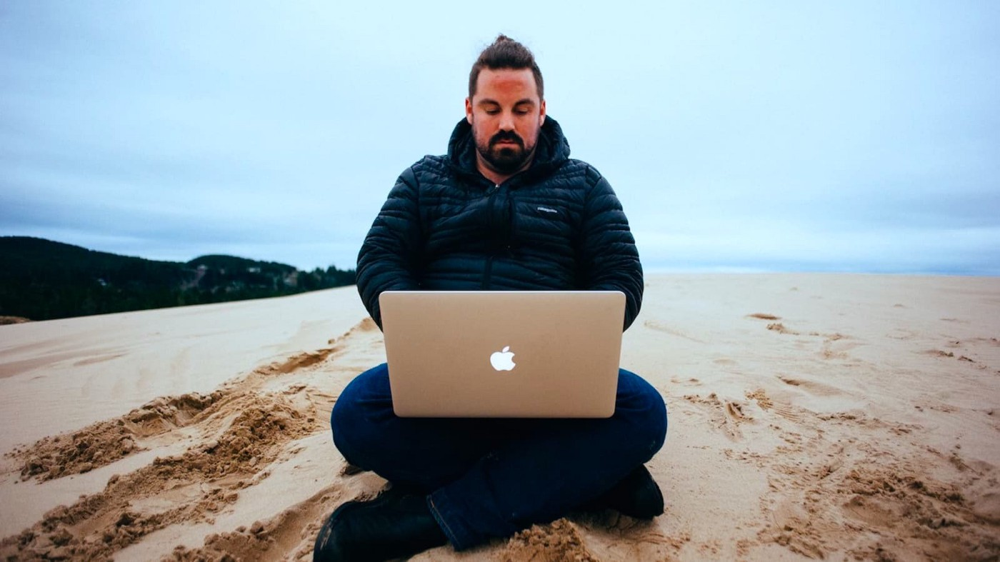

# Your 9-5 Pays the Bills. Your 6-10 Builds Your Skills.
 *Your weekends turn those skills into money.*
 
 

 A job is a dream depending on how you look at it.

 Most get it wrong. They devote their lives to a company that, during a crisis, couldn’t give a crap about them and would gladly fire their ass.

<!-- more -->
 Been there myself.

 When I wanted to get my life back I came up with a 3-step plan: Use the 9-5 job to pay bills. Use 6-10 pm to build skills. Use the weekend to turn skills into money. Then do it for [5 years](https://medium.com/entrepreneur-s-handbook/1-year-of-effort-to-build-a-side-hustle-5-years-to-make-enough-money-so-you-never-work-a-job-again-d2c5bbd1b7fc).

 This formula will help you reach true happiness in life.

## The simple way to know if you need this formula
 Naval Ravikant offers a question that helps you know if you’re on the right track or the wrong track.


How much of your day is spent doing things out of obligation versus doing things out of interest?


 For me, I spent my day doing stupid stuff I couldn’t stand. I was always chasing my tail and getting dragged into dumb meetings about nothing.

 Some slick-back hair flogger, dude in a suit, always wanted his knob shined with compliments before he’d approve a business-as-usual activity.

 Drove me bonkers.

 I wanted to read books, [learn about psychology](https://medium.com/the-ascent/18-things-that-are-not-worth-the-mental-cost-84871d61e4db), and publish my thoughts online. 90% of my day wasn’t spent doing this. It led to regrets. Did I waste my 20s working for the man?

 It became time to stick it to the man.

## The time to make a decision isn’t when you think
 We’re not talking about much time here.

 I chose to work on my side hustle from 6-10 pm. But I’m a crazy Batman kinda guy. You can work on your [side hustle](https://entrepreneurshandbook.co/build-a-highly-profitable-side-hustle-for-0-with-these-underrated-tools-ff89fc473fbb) in less time.

 The decision is this: Do you want to spend 4 hours a week working on your dream? Or, spend 8 hours a day working on someone else’s dream?

 The intersection of that decision is where the next level is found. By the way, it’s never a good time to make this decision. None of us are ready. Ever.

 Just start.

 Stop pissing all over yourself with excuses.

## This system can lead you to true happiness
 Happiness isn’t making a billion bucks like Zucks.

 It’s control of your time.

 A forced routine makes you a prisoner locked up in a jail. But a routine you choose is the ultimate definition of freedom.

 The point of building after hours — to turn your work hours into something special — is because it puts you back in control.

 You can’t get out of work. Although you can own your calendar and decide what types of work you do.

 Since I quit my job, I approach opportunities differently. Here’s my email template for any request I get (steal it).


Pitch me. If it’s good, I’ll reply. If it sucks, I won’t.


 That level of control feels amazing. It’s fun. I only say yes to stuff that makes me say “hell yes” without thinking too hard.

 Happiness looks like that. The problem is no book tells you. It only becomes apparent when you follow this formula.

## The best job is the one that helps you cheat on your boss
 Let’s not live in a fantasy land.

 [9-5](https://timdenning.com/9-5-employees-keep-telling-themselves-the-lie-one-more-year/) pm is actually a dream. A lot of jobs are hellholes.

 8 hours a day is an absolute blessing, better than meeting Oprah. The reality I’ve lived, though, is 12 hour+ workdays. Most of you can relate.

 If you work one of these jobs then my formula is useless. Every spare minute you have will get taken up by a boss that knows you can’t say no.

 What I did was find a new job that gave me time to cheat on my boss.

 I did extensive research into work-life balance. I didn’t trust the HR marketers either. I asked *actual* employees via LinkedIn.


Hey mate, do people work stupidly long hours at this company?


 I collected data. I shortlisted the companies with decent work hours. I got a job at one. I smashed my KPIs in a few hours each day. Then I spent the rest of the day cheating on my boss and smiling every time he asked for updates.

 I got good at pretending like the work I was doing was rigorous and took days of planning.

 Really, it was all bullshit.

 All I did was ring the customers that had the largest wallets. I kept in touch with them. I took them out for coffee.

 I made sure they were warm so when my sales target needed deals I could ring them for a free kick. It worked.

 Jobs with good hours are everywhere.

 Find one that’s 8 hours. If you go hard as I did then you’ll find jobs that can be done in 4 hours. Use the other 4 hours to work on your side hustle. Then any work you do after hours is a big fat bonus. Hooyah!

## The process is supposed to be boring as hell
 The messy middle is where this formula goes wrong.

 Chris Hadfield [describes](https://www.goodreads.com/book/show/18170143-an-astronaut-s-guide-to-life-on-earth) it best. When he was an astronaut for 21 years he spent only 6 months in space. Total.

 Most of his duties weren’t cleaning the windscreen of a sexy spacecraft in a spacesuit dangling above a gorgeous view of Earth. Nope.

 The most exciting job in the world was 90% boring as hell.

 That’s what a side hustle is like after you get serious with one. What you want to do is get from starting to boring as quickly as possible.

 From there, it’s a test of whether you love the boring parts enough to keep going until the formula creates the opportunity of a lifetime.

 Most can’t.

 They get trapped at the boring stage, so they stop and start again. This becomes a pattern for the rest of their life. Sad.

 Remember these two things:

 * Intelligence has nothing to do with it. All you have to do is be more disciplined than when you started.
 * The 1% gains you make through the process should be quiet. Impressing is loud — and that’s a giant distraction that’ll throw you off.

## The thing you do during 6-10 pm
 Not everyone will choose this exact time slot. You do you.

 During this [after hours](https://medium.com/entrepreneur-s-handbook/five-after-hours-habits-to-help-you-build-a-tiny-empire-quietly-d0ec0de3b13d) time slot you’re supposed to build your existing skills and acquire new ones.

 Elon Musk, not my cup of kombucha, offers great [advice](https://www.youtube.com/watch?v=_u1JXzEk6og).


You can literally learn any skill you want for free on YouTube. You can become a person of value in a matter of months. Just a few years ago this wasn’t possible.


 If you don’t know where to start then start here.

 Start with Youtube. Learn a skill you can use online. Or take something you do offline and bring it to the online world.

## The naughty weekends
 That’s when I spent time turning my after hours skills into money.

 Normally, I’d send direct messages, write up pitch templates to use in emails, research how to use payment processors like Stripe, or learn the basics of affiliate marketing.

 The goal became “how could this make money? What are the money-making tools online I need to know about?” Then I simply experimented with them.

 At the start it felt like joining an orgy for the first time as a virgin.

 But after a while this new world started to make sense. It didn’t seem complicated anymore. Let me demonstrate. I tweeted something about investing in financial assets. A reader gave me a smart ass [reply](https://twitter.com/CryptoFireside_/status/1503481552348790784?s=20&t=EiFtg0XfEi2vB0TfYMfJpA):


My 63 year old retired mum makes $500 a week buying off Gumtree and reselling on eBay and Amazon. She doesn’t know what a financial asset is.


 That’s how simple the online side hustle world is if you let it be.

## What it feels like when your side hustle takes over
 Now we come full circle.

 If you apply my 3-step formula for a year or more your side hustle will, hopefully, become your main source of work/income.

 The way to know you’ve reached the holy grail is with some advice Dickie Bush’s mentor gave him:

 

 <!-- > Work every day until you don’t know what day it is — because there’s no greater feeling of freedom than when your Wednesdays feel like Saturdays. -->

 I realized this yesterday. It was a public holiday in Australia. No one told me. I went down to the local cafe for a decaf coffee and it was packed. Took 30 minutes when it normally takes 3 minutes.

 > Hmmm … that’s strange.

 I got home and saw my wife in bathers heading to the beach.

 > Hmmm … Australia sure has got lazy these days … but okay.

 At around 6 pm I had dinner. My wife says “*it’s a public holiday you dummy*.” I had zero clue. I love what I do for work so much that I don’t look forward to public holidays anymore.

 I just want to be alone in my bedroom to write online. I don’t miss the old days of literally dying to get to the weekend, or giving my left nut to have an extra day off during a long weekend.

 None of it matters. Because the line between life and work is blurred.

## Wrapping up
 Nothing wrong with a 9-5 job.

 Just make sure you’re building something you have control over after hours, or by cheating on your boss (thanks to an easy job).

 True happiness is having control of your life and time. An after hours side hustle gets you there. Start now.
