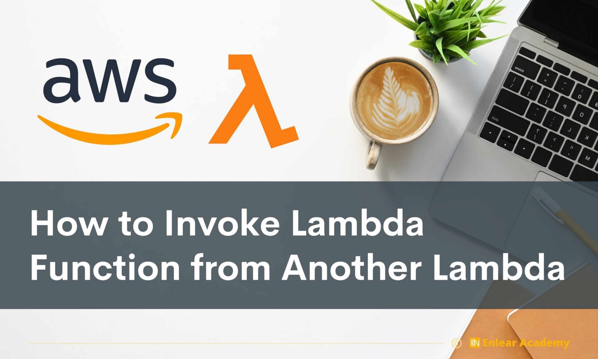
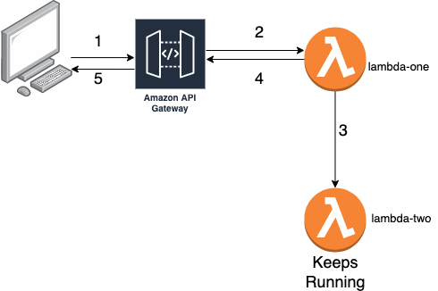
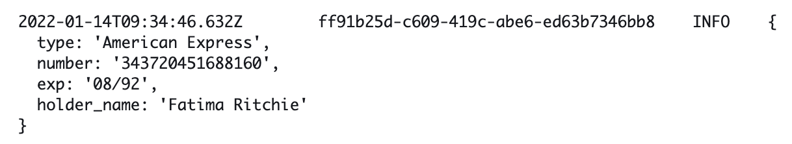

 <!--  -->

 It's good to know what you can do with the AWS services, but it's equally important, if not more, to know what you cannot do. A good solution architect knows the limitations of the different AWS services like Lambda, API Gateway, DynanoDB, etc.

 AWS Lambda has a timeout of 15mins and API Gateway has a timeout of just 30 seconds. If you trigger a lambda from API Gateway, the lambda will also time out in 30 seconds. If you want to perform some time-consuming tasks in lambda invoked from APIGateway, how do we circumvent this problem. Since the lambda triggered by the API Gateway will timeout in 30 seconds, we don't have much choice but to invoke another lambda. There are multiple ways in which we can do this.

 * Using SQS
 * Step Functions
 * Async Lambda Invocations

 Async lambda invocation is the simplest and straightforward way to go about this problem. Async invocation means that the lambda that invokes the other lambda does not wait for the second lambda to finish and immediately returns. There are 2 lambdas. We will call them lambda-one and lambda-two. Lambda-one is invoked using APIGateway, and then lambda-one invokes the lambda-two asynchronously.

 

 Required things to invoke lambda:

 1. **Name of the function we want to invoke**: Serverless, while creating the lambda, constructs the function name by appending the service name and stage name to the function name. If the service name is `experiment` and stage is `dev`, then our second lambda's function name becomes `experiment-dev-lambda-two`. so we pass the FUNCTION_PREFIX ( which consists of service name and stage ) into env in `serverless.yml` file.



 and we construct the function name using the function prefix that we receive from the environment.

```javascript
const FunctionName = `${process.env.FUNCTION_PREFIX}-${function_name}`;
```

 2. **Permissions**: We also need to give permission to invoke the other lambda. so we allow for "lambda:InvokeFunction" and "lambda:InvokeAsync" in the "iamRoleStatements" in "serverless.yml".

 3. **Payload**: for payload, we use the "casual" npm package to generate some fake data. We use "casual.card_data" to generate some card data.




 We need to stringify the data that we send as payload to the lambda-two, and lambda-two receives a parsed version of the payload in the event.

 4. **InvocationType**: By default, the invocation is done synchronously. To invoke lambda asynchronously, we need to set "InvocationType" as "Event" in the invoke method of the lambda.



 In `lambda-two` , we will just print the payload. Remember, we don't need to parse it. What we receive is a JSON object.



 

 The full source code can be found here:
 

 I hope you enjoyed reading the post as much as I enjoyed writing it.🥰

