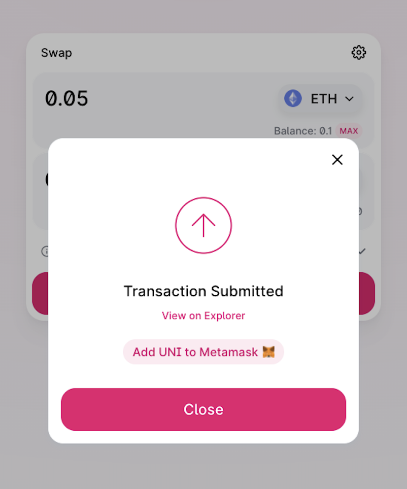

 <!--  -->

 Entering the blockchain space is a challenge to say the least. It’s competitive, it’s technologically advanced and on top of that, nobody really knows for sure where it’s heading.

 With that in mind, it can be very difficult to understand what people want from a product, which leaves web3 creators often not knowing where to start when it comes to UX.

## 3 reasons why UX is crucial in web3 
 It’s first important to understand why UX is so important in the blockchain space. 

 As of February 2021, [9.8 million people](https://cybercrew.uk/blog/cryptocurrency-statistics-uk/) in the UK owned some form of cryptocurrency. That’s an incredible 553% increase from 2018.

 But while the space is growing enormously, we’re still striving for mass adoption. We believe the final piece of the puzzle could be an increased focus on user experience in the space.

 Here’s 3 reasons why.

## Reason 1: Creates trust in a new space
 As is often the case, change brings about scepticism. When we are asked to change the way we’ve always done things, most assume there must be a catch. (If you don’t believe us, check out [these hilarious predictions](https://www.newstatesman.com/science-tech/2016/08/25-years-here-are-worst-ever-predictions-about-internet) about the internet from the mid 90s.)

 As blockchain technology offers us a new currency in the form of Bitcoin, a new form of art in the form of NFTs and even new spaces to socialise by way of the metaverse, Web3 is having to overcome the same trust issues that its predecessors experienced.

 “I just don’t get it.” “It’s too complicated.” “It must be a scam.” All common perceptions of the web3 space. But we believe UX is the key to changing these shortsighted ideas. How? By creating trust.

 For example, a robust back end often makes sites appear more credible; [47% of people](https://www.forbes.com/sites/forbesagencycouncil/2019/11/19/why-site-speed-should-be-an-optimization-priority/?sh=21ee5c1e192b) expect a webpage to load in two seconds or less. Anything more and users may assume your site isn’t legit.

 Alternatively, build trust through UI. See how [Oasis.app](https://oasis.app), a DeFi platform which allows you to borrow using your crypto as collateral, has a UI that oozes trust. A minimalistic approach that is clutter free and light in copy comes across far more welcoming to the user.  

  

## Reason 2: USP in a developer-dominated field
 
 Advancements in technology often result in mass innovation. 

 But many innovators fall down the rabbit hole of believing their idea alone is enough. The rise of the internet in the mid 90s saw an abundance of new ideas built online. But with very few considering anything more than the idea, most failed.   

 It could be argued that we’re at the same stage with web3. Developers are pivoting to blockchain technology in order to advance the world of DEXs, DAOs and DeFi platforms. But just like the 90s, UX is an afterthought.

 From our own experience, the belief that product alone is enough leads to blockchain based applications being confusing to the user, hard to navigate and not the most aesthetically pleasing.  

 This is where UX comes into play. Sites that look the part, flow well and are easy to navigate will stand out in a field that is currently being led by developers.

## Reason 3: Vital to a young target market
 As we mentioned previously, it can be challenging to get people to change the way they’ve always done things. This makes younger generations vital to the blockchain space as they are often more open minded and yet to be stuck in their ways.

 However, there’s a few issues with the millennials and gen-Z age groups.  

 For a start they’re not the most patient. Gen-Z especially have grown up with rapid-speed internet connections and smartphones providing almost-instant access to information.

 Considering this, the relationship between the back-end and UX needs to be taken extremely seriously by web3 projects. A target audience dominated by under 40s won’t be prepared to wait regardless of how revolutionary your product is.

 Additionally, this age group is too young to remember the web design UX horrors that existed prior to the 2000s. Instead, they’ve grown up with websites and apps being treated like works of art and will expect nothing less with web3.

## Blockchain UX Patterns
 Are you building in the web3 space? Whether it’s a dapp, an NFT project, a crypto platform or something else, we’ve pulled together a list of some of the common and trusted UX patterns in the blockchain space.

 The patterns used will depend on the product being built. Some blockchain projects need to focus on ease of use and functionality whereas others are more dependent on the look and feel.

## Digital Wallets UX Patterns
### Simple UI
 A wallet will be one of the first products someone uses when entering the web3 space. Therefore, it’s vital that crypto wallets are designed considering that users may be beginners with limited knowledge. 

 Wallets may have several uses: buying, sending and holding crypto for example. Cluttered UI will only confuse newbies. Try and keep everything in one place so the user can’t get ‘lost’ in the process.

 Another important thing to consider with digital wallets is the wallet address. These have become a bit of a barrier in the crypto space with most existing as a random jumble of letters and numbers.

 Digital wallets need to consider an alternative way to incorporate addresses or make it simple for addresses to be found and sent.

 One of the most popular wallets, MetaMask, makes it simple for users by allowing them to copy their wallet address with one tap from the home screen. This way, users don’t need to remember or even make a note of their wallet address.

 

### Safety
 The topic of safety divides opinion in the world of crypto. With crypto natives seeing the space as a safer alternative but wider society sceptical about having no bank to run to. This makes it essential that any product in the DeFi space translates the message of safety and privacy through their UX.

 Using MetaMask as a great example again,  MetaMask makes users re-enter their secret backup phrase once they’ve created a wallet. The design of the app deliberately stops the user copying and pasting the phrase into the input box. This ensures that the user has made a note of their secret recovery phrase which is required to access the wallet.

 

## DeFi UX Patterns
### Be prepared for the user to make mistakes
 It’s still early in DeFi, we’re all new. So be prepared for the user to make mistakes. Have you considered a setup for a user’s every situation? Not connected to their wallet, don’t have enough of a token, deposited too much of a token, approaching liquidation and so on. 

 Users need to be told not just when something has gone wrong, but why it has gone wrong. DeFi is complex, a validation message that says ‘error’ isn’t going to cut it.

 This is an issue we faced while working on crypto launchpad, [Launchpool](https://launchpool.xyz). 

 The crypto launchpad facilitates staking and incorporates different blockchains. With many different requirements, the user needed to be told why their transaction wasn’t going through. The Launchpool app will tell the user things like if they’re trying to stake too much of a token or if they’re using the wrong wallet.

 

### New terminology
 Sharding, farming, staking, mining. The DeFi space is swamped by [new terms](https://www.uxsequence.io/learn/article/blockchain-dictionary-a-z/). It’s important to consider that many new users won’t fully understand a lot of this lingo. 

 A simple way to help users understand the terminology in your app is by using a simple tooltip. 

 [Bancor](https://app.bancor.network/pools) does a great job of this. The DeFi protocol allows users to convert tokens instantly rather than using exchanges like Coinbase. As a result, the app contains many complex terms; Bancor gives users a definition of these terms by hovering over them.

 

### Multiple networks
 Dapps that allow for multiple networks (*e.g.* ETH and BSC) will require extra UX consideration. 

 Until there’s a solution to the issue of cross-chain interoperability, blockchain-based apps need to minimise the UX complications that arise from different blockchain networks.

 Do the work for the user, this was our approach when creating the [Launchpool app](https://www.uxsequence.io/case-studies/launchpool/).

 If a user isn’t set up on a network that they need to be to use the app, they will be made aware and will simply need to approve the network being added to their MetaMask. This saves the user having to find the new network details such as RPC and chain IDs which most people will have no knowledge of.

 

### Status of transactions
 As we mentioned earlier, web2 speeds have evolved to become almost instant, making us impatient. Pending transactions can make users feel as though your product isn’t working. 

 Leaving links so that a user can see their transactions on a blockchain explorer such as EtherScan or BSCscan can help provide transparency and reassure users that their transaction is going through. 

 Uniswap is a great example of this. The DEX allows users to see the progress of their transactions after they’ve made the swap and prompts users to check the progress on Etherscan.

 

## NFT UX Patterns
### Create a home for NFTs
 Allow users to view their NFTs on your website/app rather than having to visit a site like Etherscan or BSC Scan.

 While marketplaces like [OpenSea](https://opensea.io) act as hub for Ethereum based NFTs, other networks don’t have this luxury. For instance, viewing an NFT you own on the Binance Smart Chain network can be particularly problematic.   

 NFT platforms should follow the lead of [NBA Top Shot](https://nbatopshot.com), one of the world’s most succesful NFT projects. NBA Top Shot allows the user to buy, sell, collect and view NFTs all through the Top Shot website.

 

### Create a story
 It’s important to create a journey for your following. Check out how we built a story for [Bitcoin Origins](https://www.btcorigins.com) through our [‘hunt for Satoshi](https://thehunt.btcorigins.com)‘ project. 

 
 
 If there’s a story behind your NFT it’s going to be much more attractive for new users. It helps onboard and educate users so they buy into the project. Continuously developing the story will also keep your community coming back for more.

## Play-to-Earn Gaming UX Patterns
### Longevity
 When it comes to play-to-earn gaming, creating a long-lasting experience for the user is a massive deal. 

 While previous gaming markets have been about graphics and reality, blockchain gamers are more concerned with earning potential.

 And with the price of gaming NFTs likely to be influenced by the amount of people playing the game, it’s vital that games give long-term value to gamers. 

### Ownership of assets and items
 Prior to the play-to-earn model, gamers wouldn’t exactly own their in-game assets. You may have a FIFA Ultimate Team card, Fortnite skin or Call Of Duty gun; but so did plenty of others. Your asset wasn’t unique. Nor could it be sold outside of the game.

 P2E games like Axie Infinity and Sorare allow gamers to fully own their assets as NFTs. This means gamers can take their gaming items out of the game and create spin offs or sell for real money. 

 

 It’s great to see how far the blockchain space has come. But if we’re going to reach mass adoption, there’s no doubt that web3 needs to become more accessible, easier to understand and more user friendly. 

