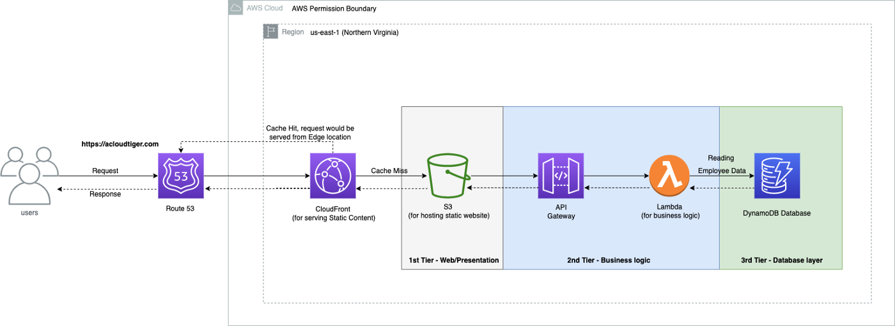
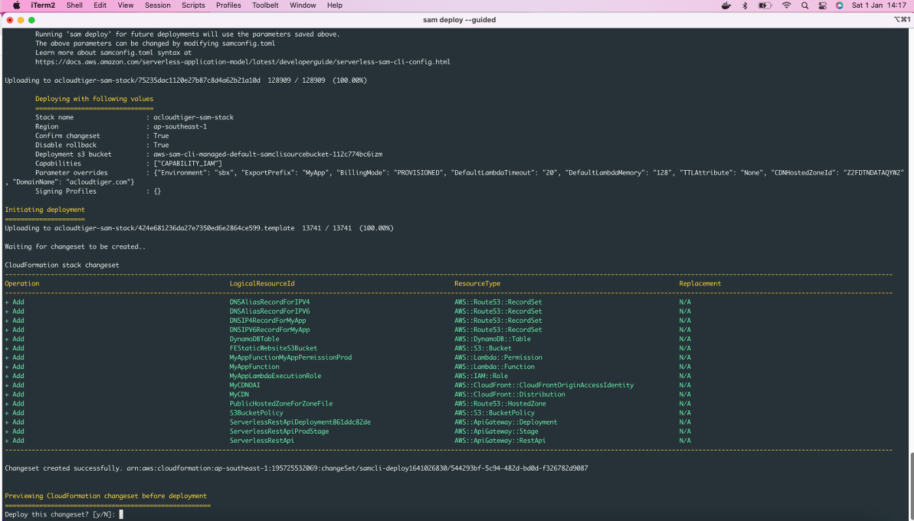

<!-- https://media.amazonwebservices.com/blog/2018/sam_squirrel_1.jpg -->
# Developing a 3-tier Serverless web application using AWS Serverless Application Model (SAM) framework
 With **AWS SAM** (Serverless Application Model)[^1][^2], we can create serverless resources on AWS to build & develop serverless applications for instance serverless resources like **AWS Lambda**, **AWS API Gateway**, etc. Not just that instead of writing the Lambda directly on AWS Console, we can use SAM to develop, build and test Lambda locally before it can be pushed to AWS Cloud, this saves a lot of time in debugging the Lambda at the local system itself and ensures productivity.

[^1]: https://docs.aws.amazon.com/serverless-application-model/latest/developerguide/what-is-sam.html
[^2]: https://aws.amazon.com/jp/blogs/news/aws-serverless-application-model-sam-command-line-interface-build-test-and-debug-serverless-apps-locally/

 

 In this article, we will see how we can use AWS SAM to build a simple 3-tier serverless web application and with the help of a few CLI (Command Line Interface) commands, how we can deploy the same to AWS Cloud from our local system and then access it.

## Advantages of going with AWS SAM
 1. Extension of AWS CloudFormation
 2. Develop, build, debug and test locally
 3. Supports integration with CI/CD servers like Jenkins, Atlassian Bamboo, etc as a single deployment configuration YAML file
 4. Native support of other AWS tools/resources like AWS Cloud9 IDE, Code Build, CodeDeploy and CodePipeline


## Our 3-tier Serverless Web Application Architecture
 

### Step 1: Ensure that AWS CLI & SAM CLI is installed & configured
 Visit AWS documentation here https://docs.aws.amazon.com/serverless-application-model/latest/developerguide/serverless-sam-cli-install.html and install the binaries in your local system depending upon your Operating Systems. You also need to ensure that IAM User is configured in your AWS CLI with access keys and secret access keys.

 (To configure access/secret access keys of IAM User with your CLI, you can refer to https://docs.aws.amazon.com/cli/latest/userguide/cli-configure-quickstart.html)


### Step 2: Initialize a SAM application
 Use the following command to initialize a SAM application:

```bash
sam init --runtime nodejs14.x --name <application name>
```

 Here, I have chosen NodeJS as runtime however you are free to choose any other runtimes like Python, etc. You also need to give an application name in the flag called name.

 Once executed, then it will give you a few options on the terminal as a base starter project to start with. You can select basic hello world as an example.

 Once done, then it generates a skeleton project structure locally with a `template.YAML` file.

### Step 3: Create AWS resources using the SAM template.YAML file
To create a Lambda function using the template add the below configuration inside the Resources tag as shown below:

```yaml template.YAML
# -------------------------------------------------------------- #
#                                  Resources                                   #
# -------------------------------------------------------------- #

Resources:
MyAppFunction:
    Type: AWS::Serverless::Function # More info about Function Resource: https://github.com/awslabs/serverless-application-model/blob/master/versions/2016-10-31.md#awsserverlessfunction
    Properties:
      CodeUri: my-app/
      Handler: app.lambdaHandler
      Runtime: nodejs14.x
      MemorySize: !Ref DefaultLambdaMemory
      Timeout: !Ref DefaultLambdaTimeout
      Role: !GetAtt MyAppLambdaExecutionRole.Arn
      Environment:
        Variables:
          RUNTIME_DDB_TABLE_NAME: !Ref DynamoDBTable
      Architectures:
        - x86_64
      Events:
        MyApp:
          Type: Api # More info about API Event Source: https://github.com/awslabs/serverless-application-model/blob/master/versions/2016-10-31.md#api
          Properties:
            Path: /hello
            Method: get
```
 Note, *`MyAppFunction` is a logical name given to Lambda*. You can give any name to it and can refer these resources anywhere inside this template to any other AWS resources by using ARN (Amazon Resource Name) *i.e.* `!GetAtt MyAppFunction.Arn` .

 The filename of my Lambda is `app.js` inside the folder called `my-app` (refer `CodeUri: my-app/` in the above `template.yaml` definition). You can write your own logic inside that Lambda function. For this demo purpose, I have put below the logic of writing an item to the DynamoDB table whenever this Lambda is invoked for the first time as shown below:

```javascript DynamoDB_Lambda.js
const AWS = require("aws-sdk");

//All Cold Start Code of Lambda goes here
const dynamodb = new AWS.DynamoDB.DocumentClient();
const ddbTable = process.env.RUNTIME_DDB_TABLE_NAME;

//All Warm Start Code of Lambda goes withing LambdaHandler
exports.lambdaHandler = async (event, context) => {
    let body;
    let statusCode = 200;
    const headers = {
      'Content-Type': 'application/json',     
      'Access-Control-Allow-Headers': 'Content-Type',
      'Access-Control-Allow-Origin': '*',
      'Access-Control-Allow-Methods': 'GET'
    };

    try {
        // Adding random data to DynamoDB table - Adding static data just for this Sample App otherwise data will be populated based on parsing the Request
        await dynamodb
          .put({
            TableName: ddbTable,
            Item: {
              'id': 'E1001',             
              'name': 'Vinod Kumar',
              'company': 'My Company',
              'email': 'vinod827@yahoo.com'
            }
          })
          .promise();

        // Retrieving data from DynamoDB table - Just from demo purpose only otherwise data will be fetched based on given employee id sent dynamically through headers
        body = await dynamodb.get({ TableName: ddbTable, Key: { id: 'E1001' }}).promise(); // To retrive 1 item
       
    } catch (err) {
        console.log(err);
        statusCode = 400;
        body = err.message;
        return err;

    } finally {
        body = JSON.stringify(body);
    
    }

    //return response
    return {
        statusCode,
        body,
        headers
    };

};
```

 Similarly, to add another serverless resource like DynamoDB table, add below in the same template:

```yaml DynamoDB_template.yml
# ------------------------------------------------------------ #
#                        DynamoDB Table                              #
# ------------------------------------------------------------ #
  DynamoDBTable:
      Type: AWS::DynamoDB::Table
      Properties: 
        AttributeDefinitions: 
          - AttributeName: id
            AttributeType: S
        KeySchema: 
          - AttributeName: id
            KeyType: HASH
        ProvisionedThroughput: 
          ReadCapacityUnits: 5
          WriteCapacityUnits: 5
        tags: # Optional
          - Key: Namespace
            Value: '@MyApp'
          - Key: Name
            Value: !Sub
            - '${ExportPrefix_}DynamoDBTable'
            - ExportPrefix_: !If
              - HasExportPrefix
              - !Join ['-', [!Ref ExportPrefix, !Ref Environment, '']]
              - !Join ['-', [!Select [0, !Split ["-", !Ref "AWS::StackName"]], !Ref Environment, '']]
          - Key: Environment
            Value: !FindInMap [Environment, FullForm, !Ref Environment]
        TimeToLiveSpecification: !If
          - HasTTLAttribute
          - AttributeName: !Ref TTLAttribute
            Enabled: true
          - !Ref 'AWS::NoValue'

```

## template.YML
 To complete our 3-tier serverless web application architecture below is the completed version of the `template.YAML` file which would create the AWS resources such as Lambda, DynamoDB, API Gateway, CloudFront distribution, Route 53 Public Hosted Zone, etc. You can simply copy and paste the below to your own `template.YAML` file.

```yaml FULL_template.yml
AWSTemplateFormatVersion: '2010-09-09'
Transform: AWS::Serverless-2016-10-31
Description: >
  AWS Serverless Application Model app
  Sample application

Globals:
  Function:
    Timeout: !Ref DefaultLambdaTimeout # Limit 900 seconds (15 minutes)
    MemorySize: !Ref DefaultLambdaMemory # Limit 128 MB to 3,008 MB, in 64 MB increments

  Api:
    Cors:
      AllowMethods: "'DELETE,GET,HEAD,OPTIONS,PATCH,POST,PUT'"
      AllowHeaders: "'Content-Type,X-Amz-Date,X-Amz-Security-Token,Authorization,X-Api-Key,X-Requested-With,Accept,Access-Control-Allow-Methods,Access-Control-Allow-Origin,Access-Control-Allow-Headers'"
      AllowOrigin: "'*'"    

Parameters:
  Environment:
    Type: String
    Default: dev
    Description: Deployment Environment
    AllowedValues:
      - sbx
      - dev
      - qa
      - stage
      - prod
  ExportPrefix:
    Type: String
    Default: 'myapp'
    Description: >-
      Prefix for the managed resources and cloudformation exports.
      Provide it in `namespace-environment` format,
      where namespace can be product UPI or leave blank for defaults.
    AllowedPattern: ^[a-zA-Z]+(-?[a-zA-Z0-9]+)*$
    ConstraintDescription: >-
      Only hyphen (-) separated alphanumeric string is allowed. Should start with a letter.
    MinLength: 3
    MaxLength: 30
  BillingMode:
    AllowedValues:
    - PAY_PER_REQUEST
    - PROVISIONED
    Default: 'PROVISIONED'
    Description: >-
      Specify how you are charged for read and write throughput and how you manage capacity.
      Set to PROVISIONED for predictable workloads and PAY_PER_REQUEST for unpredictable workloads.
      PAY_PER_REQUEST sets the billing mode to On-Demand Mode
    Type: String
  DefaultLambdaTimeout:
    Default: 3
    MinValue: 3
    MaxValue: 900
    Description: >-
      The amount of time that Lambda allows a function to run before stopping it.
      The default is 3 seconds.
      The maximum allowed value is 900 seconds.
    Type: Number
  DefaultLambdaMemory:
    Default: 128
    MinValue: 128
    MaxValue: 3008
    Description: >-
      The amount of memory that your function has access to.
      Increasing the function's memory also increases its CPU allocation.
      The default value is 128 MB. The value must be a multiple of 64 MB.
    Type: Number
  TTLAttribute:
    Default: None
    Description: >-
      Attribute name for time to live. Provide None or leave blank for if not required.
    Type: String
  CDNHostedZoneId:
    Default: 'Z2FDTNDATAQYW2'
    Description: >-
      CloudFront hosted zone id. 
      Always Static Value. 
      Refer AWS Documentation here
      https://docs.aws.amazon.com/AWSCloudFormation/latest/UserGuide/aws-properties-route53-aliastarget.html#cfn-route53-aliastarget-hostedzoneid
    Type: String
  DomainName:
    Default: 'acloudtiger.com'
    Description: >-
      Registered domain name with Top Level Domain as .com
    Type: String


# --------------------------------------------------------------- #
#                                   Mappings                                   #
# --------------------------------------------------------------- #

Mappings:
  Environment:
    FullForm:
      sbx: sandbox
      dev: development
      stage: staging
      qa: qa
      prod: production


# ------------------------------------------------------------ #
#                                  Conditions                                  #
# ------------------------------------------------------------ #

Conditions:
  HasExportPrefix: !Not [!Equals [!Ref ExportPrefix, '']]
  HasNoTTLAttribute: !Or [!Equals [!Ref TTLAttribute, ''], !Equals [!Ref TTLAttribute, 'None']]
  HasTTLAttribute: !Not [!Condition HasNoTTLAttribute]

# -------------------------------------------------------------- #
#                                  Resources                                   #
# -------------------------------------------------------------- #

Resources:
# ---------------------------------------------------------------- #
#  MyApp Lambda Execution Role for reading writing to DynamoDB, CloudWatch, etc #
# ---------------------------------------------------------------- #
  MyAppLambdaExecutionRole:
    Type: AWS::IAM::Role
    Properties:
      AssumeRolePolicyDocument:
        Statement:
          - Action:
              - "sts:AssumeRole"
            Effect: Allow
            Principal:
              Service:
                - lambda.amazonaws.com
        Version: 2012-10-17
      Path: /
      ManagedPolicyArns:
        - arn:aws:iam::aws:policy/service-role/AWSLambdaBasicExecutionRole
        - arn:aws:iam::aws:policy/AWSXrayWriteOnlyAccess
        - arn:aws:iam::aws:policy/service-role/AWSLambdaVPCAccessExecutionRole
      Policies:
        - PolicyName: !Sub
          - "${ExportPrefix_}MyAppGetLambdaPolicy"
          - ExportPrefix_: !If
            - HasExportPrefix
            - !Join ['-', [!Ref ExportPrefix, !Ref Environment, '']]
            - !Join ['-', [!Select [0, !Split ["-", !Ref "AWS::StackName"]], !Ref Environment, '']]
          PolicyDocument:
            Version: 2012-10-17
            Statement:
              - Sid: MyAppLambdaExecutionAndXRayTracing
                Effect: Allow
                Action:
                  - cloudwatch:PutMetricData
                  - dynamodb:UpdateItem
                  - dynamodb:ConditionCheckItem
                  - dynamodb:Scan
                  - dynamodb:BatchWriteItem
                  - dynamodb:PutItem
                  - dynamodb:GetItem
                  - dynamodb:DescribeTable
                  - dynamodb:Query
                  - dynamodb:BatchGetItem
                  - dynamodb:DeleteItem
                  - s3:*
                  - lambda:*
                Resource: "*"

# -------------------------------------------------------------- #
#                          MyApp Lambda Function                                #
# -------------------------------------------------------------- #
  MyAppFunction:
    Type: AWS::Serverless::Function # More info about Function Resource: https://github.com/awslabs/serverless-application-model/blob/master/versions/2016-10-31.md#awsserverlessfunction
    Properties:
      CodeUri: my-app/
      Handler: app.lambdaHandler
      Runtime: nodejs14.x
      MemorySize: !Ref DefaultLambdaMemory
      Timeout: !Ref DefaultLambdaTimeout
      Role: !GetAtt MyAppLambdaExecutionRole.Arn
      Environment:
        Variables:
          RUNTIME_DDB_TABLE_NAME: !Ref DynamoDBTable
      Architectures:
        - x86_64
      Events:
        MyApp:
          Type: Api # More info about API Event Source: https://github.com/awslabs/serverless-application-model/blob/master/versions/2016-10-31.md#api
          Properties:
            Path: /hello
            Method: get           


# ------------------------------------------------------------ #
#                        DynamoDB Table                              #
# ------------------------------------------------------------ #
  DynamoDBTable:
      Type: AWS::DynamoDB::Table
      Properties: 
        AttributeDefinitions: 
          - AttributeName: id
            AttributeType: S
        KeySchema: 
          - AttributeName: id
            KeyType: HASH
        ProvisionedThroughput: 
          ReadCapacityUnits: 5
          WriteCapacityUnits: 5
        tags: # Optional
          - Key: Namespace
            Value: '@MyApp'
          - Key: Name
            Value: !Sub
            - '${ExportPrefix_}DynamoDBTable'
            - ExportPrefix_: !If
              - HasExportPrefix
              - !Join ['-', [!Ref ExportPrefix, !Ref Environment, '']]
              - !Join ['-', [!Select [0, !Split ["-", !Ref "AWS::StackName"]], !Ref Environment, '']]
          - Key: Environment
            Value: !FindInMap [Environment, FullForm, !Ref Environment]
        TimeToLiveSpecification: !If
          - HasTTLAttribute
          - AttributeName: !Ref TTLAttribute
            Enabled: true
          - !Ref 'AWS::NoValue'

# --------------------------------------------------------------- #
#             S3 bucket for static website hosting                             #
# ---------------------------- ---------------------------------- #
  FEStaticWebsiteS3Bucket:
    Type: AWS::S3::Bucket
    Properties:
      BucketName: acloudtiger.com
      tags: # Optional
          - Key: Namespace
            Value: '@MyApp'
          - Key: Name
            Value: !Sub
            - '${ExportPrefix_}FEStaticWebsiteS3Bucket'
            - ExportPrefix_: !If
              - HasExportPrefix
              - !Join ['-', [!Ref ExportPrefix, !Ref Environment, '']]
              - !Join ['-', [!Select [0, !Split ["-", !Ref "AWS::StackName"]], !Ref Environment, '']]
          - Key: Environment
            Value: !FindInMap [Environment, FullForm, !Ref Environment]

  S3BucketPolicy:
    Type: AWS::S3::BucketPolicy
    Properties:
      Bucket: !Ref FEStaticWebsiteS3Bucket
      PolicyDocument:
        Statement:
          - Effect: Allow
            Action: 's3:GetObject'
            Resource:
              - !Sub "arn:aws:s3:::${FEStaticWebsiteS3Bucket}/*"
            Principal:              
              AWS: !Sub "arn:aws:iam::cloudfront:user/CloudFront Origin Access Identity ${MyCDNOAI}"


# ------------------------------------------------------------- #
#                       CDN and its distribution                    #
# ------------------------------------------------------------- #
  MyCDNOAI:
    Type: 'AWS::CloudFront::CloudFrontOriginAccessIdentity'
    Properties:
      CloudFrontOriginAccessIdentityConfig:
        Comment: 'Serverless website OA'

  MyCDN:
    Type: 'AWS::CloudFront::Distribution'
    Properties:
      tags: # Optional
          - Key: Namespace
            Value: '@MyApp'
          - Key: Name
            Value: !Sub
            - '${ExportPrefix_}MyCDN'
            - ExportPrefix_: !If
              - HasExportPrefix
              - !Join ['-', [!Ref ExportPrefix, !Ref Environment, '']]
              - !Join ['-', [!Select [0, !Split ["-", !Ref "AWS::StackName"]], !Ref Environment, '']]
          - Key: Environment
            Value: !FindInMap [Environment, FullForm, !Ref Environment]
      DistributionConfig:
        Comment: "CDN configuration for s3 static website"
        ViewerCertificate:
          AcmCertificateArn: arn:aws:acm:us-east-1:195725532069:certificate/742155d5-0040-4a85-a24d-ac248d93324e #Cert for my personal domain acloudtiger.com
          MinimumProtocolVersion: TLSv1.1_2016
          SslSupportMethod: sni-only
        DefaultRootObject: 'index.html'
        Aliases:
          - !Ref DomainName
          #- !Sub '*.${DomainName}'
          - !Sub 'www.${DomainName}'
        Enabled: true
        HttpVersion: http2
        IPV6Enabled: true
        Origins:
          - Id: my-s3-static-website
            DomainName: !GetAtt FEStaticWebsiteS3Bucket.DomainName
            S3OriginConfig:
              OriginAccessIdentity: 
                Fn::Sub: 'origin-access-identity/cloudfront/${MyCDNOAI}'
        DefaultCacheBehavior:
          Compress: 'true'
          AllowedMethods: 
            - DELETE
            - GET
            - HEAD
            - OPTIONS
            - PATCH
            - POST
            - PUT
          CachedMethods: 
            - GET
            - HEAD
            - OPTIONS
          ForwardedValues:
            QueryString: false
          TargetOriginId: my-s3-static-website
          ViewerProtocolPolicy : redirect-to-https

# ---------------------------------------------------#
#  Zone file for TLD - Public Hosted Zone            #
# ---------------------------------------------------#

  # PublicHostedZoneForZoneFile:
  #   Type: AWS::Route53::HostedZone
  #   Properties: 
  #     HostedZoneConfig: 
  #       Comment: Hosted zone acloudtiger.com
  #     Name: !Ref DomainName

# -------------------------------------------------------------#
#                Record sets for Public Hosted Zone            #
# -------------------------------------------------------------#
  # DNSAliasRecordForIPV4:
  #   Type: AWS::Route53::RecordSet
  #   DependsOn: MyCDN
  #   Properties:
  #     HostedZoneId: !Ref PublicHostedZoneForZoneFile
  #     Name: !Ref DomainName
  #     Type: A
  #     AliasTarget:
  #       DNSName: !GetAtt MyCDN.DomainName
  #       HostedZoneId: !Ref CDNHostedZoneId

  # DNSAliasRecordForIPV6:
  #   Type: AWS::Route53::RecordSet
  #   DependsOn: MyCDN
  #   Properties:
  #     HostedZoneId: !Ref PublicHostedZoneForZoneFile
  #     Name: !Ref DomainName
  #     Type: AAAA
  #     AliasTarget:
  #       DNSName: !GetAtt MyCDN.DomainName
  #       HostedZoneId: !Ref CDNHostedZoneId

  # DNSIP4RecordForMyApp:
  #   Type: AWS::Route53::RecordSet
  #   DependsOn: MyCDN
  #   Properties:
  #     HostedZoneId: !Ref PublicHostedZoneForZoneFile
  #     Name: www.acloudtiger.com
  #     Type: A
  #     AliasTarget:
  #       DNSName: !GetAtt MyCDN.DomainName
  #       HostedZoneId: !Ref CDNHostedZoneId

  # DNSIPV6RecordForMyApp:
  #   Type: AWS::Route53::RecordSet
  #   DependsOn: MyCDN
  #   Properties:
  #     HostedZoneId: !Ref PublicHostedZoneForZoneFile
  #     Name: www.acloudtiger.com
  #     Type: AAAA
  #     AliasTarget:
  #       DNSName: !GetAtt MyCDN.DomainName
  #       HostedZoneId: !Ref CDNHostedZoneId  

# ------------------------------------------------------------#
#                          Outputs                                             #
# ----------------------------------------------------------- #
Outputs:
  MyAppApi:
    Description: "API Gateway endpoint URL for Prod stage for this function"
    Value: !Sub "https://${ServerlessRestApi}.execute-api.${AWS::Region}.amazonaws.com/Prod/hello/"
  
  MyAppFunction:
    Description: "Lambda Function ARN"
    Value: !GetAtt MyAppFunction.Arn

  # MyAppFunctionIamRole:
  #   Description: "Implicit IAM Role created for function"
  #   Value: !GetAtt MyAppFunctionRole.Arn

  DynamoDBTable:
    Description: Dynamodb table
    Export:
      Name: !Sub
        - ${ExportPrefix_}:${AWS::Region}:myapp:DynamoDBTable
        - ExportPrefix_: !If
          - HasExportPrefix
          - !Join ['-', [!Ref ExportPrefix, !Ref Environment]]
          - !Join ['-', [!Select [0, !Split ["-", !Ref "AWS::StackName"]], !Ref Environment]]
    Value: !Ref DynamoDBTable
  
  DynamoDBTableArn:
    Description: Dynamodb table Arn
    Export:
      Name: !Sub
        - ${ExportPrefix_}:${AWS::Region}:myapp:DynamoDBTable:Arn
        - ExportPrefix_: !If
          - HasExportPrefix
          - !Join ['-', [!Ref ExportPrefix, !Ref Environment]]
          - !Join ['-', [!Select [0, !Split ["-", !Ref "AWS::StackName"]], !Ref Environment]]
    Value: !GetAtt DynamoDBTable.Arn

```


## Deployment
 To deploy your resources there are two ways, **interactive mode** (recommended if you are new) or the **non-interactive mode** (if you are pro or want to integrate with your CI/CD servers like Jenkins).

 Run the below command and follow all the prompts to follow the interactive mode based deployment:

```bash
sam build
sam deploy --guided
```

 Or, for non-interactive mode, execute the below command in your terminal:

```bash
sam build
sam package --template-file template.yaml --output-template-file deploy.yaml --s3-bucket acloudtiger-sam-template-cli

sam deploy --template-file deploy.yaml --stack-name acloudtiger-sam-stack
```



With the above step, you need to ensure that the S3 bucket (in my case, it is `acloudtiger-sam-template-cli`) exists.


## Output
 

 You will see the resources getting created on your terminal and once completed, you will have an application ready to be accessed at the public hosted zone domain you mentioned inside this template.YAML.

 Besides, the above steps, if you want to test or debug your Lambda functions locally before deploying them to AWS Cloud, you can execute the below commands and keep them handy.

If you want to execute your Lambda function with a pre-configured event:

```bash
sam local invoke <Lambda function name> --event <event.json>
```

 If you do not want to pass any event to your Lambda function:

```bash
sam local invoke <Lambda function name> --no-event
```

 If a debugger is configured in your IDE (say, **VS Code**) and listening at the particular port *(in my case, 1391)* then execute the below command:


```bash
sam local invoke <Lambda function name> -d 1391 --event ./events/event_sqs.json
```


## Summary
 In this blog, we have seen how we can use AWS SAM to build and create serverless resources like AWS Lambda, AWS API Gateway, and AWS DynamoDB table along with other AWS Global services like Route 53 public hosted zone with its record sets and CloudFront Distribution.

 Further, we can use this SAM Template (Serverless YAML file) with CI/CD servers like Atlassian Bamboo or Jenkins to build an end-to-end integration pipeline to automate this whole process of setting up the serverless apps on an Adhoc basis.

 As usual, you will find the code here in this GitHub repository:



## Refereences

