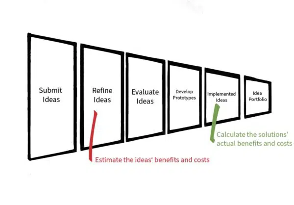

 
   Crowdsourcing and open innovation initiatives are vital by bringing vast stakeholders together to share ideas on complex problems and opportunities. Much of the focus is set on engaging the crowd yet deciding which ideas to take a risk on requires data on the likely impacts and costs. 


 One of the top innovation management topics I run into is evaluating the Return on Investment (ROI) for an idea. In my practice several clients evaluate their ideas based on quantifiable metrics that help their innovation teams to measure the costs and the real value or impact of their solutions. In this article I will provide an overview on how to calculate an idea’s ROI, focusing on an idea that will save employees’ time doing a task (one of the most common solutions suggested in employee open innovation campaigns). This calculation can be both a simple and a comprehensive process depending on the complexity of the project’s intended solution. What’s important is that calculating ROI for an idea makes sense for your business, your leadership and is a process that can be applied consistently across a variety of promising ideas and innovation decisions.

## Introduction to ROI
 Calculating the ROI can serve as a valuable exercise to understand whether one of your open innovation campaign’s ideas should be developed into a project and whether a project should be developed into a minimal viable product, service or a national program. 

 The ROI is your net profit divided by the cost of that investment. Simply, find your expected revenue from implementing the idea and subtract your expected cost to develop it. Divide this number by the same expected cost to develop your idea.

$$
ROI=\frac{Profit-Investment_{cost}}{Investment_{cost}}
$$

 To obtain the financial data for this calculation, it is best for an innovation campaign to incorporate some questions that capture the financial implications of the idea and have subject matter experts (SMEs) revise the numbers as the idea evolves. Your open innovation campaign will likely generate a broad range of valuable ideas so thinking about new value creation broadly will be important. 

 To guide us in calculating ROI, I use Ray Sheen’s and Amy Gall’s [Guide to Building Your Business Case](https://www.amazon.com/Guide-Building-Your-Business-Case/dp/1633690024/) published in the Harvard Business Review. It is a concise read with ample financial guidance. Sheen and Gall suggest describing ‘profit’ as ‘benefit’ to assess the positive impact since many ideas will not be easily financially quantifiable at the early stage of your innovation campaign’s funnel. Going forward, we will use ‘Estimated Benefit’, as a substitute for ‘Profit’ and ‘Estimate Cost’, as a substitute for all of the possible costs involved in developing the idea. 

 *The Estimated Benefit of your idea describes all of the ways that it adds new value to the issue at hand such as new revenue through sales, productivity savings, and intangible benefits such as improved morale or creating a creative culture.
 The Estimated Cost of your idea describes all of the costs associated with developing and implementing your idea. This can include capital expenditures, one time project expenditures and foreseen operating costs. Idea’s affecting external communities will likely incur some costs.* 

 In an open innovation campaign, we are asking an idea submitter, or team, to give their best estimate for the value and the development costs of their idea. Given this, let’s adjust the formula to describe the estimated, or potential benefit and the estimated cost of developing the idea into a full project or prototype:

$$
Development_{cost}=\frac{Project_{benefit}-Project_{cost}}{Project_{cost}}
$$

## Design your Open Innovation Campaign to Collect Financial Data 
 Now let’s review some typical components to your open innovation workflow. To start, your workflow will begin with a call to action, or problem statement, that asks people to submit an idea that details or addresses your innovation intent. The idea may describe a problem really well, alluding to operational costs, that if addressed, could save the company money or an idea submitter may describe a new program that is designed to improve the health of a community.

 To be able to do an ROI calculation, you will need to collect information from the idea submitter, or their team, that helps to quantify the estimated benefit and cost of the idea. This means you will need to incorporate sub-questions that ask about the potential benefits and potential costs to develop the idea.

 If your idea submitter is not asked to describe the idea’s quantifiable financial, social or environmental impact when the idea is submitted, your team will need to incorporate additional stages within your workflow to gather such ROI quantifiable financial information. Also, not all ideas submissions will describe a benefit in a way that is easily quantifiable so it is important that such sub-questions are made optional to idea submitters so the essence of the idea is still captured. The power of open innovation is that the crowd and its subject matter experts can help think through an idea’s components. Below is how I visualize an open innovation campaign’s stages and where you can ask quantifiable financial questions:

 Here are some examples of estimated-benefit and estimated cost questions:

  - *Who is positively impacted by this idea?* This question will tell us if there are front line workers, engineers, sellers, marketers, leadership or community members that can benefit from this idea. This answer can be in the form of new revenue, cost savings or improved morale numbers.  
  - *If implemented, how much time do you think this idea will save you or others each day?*  In addition to the overall benefit of the idea, this question pushes the idea submitter to think about time saved in doing a particular task or process. 
  - *Can this idea be developed and deployed with existing company technologies, workflows, advantages or will it require a new technology, workflow or staff to manage it?* This question informs the project team if this is something that the organization can manage immediately or will require more time to procure or develop in-house.

 These questions ask for parts of the total estimated benefit and costs and are usually easier to answer than asking for a total estimated benefit and cost of an idea. The end goal in calculating an ROI on any idea is to obtain the total Estimated Benefit (i.e. `$1,000,000` saved) and the total Estimated Cost (ie. `$100,000` including development and training). 

 Should an idea be selected, you will want to repeat this calculation for the actual total benefits and the actual total costs of development and management of the solution a few months or years later. Depending on the type of solution, your team may need to design more complex ROI calculations, such as break even analysis and net present value. Please refer to the HBR Guide to Building Your Business Case for such guidance. 

 Please [reach out to me](https://ideascale.com/innovation-services/) if you want to discuss how best to engage your crowd about quantifying ROI and impact of their ideas

## An Idea that Saves Time
 To make this topic more tangible, let’s calculate a hypothetical solution’s estimated benefit of saving a company time on a process. Let’s take a hospital’s reception room as an example. Upon arrival a new patient may have to complete several pages of health history paperwork that is usually on a clipboard. Afterwards, a receptionist may be responsible for creating a new user profile in the hospital’s database by manually typing the patient’s paperwork into a digital form. Creating this new user profile can take a total of 30 minutes.

 In our open innovation campaign example, an employee heard about a new application that another hospital uses called FastForm which is both a Microsoft and Apple application that syncs with a hospital’s patient database. The employee submits an idea to use the FastForm application for the hospital’s new patient intake, alluding to it’s time savings.

 If this employee’s idea were to be implemented, instead of a patient completing the paper form, the patient would complete a digital form taking the same amount of time, about 10 minutes; however, the data will now automatically sync to the computer desktop FastForm application. This creates a shareable patient profile and eliminates the need for the administrator to enter patient data directly into the database which can take up to 20 minutes.

## Quantify an Idea’s Time Savings Into  Financial Benefit
 To calculate the time saved for this idea, let’s assume the idea submitter did not estimate the total benefit or the total cost of implementing their idea. We will need to calculate the cost of performing the current task and what might be the cost of the idea submitters’ new solution.

  - How much time does it take to currently manage the task? 

 To answer this, you can ask, “Who in the organization is typically responsible for doing such a task?” Let’s say one receptionist is responsible for creating the new profiles each day. The next step is to calculate how many new patient profiles the receptionist enters into the hospital’s system per day. We’ve been told that a receptionist manually enters, on average, 10 new patient profiles a day and it takes about 20 minutes to create each profile manually. That is 200 minutes a day to enter 10 new patient profiles. 

  - How much does this task currently cost the organization per year?

 Let’s convert our numbers into some financial numbers. The 200 minutes spent daily is 3.33 hours per day entering new profiles. The receptionist’s wage is `$15` per hour so to keep things simple we calculate `$15` wage multiplied by 3.33 hours to arrive at approximately `$50` as the cost of creating and entering a day’s worth of new patient profiles. The receptionist works an average of 261 days per year therefore 261 days multiplied by `$50` a day is a `$13,050` cost per year to create new patient profiles for one hospital. In other words, one receptionist creating on average 2610 new user profiles (261 X 10 profiles per day) costs the hospital `$13,050` a year.

  - What is the estimated benefit of the proposed solution? 

 To answer this, we must first ask, “what is the new time it will take to manage a task with the proposed solution?” To begin, start organizing all of the numbers that come to mind. The first cost is purchasing a new iPad and the iOS application which is $300 for each receptionist using the new solution.  For simplicity, we will not include software configuration or training costs; however, they are important to note.

 Once the iPad and its FastForm application is up and running, a new patient will still take 10 minutes to create a patient profile using the iPad; however, the job of the receptionist to take the paper forms and enter them into the database is eliminated because the software application already syncs the data automatically. 200 minutes are now saved each day and thanks to our earlier calculation, we can present `$13,050` a year of estimated benefit for one receptionist deploying the iPad and application solution. You can decide later how best to incorporate the value and time saved by the customer in the future.  

## ROI Calculation for a Submitted Idea
 The idea involves purchasing 1 new iPad and the iOS application that syncs with the existing desktop software. 

$$
ROI_{est}=\frac{Project_{benefit}-Project_{cost}}{Project_{cost}}
$$

`$13,050` is saved and is the initial Estimated Benefit. `$300` is the Estimated Cost of purchasing one iPad with the FastForm application.

$$
\frac{\$\text{13050 }–\\,\$\text{300}}{\$\text{300}}=\text{425}\\%\\,\text{ROI}
$$

<!-- http://docs.mathjax.org/en/latest/input/tex/extensions/textmacros.html?highlight=percent -->

 We can now adjust these numbers to the full scale of receptionists expected to be impacted, their average (or median) hourly rate and by the quantity of iPads required across the entire hospital. For example, if twenty receptionists start to use the new iPad, we’re looking at `$261,000` of savings per year. That’s over a quarter million dollars!

## Summary
 This is a simple calculation of time and money saved; however, the $13,050 of estimated benefit will need to be considered against other benefits such as what the administrators and patients can be doing with the extra time saved in the waiting room and elsewhere. 

 An additional consideration may be the hours of training for the receptionists each year or iPad repairs. By now you should see there are multiple ways to calculate a solution’s benefits and costs. 

 An idea with a positive ROI will need to be compared against other factors and ideas for unknown project management costs, legal risks and business priorities before being selected.

 In conclusion, when designing an open innovation challenge, take time to think through how and when to ask about the financial implications of the ideas submitted. The goal is to gather important financial details without stymying your crowd’s ideation. Thinking through how to tease out the financial details of an idea can be a bit of work but will ultimately help you to communicate your innovation campaign’s true financial value and help make the type of innovation decisions that will sustain your organization into the future.

