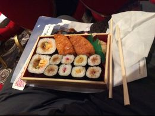
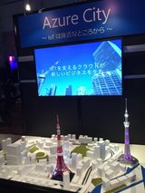

#MSJPC2014 @ [The Prince Tower Tokyo](http://www.princehotels.co.jp/parktower/)

Today's free lunch.

vForum 2013 provided far better faire for the taste buds than this "cheap" conference does... Seems that Microsoft does not get the same fan base as VMware does.
Then again, I really shouldn't complain about a "free" lunch...

Cool display at the Microsoft conference Expo.
