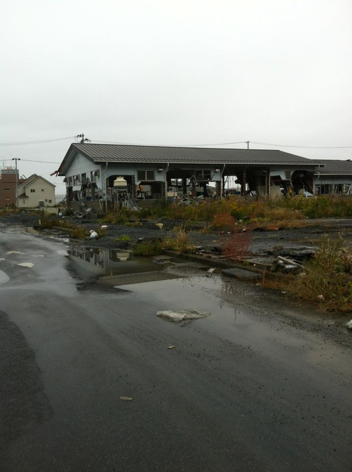
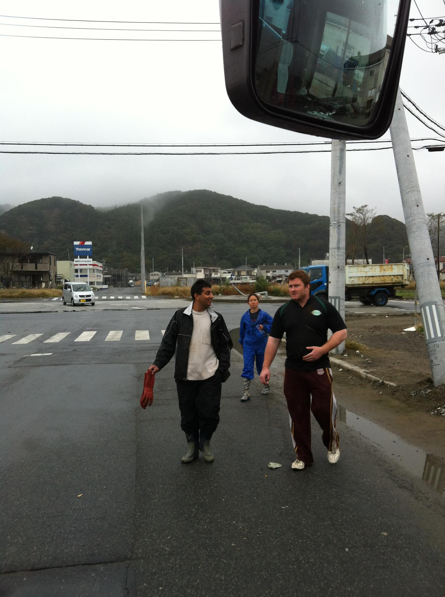
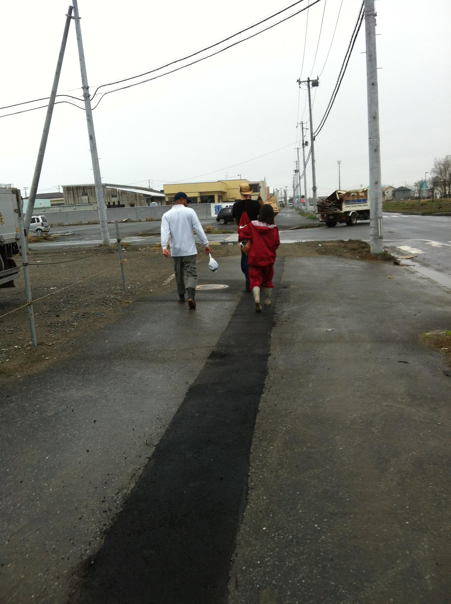
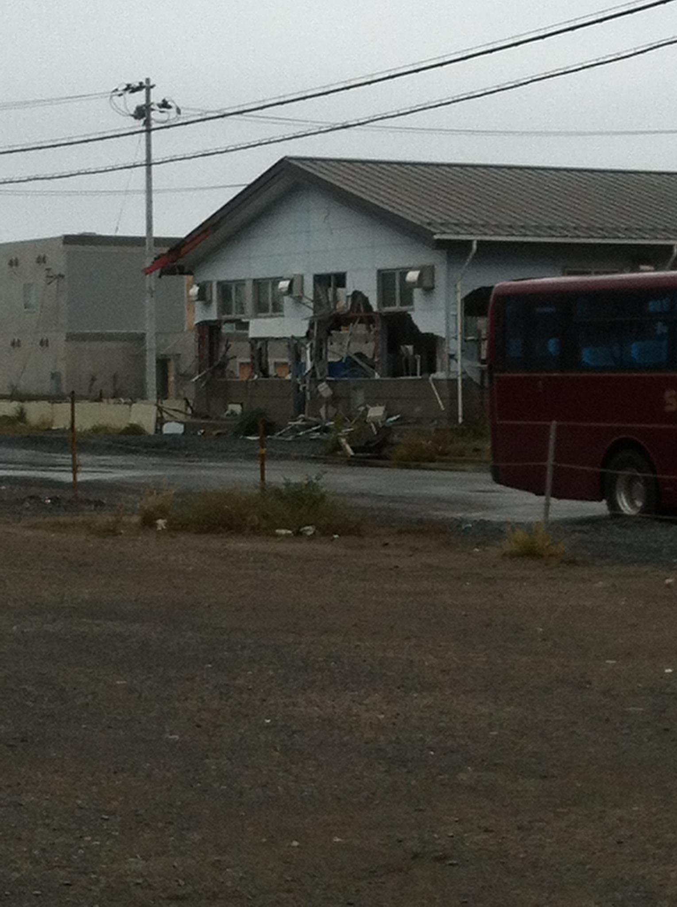

# Highway to the "Danger Zone."

 Tonight, I'm heading up to one of the worst hit cities of the Tohoku disaster - Ishinomaki. 

 Seven months after the 9.0 quake rocked Japan and drove it 8 feet (!) closer to the USA, it still looks like the disaster hit just last month... There are simply not enough hands to physically pick up the pieces of what remains of this region. 

With 5 other people from my office, we are volunteering to help. I'll post more after my first day on-site.

## Clean up efforts
 Seven months after the main event, this place is still a huge mess. I'm told this will probably take more than a year to clean up! There are simply not enough helping hands to reassemble these disaster zones. The news papers here in Japan estimate over 5 to 10 years will be required to recover from this major disaster. If you can help, please volunteer!!

